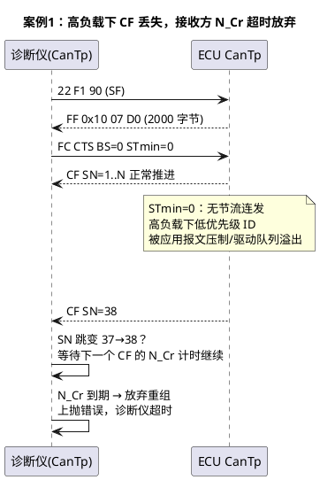
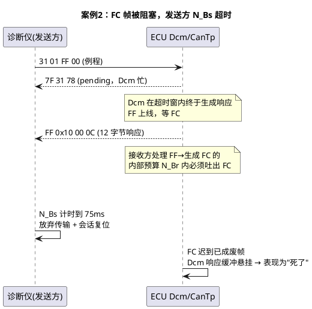

# 03-排障实录

> 一句话定位：诊断多帧"传一半死、偶发死、传得慢"三类现场的完整还原——每个案例都给出现象→时序还原→根因→修复，最后附一张可打印的超时速查清单。
> 等级：L2 ｜ 前置：[01-CanTp分段15765-2](01-CanTp分段15765-2.md)

## 原理

传输层排障的总纲一句话：**在 CANoe 里把诊断 ID 的帧按时间轴排开，看断点处"最后一帧是什么类型、该来的下一帧是什么"**——SF/FF/CF/FC 四种帧型的接力赛，谁没交接棒，谁就是嫌疑人。三个案例都从时序图开始还原。

## 详解

### 案例 1：读长 DID 中途断——STmin 配置过小丢 CF → N_Cr 超时

- **现象**：诊断仪 22 读某配置 DID（约 2KB），多数时候正常，总线负载高时（整车路试、多 ECU 同时上报）传输到 60%~70% 处诊断仪报超时失败；复现率与负载正相关。
- **时序还原**：

- **根因链**：FC 声明 STmin=0/BS=0（无节流）→ CF 以最快速度连发且诊断响应 ID 优先级不占优 → 高负载下个别 CF 在发送侧被丢弃或根本没上线（CanDrv 返回 CAN_BUSY 被简单丢弃，见 [01-CanDrv接口契约](../../../04-MCAL与外设驱动/2-L2进阶/CanDrv与LinDrv/01-CanDrv接口契约.md)）→ 接收方 SN 不连续但按规范**收到错序 CF 即判失败或等 N_Cr 超时**。
- **修复**：接收方 FC 改 STmin=5~10ms、BS=8~16，把发送节奏压进可预算范围；同时发送侧对 CanTp CF 的 CAN_BUSY 做重试而非丢弃。修完跑"叠加 60% 背景负载"的回归用例。
- **举一反三**：凡是"负载一高就断"，先看 FC 参数是不是"全零裸奔"。

### 案例 2：偶发 7F 78 后死机——流控帧丢失 → N_Bs 超时（查 CanTp N_Br/RxNbr 侧）

- **现象**：31 例程控制/27 安全访问后偶发无响应，抓包看到 Dcm 先回 7F 78（responsePending），随后多帧响应的 FF 发出后**再无 FC**，会话挂死到诊断仪 P2* 超时。低频，每天几台车。
- **时序还原**：

- **根因链**：FC 的生成走 CanIf RxIndication 中断上下文→该回调里残留调试代码（printf/长循环）→ FC 上总线时间被拖过 N_Bs 窗口；发送方按规范放弃，而接收方 Dcm 的挂起响应没有超时清理，后续请求全部石沉大海。
- **排查点**：确认 ECU 侧 CanTp 的接收通路（FF 处理→FC 发送，即 RxNbr/N_Br 一侧）有没有被阻塞：在 FC 发送函数打时间戳，对照 FF 到 FC 的实测间隔；90% 的"FC 迟到"都在回调做重活或优先级反转。
- **修复**：回调只搬运置事件、处理回任务（对照 04 区中断挂接规范）；Dcm 增加挂起响应的超时清理；N_Bs 适当放宽到 OEM 允许上限。
- **举一反三**：偶发挂死先查"该到没到的控制帧"，再看应用层有没有清理机制。

### 案例 3：升级刷写慢——BS/STmin 组合欠优

- **现象**：34/36/37 刷写 2MB 应用区耗时 12 分钟，产线节拍逼死人；帧间看 trace，CF 之间有肉眼可见的整齐间隔。
- **分析**：网关/ECU 的 FC 宣告 BS=1、STmin=0x32（50ms）——每发 1 个 CF 就要等一轮 FC 往返，还硬加 50ms 间隔；等效吞吐 (7B/50ms)≈140B/s 量级，纯参数问题，硬件远没跑满。
- **修复**：接收方缓冲允许的话 BS=0（或 16）、STmin=0~5ms；有 CAN FD 的链路直接启用 FD 通路（SF 62 字节，帧数骤减）；改后 2MB 刷写压进 2 分钟内。注意与 OEM 诊断规范核对允许的最大激进程度，产线环境实测稳定性优先于纸面极限。

## 配置层

三个案例暴露的参数全在这张表（数字是经验起点，以 OEM 规范为最终依据）：

| 参数 | 角色 | 激进值 | 保守值 | 调错的症状 |
|---|---|---|---|---|
| FC: STmin | 接收方宣告的间隔 | 0~5ms | 10~50ms | 过小+高负载→丢 CF（案例1） |
| FC: BS | 每轮 CF 配额 | 0 或 16 | 1~4 | 过小→刷写慢（案例3）；过大→缓冲压力 |
| CanTpNbs | 发送方等 FC | 200~1000ms | 75ms | 过小→FC 稍慢就断（案例2） |
| CanTpNcr | 接收方等 CF | 200~1000ms | 75ms | 过小→正常间歇被判死刑 |
| CanTpNas/Nar | 上线预算 | 25~70ms | — | 与背景负载不匹配误报 |
| CanTp 缓冲深度 | 最大 N-SDU | ≥4095 | — | 不足→FF 直接 OVFLW 拒收 |

## 易错点与陷阱

1. **只看应用层超时就重试**：Dcm/应用自动重试把传输层断链掩盖成"偶发失败"，现场难归因；CanTp 超时事件必须打点上报（Det/Dlt）。
2. **拿诊断仪日志当总线事实**：诊断仪的"timeout"只有时间没有总线画面；CANoe 接在 ECU 与诊断仪之间看真实帧序，是本案的黄金姿势。
3. **跨网段只录本段**：故障在网关另一侧（LinTp 调度表被切、对段 CF 丢失），本段只看到"响应变慢/断"——两侧通道必须同时录。
4. **调参不看背景负载**：台架空载全绿，整车 60% 负载立刻翻车；回归用例必须带背景流量注入。
5. **改完参数不回归慢路径**：只测大 DID 不测小 DID、只测成功不测中途拔线，边界行为（SN 回绕、最后一块 CF、OVFLW）都是雷区。

## 排障清单（收尾速查）

**超时参数速查**：

| 超时 | 谁在等 | 等什么 | 典型值 | 到期动作 |
|---|---|---|---|---|
| N_As | 发送方 | 数据上总线 | 25~70ms | 报发送失败 |
| N_Ar | 接收方 | FC 上总线 | 25~70ms | 报失败 |
| N_Bs | 发送方 | FF/CF 后的 FC | 75~1000ms | 放弃传输 |
| N_Cr | 接收方 | 下一个 CF | 75~1000ms | 放弃重组、丢半包 |
| STmin | 发送方自律 | CF 最小间隔 | 0~50ms | 仅为节流非超时 |

**定位五步**：

1. CANoe 过滤诊断 ID + 网关两侧通道，复现并完整录制；
2. 找断点：最后一个成功的帧是什么（FF？CF？FC？）→ 该来的下一帧是谁的职责；
3. 对照超时表判断哪一侧先放弃（N_Bs vs N_Cr），把嫌疑压到单侧；
4. 单侧深挖：帧没上线（驱动队列/仲裁/CAN_BUSY 丢弃）还是上了没处理（回调阻塞、缓冲、SN 错序）；
5. 修复后带背景负载回归：大/小 DID、中途断线、SN 回绕边界各一轮。

## 面试高频题（高频考点即案例本身）

- **Q：诊断多帧传输到一半失败，你的定位思路？**
  A：录制总线找断点帧型：停在 FF→无 FC 查接收方 N_Br 侧（回调阻塞/参数）；停在 CF 中段查发送方（CAN_BUSY 丢弃、负载压制）与 SN 连续性；再对照 N_Bs/N_Cr 判定先放弃的一方。
- **Q：为什么 STmin=0、BS=0 反而容易出问题？**
  A：无节流连发把节奏交给总线运气：高负载下低优先级诊断帧被压制或驱动队列溢出丢 CF，接收方 SN 断裂/超时放弃——流控参数的意义就是把突发变成预算内速率。
- **Q：刷写慢你会先查哪三个数？**
  A：FC 的 BS（是否小配额）、STmin（是否大间隔）、是否启用 CAN FD 通路；三处决定吞吐数量级，其余是细调。

## 延伸

- [01-CanTp分段15765-2](01-CanTp分段15765-2.md)：四种帧与超时参数的本体定义；
- [02-LinTp](02-LinTp.md)：跨 LIN 段断链的特殊性（调度表嫌疑）；
- [01-CanDrv接口契约](../../../04-MCAL与外设驱动/2-L2进阶/CanDrv与LinDrv/01-CanDrv接口契约.md)：CAN_BUSY 丢弃链的上游；
- [02-中断挂接规范](../../../04-MCAL与外设驱动/2-L2进阶/CDD设计方法论/02-中断挂接规范.md)：FC 迟到的回调重活问题规范解；
- [总线工具](../../../09-调试与测试/2-L2进阶/总线工具/README.md)（待写）：CANoe 过滤、触发与负载注入实操。

---

维护约定：笔记命名 `序号-主题.md`；真实截图放 `_images/`；流程/时序/状态/架构图用 PlantUML 内嵌正文，规范见 [图表规范与模板](../../../00-总览/图表规范与模板.md)。
