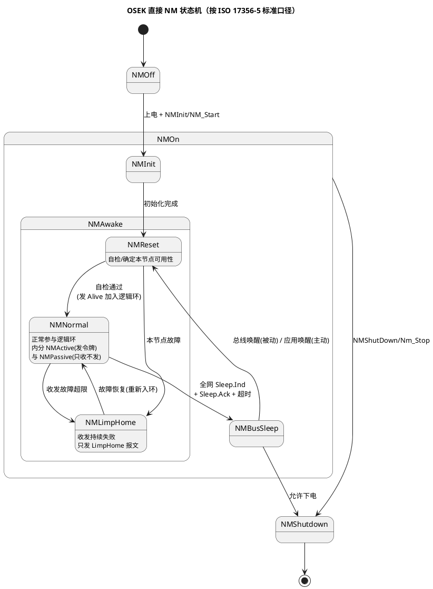
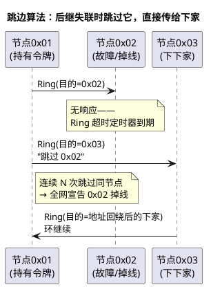

# 01-OSEK-NM

> 一句话定位：网络管理的第一代正统——用"逻辑环 + 令牌传递"让一条总线上的 ECU 集体协商睡觉，读懂它，AUTOSAR NM 的每个设计决定都有了参照系。
> 等级：L2 ｜ 前置：[从一帧CAN报文说起-车载网络全景](../../00-入门导读/01-从一帧CAN报文说起-车载网络全景.md)

## 原理

为什么需要网络管理？因为整车 ECU 挂在 KL30 常电上（不能断电），停车的日子里谁都不许偷偷耗电。于是需要一个机制回答两个问题：**"大家都还醒着吗"（节点监控）** 和 **"能不能一起睡"（同步休眠）**。OSEK NM（现收录于 ISO 17356-5）给出的答案是：所有节点排成一个逻辑环，令牌（Ring 报文）挨个传，传一圈谁没应答就是掉线，所有人都说"可以睡"才一起睡。

标准口径的三主状态：**NM-Off → NM-On → NM-Shutdown**（注意：有些 OEM 资料写成 NM-Busy/NM-Idle 之类，非标准命名，读资料时按行为对号入座）。NM-On 内部再分层：

## 详解

### NM 报文结构

OSEK 直接 NM 的报文把"谁发的、发给谁、干什么"全塞进一帧 CAN：

| 字段 | 位置 | 内容 |
|---|---|---|
| Source Node ID | CAN ID（基地址 + 节点地址） | 发送者身份，如 0x400+ECU 地址，逻辑环顺序通常按地址升序 |
| Destination ID | 数据 Byte0 | 令牌传给谁（逻辑后继） |
| Opcode | 数据 Byte1 | Alive / Ring / LimpHome（取值随实现，读 OEM 规范为准） |
| Data | 数据 Byte2~7 | 应用数据（保持唤醒原因等，多数平台填 0x00/0xFF） |

三种报文各司其职：**Alive**——"我上线了/我被跳过了，我要（重新）入环"；**Ring**——正常态的令牌，顺着地址序一站一站传；**LimpHome**——"我收发都有问题，但我还活着"，用固定周期广播刷存在感（防止全网把我当掉线、或者我拖累别人睡觉）。

### 逻辑环与跳边算法

逻辑环是虚拟的：总线上物理是广播，但每个节点只认"地址比我大的下一个在线节点"是自己的后继。跳边（skip）算法解决"后继死了怎么办"：

### 同步休眠

想睡的节点在自己发出的 Ring 报文里置 **Sleep.Ind** 位；当全网所有在线节点都置了 Sleep.Ind，逻辑上最后一个节点发 **Sleep.Ack**，大家同时停发、进 NMBusSleep。这就避免了"A 睡了 B 还在等 A 的令牌"这类不同步死锁。被动唤醒靠收发器对总线显性位的检测，主动唤醒则直接发 Alive 报文拉醒全网。

### 与 AUTOSAR NM 的关系（演进动机）

OSEK NM 能用，但工程上四宗罪，直接催生了 AUTOSAR NM 的广播式设计：

1. **逻辑环太脆**：节点上下线、跳边、重入环的排列组合，测试用例指数级；
2. **耦合 COM**：OSEK NM 和 OSEK COM 绑定实现，没法塞进分层清晰的 AUTOSAR 栈；
3. **没有部分网络**：一个节点要醒，全网陪着醒，功耗细化不下去；
4. **状态嵌套深**：NM-On 里套 NMAwake 再套 NMNormal/Active/Passive，移植成本高。

AUTOSAR NM 的对策（下一篇详解）：**去中心化广播**——不再传令牌，人人周期性广播自己的 NM 报文，靠"多久没收到任何 NM 报文"判断全网状态；状态机压平成三模式三状态；并原生支持 PNC 部分网络。一句话：**从"轮流点名"退到"人人打卡"**，牺牲一点总线负载，换来行为可预测。

## 配置层

OSEK NM 在新项目里多见于存量平台维护与兼容阅读，配置量比 CanNm 小：

| 配置项 | 含义 | 典型值（以 OEM 规范为准） | 易错点 |
|---|---|---|---|
| 节点地址（Node ID） | 本节点在环中的身份 | 唯一 8bit，如 0x01~0x40 | 地址重复→环逻辑直接错乱 |
| CAN 基地址 | NM 报文 ID 前缀 | 如 0x400~0x4FF | 与其他网段 NM 基地址冲突（网关路由错） |
| 环超时（Ring timeout） | 等后继应答的时间窗 | ~100ms 量级 | 过小→正常负载下误判跳边；过大→掉线发现慢 |
| Sleep 等待时间 | Sleep.Ind 全置后等多久落睡 | 数百 ms | 与其他节点不一致→有的睡了有的没睡 |
| LimpHome 周期 | 故障态广播周期 | ~1s | 配太密把"故障态"刷成总线负载大户 |

## 易错点与陷阱

1. **把 NMBusSleep 等同于 ECU 低功耗**：BusSleep 只是 NM 层"不再管总线"，真正进低功耗还要 EcuM/应用把外设、收发器逐个按次序关——顺序错了就是睡眠电流超标（详见 [03-睡眠与假醒](03-睡眠与假醒.md)）。
2. **逻辑环地址顺序被网关改写**：跨网段路由后 Source/Dest ID 对不上，接收方认不出后继；对策：网关只透传不改写 NM 字段，或干脆 NM 不跨网段路由。
3. **LimpHome 误当成"故障恢复成功"**：节点发 LimpHome 说明它已退出正常环逻辑，只能被监控不能被依赖；应用侧要按"该节点功能降级"处理。
4. **Sleep.Ind 与应用状态不同步**：NM 层答应了睡觉，应用还有未落盘数据（NvM 写没做完），醒来数据丢；对策：睡眠握手必须等 NvM/应用确认（EcuM 的 RUN→POST_RUN 序列就是干这个的）。
5. **被动唤醒后不发 Alive**：收发器唤醒了但 NM 没被正确触发（唤醒事件没接到 NM），该节点表现为"在线但不入环"，全网把它当掉线反复跳边。

## 面试高频题

- **Q：OSEK NM 靠什么机制发现节点掉线？**
  A：逻辑环令牌传递——每个节点把 Ring 报文发给自己的逻辑后继，后继超时不响应就执行跳边算法直接传给下家；连续跳过同一节点即宣告其掉线。
- **Q：OSEK NM 如何保证全网同步入睡？**
  A：两段式握手：想睡的节点在 Ring 报文置 Sleep.Ind，全网都置位后由最后节点发 Sleep.Ack，全体同时停发进 BusSleep；之后才轮到 MCU 低功耗。
- **Q：AUTOSAR NM 相比 OSEK NM 改了什么？为什么？**
  A：从令牌逻辑环改为周期广播 + 超时判定：状态机更平、测试空间更小、天然支持部分网络（PNC），代价是常态多占一点总线负载——工程上这笔账划算。
- **Q：LimpHome 状态的节点还参与休眠协商吗？**
  A：不参与正常环逻辑，但会周期广播 LimpHome 报文声明存在；对其他节点而言它不可依赖，功能上应降级处理。

## 延伸

- [02-AUTOSAR-NM状态机](02-AUTOSAR-NM状态机.md)：演进后的三模式状态机与 CanNm 配置主业；
- [03-睡眠与假醒](03-睡眠与假醒.md)：从 NM 落睡到 MCU 低功耗的完整握手与假醒排障；
- [01-CanDrv接口契约](../../../04-MCAL与外设驱动/2-L2进阶/CanDrv与LinDrv/01-CanDrv接口契约.md)：NM 报文最终也走 CanIf→CanDrv 这条发送链；
- [EcuM](../../../07-AUTOSAR架构/2-L2进阶/系统服务栈/EcuM/02-上下电时序.md)：睡眠握手的上层协调者；
- [术语表](../../../00-总览/术语表.md)：NM/NM-PDU/LimpHome 词条对照。

---

维护约定：笔记命名 `序号-主题.md`；真实截图放 `_images/`；流程/时序/状态/架构图用 PlantUML 内嵌正文，规范见 [图表规范与模板](../../../00-总览/图表规范与模板.md)。
