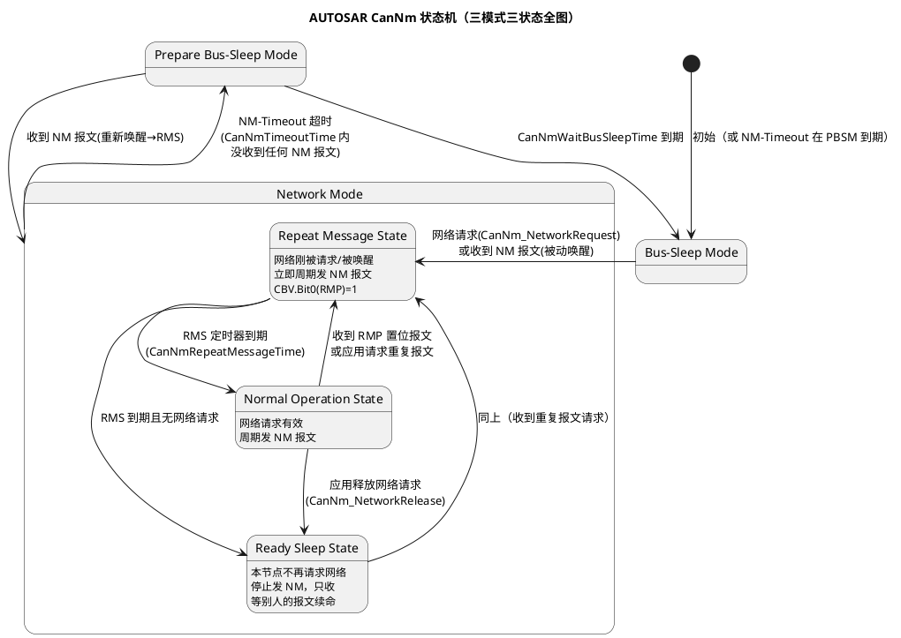

# 02-AUTOSAR-NM状态机

> 一句话定位：把 CanNm 的"三模式三状态"画成一张能背下来的图——网络管理的配置项 90% 都是在给这张图的每条边定时间。
> 等级：L2 ｜ 前置：[01-OSEK-NM](01-OSEK-NM.md)

## 原理

AUTOSAR NM 的核心只有一句话：**想聊天的节点周期性广播 NM 报文；一个节点都不发了，全网一起睡**。没有令牌、没有环、没有中心节点——每个节点独立跑同一套状态机，靠收到的 NM 报文维持醒着的状态。

三个模式各记住一句：**Bus-Sleep**——总线安静，MCU 可进低功耗，靠收发器监听唤醒；**Prepare Bus-Sleep**——"缓冲区"，不再发 NM 报文但再等一个超时窗，给迟到的节点留追赶机会；**Network Mode**——正常工作，内部再分三个状态。

### Repeat Message 状态详解

RMS 是状态机里最"多余"也最关键的一站，进图后先狂刷 NM 报文（RMP 位置 1），持续 `CanNmRepeatMessageTime` 再走人。它解决三个问题：

1. **唤醒稳定性**：刚醒时总线/收发器/应用未必就绪，快刷一阵确保"我醒了"被全网看到；
2. **互相发现**：新上电或迟醒的节点靠别人的 RMS 报文快速对齐状态；
3. **防抖**：任何节点收到 RMP=1 的报文都被拉回 RMS，全网重新同步一次，防止个别节点状态漂移后"自说自话"。

一句话直觉：**RMS 是全网闹钟响后的"再按一次确认"**，大家都确认真醒了才进正常工作。

### NM 报文格式与 CBV

| 字节 | 内容 | 说明 |
|---|---|---|
| Byte0 | Source Node ID | 节点身份（0x00~0xFF，OEM 分配） |
| Byte1 | CBV（控制位向量） | 见下表 |
| Byte2~7 | User Data | 部分网络时放 PNC 位图，否则 OEM 自定义/0x00 |

NM 报文 CAN ID = 基地址 + Source Node ID（如 0x400~0x4FF）， DLC 通常 8。

CBV 位定义（按 AUTOSAR PRS NetworkManagementProtocol，R20-11 口径）：

| 位 | 名称 | 含义 |
|---|---|---|
| Bit0 | RMP（Repeat Message） | 1=处于/请求重复报文状态 |
| Bit1 | PNSR（PN Shutdown Request） | 1=请求 PNC 同步关闭（部分网络用） |
| Bit3 | NM Coordinator Sleep Ready | 协调多网段同步睡眠用 |
| Bit4 | AWB（Active Wakeup） | 1=主动唤醒（我自己要醒），0=被动唤醒 |
| Bit6 | PNI（Partial Network Info） | 1=User Data 里带 PNC 请求位图 |
| Bit2/5/7 | 保留 | OEM 自定义需谨慎 |

### 状态转换触发条件表

| 当前 | 目标 | 触发条件 | 关键参数 |
|---|---|---|---|
| Bus-Sleep | RMS | 应用网络请求 / 收到 NM 报文被动唤醒 | — |
| RMS | NOS | RMS 定时器到期 + 网络请求仍在 | CanNmRepeatMessageTime |
| RMS | RSS | RMS 到期 + 无网络请求 | 同上 |
| NOS | RMS | 收到 RMP=1 报文 / 应用重新请求 | — |
| NOS | RSS | CanNm_NetworkRelease（应用不再需要总线） | — |
| RSS | NOS | 应用再次网络请求 | — |
| 任意 Network 态 | PBSM | NM-Timeout：CanNmTimeoutTime 内未收到任何 NM 报文 | CanNmTimeoutTime |
| PBSM | RMS | 收到 NM 报文（有节点又说话了） | — |
| PBSM | BSM | 等待定时器到期，正式落睡 | CanNmWaitBusSleepTime |

## 详解

时间轴串起来读一遍（典型参数）：节点 A 停止请求网络（NOS→RSS，从此不发 NM 报文）；全网其他节点继续每 100ms 广播；若其他节点也陆续收工，最后一个停发后，每台车上的节点在 `CanNmTimeoutTime`（典型 2s）内收不到任何 NM 报文 → 进 PBSM；再等 `CanNmWaitBusSleepTime`（典型 750ms）还是没人说话 → BSM，CanSM 通知 EcuM 可以安排真正的低功耗。醒来的路径反着走：总线上一帧 NM 报文触发收发器唤醒 → CanNm 进 RMS 快刷 → 全网同步回暖。

与 OSEK NM 的行为差异落在排障上：AUTOSAR NM 里"谁先停发"不重要（没有环序），重要的是**每一帧 NM 报文的到达时刻**——CANoe 里把 15 个节点的 NM 报文按时间轴排开，全网睡醒节奏一目了然。

## 配置层

CanNm 配置是本目录的日常主业，超时四件套 + 报文三件套必须张口就来：

| 配置项 | 含义 | 典型值 | 易错点 |
|---|---|---|---|
| CanNmTimeoutTime | NM-Timeout 判定窗：收不到任何 NM 报文即进 PBSM | 2000ms | 与 NM 周期不匹配（应 ≥ 数倍周期）；负载重时丢帧误超时 |
| CanNmRepeatMessageTime | RMS 停留时长 | 1600ms | 配太小→唤醒同步不充分；配太大→唤醒后总线刷屏 |
| CanNmWaitBusSleepTime | PBSM 停留时长 | 750ms（OEM 常见 500~2000ms） | 各 ECU 不一致→落睡顺序参差，尾电流超标 |
| CanNmMsgCycleTime | Network 态 NM 报文广播周期 | 100ms（OEM 常见 100/200/390ms） | 与 Timeout 比例失衡；跨 ECU 不一致→频闪 |
| CanNmNodeId | 本节点 Source Node ID | OEM 分配唯一值 | 冲突即灾难：两个节点互认对方的报文 |
| CanNmPduCanId 基地址 | NM 报文 CAN ID 前缀 | 0x400~0x4FF 等 | 与应用报文/诊断 ID 段冲突，或网关漏路由 |
| CanNmPassiveModeEnabled | 被动模式：只收不发 | FALSE（网关/特殊节点 TRUE） | 误开→该节点永不发 NM，全网等它等到超时前一刻 |
| CanNmActiveWakeupEnabled | 主动唤醒时置 AWB 位 | TRUE | OEM 要求置位却没开→电气测试判主动唤醒失败 |
| CanNmPnEnabled | 部分网络支持 | 按项目 | 详见 [04-部分网络](04-部分网络.md) |
| CanNmMainFunctionPeriod | CanNm 主函数周期 | 10~20ms | 与超时参数粒度不匹配→实际超时偏差一个主函数周期 |

## 易错点与陷阱

1. **超时参数全网不一致**：A 节点 Timeout 2s、B 节点 1.5s，B 先进 PBSM，A 又被 B 的最后报文拉醒，网络"睡-醒-睡"震荡；对策：四件套参数以 OEM 规范为唯一来源，矩阵评审时逐 ECU 核对。
2. **RSS 状态理解错**：应用释放网络后节点仍醒着、仍收报文，只是不发——它随时会被应用请求拉回 NOS；把 RSS 当成"已经在睡"提前关外设，唤醒延迟直接超标。
3. **被动唤醒后不发 RMS 报文**：被动唤醒节点若不（被）拉进 RMS，全网其他节点可能已各自进 PBSM，出现"半睡半醒"网络；标准行为是被 NM 报文唤醒后进 RMS。
4. **NM 报文被网关路由丢掉**：跨网段场景网关必须转发 NM 报文（或做 NM 协调），只配了单边路由→对网段永远"看不见"本网节点，早睡或永不睡。
5. **CanNmMainFunction 周期与超时参数不匹配**：主函数 20ms 而参数步进 1ms，实际超时时间被量化到 20ms 网格，微调参数"看起来生效实际没变"。
6. **调试代码里硬留网络请求**：残留的 CanNm_NetworkRequest() 让节点永不落睡，整车静态电流测试当场翻车——出厂前 grep 一遍网络请求调用链。

## 面试高频题

- **Q：AUTOSAR NM 三个模式、三个状态分别是什么？**
  A：模式：Bus-Sleep / Prepare Bus-Sleep / Network；状态是 Network 模式内部的 Repeat Message / Normal Operation / Ready Sleep。要点是模式由 CanNm 状态机管理、状态由网络请求与 NM 报文收发驱动。
- **Q：Repeat Message 状态存在的意义？**
  A：唤醒/上线后的同步缓冲：快刷 NM 报文并置 RMP 位，让新旧节点互相确认存在，防止状态漂移；任何收到 RMP=1 的节点也会被拉回 RMS 重新同步。
- **Q：节点怎么知道全网都睡了？**
  A：不是显式协商，而是超时推断：CanNmTimeoutTime 内收不到任何 NM 报文→PBSM→再等 CanNmWaitBusSleepTime→BusSleep。所以"没人说话"本身就是睡眠信号。
- **Q：CBV 的 AWB 位有什么用？**
  A：区分主动/被动唤醒：主动唤醒（本节点功能触发）置 1，全网据此统计唤醒源，电气测试与功耗归因（谁把车弄醒的）靠它。

## 延伸

- [01-OSEK-NM](01-OSEK-NM.md)：这套状态机在替谁还债；
- [03-睡眠与假醒](03-睡眠与假醒.md)：BusSleep 之后 MCU 如何真正低功耗、假醒如何排查；
- [04-部分网络](04-部分网络.md)：User Data 字节的 PNC 位图与更细粒度的睡眠；
- [01-CanTp分段15765-2](../传输层/01-CanTp分段15765-2.md)：唤醒后总线上的另一类常客——诊断多帧；
- [EcuM](../../../07-AUTOSAR架构/2-L2进阶/系统服务栈/EcuM/02-上下电时序.md)：CanNm 只管"总线上睡"，整机睡眠的导演是 EcuM。

---

维护约定：笔记命名 `序号-主题.md`；真实截图放 `_images/`；流程/时序/状态/架构图用 PlantUML 内嵌正文，规范见 [图表规范与模板](../../../00-总览/图表规范与模板.md)。
