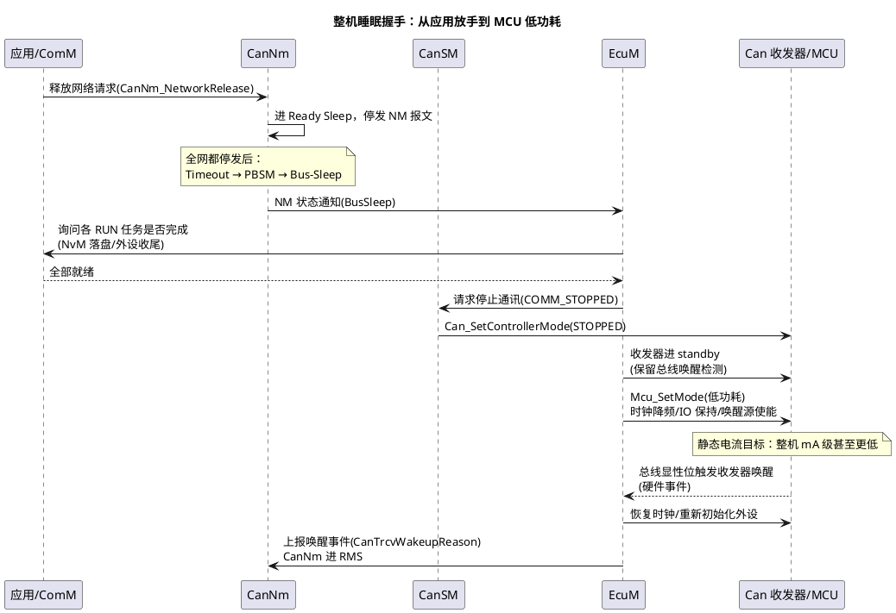

# 03-睡眠与假醒

> 一句话定位：从"NM 不发报文"到"MCU 只剩几毫安"，中间是一条必须按次序走完的关机流水线——而假醒，就是这条流水线被一帧莫名其妙的报文打断的现场。
> 等级：L2 ｜ 前置：[02-AUTOSAR-NM状态机](02-AUTOSAR-NM状态机.md)

## 原理

睡眠不是一瞬间的动作，是一条从应用到硬件的断电流水线。谁先停、谁后停、谁负责最后一眼，全靠 EcuM 这位导演指挥：

四个直觉：①**NM 层的 Bus-Sleep 只是"总线上没人说话"，不等于芯片省电**——真正的省电在后面 EcuM 的关外设序列；②唤醒是硬件事件（收发器检测显性位），醒来后才轮到软件跑状态机；③每个节点独立执行同一套流程，时序参数不一致就会出现"你睡了它没睡"；④假醒的第一现场几乎总在**唤醒链的第一帧报文**上。

## 详解

### 睡眠路径逐段拆

1. **应用放手**：ComM/应用调 CanNm_NetworkRelease，本节点停发 NM 报文（Ready Sleep，仍监听）；
2. **全网静默判定**：CanNmTimeoutTime 内无任何 NM 报文 → Prepare Bus-Sleep → 再等 CanNmWaitBusSleepTime → Bus-Sleep；
3. **通讯栈下线**：CanSM 把控制器切 STOPPED、报文收发停止；
4. **EcuM 收尾**：RUN→POST_RUN→SHUTDOWN 序列里完成 NvM 写队列冲刷、外设复位、禁用无关时钟；
5. **硬件落睡**：收发器进 standby（RX 监听保持）、MCU 进低功耗模式（TC377 看 WFI/休眠模式选择，S32K 看 LLwu 唤醒源配置）。

任何一段被拖住（NvM 写 pending、某个任务不 POST_RUN 就绪、某个外设漏关），现象都一样：**整车静电流超标**。

### 假醒：定义与来源表

假醒（false wakeup）：总线被唤醒、网络完整跑了一遍睡眠流程，但**没有任何真实的业务需求**——车在停车场上演"半夜睁眼看一眼又睡了"。它单独一次不致命，坏在：每轮醒-睡 2~4 秒，静态电流测试整夜均值直接拉爆；频繁的电压波动还骚扰别的节点。

| 来源 | 机制 | 典型特征 |
|---|---|---|
| 唤醒后无后续 | 某节点主动唤醒（事件触发）但应用随后不发不发不请求，或请求后立即释放 | 一帧 NM 报文后全网起来又集体睡回 |
| 非法/陌生报文 | 报文 ID 落在总线上但接收方无配置，仍触发收发器硬件唤醒 | 唤醒源报文 ID 不属于本网矩阵 |
| 总线毛刺/EMC | 干扰脉冲达到收发器唤醒阈值（正常显性位宽度边缘） | 无可解释报文，录波抓不到帧 |
| 边缘阈值/老化 | 收发器唤醒阈值随温度/器件偏差漂移，慢边沿误判 | 特定温度/特定车才复现 |
| 诊断/工厂残留 | 诊断仪接入、产线设备轮询，或某 ECU 刷写后状态异常 | 时间上与人为操作吻合 |
| 网关转发 | 邻网假醒被网关路由成 NM 报文转发到本网 | 本网第一帧来自网关节点 |

### 假醒排障路径

拿到"整车睡眠电流偶发超标"的工单，按这条链走：

1. **CANoe 录制 + 电流同步记录**：整车所有网段挂通道，程序化触发（Trigger：总线活动 OR 电流台阶），睡一整夜；
2. **找第一帧**：回放里定位每次唤醒的**最早一帧报文**——它定义唤醒源：是应用报文、NM 报文还是错误帧/无帧（毛刺）；
3. **唤醒源归因**：NM 报文看 Source Node ID + CBV 的 AWB 位（主动/被动）；应用报文看矩阵属主；无报文则转硬件（示波器看总线电平、查该网段收发器）；
4. **闭环**：把嫌疑 ECU 单独摘出实验台复现，或用 CANoe 模拟其余节点验证它的唤醒-睡眠行为。

### OEM 电气测试场景直觉

整车厂验收睡眠的常规剧本，写代码前先知道考官怎么考：静态电流测量（常电 ECU 逐个 mA 记账）；熄火后 N 分钟全车入睡；K 次循环睡眠/唤醒的稳定性；各唤醒源逐个注入（开门/遥控/充电枪插入/诊断接入）确认醒来后能在限定时间内再睡回去——**假醒测试就是其中"夜里没有任何输入，电流曲线却出现台阶"的专项**。

## 配置层

睡眠与假醒横跨多个模块，配置项按"睡眠流水线"的段落在脑子里挂档：

| 配置项 | 所在模块 | 含义 | 典型值 | 易错点 |
|---|---|---|---|---|
| CanNmTimeoutTime | CanNm | 无 NM 报文判定窗 | 2000ms | 与唤醒后首帧时间叠加，影响"假醒时长" |
| CanNmWaitBusSleepTime | CanNm | PBSM 时长 | 750ms | 全网不一致→落睡先后差 |
| CanTrcv 唤醒事件使能 | CanIf/CanTrcv | 收发器唤醒上报路径 | 启用 | 漏配→硬件醒了软件不知道，功能异常 |
| 唤醒源判定去抖 | CanSM/EcuM | 误毛刺过滤 | 数 ms 采样 | 太短易假醒，太长唤醒延迟 |
| EcuM 睡眠确认链 | EcuM | RUN 任务/NvM 完成回调 | 按项目 | 有任务永不就绪→整机不睡 |
| 低功耗模式选择 | Mcu | STOP/STANDBY 等级 | 按电流预算 | 模式太浅→省不了电；太深→唤醒源不够 |
| 调试代码残留请求 | 应用 | CanNm_NetworkRequest 硬编码 | 禁止 | 出厂翻车头号原因 |

## 易错点与陷阱

1. **BusSleep 后直接断外设电源**：EcuM 序列没走完就关收发器，唤醒事件永远到不了 MCU——车变"睡美人"；必须让收发器 standby 且 RX 唤醒引脚接进 MCU 唤醒源。
2. **NvM 冲刷未完成就落睡**：睡眠前 NvM 队列里还有写任务，被睡眠打断→数据丢/块半写；EcuM 的 SHUTDOWN 序列必须含 NvM 完成等待。
3. **唤醒后不复位部分外设状态**：低功耗期间外设寄存器丢配置，醒来沿用旧状态读写错乱；醒来路径要按外设清单重新初始化（对照 04 区 Mcu 模块）。
4. **假醒只看电流不录总线**：电流台阶没有总线时间轴对齐，永远找不到第一帧；CANoe 触发录制 + 电流通道同步是唯一靠谱姿势。
5. **网关唤醒链路没闭环**：邻网唤醒经网关转发 NM，本网跟着醒；若网关在无业务时频繁转发（配置了错误的 NM 转发条件），本网假醒背锅——排障要把网关两侧通道都录上。
6. **温度条件漏考**：唤醒阈值漂移型假醒常温复现不了，低温箱/高温老化一遍才现形；测试大纲里保留温度维度。

## 面试高频题

- **Q：整车睡眠流程中 CanNm、CanSM、EcuM 各负责什么？**
  A：CanNm 管"总线上"的睡（NM 报文停发与超时判定，Bus-Sleep）；CanSM 管通讯栈模式切换（控制器 STOPPED）；EcuM 管整机睡眠序列（任务确认、NvM 冲刷、外设关闭、MCU 低功耗）。
- **Q：什么是假醒？怎么定位唤醒源？**
  A：网络被唤醒但无真实业务、随后又睡回的现象。定位：CANoe 全网段录制 + 电流同步，找唤醒后第一帧报文，NM 报文按 Source Node ID 和 AWB 位归因，无报文则转示波器查毛刺与收发器阈值。
- **Q：被动唤醒和主动唤醒在报文与软件路径上的区别？**
  A：主动唤醒：本节点应用触发，CanNm 发 NM 报文且 CBV 的 AWB 位置 1；被动唤醒：收发器检测总线显性位→硬件中断→EcuM 上报→CanNm 进 RMS。功耗归因和电气测试都依赖这个区分。
- **Q：为什么睡眠电流超标先怀疑网络管理？**
  A：常电 ECU 的电流大头是"没睡够"：网络请求残留、假醒循环、EcuM 序列卡住、外设漏关——前三个都在 NM/EcuM 范围，且能用总线录制直接观察。

## 延伸

- [02-AUTOSAR-NM状态机](02-AUTOSAR-NM状态机.md)：睡眠判定的超时机制从哪来；
- [04-部分网络](04-部分网络.md)：让"睡得更细"——功能级的部分网络睡眠；
- [01-CanDrv接口契约](../../../04-MCAL与外设驱动/2-L2进阶/CanDrv与LinDrv/01-CanDrv接口契约.md)：控制器 STOPPED/SLEEP 模式最终落在 CanDrv；
- [总线工具](../../../09-调试与测试/2-L2进阶/总线工具/README.md)（待写）：CANoe 触发录制与电流同步实操；
- [EcuM](../../../07-AUTOSAR架构/2-L2进阶/系统服务栈/EcuM/02-上下电时序.md)：睡眠导演的完整调度脚本。

---

维护约定：笔记命名 `序号-主题.md`；真实截图放 `_images/`；流程/时序/状态/架构图用 PlantUML 内嵌正文，规范见 [图表规范与模板](../../../00-总览/图表规范与模板.md)。
