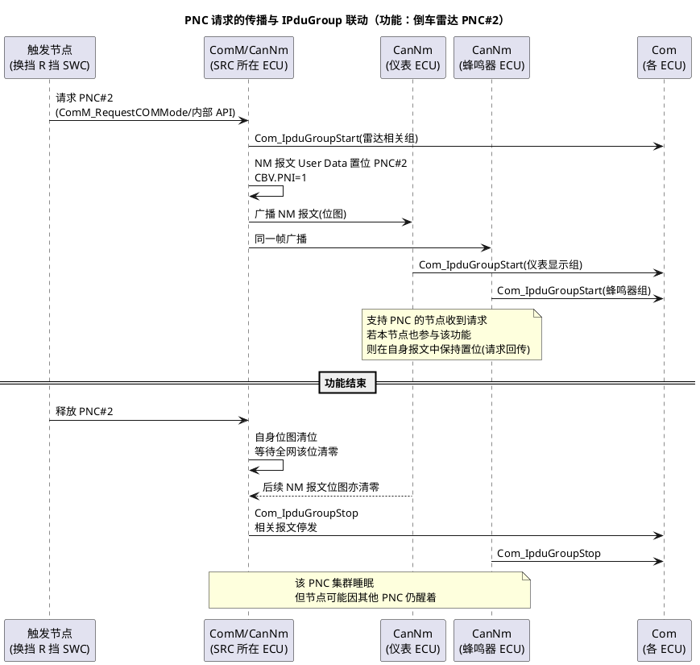

# 04-部分网络

> 一句话定位：让"倒车雷达"这种功能只唤醒它需要的 4 个 ECU，其余节点继续睡——网络管理从"全网一刀切"进化到"按功能开灯"。
> 等级：L2→L3 ｜ 前置：[02-AUTOSAR-NM状态机](02-AUTOSAR-NM状态机.md)

## 太长不看

> - 人话直觉：把全车 ECU 想成一栋楼，普通 NM 是"有人按门铃整栋楼开灯"，部分网络（PN）是"哪个房间有事开哪个房间的灯"；
> - 本篇解决：PNC 是什么、请求在 NM 报文 User Data 里怎么传、CanNm/Com/ComM 怎么协作、配到什么程度算够用；
> - 赶时间记住：①PNC = 部分网络集群，一个功能一组 ECU 共享一个唤醒位；②请求位放在 NM 报文 User Data 的位图里，CBV 的 PNI 位声明"位图有效"；③真正收发与否由 Com 的 IPduGroup 控制，CanNm 只管位图与状态机。

## 原理

普通 AUTOSAR NM 的粒度是"整条总线"：一个节点要通信，全网醒。但车上大量功能只涉及少数 ECU——倒车雷达（雷达+域控+仪表+蜂鸣器）、远程空调（TBOX+空调+泵）。如果这些场景也让全网陪着醒，静态电流与工况设计就崩了。部分网络（Partial Networking）的解法：**给每个"功能组"分配一个位（PNC，Partial Network Cluster），组内 ECU 监听这个位，位为 1 就醒着干活，全网所有 PNC 位都是 0 且各节点自身也无请求时，才整网睡眠。**

## 详解

### PNC 位图放在哪

NM 报文 8 字节里：Byte0 Source Node ID、Byte1 CBV、**Byte2~7 是 User Data——启用 PN 时这里放 PNC 位图，每 bit 一个 PNC，最多 48 个**（OEM 在网络规范里定义"第几字节第几位是什么功能"）。CBV 的配合位：**Bit6 PNI**（Partial Network Information）=1 表示 User Data 是 PNC 位图；**Bit1 PNSR**（R20-11 起）用于 PNC 的同步关闭请求。

### 请求与应答的闭环

三个关键行为，理解了就不会被配置绕晕：

1. **请求（Request）**：应用通过 ComM 请求某 PNC → CanNm 在自己发送的 NM 报文位图里置位。位是广播的，总线上所有节点都能看到；
2. **回传/保持（Echo/Requested PNC 处理）**：参与该功能的接收节点，也要在自己发出的 NM 报文里置位这个 PNC——形成"请求-应答"闭环。为什么？因为请求节点需要知道"组内伙伴都收到了/都在线"，否则一个伙伴睡了它就成了光杆司令；
3. **就绪睡眠（PNC Ready Sleep）**：每个 PNC 有独立的小状态机（Requested→Normal Communication→Ready Sleep→No Communication），只有当**全网该位都清零**，这个功能组才真正收工。

### 与 Com 的协作：IPduGroup 是开关

CanNm 决定"PNC 醒/睡"，但它不碰业务报文——**业务报文的收发开关在 Com 的 IPduGroup（PDU 组）上**：每个 PNC 关联若干 IPduGroup，CanNm 判定 PNC 激活后调 Com_IpduGroupStart/Stop，组里的周期报文才开始/停止收发。链路全景：**应用→ComM（请求 PNC）→Nm/CanNm（位图与状态机）→Com（IPduGroup 开关）→PduR/CanIf（报文上下路）**。BswM 通常在中间加规则做联动（比如某 PNC 激活时顺带点亮某路外设）。

### 与普通睡眠的关系

PNC 是"子状态"，整网睡眠判定仍在：节点只有当**所有它参与的 PNC 都睡了、且自身无网络请求**时，才走上一节的 Ready Sleep→超时→PBSM 老路。所以 [03-睡眠与假醒](03-睡眠与假醒.md) 的排障思路依然成立，只是多了一层"先查 PNC 位图有没有被谁偷偷置位"。

## 配置层

点到即止：真项目里 PN 是 OEM 网络规范+工具链（PREEvision→EcuExtract→EB tresos/Vector）批量生成的，手配极易漏。你需要看懂这几处：

| 配置项 | 所在模块 | 含义 | 易错点 |
|---|---|---|---|
| CanNmPnEnabled | CanNm | 打开 PN 支持 | 只开 CanNm 不配 ComM/Com 联动=白开 |
| PNC 位图位置 | CanNm/OEM 规范 | User Data 哪个 bit 对应哪个 PNC | 跨 ECU 位图定义不一致→甲请求乙无感 |
| IPduGroup 关联 | Com | 每个 PNC 挂哪些 PDU 组 | 漏挂→功能醒着但报文没发 |
| ComM PNC 请求映射 | ComM | 应用功能→PNC 编号 | 映射错功能→唤醒错节点组 |
| EcuIRV / PNC 使能 | 各 ECU 矩阵 | 本 ECU 参与哪些 PNC | 不参与的 PNC 位要配置为忽略 |

## 易错点与陷阱

1. **位图定义全网不同源**：A 节点以为 PNC#2 在 Byte2.bit2，B 节点配到 Byte3——单看都能跑，联调时功能时醒时不醒；位图必须以 OEM 通讯矩阵为唯一事实源（见 [03-通讯矩阵ARXML](../../1-L1基础/通讯数据库/03-通讯矩阵ARXML.md)）。
2. **只配了 CanNm 没配 Com 联动**：位图正常传播、状态机正常跳转，但业务报文永远不发（IPduGroup 没启动）——现象是"网络醒了功能不工作"。
3. **PNC 请求残留**：与网络请求残留同理，某 SWC 请求 PNC 后异常路径没释放，该功能组永不睡；假醒排查时要同时看 NM User Data 位图。
4. **不支持 PN 的老 ECU 混网**：它不解析位图、只按普通 NM 行为醒/睡，会拖累整网——OEM 通常要求全网 ECU 同步支持，或用网关隔离。
5. **PNSR/同步关闭滥用**：PNC 同步关闭（PNSR 位）让全网同刻收工，时序敏感；没吃透机制前别在自定义功能里用它。

## 面试高频题

- **Q：部分网络解决什么问题？核心机制是什么？**
  A：解决"一个功能唤醒全网"的功耗浪费。机制：每个功能组（PNC）占 NM 报文 User Data 位图的一个 bit，请求节点置位广播，组内节点收到后置位应答并启动对应 IPduGroup 收发业务报文；位清零即功能组睡眠。
- **Q：CanNm 和 Com 在部分网络里各干什么？**
  A：CanNm 管 PNC 位图的收发与 PNC 小状态机（请求/正常通信/就绪睡眠）；Com 按 PNC 状态开闭 IPduGroup 控制业务报文收发；中间通常还有 ComM/BswM 做请求归口与规则联动。
- **Q：为什么接收节点收到 PNC 请求后也要置位回传？**
  A：形成闭环确认——请求节点靠"全网位清零"判断功能组可睡，若伙伴不回传，请求节点无法区分"伙伴收到了"和"伙伴睡死了"，PNC 睡眠判定就不可靠。

## 延伸

- [02-AUTOSAR-NM状态机](02-AUTOSAR-NM状态机.md)：PNC 跑在其上的基础状态机与 CBV 位定义；
- [03-睡眠与假醒](03-睡眠与假醒.md)：PNC 之上的整机睡眠判定与假醒排查；
- [03-通讯矩阵ARXML](../../1-L1基础/通讯数据库/03-通讯矩阵ARXML.md)：PNC 位图与 IPduGroup 的配置从哪生成；
- [通讯服务栈](../../../07-AUTOSAR架构/2-L2进阶/通讯服务栈/README.md)：ComM/Com/PduR 全链路；
- 工程深入场景：拿到支持 PN 的 OEM 矩阵后，用 CANoe 模拟"只有部分节点置位"的边界用例（请求者掉线、应答者单边清位），验证所配 ECU 的 PNC 状态机鲁棒性——这是 PN 联调最出 bug 的三处。

---

维护约定：笔记命名 `序号-主题.md`；真实截图放 `_images/`；流程/时序/状态/架构图用 PlantUML 内嵌正文，规范见 [图表规范与模板](../../../00-总览/图表规范与模板.md)。
