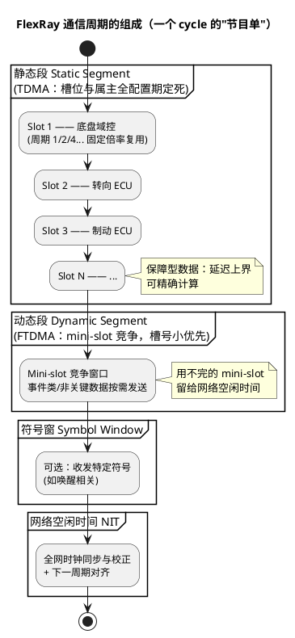

# 01-概览

> 一句话定位：FlexRay 用"双通道×10Mbps×时间触发"换来了 CAN 给不了的确定性带宽——然后被"以太网+TSN 与 CAN FD"的组合拳请出了新平台舞台；本篇建立概念地图，不深潜。
> 等级：L2→L3 ｜ 前置：[从一帧CAN报文说起-车载网络全景](../../00-入门导读/01-从一帧CAN报文说起-车载网络全景.md)

## 太长不看

> - 人话直觉：CAN 是"抢话筒"，FlexRay 是"节目单"——每个节点在通信周期的固定槽位发言，谁什么时候说话在配置时就定死了，所以延迟可精确计算；
> - 本篇解决：FlexRay 为什么存在、通信周期（静态段/动态段/符号窗）怎么构成、和 CAN 差在哪、为什么新平台不再选它；
> - 赶时间记住：①双通道 A/B 各 10Mbps，可冗余也可加倍带宽；②静态段 TDMA（保确定性）+动态段 FTDMA（给事件类数据）；③强确定性=弱灵活性，改一个槽位牵动全网配置，这是它输给"以太网+CAN FD"的根本原因。

## 原理

FlexRay 的设计目标只有一个：给 X-by-wire（线控转向/制动这类不容许"总线忙"的功能）提供**带宽、确定性、冗余**三合一的总线。确定性来自时间触发：全网共享同一张"通信周期节目单"，每个帧槽属于谁、在周期的第几个微秒开始，全是配置期定好的。

周期（典型 1~5ms）以上还有"周期计数"维度：某槽位可以配置每 2 个或 4 个周期才用一次，形成"基础周期×倍率"的复用。时钟靠全网时间同步（分布式冷启动节点 + 偏移校正）维持在微秒级一致——这是静态段"节目单"能对表的前提。

### 与 CAN 对比

| 维度 | CAN/CAN FD | FlexRay |
|---|---|---|
| 带宽 | 1Mbps / 数据段 ≤5~8Mbps | 2 通道 ×10Mbps（可并行用满或冗余） |
| 访问机制 | 事件触发，ID 优先级仲裁 | 时间触发（静态段 TDMA）+动态段（FTDMA） |
| 确定性 | 最坏延迟受负载/填充影响，只能估算 | 静态段延迟上界可精确计算 |
| 冗余 | 无（靠上层 E2E） | 双通道天然冗余（A/B 发同一帧或分载） |
| 拓扑 | 总线型 | 总线型/星型（含冗余星型） |
| 线束与器件 | 便宜、生态海量 | 双绞×2、专用 PHY/节点，贵 |
| 灵活性 | 加节点几乎零成本 | 改槽位=全网重配，变更代价大 |
| 典型用途 | 车身/动力/诊断主流 | 高端底盘线控（历史） |

### 为什么当前多被以太网+CAN FD 取代

市场直觉三条：

1. **带宽维度被碾压**：10Mbps 的天花板在摄像头/雷达时代不够看，100/1000BASE-T1 直接高出两个数量级，还带交换机组网；
2. **确定性有了替代品**：以太网 TSN（时间敏感网络，802.1Qbv/Qbu 等时间门控调度）把"节目单"思路搬进了以太网，兼容流量工程与 IT 生态；
3. **成本与灵活性**：CAN FD 承接了传统 CAN 升级（8→64 字节、5Mbps+），改动小、器件成熟；FlexRay 的全网重配置与专用器件在新 E/E 架构（域集中式）里没有位置。

现状：存量高端平台（如部分欧系底盘）仍在运行，中国新平台基本不再新增 FlexRay 节点。**对多数工程师：读懂周期结构与设计动机即可，遇到存量项目再按 AUTOSAR FrIf/FrDrv 深入。**

## 详解

三个容易考/容易混的点，点到即止：

- **静态段 vs 动态段分工**：静态段给"必须准点"的控制回路（转向/制动），动态段给"有最好没有也行"的事件数据（诊断报文、标定数据）——像民航时刻表（正班）+廉航竞价（加班）；
- **双通道两种用法**：冗余模式 A/B 同发（容错，单通道失效不断链）；带宽模式 A/B 分载（吞吐翻倍，不冗余）——配置期二选一，不能动态切换；
- **启动（coldstart）**：指定 2 个以上冷启动节点牵头完成时间同步建网；冷启动节点全挂则全网起不来——这是 FlexRay 网络设计里最重的单点风险之一。

## 配置层

FlexRay 不在本库配置主线（主业 CAN/LIN），仅留清单供存量项目定位：

| 概念项 | 含义 | 典型/说明 | 易错点 |
|---|---|---|---|
| 通信周期长度 | 静态+动态+符号窗+NIT 的总时长 | 1~5ms | 各段预算总和超周期→配置工具报错 |
| 静态槽数量/长度 | 静态段分成多少等宽槽 | 按 ECU 数规划 | 槽位复用倍率配错→报文断续 |
| 帧 ID 与槽位绑定 | 每槽属主 | 配置期定死 | 新增节点要全网重配 |
| 通道用法 | A/B 冗余或分载 | 按安全概念 | 两端配置不一致→单通道"隐形失效" |
| 冷启动节点 | 建网牵头 | ≥2 | 数量不足/全挂在同一域→起网失败 |
| FrIf/FrDrv | AUTOSAR 适配/驱动层 | 存量维护 | 与 Com/PduR 的映射关系同 CAN 栈思路 |

## 易错点与陷阱

1. **拿 CAN 思维估算延迟**：FlexRay 静态段的延迟必须按"槽位位置×周期+倍率"精确计算，用"总线负载百分比"估会错得离谱；
2. **忽视周期倍率（frame repetition）**：某槽 4 周期复用，接收方以为每周期都有——超时判定配置错；
3. **双通道配置不对齐**：A 通道配了某帧 B 通道没配，冗余模式下单通道故障即丢帧；
4. **动态段当保底用**：把关键控制数据塞进动态段，mini-slot 竞争在高负载下饿死，确定性的意义尽失；
5. **冷启动节点分布不合理**：冷启动节点集中在单一供电域/单一供应商件，域故障全网瘫。

## 面试高频题

- **Q：FlexRay 通信周期由哪几段组成？各自作用？**
  A：静态段（TDMA 固定槽位，承载确定性控制数据）+动态段（FTDMA mini-slot 竞争，承载事件数据）+符号窗（可选，特定符号）+网络空闲时间 NIT（时钟同步校正、周期对齐）。
- **Q：FlexRay 的确定性是怎么来的？为什么 CAN 做不到？**
  A：时间触发：全网时间同步后按配置好的槽位表发送，延迟上界由槽位位置精确决定；CAN 事件触发+仲裁，最坏延迟依赖负载与帧重试，只能统计估算。
- **Q：为什么新平台少用 FlexRay 了？**
  A：带宽被车载以太网碾压（100M/1000M vs 10M）、确定性需求可由 TSN 承接、成本与变更灵活性差（全网重配），加上 CAN FD 吸收了原 CAN 侧增量，FlexRay 退守存量高端底盘。

## 延伸

- [从一帧CAN报文说起-车载网络全景](../../00-入门导读/01-从一帧CAN报文说起-车载网络全景.md)：四总线定位表中 FlexRay 的位置；
- [01-100BASE-T1](../车载以太网/01-100BASE-T1.md)：接过带宽与确定性接力棒的对手；
- [CAN](../../1-L1基础/CAN/README.md)：对比的基准线；
- [术语表](../../../00-总览/术语表.md)：TDMA/FTDMA/静态段词条；
- 工程深入场景：接手存量 FlexRay 底盘网时，先用工具导出全全网槽位表（帧 ID→槽位→周期倍率→通道），再对照 AUTOSAR FrIf 配置核对每帧的接收路由——这是读懂一张陌生 FlexRay 网最快的路径。

---

维护约定：笔记命名 `序号-主题.md`；真实截图放 `_images/`；流程/时序/状态/架构图用 PlantUML 内嵌正文，规范见 [图表规范与模板](../../../00-总览/图表规范与模板.md)。
