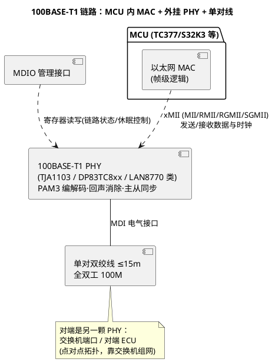

# 01-100BASE-T1

> 一句话定位：把家用网线的四对线砍成一对、按车规 EMC 重做物理层——100BASE-T1 是车载以太网的地基，摄像头/雷达/DoIP 刷写都从这一对双绞线开始。
> 等级：L2→L3 ｜ 前置：[从一帧CAN报文说起-车载网络全景](../../00-入门导读/01-从一帧CAN报文说起-车载网络全景.md)

## 太长不看

> - 人话直觉：CAN 传"纸条"，100BASE-T1 传"集装箱"——同样的车规环境（-40~125℃、EMC、常电休眠），吞吐高两个数量级；
> - 本篇解决：为什么要单对线、和家用 100BASE-TX 差在哪、PHY 怎么接 MCU、怎么睡怎么醒；
> - 赶时间记住：①IEEE 802.3bw，单对双绞线全双工 100M、车内 15m、主从时钟模式；②PHY 外挂、经 MII/RMII/RGMII/SGMII 连 MCU 内的 MAC；③休眠唤醒走 OPEN Alliance TC10（数据线带内唤醒，睡眠电流 µA 级）。

## 原理

动机一个字：**线束**。家用 100BASE-TX 要两对（4 根）线，车内布线重量与成本立刻失控；100BASE-T1（IEEE 802.3bw，Clause 96）用**单对（2 根）双绞线**实现双向 100M——发收同时在同一对线上跑，靠混合电路/回声消除把两个方向拆开。PHY 之间分主从（master/slave），从机时钟锁定主机，收发节拍才能对上。

### 与家用 100BASE-TX 差异表

| 维度 | 100BASE-TX（家用） | 100BASE-T1（车载） |
|---|---|---|
| 线对 | 2 对（4 线）：一发一收 | 1 对（2 线）双向同传（回声消除） |
| 线缆/距离 | Cat5，100m | 车规单对屏蔽/非屏蔽双绞线，车内典型 ≤15m |
| 线路编码 | MLT-3 + 4B/5B | PAM3（三电平），750MBd，配套扰码与前向纠错 |
| 主从同步 | 自适应/对等 | 必须一主一从（ PHY 配置或自协商决定） |
| EMC/环境 | 家用级 | AEC-Q100 Grade1、车规 EMC（IEC 62228-5/OA 规范） |
| 休眠唤醒 | 无车规低功耗叙事 | TC10：数据线带内休眠/唤醒，睡眠电流 µA 级（<20µA 典型） |
| 组网 | 交换机星型 | 点对点 + 车规交换机（骨干/树型） |

### 启动与休眠（T1 Sleep）概念

- **链路建立**：上电后 PHY 间做 link training（训练/均衡收敛），主从对齐后链路 UP，MAC 侧才见得到载波；
- **TC10 休眠**：不通信时 PHY 进 **sleep**（µA 级），交换机与端节点经**数据线上发送的特定唤醒序列**互相叫醒（wake over data-line），并支持 wake forwarding（交换机把唤醒往下游继续传）；也有用 PHY 的 enable/inhibit 引脚做局部电源管理的实现；
- **与整车睡眠的衔接**：T1 sleep 对应 [03-睡眠与假醒](../../2-L2进阶/网络管理/03-睡眠与假醒.md) 的硬件层那一格——以太网侧的"网络管理"（如 UdpNm 或 TC10+上层策略）决定何时允许整链路睡。

### PHY 与 MCU 的连接（一句话）

MAC 在 MCU 里、PHY 在外面：数据面走 **xMII**（MII 引脚多、RMII 省引脚、RGMII 给高集成 SoC、SGMII 走差分串行），管理面走 **MDIO**（读写 PHY 寄存器：链路状态、速率、TC10 睡眠控制、SQI 信号质量诊断）；AUTOSAR 里对应 EthDrv/Eth 接 PHY 驱动（EthTrcv 抽象收发器，概念上与 CAN 收发器同位）。

## 详解

三个工程直觉：

1. **点对点≠总线**：CAN 是共享总线挂 N 个节点；T1 是两个点之间一条线，组网靠交换机——所以车载以太网的"地址"是 MAC/IP 层的事，物理层没有"仲裁"概念，也不存在 busoff；
2. **诊断能力内建**：主流 PHY 提供 SQI（信号质量指示）、线缆开路/短路检测（TDR 类）、符号错误计数——链路问题先问 PHY 寄存器，再换示波器；
3. **15m 是车内预算**：更长距离（如特殊商用车）要走 1000BASE-T1 或中继/交换机级联，选型时把线长、EMC 屏蔽需求（是否需要屏蔽双绞）写进硬件规范。

## 配置层

点到即止，列的是网 Bring-up 时最常碰的旋钮：

| 项 | 所在 | 含义 | 典型值 | 易错点 |
|---|---|---|---|---|
| PHY 主从模式 | PHY strap/寄存器 | 链路两端一主一从 | 交换机侧=主 | 两端都主/都从→链路永远起不来 |
| xMII 接口与时钟 | MCU+PHY | RMII 50M/RGMII 125M 等 | 与硬件设计一致 | 时钟方向/延迟(RGMII-ID)配错→大量 CRC 错 |
| TC10 使能 | PHY/EthTrcv | 数据线休眠唤醒 | 车规默认开 | 没配 EthTrcv 唤醒回调→链路睡了叫不醒应用 |
| 休眠进入条件 | 上层(BswM/NM) | 何时不通信可睡 | 与整车睡眠策略联动 | 以太网不睡→整机静电流超标 |
| MDIO 轮询链路状态 | Eth/EthTrcv | 链路 UP/DOWN 上报 | 100ms 级 | 只在启动时查一次→插拔后状态不刷新 |
| SQI/诊断读取 | PHY | 链路质量评估 | 阈值告警 | 忽视 SQI→EMC 边缘问题到冬测才爆 |

## 易错点与陷阱

1. **主从配反**：两端 PHY 都是 master（或都 slave），link training 永远失败，现象是"双方都活着但链路 DOWN"；第一步先查 strap/寄存器主从位。
2. **RGMII 延迟（-ID）两端重复**：源同步延迟两边都开了（或都没开），数据采样错位，表现为通一小段然后 CRC 错误暴涨；对照 MAC 与 PHY 数据手册逐项核对 skew 配置。
3. **TC10 与整机睡眠策略脱节**：PHY 支持 TC10 但上层永远不允许睡（或反之链路睡了上层还在发），静态电流/功能异常各占一半；睡眠状态机要在 EthTrcv 层与 EcuM 对齐。
4. **15m 当 100m 用**：拿 IT 网线的距离直觉做车内长走线，信号余量不足、SQI 低，高温老化后批量掉链；距离预算在原理图阶段就要卡死。
5. **忘记车规唤醒路径验证**：整车睡眠后只测了 CAN 唤醒，没测以太网线唤醒（DoIP 诊断唤醒整车的典型路径）；电气测试大纲要有 T1 唤醒专项。

## 面试高频题

- **Q：100BASE-T1 和 100BASE-TX 的本质区别？**
  A：T1 单对双绞线全双工（回声消除分离收发方向）、PAM3 编码、主从时钟模式、车内 15m、车规 EMC 与 TC10 休眠；TX 两对线、MLT-3、100m、无车规低功耗叙事。
- **Q：PHY 和 MCU 怎么连接？**
  A：MCU 内置 MAC，外挂 PHY：数据面 xMII（MII/RMII/RGMII/SGMII），管理面 MDIO 读写寄存器（链路状态/主从/TC10/诊断）；AUTOSAR 里 Eth 之下由 EthTrcv 抽象 PHY。
- **Q：车载以太网怎么休眠唤醒？**
  A：OPEN Alliance TC10：不通信时 PHY 进 µA 级 sleep，经数据线上的唤醒序列互相唤醒并支持唤醒转发，上层配合 EthTrcv/EcuM 与整车睡眠策略对齐。

## 延伸

- [02-SOME-IP](02-SOME-IP.md)：跑在这对线上的服务化通信中间件；
- [03-DoIP](03-DoIP.md)：以太网诊断与高速刷写；
- [01-概览](../FlexRay/01-概览.md)：被 T1+TSN 挤下舞台的上一代高速总线；
- [03-睡眠与假醒](../../2-L2进阶/网络管理/03-睡眠与假醒.md)：整车睡眠语境下的 T1 sleep；
- 工程深入场景：新板 Bring-up 时按"读 PHY ID→确认主从→查 link training 状态→SQI/CRC 计数→MDIO 中断链路事件"五步把链路调通，再用 iperf/自环流量验证吞吐与温度箱内稳定性。

---

维护约定：笔记命名 `序号-主题.md`；真实截图放 `_images/`；流程/时序/状态/架构图用 PlantUML 内嵌正文，规范见 [图表规范与模板](../../../00-总览/图表规范与模板.md)。
