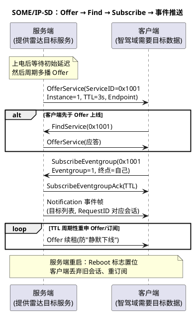

# 02-SOME-IP

> 一句话定位：SOME/IP 是把"函数调用"搬上车载以太网的中间件协议——服务提供方 Offer、需求方 Subscribe、事件按需推送，取代了 CAN 世界"无脑周期广播一切"的粗放模式。
> 等级：L2→L3 ｜ 前置：[01-100BASE-T1](01-100BASE-T1.md)

## 太长不看

> - 人话直觉：CAN 信号是小区广播喇叭（不管你听不听，每 100ms 喊一遍）；SOME/IP 是外卖（下单才做、订阅才送、还能问"答不答应"）；
> - 本篇解决：面向服务到底换了什么、SOME/IP 报文头长什么样、SD 三剑客（Offer/Find/Subscribe）如何把服务接起来；
> - 赶时间记住：①服务=方法(可请求响应)+事件(订阅后推送)+字段(读写通知)，接口用 ServiceID/MethodID/EventID 编址；②SOME/IP-SD 走 UDP 多播（端口 30490），Offer/Find/Subscribe 三个动作建链；③Session ID 与 Reboot 标志防"重启后旧会话污染"。

## 原理

面向信号 vs 面向服务，一张表说清范式差异，其余都是工程细节：

| 维度 | 经典信号通信（CAN/Com） | 服务通信（SOME/IP） |
|---|---|---|
| 通信触发 | 周期广播为主，变化也广播 | 请求-响应、订阅-推送按需 |
| 耦合关系 | 矩阵写死：谁收什么信号 | 运行时发现+订阅：服务实例在线才通 |
| 数据形态 | 定长 bit 位排布 | 序列化结构（SOME/IP-SD 负载/TLV），可扩展 |
| 交互模式 | 只有"发"和"收" | 方法调用（有响应）、事件通知、字段读写 |
| 带宽使用 | 不需要也在发 | 没订阅就不发 |
| 典型载体 | CAN/FD + Com/PduR | 以太网 + TCP/UDP + SOME/IP 栈 |

服务发现与订阅建立的时序：

## 详解

### SOME/IP 报文头速览

| 字段 | 长度 | 含义 |
|---|---|---|
| Message ID | 4B | = Service ID(2B，服务) + Method ID(2B，方法/事件；最高位 0=方法、1=事件) |
| Length | 4B | 从 Request ID 起到报文尾的总长度 |
| Request ID | 4B | = Client ID(2B) + Session ID(2B)；区分"谁的哪次请求"，响应对号入座 |
| Protocol Version | 1B | 协议版本（0x01） |
| Interface Version | 1B | 服务接口版本——版本不匹配直接拒 |
| Message Type | 1B | 0x00 请求 / 0x01 无返回请求(发后不管) / 0x02 通知 / 0x80 响应 / 0x81 错误 |
| Return Code | 1B | 成功/服务错误码（请求方向填 0x00） |

头部 16 字节后跟序列化负载（常用 SOME/IP/TP 处理超 UDP MTU 的大报文分段）。三个工程抓手：**Message ID 是路由钥匙**（TCP/IP 栈按它分派给服务实例）、**Session ID 单调递增**（新旧会话判别）、**Interface Version 是兼容性闸门**。

### SD（Service Discovery）协议直觉

- 载体：UDP 多播，**端口 30490**；报文体=若干 Entry（OfferService/FindService/SubscribeEventgroup(+Ack)）+ 若干 Option（IPv4 终点、TTL、配置串）；
- Offer：服务端周期多播"我有服务 X，地址端口在这，TTL 3 秒"——TTL 过期没续租即视为下线（软状态，不需要显式"下线报文"）；
- Find：客户端冷启动后主动问"谁有服务 X"，避免干等 Offer 周期；
- Subscribe：客户端订阅事件组（eventgroup），服务端 Ack 后才开始推事件——**没订阅就没有流量**，这是与 CAN 广播最大的行为差异；
- Reboot 机制：节点重启后首个 SD 报文置 reboot 标志，对端清空旧会话/旧订阅，防"幽灵会话"。

### 排障直觉（借 CANoe 思维迁移）

以太网侧的"trace"= 抓包（Wireshark 自带 SOME/IP-SD 解析）：故障三板斧——①Offer 在不在（服务端没起来/多播路由不通）；②Subscribe 有没有 Ack（版本不匹配/权限拒绝）；③事件帧 RequestID/Session 是否对得上（旧会话残留）。与 CAN 侧"先看总线有没有这帧"完全同构。

## 配置层

AUTOSAR 里 SOME/IP 落在服务层（SoAd 做 Socket 适配，LdCom/SomeIpTp 走数据面），点到即止列关键项：

| 配置项 | 所在模块 | 含义 | 典型值 | 易错点 |
|---|---|---|---|---|
| Service/Instance/Method ID | 服务定义(ARXML) | 编址三件套 | OEM 服务清单 | 两端版本不一致→请求无人认领 |
| 多播地址与端口 | SoAd/SD | SD 通信参数 | 224.x.x.x:30490 | 交换机 IGMP 配置缺失→多播不通 |
| Offer 初始延迟/周期 | SD | 上线节奏 | 随机退避+1s 级周期 | 全网同时 Offer→风暴 |
| TTL | SD | 软状态租期 | 3s | TTL < 重申周期→服务频繁"假下线" |
| 订阅超时/重试 | 客户端 SD | 无 Ack 的处理 | 秒级 | 重试过猛放大风暴 |
| SOME/IP-TP 使能 | SomeIpTp | 大报文 UDP 分段 | MTU 1500 内尽量不用 | 忘配→超 MTU 报文被丢 |

## 易错点与陷阱

1. **Interface Version 演进踩雷**：服务端升级改了序列化布局但版本号没动，客户端解析错位——版本号与接口变更必须同节奏（服务清单管理）；
2. **多播不通当协议 bug 查**：交换机没开 IGMP Snooping/Querier，SD 多播根本到不了对端；先 ping/抓包验证多播可达性再看栈；
3. **TTL 与续租周期失衡**：续租周期配置大于 TTL，服务周期性"消失再出现"，上层表现为主题间歇断流；
4. **重启后幽灵会话**：没处理 Reboot 标志，客户端沿用旧 Session 订阅，服务端视作无效，事件"订阅了却不来"；
5. **把订阅当矩阵的一次性配置**：服务实例不在（模块没起）时订阅一直失败，上线依赖顺序（先起服务再起客户端）要进启动脚本/状态机。

## 面试高频题

- **Q：SOME/IP 与经典信号通信的本质区别？**
  A：范式从"矩阵写死的周期广播"变为"运行时发现+订阅的服务通信"：方法可请求-响应、事件订阅后才推送、字段可读写；带宽按需、耦合在运行时建立，代价是多了发现与状态管理。
- **Q：SD 的三个核心报文与作用？**
  A：OfferService（服务端多播宣告服务与终点）、FindService（客户端主动询问）、SubscribeEventgroup(+Ack)（订阅事件组建立推送关系）；均走 UDP 多播 30490，靠 TTL 软状态维持。
- **Q：SOME/IP 头里 Request ID 由什么组成、为什么需要？**
  A：Client ID + Session ID：区分"哪个客户端的哪次请求"，让响应精确对号；Session 单调递增配合 reboot 标志还能识别服务端重启后的会话失效。

## 延伸

- [01-100BASE-T1](01-100BASE-T1.md)：SOME/IP 赖以奔跑的物理层地基；
- [03-DoIP](03-DoIP.md)：同一张以太网上的诊断运输层；
- [03-通讯矩阵ARXML](../../1-L1基础/通讯数据库/03-通讯矩阵ARXML.md)：服务定义（Service/Method ID）同样源于 ARXML 建模；
- [通讯服务栈](../../../07-AUTOSAR架构/2-L2进阶/通讯服务栈/README.md)：SoAd/LdCom/SomeIpTp 的栈内位置；
- 工程深入场景：联调首日用 Wireshark 过滤 `someip-sd`，确认 Offer/Subscribe/Ack 三段齐全且 TTL 续租正常，再放业务流量——SD 层通了，90% 的"服务不可用"就地消失。

---

维护约定：笔记命名 `序号-主题.md`；真实截图放 `_images/`；流程/时序/状态/架构图用 PlantUML 内嵌正文，规范见 [图表规范与模板](../../../00-总览/图表规范与模板.md)。
