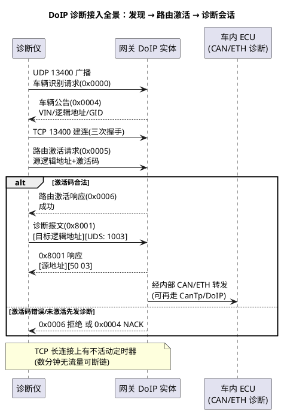

# 03-DoIP

> 一句话定位：DoIP（ISO 13400-2）是"以太网上的 UDS 快车道"——同一套 14229 诊断服务，运输层从 CanTp 的 8 字节小船换成了 TCP 大轮船，整车刷写从十几分钟进到分钟级。
> 等级：L2→L3 ｜ 前置：[01-100BASE-T1](01-100BASE-T1.md)

## 太长不看

> - 人话直觉：CanTp 是"8 座面包车分 5 趟运货"，DoIP 是"整集装箱直达"——诊断服务（22/2E/27/34…）原样不动，只换了集装箱和报关流程（车辆发现→路由激活→诊断会话）；
> - 本篇解决：DoIP 报文头怎么拼、车辆发现与路由激活两步握手长什么样、与 CanTp 的取舍；
> - 赶时间记住：①UDP/TCP 端口 **13400**：UDP 管发现（广播识别/公告），TCP 管正式诊断；②报文头=版本 1B+反码 1B+类型 2B+长度 4B，payload 里装原始 UDS 报文；③**路由激活成功前，诊断报文一律被拒**（0x0004 NACK）。

## 原理

两条腿分工：**UDP 13400 负责"喊话"**（广播车辆识别、周期性车辆公告、 Alive 检查），**TCP 13400 负责"办事"**（路由激活后的全部诊断交互）。逻辑地址（2 字节，如网关 0x0E80）是 DoIP 世界的"节点号"，与 CAN 的诊断地址（0x7E0 段）在网关内做映射。

## 详解

### 报文头格式

| 字段 | 长度 | 说明 |
|---|---|---|
| Protocol Version | 1B | 协议版本（0x02 常见，旧 0x01） |
| Inverse Protocol Version | 1B | 版本反码（校验用） |
| Payload Type | 2B | 报文类型（下表） |
| Payload Length | 4B | 负载长度（大端） |

常用类型速查：

| 类型值 | 名称 | 方向/载体 | 用途 |
|---|---|---|---|
| 0x0000/0x0004 | 车辆识别请求/车辆公告 | UDP | 广播发现：报 VIN、逻辑地址、同步状态 |
| 0x0001/0x0002/0x0003 | 识别请求（按 VIN/EID/GID） | UDP | 定向识别 |
| 0x0005/0x0006 | 路由激活请求/响应 | TCP | 建立诊断通路（激活码鉴权） |
| 0x8001 | 诊断报文 | TCP | 负载=[源逻辑地址 2B][目标逻辑地址 2B][原始 UDS] |
| 0x8003/0x8005 | 诊断正/负确认 | TCP | TCP 收到诊断报文的回执 |
| 0x0007/0x0008 | Alive 检查请求/响应 | TCP | 探活 |
| 0x0004（TCP 上）| 通用 NACK | TCP | 非法报文（未激活就发诊断等） |

记忆抓手：**0x0xxx 是控制面（发现/激活），0x8xxx 是数据面（诊断载荷）**；诊断负载数据部分就是裸 UDS 字节流——所以 22 服务发 `22 F1 90`，DoIP 只是在前面加 8 字节头和 4 字节地址。

### 车辆发现与路由激活的意义

为什么不能插上网线直接发 22？两层门禁：**发现**让诊断仪在没有 IP 信息（DHCP 拿不到/不知道网段）时也能靠 UDP 广播摸到车；**路由激活**是网关的准入控制（激活码≈门票）+ 状态登记（谁占用诊断连接），防止多诊断仪打架，也给了网关把"TCP 通路→内部 CAN/ETH 路由"动态建起来的时机。

### 与 CanTp 对比

| 维度 | CanTp（15765-2 over CAN） | DoIP（13400-2 over TCP） |
|---|---|---|
| 运输载体 | CAN 8 字节帧（FD 62） | TCP 流（MTU 级整包） |
| 分段开销 | SF/FF/CF/FC 协议开销+流控往返 | TCP 自管，无应用层分段（巨型报文靠 TCP 分段） |
| 吞吐 | 数十~数百 KB/s | 数 MB/s 级，刷写提速一个数量级 |
| 寻址 | CAN ID（物理/功能） | 逻辑地址（2B）+ TCP 连接 |
| 会话建立 | 无（总线即达） | 发现+路由激活两步握手 |
| 连接管理 | 无连接 | TCP 保活/不活动定时器断链 |
| 诊断仪接入 | OBD 口 CAN 引脚 | OBD 口以太网引脚（或无线/TBOX 远程） |
| 协议标准 | ISO 15765-2 | ISO 13400-2（UDS 承载见 14229/13400-1） |

### 诊断仪接入路径直觉

从诊断仪视角看整车：OBD 诊断座→中央网关（DoIP 实体常驻于此）→网关内部把 DoIP 诊断报文解包，按目标逻辑地址路由到内部 CAN（再走 CanTp→Dcm）或内部以太网（直连 DoIP/Dcm）。所以**一台车可以同时挂 CAN 诊断与以太网诊断两套通路**：小诊断（读 DTC）走哪条都行，大刷写（34/36/37）必然走 DoIP。远程诊断（OTA 场景）则由 TBOX 代行"诊断仪"角色，经内部网关下发——同一套协议换个入口。

## 配置层

AUTOSAR 里 DoIP 由 Dcm（DSL/DSD 之下配 DoIP 连接）+ SoAd（Socket 映射）承担，关键项：

| 配置项 | 所在模块 | 含义 | 典型值 | 易错点 |
|---|---|---|---|---|
| DoIP 逻辑地址 | Dcm/DoIP 配置 | 本实体地址（源/目标） | 如网关 0x0E80 | 与 OEM 地址表不符→对端路由不到 |
| TCP/UDP 13400 | SoAd | 端口绑定 | 标准 13400 | 换端口未同步诊断仪侧配置 |
| 路由激活码 | Dcm | 准入门禁 | OEM 分配 | 测试码带上产线/量产码泄露 |
| 不活动定时器 | Dcm/SoAd | 空闲断链时间 | 数分钟 | 过短产线节拍内掉线；过长占连接 |
| 车辆公告周期 | DoIP | UDP 周期广播 | 秒级 | 关掉→老诊断仪发现不了车 |
| 内部路由映射 | 网关 PduR/Dcm | 逻辑地址→内部网段 | 地址表 | 只配了去 CAN 的路由，内部 ETH ECU 诊断不通 |
| 静态电流策略 | EthTrcv/BswM | 诊断链路休眠 | 与整车睡眠联动 | 诊断连接挂着不让睡/睡着叫不醒 |

## 易错点与陷阱

1. **没路由激活就发诊断**：跳过 0x0005 直接 0x8001，一律 NACK（0x0004/负响应）；联调脚本要老老实实按发现→TCP→激活→诊断四步走。
2. **逻辑地址映射漏配**：网关只登记了部分目标 ECU 的逻辑地址，表现为"部分 ECU 可诊断部分永远超时"——对照 OEM 地址表逐条核。
3. **TCP 不活动断链撞上长会话**：升级中 ECU 擦写 Flash 不回包超过定时器，连接被掐；诊断仪/网关侧要为长静默场景发 Alive 检查或调大定时器。
4. **UDP 广播被交换机/防火墙吞**：发现阶段失败常在网络上（IGMP/VLAN/隔离），先抓包确认 0x0000 有去有回再查栈；
5. **把 DoIP 当 CanTp 的参数平移**：N_Bs/N_Cr 这套 CanTp 超时在 DoIP 上不存在（TCP 保障传输），但诊断仪侧 P2/P2* 与升级序列超时仍要按 14229 配——层次别混。

## 面试高频题

- **Q：DoIP 的接入两步是什么？为什么需要？**
  A：UDP 13400 车辆发现（广播识别拿 VIN/逻辑地址）+ TCP 13400 路由激活（激活码鉴权+连接登记）。发现解决"不知道车在哪"，激活解决"准入与路由建立"，激活成功前诊断报文一律被拒。
- **Q：DoIP 报文头结构？诊断数据放在哪？**
  A：版本 1B+反码 1B+类型 2B+长度 4B；诊断报文（0x8001）负载为源/目标逻辑地址各 2B+原始 UDS 字节流——UDS 服务原样复用，只换运输层。
- **Q：DoIP 相比 CanTp 的收益与代价？**
  A：收益：TCP 整包运输+百兆带宽，刷写/大数据 DID 提速一个数量级，且支持远程（TBOX）接入；代价：连接与状态管理（发现/激活/保活）、网关路由配置、网络问题进入排障视野。

## 延伸

- [01-CanTp分段15765-2](../../2-L2进阶/传输层/01-CanTp分段15765-2.md)：被 DoIP"平替"的旧快车道与它的超时体系；
- [03-排障实录](../../2-L2进阶/传输层/03-排障实录.md)：CAN 侧诊断断链的同构排查思路；
- [02-SOME-IP](02-SOME-IP.md)：同一张以太网上的服务化通信范式；
- [Bootloader](../../../06-诊断与标定/3-L3高级/Bootloader/02-34-37实现细节.md)：DoIP 34/36/37 大流量刷写的落地场景；
- 工程深入场景：产线/售后网首次开通时，用 Wireshark 过滤 `doip` 把"识别→公告→激活→0x8001"四段完整录一遍存为基线——之后任何"诊断不通"，先比基线缺哪段，再决定查网络、网关还是诊断仪。

---

维护约定：笔记命名 `序号-主题.md`；真实截图放 `_images/`；流程/时序/状态/架构图用 PlantUML 内嵌正文，规范见 [图表规范与模板](../../../00-总览/图表规范与模板.md)。
