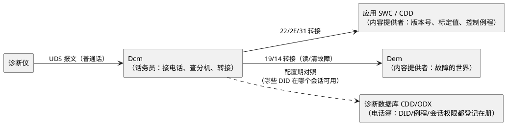

# 01-从诊断仪的一次连接说起-诊断全景

> 一句话定位：跟着诊断仪连上 ECU 后的前三条报文走一遍（进会话→解锁→读数据），把 UDS/Dcm/Dem 的分工与负响应的语言装进一张地图——之后在本区任何子目录迷路，都能靠这张地图找到回程。
> 等级：L1 ｜ 前置：无

## 诊断仪连上 ECU 后发生了什么

产线工位上，工程师插上 OBD 口，点开诊断软件，连上你的 ECU。屏幕上"啪"地跳出软件版本号。中间发生了什么？——其实只有三条报文开场：

```plantuml
@startuml
 autonumber on
 participant "诊断仪\n(CANdela/CANoe)" as TESTER
 participant "Dcm\n(诊断服务管理)" as DCM
 participant "应用 / Dem\n(内容提供者)" as APP

 TESTER -> DCM : 10 03（进入扩展会话）
 note right of DCM : 默认会话很多服务被禁用，\n先切换会话解锁"权限档位"
 DCM --> TESTER : 50 03（正响应）
 TESTER -> DCM : 27 01（请求种子 seed）
 note right of DCM : 安全访问两步走：\n先要随机数，再交"钥匙"
 DCM --> TESTER : 67 01 + seed（种子）
 TESTER -> DCM : 27 02 + key（算法算出的钥匙）
 DCM --> TESTER : 67 02（正响应，解锁成功）
 note right of DCM : 密码对不上就回负响应，\n连续错几次还会进延时惩罚
 TESTER -> DCM : 22 F1 90（读 DID F190：软件版本号）
 note right of DCM : Dcm 查 DID 路由表，\n把请求转给"内容提供者"
 DCM -> APP : 读 F190
 APP --> DCM : "SW_V1.2.3_20250612"
 DCM --> TESTER : 62 F1 90 + 数据（版本号上屏）
@enduml
```

三条直觉要点：

1. **先给权限，再干活**：10 会话控制是"换档"（默认/扩展/编程会话，权限逐级放大），27 安全访问是"验身份"（seed-key）——读版本号这种小事不需要解锁，但写 DID、刷写固件必须先过这两关；
2. **请求-响应一问一答**：诊断仪永远是发起方，ECU 只应答；正响应 SID+0x40（22→62、10→50），负响应统一 7F——这就是 UDS 世界的"普通话"；
3. **每条报文都坐着 CanTp 过桥**：这些请求多数超过 8 字节或不定长，底层靠 05 区讲过的传输层分段搬运——诊断是"业务"，CanTp 是"货车"。

## UDS / Dcm / Dem：协议、话务员与内容提供者

一句话分工：**UDS 是普通话，Dcm 是话务员，Dem 和应用是内容提供者。**



- **UDS（ISO 14229）**：定义"说什么"——每条报文的 SID、格式、状态机。协议是地基，所以本区把它放在 L1 带最前面；
- **Dcm（AUTOSAR 模块）**：定义"谁接线"——内部 DSL/DSD/DSP 三层分工，把 22 请求路由到对应 DID 的提供者。你在配置工具里配诊断，八成时间在配 Dcm；
- **Dem（AUTOSAR 模块）**：定义"故障怎么管"——故障事件、DTC、冻结帧、老化，都归它记账，19/14 的读写最后落到 Dem 的账本上。

为什么工程里要把三者分开？因为**协议稳定、接线随项目变、内容天天变**——分层后换车型只改 Dcm 配置和 DID 表，UDS 协议栈一行不用动。

## NRC 负响应：ECU 说"不"的方式

诊断仪发请求，ECU 不一定答应。拒绝时的统一格式：`7F + SID + NRC 码`——三个字节，第一眼就能认出"这是拒绝"。常见的"不"有三种腔调：

| NRC | 名字 | 直觉 | 现场对照 |
|---|---|---|---|
| 0x22 | 条件不满足 | "现在不是干这事的时候" | 未进扩展会话就想 2E 写 DID；车速不为 0 时想刷写 |
| 0x31 | 请求超出范围 | "没这个号" | DID 不存在、RID 写错——十有八九是路由表漏配 |
| 0x33 | 安全拒绝 | "你没解锁" | 忘了先走 27 流程，或 key 算错 |

排障直觉：**0x33 查顺序（先 10 后 27），0x22 查会话/条件，0x31 查配置**。看到 7F 先别慌，NRC 码就是 ECU 留给你的"拒绝理由条"。

## 三个常见误解，一次说清

刚入行的三个人们几乎都踩过这三个坑：

1. **"UDS 就是 Dcm"**——不是。UDS 是 ISO 14229 定义的协议（说什么话），Dcm 是 AUTOSAR 里实现这份协议的模块（谁在接电话）；非 AUTOSAR 的裸机工程照样能跑 UDS，只是没有 Dcm 这层现成的接线盒。所以本区把 UDS协议 放 L1（先学说话），Dcm配置 放 L2（再学接线）；
2. **"负响应就是出错了"**——不全是。7F 里的相当一部分是 ECU 在"正常地拒绝"：没进对会话（NRC 0x7E/0x7F，会话不支持）、条件不满足（0x22），都是协议设计好的应答路径；真正的异常是超时无响应（总线断、Dcm 没配）——**有 7F 恰恰说明 Dcm 活着**；
3. **"诊断走专门的线"**——乘用车里诊断绝大多数就搭在 CAN/LIN 上（DoIP 才用以太网）；诊断报文与普通应用报文同线传输，靠 ID 与 CanTp 分流——这也是 05 区传输层与诊断强关联的原因。

## 诊断三层与本区地图

把本区内容按"三层"归位，再看分带就顺了：

| 层 | 管什么 | 对应子目录 |
|---|---|---|
| 协议层 | 报文格式与服务语义（说什么） | UDS协议、OBD |
| 配置层 | 栈怎么接线（谁接电话） | Dcm配置、Dem配置、DID与RID设计 |
| 数据库层 | 工具侧的"电话簿"（诊断仪怎么认识你的 ECU） | 诊断数据库 |

| 带 | 子目录 | 一句话 |
|---|---|---|
| 1-L1基础 | UDS协议/ | 协议是地基，每服务一档（SID 前缀命名）；SID29/SID34-37 篇级标【L2】 |
| 1-L1基础 | OBD/ | 法规与模式，了解级 1 篇 |
| 2-L2进阶 | Dcm配置/ | DSL/DSD/DSP 分层、DID 路由、会话与安全配置 |
| 2-L2进阶 | Dem配置/ | 事件与 DTC、冻结帧、老化、与 Dcm 联动 |
| 2-L2进阶 | DID与RID设计/ | 命名规范、字节序、设计模板 |
| 2-L2进阶 | XCP与标定/ | XCP-on-CAN、A2L、CANape 实操 |
| 2-L2进阶 | 诊断数据库/ | ODX、CDD 与 CANdela |
| 3-L3高级 | Bootloader/ | 刷写流程与 34-37、双分区回滚（点到即止） |

另有一条**标定支线**：XCP 与 UDS 并行——UDS 面向产线与售后"问答"，XCP 面向台架"实时读写观测"，两条线共用一条 CAN，互不隶属。

自查口径：读完本篇，你应能不查资料说出"连接后前三条报文是什么、7F 后面两个字节各是什么、Dcm 和 Dem 谁管接线谁管记账"——说得出，就可以进 L1 带读 UDS 了。

## 下一步读什么

- 协议地基：[UDS协议/01-服务总览](../1-L1基础/UDS协议/01-服务总览.md)——从服务总览与 SID10/SID22 起步，每服务一档；
- 了解级补充：[OBD/01-法规与模式](../1-L1基础/OBD/01-法规与模式.md)——法规与模式，一篇带过；
- 接线层：[Dcm配置](../2-L2进阶/Dcm配置/README.md)（DID 路由怎么落）→ [Dem配置](../2-L2进阶/Dem配置/README.md)（故障账本）；
- 设计动手：[DID与RID设计](../2-L2进阶/DID与RID设计/README.md)——定命名与字节序；
- 深水区按需：[Bootloader/01-刷写流程总览](../3-L3高级/Bootloader/01-刷写流程总览.md)——刷写流程总览可提前读；
- 完整阅读顺序见本区 [README 入门坡道](../README.md)。

---

维护约定：笔记命名 `序号-主题.md`；真实截图放 `_images/`；流程/时序/状态/架构图用 PlantUML 内嵌正文，规范见 [图表规范与模板](../../00-总览/图表规范与模板.md)。
