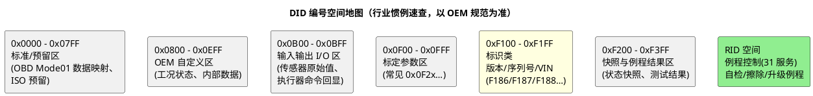

# 01-命名与字节序规范

> 一句话定位：DID/RID 的编号空间是一张"公共地皮规划图"——谁住哪段、字节怎么排、字符串怎么收尾，先立规矩再开工，产线与售后才不会为对不上号返工。
> 等级：L2 ｜ 前置：[从诊断仪的一次连接说起](../../00-入门导读/01-从诊断仪的一次连接说起-诊断全景.md)

## 原理

DID（Data Identifier，2 字节）与 RID（Routine Identifier，2 字节）是诊断世界的"门牌号"。号段不是法律，但全行业高度趋同——**照惯例划地皮，工具（CANdela/CANoe）与跨团队评审才有共同语言**：

必须先声明：**上表是惯例不是标准**——每个 OEM 的 DID 手册才是本项目法律；但在"没拿到手册先做原型"或"自研 ECU 立规范"时，这张图就是起点。

### 常用标准 DID 速查

| DID | 含义 | 常见用途 | 备注 |
|---|---|---|---|
| 0xF186 | 活动诊断会话 | 诊断软件心跳轮询（顺便刷 S3） | 见 [会话与安全配置](../Dcm配置/03-会话与安全配置.md) |
| 0xF187 | 供应商零件号/软件号 | 备件追溯、版本核对 | 刷写前核对的第一项 |
| 0xF188 | 软件版本号 | 版本一致性检查 | 与 F15B 关系按 OEM 定 |
| 0xF189 | ECU 序列号 | 整车档案绑定 | 一次写入后常锁死 |
| 0xF190 | VIN 车辆识别码 | 整车级标识 | 车厂写入，多 ECU 广播共享 |
| 0xF191 | ECU 制造日期 | 产线追溯 | 编码格式（BCD/ASCII）按 OEM |
| 0xF195 | 系统供应商软件版本 | 供应商生态并行版本管理 | 多层版本链之一 |
| 0xF197 | 车厂硬件号 | 硬件版本追溯 | 与 F183（供应商硬件号）配对使用 |
| 0xF15B/0xF15C | 应用软件版本/指纹 | 刷写流程识别（OEM 惯例段） | ISO 22900 语境常客，按 OEM 手册 |

### 字节序：大端是默认惯例

UDS 世界的多字节数据默认**大端（Big-Endian，Motorola/network byte order）**：`0x0ADC`（28.12V 的原始值）在报文里就是 `0A DC`，高位在前。三条细则：

1. **物理量换算统一走"原始值+线性公式"**（raw × factor + offset），factor 用十进制幂（0.001/0.01），诊断仪侧 CDD 换算与 ECU 侧打包必须同一张表；
2. **字符串 DID**：ASCII、定长左对齐、剩余空间按 OEM 填充（常见 0x00 或空格 0x20；部分 OEM 用 0xFF 饱和表示"无效"）——填充规则必须写进设计表，别让两家诊断软件显示两种尾巴；
3. **位级数据（布尔开关组）**：按位打包时**不跨字节**（一个信号不横跨两个字节），字节内高位是 bit7 还是 bit0 在表中显式声明。

### 长度对齐原则

- 成员长度取 1/2/4 字节，不用 3 字节与跨字节位段（3 字节数值是 OBD 遗产，新设计别再引入）；
- 定长优先：同语义 DID 的长度跨版本保持不变，新增字段追加到尾部（老工具读旧前缀不炸）；
- 变长 DID（动态长度）必须有显式长度字节/计数前缀，禁止"以 0x00 结尾"式隐式约定；
- 预留字节统一填 0x00（或 OEM 指定值），并在设计表标注"预留，读为 0"。

## 详解

命名规范落地的最小集是**三张同源表**：DID/RID 分配总表（含号段、归属模块、负责人）、字节布局表（本篇原则）、权限矩阵（会话/安全，见 [02-设计模板](02-设计模板.md)）。三张表从同一个 Excel/ARXML 派生 Dcm 配置与 CDD/ODX 数据库——**手工在两处各维护一份，漂移只是时间问题**。

RID 的命名同款思路但更简单：RID 空间通常按功能域分段（自检/存储管理/标定/产线序列），号本身不带语义细节，语义靠设计表的"例程名+选项码"承载。DID 与 RID 分属两个服务（22/2E vs 31），**号段互不混用**——同一个号在两个空间里指两个东西，是排查地狱的开始。

## 配置层

设计规范落到配置与数据库的两端核对项：

| 核对项 | 含义 | 典型口径 | 易错点 |
|---|---|---|---|
| DID 分配总表 | 全 ECU 号段分配与唯一性 | 按 OEM 手册+本项目扩展段 | 两个模块各扩了 F210 各指各的数据：集成期撞号 |
| 字节布局表 | 每字节字段/换算/单位/填充 | 大端、1/2/4 字节成员 | 布局表更新了，CDD 没重新生成，诊断仪按旧布局解 |
| 字符串规则 | 定长/编码/填充字符 | ASCII+0x00 填充 | 串尾填 0xFF：诊断软件显示乱码尾巴 |
| 长度声明 | Dcm DcmDspDidInfo 定长/动态 | 定长 DID 居多 | 动态 DID 回调长度与 CDD 声明不一致 |
| 预留字节策略 | 未用字节的读值 | 0x00 | 有的模块填 0xFF 有的填 0：整车扫描时数据"花脸" |
| RID 分配表 | 例程号+选项码结构 | 功能域分段 | 选项码未定义语义范围：后续扩展无号可用 |
| 三表同源 | DID 表↔Dcm 配置↔CDD 同源生成 | 变更走单一 owner | 复制粘贴式同步，版本错位一周后才爆 |

## 易错点与陷阱

1. **现象：诊断仪显示值是实际值 256 倍。原因：一端按大端解析另一端按小端打包（或换算因子 0.01 vs 1 写错位）。对策：新增 DID 验收用例固定"已知物理值→报文十六进制 dump"双向核对。**
2. **现象：同 DID 在两个 ECU 上语义不同。原因：号段规划只在单 ECU 内部做了，没做整车级分配。对策：跨 ECU DID 总表由整车诊断负责人统一签发，ECU 只能领号不能自封。**
3. **现象：版本升级后老诊断软件读新 ECU 数据错位。原因：布局中段插入新字段，偏移全变。对策：新字段只允许尾部追加；破坏性变更必须换 DID 号。**
4. **现象：字符串 DID 偶发乱码。原因：缓冲区未初始化就拷了固定长度，填充规则没执行。对策：读回调统一 memset 填充值后再拷数据；代码评审列必查项。**
5. **现象：布尔位状态与文档相反。原因：字节内位序声明缺失（bit0 起数 vs bit7 起数两家理解不同）。对策：布局表每字节附位序图（b7..b0 显式标号），不靠默契。**
6. **现象：RID 扩展时选项码空间不足。原因：初版把选项码当任意 2 字节用掉大片。对策：选项码按"功能码+子序号"分段预留，设计表标注每段语义。**

## 面试高频题

- **Q：DID 0xF190、0xF187、0xF188 分别是什么？**
  A：F190 是 VIN（车辆识别码，整车级唯一）、F187 是供应商零件/软件号（备件追溯）、F188 是软件版本号——刷写与售后核对版本的"三件套"，通常产线脚本第一步就读它们。
- **Q：UDS 数据的字节序是什么？换算怎么做？**
  A：默认大端（高位字节在前，网络字节序）；物理量用"原始值×factor+offset"线性换算，因子与偏移写进 CDD 与 ECU 打包代码，两侧同源；位信号不跨字节，位序显式声明。
- **Q：为什么禁止 3 字节成员和跨字节位段？**
  A：可移植性与工具兼容——3 字节是 OBD 遗产格式，解析端要做特殊处理；跨字节位段依赖位序定义，极易两端理解不一致。1/2/4 字节自然对齐是零歧义的最小集。
- **Q：DID 和 RID 能用同一个号吗？**
  A：技术上 22 与 31 是两个服务、互不冲突，但工程上必须禁止——同一个号两个语义，数据库、评审、排障全都要带上下文区分，纯自找麻烦。两个空间各自分段、永不重叠是惯例。

## 延伸

- [02-设计模板](02-设计模板.md)：把本篇原则固化成可复用的 DID/RID 设计表与评审 checklist；
- [02-DID路由](../Dcm配置/02-DID路由.md)：编号之后，数据从哪来的三通道；
- [03-会话与安全配置](../Dcm配置/03-会话与安全配置.md)：设计表里"会话/安全"两列的依据；
- [从诊断仪的一次连接说起](../../00-入门导读/01-从诊断仪的一次连接说起-诊断全景.md)：F186/F190 在开场三连中的角色；
- [诊断数据库](../诊断数据库/README.md)：设计表的下游产物 CDD/ODX。

---

维护约定：笔记命名 `序号-主题.md`；真实截图放 `_images/`；流程/时序/状态/架构图用 PlantUML 内嵌正文，规范见 [图表规范与模板](../../../00-总览/图表规范与模板.md)。
