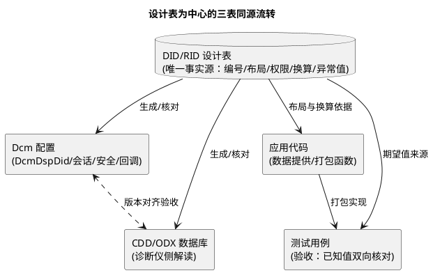

# 02-设计模板

> 一句话定位：把命名/字节序/权限/数据源的全部约定压进一张设计表——新 DID 照表填空、评审照表勾线，模板本身就是流程。
> 等级：L2 ｜ 前置：[01-命名与字节序规范](01-命名与字节序规范.md)

## 原理

DID/RID 设计的失控从来不是技术问题，是**信息散落问题**：编号在 A 表、权限在配置工具里、换算在代码注释里、异常值在某人脑子里。设计模板的思路是把一个 DID 的全部决策点收进一张行内表格，并让它成为 Dcm 配置与 CDD 数据库的唯一上游：

## 详解

### DID 设计表模板（复制即用）

| 字段 | 填写说明 | 示例（F1A1 电池电压） |
|---|---|---|
| DID | 十六进制号，来自分配总表 | 0xF1A1 |
| 名称 | 语义化英文名，含单位提示 | BattVolt_Phys |
| 读写 | R / W / R+W（对应 22/2E） | R |
| 会话 | 允许会话列表（默认/扩展/编程） | 全部三会话 |
| 安全 | 所需最低锁（0/1/2） | 锁 0 |
| 数据源 | 三通道之一（[DID路由](../Dcm配置/02-DID路由.md)） | 应用 SWC 经 RTE |
| 字节布局 | 逐字节字段+位序图 | 2 字节 uint16，大端 |
| 换算/单位 | raw×factor+offset 与单位 | raw×0.1 mV→V，实际 0.01 |
| 有效范围 | 物理量正常区间 | 9~16 V |
| 异常值 | 超界/未初始化的报文值与含义 | 0xFFFF=无效 |
| 长度/连读 | 总长度与允许连读组合 | 2 字节，可与 F1A2 连读 |
| 变更记录 | 版本、日期、负责人 | v1.2 追加尾字节 |

填表纪律三条：**会话/安全两列永不留空默认**（默认值是隐性知识，评审看不见）；**异常值必须定义**（未初始化读出 0 不叫设计，叫事故）；**变更只允许尾部追加**（见 [01-命名与字节序规范](01-命名与字节序规范.md)）。

### RID 设计表模板（在 DID 基础上加四列）

| 追加字段 | 填写说明 | 示例（F0E0 Flash 擦除例程） |
|---|---|---|
| 控制选项码 | 31 01/03 的选项码结构（分段语义） | 0x02=擦 App 区 |
| 执行条件 | 前置状态（会话/安全/车速/电源模式） | 编程会话+锁 2+车速 0 |
| 例程耗时/挂起 | 预期时长与 0x78 挂起次数预算 | 2~4s，预期 1 次 78 |
| 结果格式 | 31 03 响应的数据布局 | 1 字节状态+4 字节校验 |

RID 的验收口径与 DID 不同：DID 验"读回正确"，RID 验**"条件不满足时正确拒绝"**——执行条件列就是为负响应用例而生（每条条件至少一条 0x22/0x33 用例）。

### 设计评审 checklist

1. 编号取自分配总表且全 ECU 唯一，符合号段规划；
2. **读 DID 不得有副作用**——22 执行不改变任何应用状态（经典红线：读 DID 触发采样的，必须改设计）；
3. 字节布局遵守 1/2/4 字节对齐，位信号不跨字节，位序显式；
4. 换算因子/偏移/单位与 CDD、代码两侧同源一致；
5. 会话/安全矩阵显式填列，写类 DID 必须有条件检查（车速/电源等）且走 ConditionCheck 通道；
6. 写路径闭环：写→断电重启→读回一致（持久化归属明确）；
7. 响应长度预算通过：单读、允许连读组合均不超 DSL Tx 缓冲与 OEM 上限；
8. 异常值与填充值已定义（含未初始化场景），测试用例覆盖；
9. RID 的每条执行条件有对应负响应用例（0x22/0x33），长例程的 0x78 次数预算与 P2* 匹配；
10. 变更遵循尾部追加原则，破坏性变更已换号并在变更记录注明。

## 配置层

模板字段与配置项的对应关系（评审时照表查配置）：

| 模板字段 | Dcm 配置落点 | 易错点 |
|---|---|---|
| DID/长度/连读 | DcmDspDid + DcmDspDidInfo(Fixed/Dynamic) | 动态 DID 长度回调与表不一致 |
| 读写 | DcmDspDidRead / DcmDspDidWrite 容器 | 表里 W 但容器没配：2E 回 0x31 |
| 会话 | DcmDspDid>SessionLevelRef | 表与配置勾选不同步（表改了配置没生成） |
| 安全 | DcmDspDid>SecurityLevelRef | 写类漏挂锁：产线外可随便改标定 |
| 数据源 | DcmDspData 绑定（回调/RTE/NvM） | NvM 直读的 DID 没算读块性能账 |
| 执行条件 | DcmDspData>ConditionCheckRead/Write | 条件写进数据函数回错误码：NRC 不对 |
| 异常值 | 应用打包代码 + CDD 编码表 | 两端各写各的：显示 0xFFFF 当真值 |

## 易错点与陷阱

1. **现象：评审通过、产线翻车——读某 DID 后 ECU 行为异常。原因：读回调里"顺手"做了写操作（读版本号触发重初始化）。对策：checklist 第 2 条一票否决；读函数签名限定 const 输出。**
2. **现象：CDD 更新滞后，新 DID 诊断仪读出乱码。原因：设计表改了布局，CDD 未同步生成（三表同源断裂）。对策：CDD 生成纳入设计表变更流程，版本号绑定发布。**
3. **现象：写 DID 报成功但重启丢。原因：模板"持久化归属"列没人填，应用以为 Dcm 会存，Dcm 以为应用会存。对策：每个 W 类 DID 的写后动作显式写"谁落盘、何时落盘"。**
4. **现象：例程偶发 0x78 后诊断仪超时。原因：耗时预算列缺失，实际 8s 而诊断仪 P2* 只等 5s。对策：耗时/挂起列必填，联调用例含长例程全时程测量。**
5. **现象：连读组合在生产软件上被拒。原因：设计表"允许连读"列没填，评审按单读通过，组合超长。对策：长度预算列含"最长允许组合"子项。**
6. **现象：异常值域与有效域重叠。原因：0xFFFF 当无效值，但某换算下 0xFFFF 恰是合法读数。对策：异常值选取先验算全换算域，冲突时改饱和填充并登记。**

## 面试高频题

- **Q：为什么"读 DID 不得有副作用"是红线？**
  A：22 是最高频服务：诊断仪轮询、产线扫描、售后检测都在反复读；若读操作改变状态（触发采样/复位计数器），诊断行为本身污染被测系统，且多客户端并发读后果不可预测。读就是读，需要触发动作就用 31 例程。
- **Q：设计表里最容易漏填、后果最重的是哪几列？**
  A：安全（写类漏锁=产线外可篡改）、持久化归属（写丢数据）、异常值（未初始化读 0 被当真值）——三列都不会在功能测试里立刻爆雷，全在产线与售后爆。
- **Q：RID 和 DID 在验收口径上有什么不同？**
  A：DID 验正路径——读回与已知物理值一致；RID 更重负路径——每条执行条件（会话/安全/车速/电源）都要有对应 NRC 用例，因为例程常带擦除/控制等危险动作，"正确地拒绝"比"正确地执行"更重要。
- **Q：模板怎么和 Dcm 配置保持一致？**
  A：设计表是唯一事实源，Dcm 配置与 CDD 从表生成或评审时照表逐列核对（DID/读写→DidInfo 容器，会话/安全→Ref，数据源→DspData 绑定）；表变更是流程入口，配置与数据库跟随发布版本号。

## 延伸

- [01-命名与字节序规范](01-命名与字节序规范.md)：模板里编号/布局/填充列的原则依据；
- [02-DID路由](../Dcm配置/02-DID路由.md)："数据源"列的三通道详解；
- [03-会话与安全配置](../Dcm配置/03-会话与安全配置.md)："会话/安全"两列的机制；
- [02-冻结帧](../Dem配置/02-冻结帧.md)：快照 DID 清单同样用本模板管理；
- [04-模板与评审清单](../../../04-MCAL与外设驱动/2-L2进阶/CDD设计方法论/04-模板与评审清单.md)：兄弟方法论——应用侧 CDD 的模板与评审套路。

---

维护约定：笔记命名 `序号-主题.md`；真实截图放 `_images/`；流程/时序/状态/架构图用 PlantUML 内嵌正文，规范见 [图表规范与模板](../../../00-总览/图表规范与模板.md)。
