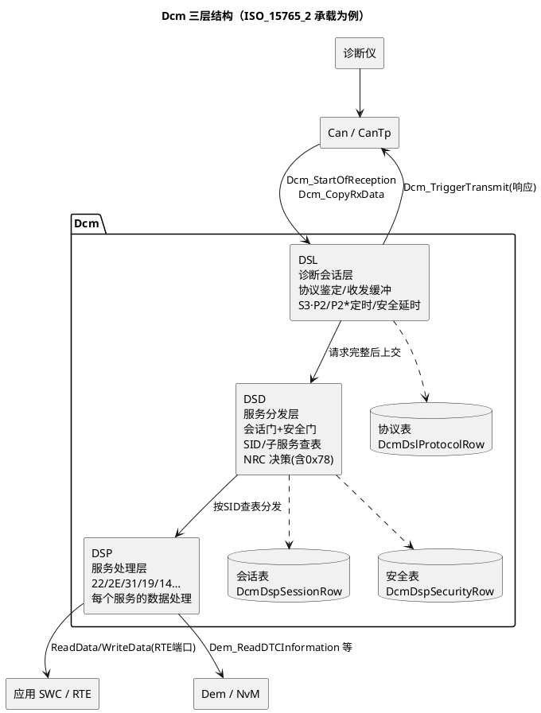

# 01-DSL-DSD-DSP分层

> 一句话定位：Dcm 内部的"总机—分机台—业务员"三层分工图——DSL 管收发与定时、DSD 管会话安全门与查表分发、DSP 管每个服务怎么干，配置工具里 90% 的 Dcm 参数都在给这三层填表。
> 等级：L2 ｜ 前置：[从诊断仪的一次连接说起](../../00-入门导读/01-从诊断仪的一次连接说起-诊断全景.md)

## 原理

AUTOSAR Dcm（Diagnostic Communication Manager）把"说 UDS"这件事拆成三层，各自回答一个问题：**DSL 收到了吗、DSD 让不让进、DSP 怎么干**。



三层职责一句话版：

| 层 | 类比 | 干什么 | 不干什么 |
|---|---|---|---|
| DSL | 话务总机 | 从 PduR/CanTp 收请求进 RxBuffer、鉴定协议与寻址方式、维护会话状态（S3Server 心跳）、P2/P2* 定时、安全访问延时惩罚、把响应送回 TxBuffer | 不看 SID 内容 |
| DSD | 分机台接线员 | 查会话表/安全表判断"该服务当前可用吗"，格式检查，把请求分发给对应 DSP 处理函数，决定正响应/哪个 NRC | 不真正读写数据 |
| DSP | 业务员 | 按 SID 干活：22 读 DID、2E 写 DID、31 例程、19/14 转手给 Dem，10/27 也在 DSP 实现服务逻辑（状态切换由 DSL 记账） | 不管定时与会话维持 |

## 详解

### 一个 22 请求穿三层

```plantuml
@startuml
title 22 F1 90 从 CanTp 到应用的完整路径
skinparam defaultFontName "Microsoft YaHei"
autonumber on
participant "诊断仪" as T
participant "CanTp" as TP
participant "DSL" as DSL
participant "DSD" as DSD
participant "DSP\n(DID服务)" as DSP
participant "应用 SWC" as APP

T -> TP : 22 F1 90（单帧 SF）
TP -> DSL : Dcm_StartOfReception(诊断RxPdu)
TP -> DSL : Dcm_CopyRxData(拷入 DslRxBuffer)
note right of DSL : 帧类型/寻址方式鉴定，\nSF/FF/CF 聚齐后判定"请求完整"
DSL -> DSD : 上交完整请求缓冲
DSD -> DSD : 查会话表：22 在当前会话可用？\n查安全表：22 需要安全等级吗？（否）
DSD -> DSP : DcmDspDid 条目：F190→DidRef\n回调 DidRead_F190()
DSP -> APP : 经 RTE 端口取数据
APP --> DSP : "SW_V1.2.3"（拷入 DspBuffer→TxBuffer）
DSP --> DSD : E_OK（同步完成）
DSD --> DSL : 请求发送响应
DSL -> TP : Dcm_TriggerTransmit(62 F1 90 + 数据)
TP --> T : 62 F1 90 …
@enduml
```

第 4~6 步是配置正确性的分水岭：**DID 不存在回 NRC 0x31，会话不对回 0x7E/0x7F，没解锁回 0x33**——同一个 22，三种拒绝全发生在 DSD 查表这一步，这也是排障时先看哪张表的依据。

### 两类缓冲的关系

- **DSL 缓冲（DslRxBuffer/DslTxBuffer）**：协议级大缓冲，按"一条完整诊断报文"分配——Rx 聚齐 SF/FF+CF，Tx 装下整条多帧响应再由 CanTp 搬运。容量必须 ≥ 本 ECU 允许的最大诊断报文长度（UDS on CAN 常见 4095 字节上限，实际按项目最大 DID/19 响应留）；
- **DSP 缓冲（DspBuffer/DcmDspDid 使用的临时区）**：服务级工作区，DSP 处理时组织响应数据。多份 DID 连读（22 F1 90 F1 91）时数据逐条拼进 TxBuffer，总量超限在 DSD 检查阶段就应拦下。

一条铁律：**DSL 缓冲不够，多帧根本收不全；DSP/总长度不够，收全了也回不了**——配置评审时两类缓冲分开核对。

### MainFunction 周期模型

Dcm 是纯轮询模块，没有自己的任务：`Dcm_MainFunction()`（如 5~10ms 周期）推动内部状态机走一步。DSL 在 IDLE→RX→PROCESSING→TX 各态间推进，DSD 在请求完整后的那个周期完成查表分发；DSP 若同步处理，同周期就出结果；若操作耗时（Flash 擦除、EEPROM 写），DSP 返回 DCM_E_PENDING，DSD 在 P2 到期前发 `7F SID 78`（RCRRP）挂起，之后每过一个 P2* 窗口可再补 78，直到结果就绪。**所有定时的粒度都是 MainFunction 周期**——P2 配 50ms 而主函数 20ms，实际响应时刻永远偏在 20ms 网格上。

### 三类静态表

Dcm 的"智能"全部来自配置期生成的静态表，运行时只查表不解释：

| 表 | 顶层容器 | 回答的问题 | 谁在查 |
|---|---|---|---|
| 协议表 | DcmDslProtocolRow | 用哪套协议（OBD/UDS on CAN/DoIP）、物理+功能寻址各绑哪个 Rx/Tx 缓冲、P2/P2*/S3 定时、引用哪张服务表 | DSL |
| 会话表 | DcmDspSessionRow | 有哪些会话（0x01/0x02/0x03），每个服务/子服务/DID 在哪些会话可用 | DSD |
| 安全表 | DcmDspSecurityRow | 有哪些安全等级（0x01/0x02…对应锁 1/锁 2），seed/key 算法、错误尝试次数与延时惩罚 | DSD/DSL |

会话表与安全表的逐项配置见 [03-会话与安全配置](03-会话与安全配置.md)；服务/DID 条目见 [02-DID路由](02-DID路由.md)。

## 配置层

| 配置项 | 含义 | 典型值 | 易错点 |
|---|---|---|---|
| DcmDslProtocolRow | 一行=一套协议实例：协议类型+寻址+缓冲+定时+服务表引用 | 每连接 1 行（ISO_15765_2 物理+功能各一行或同容器） | 物理寻址与功能寻址漏配其一：功能寻址 22 不响应（0x31/无响应） |
| DcmDslProtocolRxBufferId/TxBufferId | 协议行绑定的 DSL 收/发缓冲 | 缓冲容量 128~4095 字节 | 缓冲小于最大多帧响应→FF 阶段就被拒；多个协议行共用小缓冲互相踩 |
| DcmDslProtocolRow>P2ServerMax | 非扩展定时 P2Server | 50ms（OEM 常见 25~100ms） | 忘了与 MainFunction 周期匹配，配置值永远达不到 |
| DcmDslProtocolRow>P2StarServerMax | 0x78 后的扩展定时 P2*Server | 5000ms（典型 5000/10000） | 与 OEM 规范不一致：诊断仪侧计时先到，报 P2 超时 |
| DcmDslProtocolRow>S3Server | 扩展会话保活窗（收到任意诊断请求即刷新） | 5000ms | 配太大：总线异常后 ECU 长时间滞留扩展会话不回落 |
| DcmDspServiceTable/DcmDspSid | 服务容器：SID+子服务+会话/安全引用+NRC 使能 | 22/2E/19/14/31/27/10 各一容器 | 只配了 SID 没挂子服务：22 可用但 19 02 03 回 0x31 |
| DcmDspSessionRow | 会话定义：ID（0x01/0x02/0x03） | 3 行（默认/编程/扩展） | 少配编程会话：Bootloader 刷写前 10 02 直接被拒 |
| DcmGeneral>DcmMainFunctionPeriod | 主函数周期声明 | 5~10ms | 声明值与 OS 任务实际周期不一致→定时全部失真 |
| DcmDslBuffer（每个） | 缓冲容量字节数 | 见上 | 容量算成了"帧长"而非"报文长"，8 字节思维配诊断栈 |

## 易错点与陷阱

1. **现象：多帧请求收不全、FF 后无响应。原因：DSL Rx 缓冲小于请求总长（如 2E 长写）。对策：按本项目最大诊断报文（含 19 04 快照、2E 大 DID）核容，留余量。**
2. **现象：P2 明明配了 50ms，CANoe 里量到 60~70ms。原因：MainFunction 周期 20ms，定时被量化；且 DSD 查表在"下一周期"才执行。对策：P2 目标值 ≥ 2×主函数周期；对齐 OS 任务周期与 DcmMainFunctionPeriod 声明。**
3. **现象：功能寻址发 22 全车无响应，物理寻址正常。原因：协议表只配了物理寻址行，或功能寻址行引用了不同（漏配服务表的）服务表。对策：物理/功能两行都查服务表引用指针。**
4. **现象：扩展会话里 2E 写完偶发失败回 0x7F/0x7E。原因：长操作期间 S3Server 到期（处理期间未收到新请求），Dcm 自行跌回默认会话。对策：核对 S3 与最长服务（31 擦除例程）耗时，处理中周期响应也刷新 S3。**
5. **现象：换了一家供应商的 Dcm，同样的配置 P2 行为不同。原因：不同实现 P2 起算点口径不同（从收完请求 vs 从 DSD 分发）。对策：集成验收用示波器/CANoe 统计量测，不纸上谈兵。**
6. **现象：0x78 挂起后再无下文，诊断仪超时。原因：DSP 异步操作完成回调没把结果送回 DSD（应用侧没实现 Poll/结果通知），DSD 永远等不到。对策：检查 DSP 服务实现模板里 Pending→Result 的通知路径，联调用例必须覆盖长服务。**

## 面试高频题

- **Q：DSL/DSD/DSP 各自的职责边界？**
  A：DSL 管协议与连接——收发缓冲、协议鉴定、S3/P2/P2* 定时、安全延时；DSD 管门禁与分发——查会话表安全表、格式检查、调 DSP、决定 NRC；DSP 管服务语义——DID 读写、例程、转 Dem。一句话：DSL 收发、DSD 查表、DSP 干活。
- **Q：一个 22 请求的 NRC 0x31/0x7E/0x33 分别产生在哪一层？**
  A：都在 DSD：0x31 是查 DID/子服务表无条目，0x7E/0x7F 是会话表判定当前会话不支持（0x7E 在其他会话支持、0x7F 全不支持），0x33 是安全表判定该服务需更高安全等级且未解锁。DSL 只在缓冲/定时失败时兜底（如 0x22 时机）。
- **Q：Dcm 为什么必须是周期轮询的？P2 精度和 MainFunction 周期什么关系？**
  A：AUTOSAR 服务栈约定无自循环、由 OS 任务驱动；Dcm 状态机每次 MainFunction 推进一步，所有定时（P2/S3/延时）的分辨率=主函数周期。P2 实际值 = 配置值向上取整到主函数周期网格，再加任务抖动。
- **Q：DSL 的 Tx 缓冲和 DSP 用的缓冲是什么关系？**
  A：DSL 缓冲是协议级整报文容器（按最大多帧报文分配，CanTp 从这里分段搬运）；DSP 处理时把各 DID 数据组织进响应（可看作往 DSL Tx 缓冲/服务级工作区拼装）。容量计算口径不同：前者按协议最大长度，后者按单服务响应长度。

## 延伸

- [02-DID路由](02-DID路由.md)：DSP 里最大的一摊——DID 到数据源的三通道映射；
- [03-会话与安全配置](03-会话与安全配置.md)：会话表/安全表逐项展开与 S3/P2/P2* 时序；
- [从诊断仪的一次连接说起](../../00-入门导读/01-从诊断仪的一次连接说起-诊断全景.md)：三层图在整个诊断链路里的位置；
- [01-CanTp分段15765-2](../../../05-汽车网络通讯/2-L2进阶/传输层/01-CanTp分段15765-2.md)：DSL 收发缓冲的"另一头"——多帧搬运工；
- [通讯服务栈](../../../07-AUTOSAR架构/2-L2进阶/通讯服务栈/README.md)：Dcm 在服务栈里与 PduR/Com 的邻居关系。

---

维护约定：笔记命名 `序号-主题.md`；真实截图放 `_images/`；流程/时序/状态/架构图用 PlantUML 内嵌正文，规范见 [图表规范与模板](../../../00-总览/图表规范与模板.md)。
