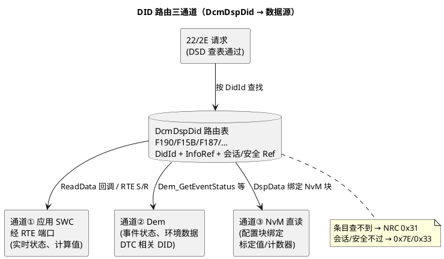

# 02-DID路由

> 一句话定位：DID 路由表是 Dcm 的"分机号簿"——每个 DID 绑定数据源回调与读写权限，22/2E 能不能通，取决于这张表配没配、配对没配对。
> 等级：L2 ｜ 前置：[01-DSL-DSD-DSP分层](01-DSL-DSD-DSP分层.md) + [SID22-读DID](../../1-L1基础/UDS协议/SID22-读DID.md)

## 原理

诊断仪发 `22 F1 90`，Dcm 拿到 F190 之后干什么？——查路由表：**DID 号 → 数据条目 → 数据源 + 读写方向 + 会话/安全门禁**。数据源按"数据住在哪"分三通道：



三通道选型口径：**数据是"活的"走应用（实时电压、车速），数据是"账本"走 Dem（故障状态），数据是"存的"走 NvM（标定参数、累计计数）**。跨 ECU 的功能寻址请求由网关转投递，本 ECU 只需把自己的 DID 配全——多 ECU 路由（如 22 F1 87 要读全网 ECU 零件号）在网关侧用 Dcm Forward/DiagRouter 实现，不在本表范围。

## 详解

### DcmDspDid 配置结构

Dcm 的 DID 配置是三层引用链，配错一层现象完全不同：

```
DcmDspDid（DID 实体：DidId=F190）
 ├── DcmDspDidInfoRef → DcmDspDidInfo（元信息：定长/动态、允许方向）
 │     ├── DcmDspDidFixed（定长 DID：总长度）
 │     ├── DcmDspDidRead（允许 22 读）
 │     └── DcmDspDidWrite（允许 2E 写，可选条件检查）
 ├── DcmDspDidRef → DcmDspData（数据段：类型/长度/回调/换算）
 │     ├── DcmDspDataType / DataLength
 │     ├── DcmDspDataReadDataFnc（读回调，通道①③入口）
 │     ├── DcmDspDataWriteDataFnc（写回调）
 │     └── DcmDspDataConditionCheckRead（读前置条件，不满足回 0x22）
 ├── DcmDspSessionLevelRef（哪些会话可访问）
 └── DcmDspSecurityLevelRef（哪个安全等级可访问）
```

运行时 DSD 查表顺序：DidId 找不到 → 0x31；会话 Ref 不含当前会话 → 0x7E；安全 Ref 高于当前等级 → 0x33；条件检查失败 → 0x22——四道门按序过，全部通过才进 DSP 调回调。

### 读写分离

22 与 2E 是两个独立容器，路由可完全不同：典型如 F190（软件版本）只配 Read（写它没有意义），F1A0（某标定量）Read/Write 都配。更常见的分离场景：**读走快通道（直接读 RAM 镜像），写走慢通道（先写 RAM，由应用择机落 NvM）**——写路径常配 ConditionCheckWrite（车速=0 才许写，回 0x22）。评审时要逐 DID 问三个问题：读谁、写谁、写了存哪。

### 22 的多 DID 连读

`22 F1 90 F1 91` 一条请求读两个 DID：DSD 逐个查表（任何一个不过门禁，整条请求回对应 NRC——0x31 优先），全部通过后 DSP 依请求顺序把各段数据拼进 TxBuffer。**总响应长度超 DSL Tx 缓冲/协议上限时整条拒绝**，所以"哪些 DID 允许连读"要在设计期就用最小公倍长度验一遍。

## 配置层

| 配置项 | 含义 | 典型值 | 易错点 |
|---|---|---|---|
| DcmDspDid>DidId | DID 编号 | 见 [命名与字节序规范](../DID与RID设计/01-命名与字节序规范.md) | 与 OEM CDD 清单不一致：诊断仪按数据库发请求，ECU 回 0x31 |
| DcmDspDid>SessionLevelRef | 该 DID 可用会话列表 | 多数 DID 三会话全开；写类限扩展会话 | 漏勾扩展会话：10 03 后读该 DID 反而 0x7E |
| DcmDspDid>SecurityLevelRef | 该 DID 需要的安全等级 | 读类锁 0；写类锁 1/锁 2 | 写 DID 挂了锁但 CDD 里没标：诊断仪不先 27，收一堆 0x33 |
| DcmDspDidInfo>Fixed/Dynamic | 定长或动态长度 DID | 串类（F187 零件号）可动态 | 动态 DID 长度回调返回值与 CDD 声明不一致→响应格式错 |
| DcmDspDidRead / DidWrite | 允许的读写方向 | Read 或 Read+Write | 只配了 Read 却期待 2E 能写：0x31（方向也算"不存在"） |
| DcmDspData>ReadDataFnc | 读数据回调函数 | App 生成代码函数名 | 函数返回长度硬编码，改布局后没同步→读到脏数据 |
| DcmDspData>ConditionCheckRead | 读前置条件 | 车速检查等 | 把条件写进数据回调里返回 0：诊断仪看到的是错数据而非 0x22 |
| DcmDspData>UsePort/数据绑定 | 三通道选择：回调/RTE 端口/NvM 块 | 标定值常直接绑 NvM 块 | 直读 NvM 意味着 22 触发 NvM_ReadBlock——周期诊断会反复读块，性能账要先算 |
| DcmDspData>换算/单位 | 物理值换算因子 | 0.1 V/LSB 等 | 与 CDD 换算不一致：诊断仪显示值系统性偏差 10 倍 |

## 易错点与陷阱

1. **现象：新加的 DID 回 0x31。原因：路由表加在服务容器外/DID 条目没挂进 DcmDspDid 列表，或 22 服务本身没引用该 DID 集。对策：从 SID22 容器→DID 集→单条 DID 三级引用链逐指针核对。**
2. **现象：2E 写完重启丢失。原因：写回调只改了 RAM 镜像，没有触发 NvM 写块（或写块异步失败未处理）。对策：写路径闭环验收=写→断电→重上电→22 读回一致。**
3. **现象：扩展会话下读某些 DID 回 0x7E。原因：SessionLevelRef 只勾了默认会话——"会话可用"是白名单逻辑，不是"扩展比默认权限大"。对策：以 OEM DID 矩阵为准逐 DID 核勾选，默认/扩展全开的是多数。**
4. **现象：22 连读偶发无响应/截断。原因：两 DID 总长超出 DSL Tx 缓冲或 OEM 允许的最大响应。对策：连读组合在 CDD 里预先限定，设计模板里记录"允许连读组合"字段。**
5. **现象：绑 NvM 块的 DID 周期轮询后整机负载升高。原因：每次 22 都触发 NvM_ReadBlock（含队列/CRC 校验）。对策：热数据走应用 RAM 镜像通道，仅冷数据（仅上电读）走 NvM 直读。**
6. **现象：功能寻址 22 某些 DID 无响应。原因：功能寻址请求要求"所有 ECU 对同一 DID 语义一致"，本 ECU 漏配导致网关聚合响应缺项。对策：跨 ECU 功能 DID 清单单独维护并与网关侧 DiagRouter 对表。**

## 面试高频题

- **Q：一个 DID 从 22 请求到数据返回，配置上要过哪几道门？**
  A：四道：DidId 查表（0x31）→ 会话白名单（0x7E/0x7F）→ 安全等级（0x33）→ 条件检查（0x22），全过后调 DcmDspData 的读回调拿数据拼响应。
- **Q：DID 数据源有哪几条通道？怎么选？**
  A：三条：应用 SWC 经 RTE（实时状态值）、Dem（事件状态/环境数据等故障账本）、NvM 直读（配置块绑定的标定值与计数）。选型按数据性质：活的走应用、账本走 Dem、存的走 NvM；性能敏感的周期轮询 DID 避免 NvM 直读。
- **Q：22 和 2E 的配置为什么是分离的？**
  A：读写在 DcmDspDidInfo 下是两个独立容器（DidRead/DidWrite），方向、回调、条件检查各自配置——版本号类只读，标定值类读写且写要条件门（车速=0）；漏配写容器时 2E 对该 DID 回 0x31。
- **Q：多 ECU 的 DID 请求怎么路由？**
  A：诊断仪功能寻址（或网关代转）后由网关的 Dcm Forward/Diagnostic Routing 转发到目标 ECU，聚合各 ECU 响应——本 ECU 只需保证自己的 DID 表与 OEM 清单一致，路由逻辑在网关。

## 延伸

- [01-DSL-DSD-DSP分层](01-DSL-DSD-DSP分层.md)：路由发生在 DSD/DSP 的上下文；
- [03-会话与安全配置](03-会话与安全配置.md)：挂在每个 DID 上的会话/安全引用如何整体生效；
- [01-命名与字节序规范](../DID与RID设计/01-命名与字节序规范.md)：DID 编号空间与字节布局惯例；
- [02-设计模板](../DID与RID设计/02-设计模板.md)：把本篇配置项固化成可复用设计表；
- [02-冻结帧](../Dem配置/02-冻结帧.md)：走 Dem 通道的代表场景——快照 DID 的数据来源。

---

维护约定：笔记命名 `序号-主题.md`；真实截图放 `_images/`；流程/时序/状态/架构图用 PlantUML 内嵌正文，规范见 [图表规范与模板](../../../00-总览/图表规范与模板.md)。
