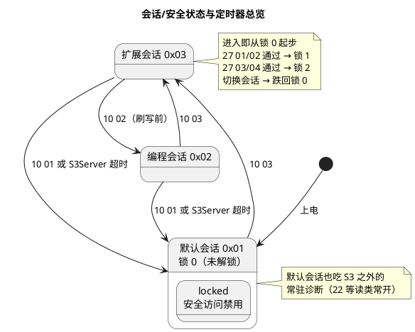

# 03-会话与安全配置

> 一句话定位：会话是"权限档位"、安全是"身份验证"、S3/P2/P2* 是"计时器"——Dcm 配置里最需要按 OEM 规范逐条核对的一张权限矩阵，配错一条整条产线流程就走不通。
> 等级：L2 ｜ 前置：[01-DSL-DSD-DSP分层](01-DSL-DSD-DSP分层.md)

## 原理

UDS 用两级门禁管理"什么状态下能干什么"：**会话（SID 10）管档位，安全等级（SID 27）管身份，S3Server 管档位时效**。三者关系：



三个会话的分工惯例：**默认会话**跑售后读码（19/22 常开，写类全关）；**扩展会话**跑标定与功能调试（2E/31 开放，多数写操作还要 27 解锁）；**编程会话**只给刷写（34/36/37 与擦除例程，进会话前通常要求特定条件如整车下电模式）。

安全等级是"逐级独立"的锁对：锁 0=未解锁（读类够用）；锁 1 由 27 01/02（seed/key 对 1）解锁；锁 2 由 27 03/04 解锁，保护更高危操作（刷写授权、安全气囊相关标定）。**解锁只升当前这把锁，且只维持到下一次会话切换。**

## 详解

### S3Server：扩展权限的保鲜期

非默认会话下，ECU 每收到一条**物理寻址诊断请求**（无论正负响应）就刷新 S3Server 计时；S3Server 到期仍未收到新请求 → 自动跌回默认会话 + 安全等级归锁 0。设计意图：诊断仪拔线/软件崩溃后，ECU 不能永远滞留在高权限状态。默认会话没有 S3 约束（它本来就是"零门槛"态）。典型值 5000ms——诊断软件的轮询周期（如 2s 心跳读 F186 会话状态）必须明显小于它，否则边诊断边被踢回默认会话。

### P2 / P2* 与 0x78 挂起

P2ServerMax 是"收到请求到发出响应"的承诺时限；当服务确实做不完（Flash 擦除、大块 EEPROM 写），Dcm 在 P2 内先回 `7F SID 78`（RCRRP，requestCorrectlyReceived-ResponsePending），随后进入 P2*ServerMax 节奏：每个 P2* 窗口内要么给出最终响应，要么再补一个 78。

```plantuml
@startuml
title 长操作 0x78 挂起时序（31 例程擦 Flash 为例）
skinparam defaultFontName "Microsoft YaHei"
autonumber on
participant "诊断仪" as T
participant "Dcm" as DCM
participant "应用\n(擦除任务)" as APP

T -> DCM : 31 01 FF 00（自检/擦除例程）
DCM -> APP : 启动异步例程
APP --> DCM : 未就绪（进行中）
note right of DCM : P2Server(50ms) 将到
DCM --> T : 7F 31 78（RCRRP 挂起）
note right of DCM : 进入 P2* 节奏(5000ms 窗)
...擦除进行中，P2* 窗将到仍未完成...
DCM --> T : 7F 31 78（再挂一次）
APP --> DCM : 例程完成，结果 E_OK
DCM --> T : 71 01 FF 00 + 结果
note over T,DCM
  S3Server 在整个挂起期间被
  每条交互刷新，不会误踢会话
end note
@enduml
```

口径提醒：0x78 是"正常地慢"，不是错误——诊断仪侧应继续等 P2* 而非重发；但 78 也不许无限刷，OEM 一般限制连续 78 次数/总时长，超限视为 ECU 故障。

### 会话切换的副作用清单

执行 10 03/10 02 成功的那一瞬间：安全等级跌回锁 0（已解锁状态全部作废）→ 依赖解锁的 DID/服务立刻 0x33；S3Server 重启；部分实现还会复位周期响应（0x22 定时响应）与挂起中的服务。**产线脚本最经典的翻车点：27 解锁后为了"确认状态"发一条 10 03，把锁又锁回去了。**

## 配置层

| 配置项 | 含义 | 典型值 | 易错点 |
|---|---|---|---|
| DcmDspSessionRow>SessionId | 会话定义：0x01 默认/0x03 扩展/0x02 编程 | 3 行全配 | 漏配 0x02：Bootloader 刷写链路 10 02 直接 0x7F |
| DcmDspSid>SessionLevelRef | 服务/子服务的会话白名单 | 19/22 三会话；2E/31 限扩展+编程 | 白名单思维弄反：以为"扩展会话包含默认会话权限" |
| DcmDspSecurityRow | 安全等级行：等级值+seed/key 回调引用 | 锁 1、锁 2 各一行 | 锁 1/锁 2 的 seed 算法配成同一个：两把锁一把钥匙 |
| DcmDspSecurityRow>GetSeedFnc/SendKeyFnc | 27 服务的种子生成与校验回调 | 应用实现（常含时间因子） | seed 固定常数：静态分析即可伪造 key |
| DcmDspSecurityAttempts | 锁定前允许的连续 key 错误次数 | 3 次 | 配 1 次：诊断仪一次手滑就把产线节拍卡进 10s 延时 |
| DcmDspSecurityDelayTime | key 错误后的强制延时 | 10s（OEM 常见 10/20s） | 延时期间所有 27 请求必须回 0x37（NRC requiredTimeDelayNotExpired） |
| DcmDslProtocolRow>S3Server | 非默认会话保活窗 | 5000ms | 与诊断软件心跳周期打架：心跳 5.1s，每轮被踢回默认会话 |
| DcmDslProtocolRow>P2ServerMax | 首响应时限 | 50ms | 忘算 MainFunction 周期量化，实测永远超配值 |
| DcmDslProtocolRow>P2StarServerMax | 78 之后的扩展时限 | 5000ms | 两侧口径不一：诊断仪等 3s 就超时，ECU 还想挂第二个 78 |
| 10 服务>NRC 使能 | 切会话对条件不满足回 0x22 等 | 按项目 | 编程会话进前条件（如电源模式）没配 0x22：非法切换被硬拒成无响应 |

## 易错点与陷阱

1. **现象：解锁成功后紧接的 2E 回 0x33。原因：脚本在 27 与 2E 之间多发了一条 10 03"确认会话"，安全状态被重置。对策：会话保持期间不重复发 10；自动化脚本把 10-27-操作编成原子序列。**
2. **现象：扩展会话干着活突然全部服务 0x7E。原因：S3Server 到期（长轮询间隔>5s），Dcm 自动回默认会话。对策：诊断仪侧加心跳请求；或按 OEM 允许调大 S3，但不可靠 S3 维持权限——那是设计漏洞。**
3. **现象：key 三次错误后 27 一直回 0x37。原因：DelayTime 惩罚计时器未到。对策：等待而非重试轰炸；测试环境把 DelayTime 临时调短要随版本还原（评审 checklist 项）。**
4. **现象：P2 配 50ms，诊断仪仍报 S3/响应超时。原因：P2* 语义配反——把 P2StarServerMax 配小于 P2ServerMax，或长服务没启用 78 回复路径，DSP 慢时直接 P2 违约。对策：长服务一律挂 0x78；核对 P2<P2*。**
5. **现象：编程会话里 34/36 无响应。原因：34 的会话白名单只勾了"编程"，但刷写前 10 02 在部分 ECU 由 Bootloader 与 App 各管一段，跨段时会话状态丢失。对策：刷写流程联调覆盖 App→BL 跳转前后各发一次 10 02 验证。**
6. **现象：两个项目复制配置后 27 互相解锁。原因：seed/key 算法与密钥沿用未换。对策：每项目独立密钥；key 校验回调里加项目标识因子。**

## 面试高频题

- **Q：为什么 10 切会话后 27 解的锁会失效？**
  A：SWS 规定会话切换复位安全状态——会话与安全是正交的两级门禁，切档位视为"新的交互上下文"，身份必须重新验证；这防止了"先进低门槛会话再横跳保权限"的旁路。
- **Q：S3Server、P2ServerMax、P2StarServerMax 各管哪段时间？**
  A：S3Server 管"非默认会话的存活"（收请求刷新，超时跌回默认+锁 0）；P2ServerMax 管单条请求的首响应时限；P2StarServerMax 是回过 0x78 后每一挂起窗口的时限。三者互相独立，刷新逻辑也不同（S3 只看请求到达，P2 看请求-响应对）。
- **Q：0x78 能一直回吗？**
  A：协议上允许在 P2* 窗口内多次挂起，但 OEM 规范通常限制连续次数/总时长（如最多 5 次/30s），防 ECU 用 78 掩盖设计缺陷；诊断仪侧对 78 的正确行为是继续等，不是重发请求。
- **Q：安全等级 1 和 2 的常见分工？**
  A：锁 1 保护常规写操作（2E 标定值、部分 31 例程），锁 2 保护高危操作（刷写授权、气囊标定、防盗件写入），各自独立的 seed/key 对；等级之间不是继承关系，解锁锁 2 不等于自动有锁 1 权限（按 SWS，等级间独立判定）。

## 延伸

- [01-DSL-DSD-DSP分层](01-DSL-DSD-DSP分层.md)：S3/P2 计时器挂在 DSL、门禁判定在 DSD 的分层位置；
- [02-DID路由](02-DID路由.md)：会话/安全引用如何挂到每个 DID 上；
- [从诊断仪的一次连接说起](../../00-入门导读/01-从诊断仪的一次连接说起-诊断全景.md)：10→27→22 的开场三连在本篇全部展开；
- [02-设计模板](../DID与RID设计/02-设计模板.md)：设计表里每条 DID 必填"会话/安全"两列的出处；
- [Bootloader](../../3-L3高级/Bootloader/README.md)：编程会话的主战场——34/36/37 刷写链路。

---

维护约定：笔记命名 `序号-主题.md`；真实截图放 `_images/`；流程/时序/状态/架构图用 PlantUML 内嵌正文，规范见 [图表规范与模板](../../../00-总览/图表规范与模板.md)。
