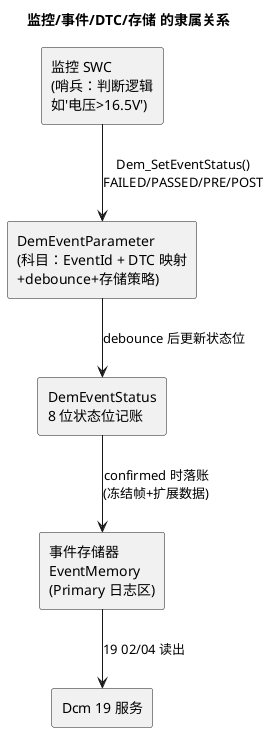
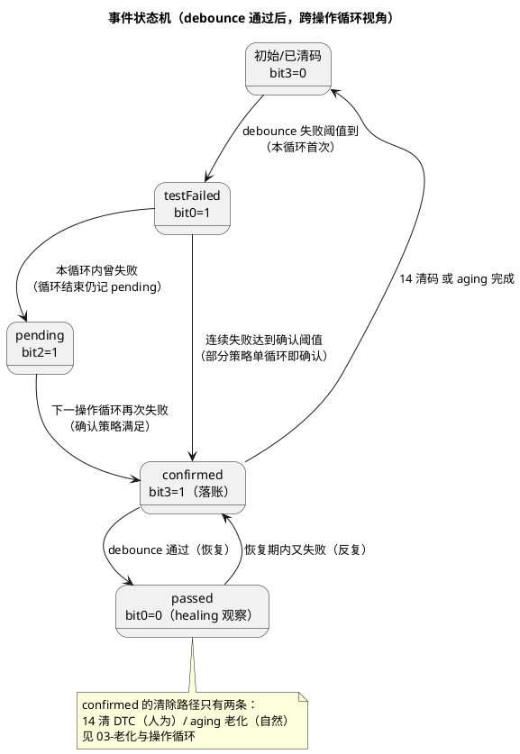

# 01-事件与DTC

> 一句话定位：Dem 的记账模型——监控（Monitor）报"事件"，Dem 按 8 位状态位流转记账，confirmed 了的才叫 DTC； DemEventParameter 就是这本账的科目设置表。
> 等级：L2 ｜ 前置：[从诊断仪的一次连接说起](../../00-入门导读/01-从诊断仪的一次连接说起-诊断全景.md)

## 原理

三个词必须先掰开：**监控是哨兵（应用代码里的判断逻辑），事件是哨兵吹的哨（DemEventId），DTC 是记进账本的编号（账本叫事件存储器）**。一个 DTC 至少对应一个事件，一个事件背后有一个监控在持续报状态。

### 8 位状态逐位表

诊断仪读到的 DTC 是"3 字节编号 + 1 字节状态"，那 1 字节每个 bit 都有含义：

| 位 | 名称 | 置 1 含义 | 谁在关心 |
|---|---|---|---|
| bit0 | testFailed | 当前测试失败（实时故障中） | 售后判断"现在还坏着吗" |
| bit1 | testFailedThisOperationCycle | 本操作循环内失败过 | 区分"刚发生"与"上循环发生" |
| bit2 | pendingDTC | 跨循环仍待定（上循环失败过） | 判断是否要继续观察 |
| bit3 | confirmedDTC | 已确认（满足确认策略） | 19 02 默认过滤的就是它 |
| bit4 | testNotCompletedSinceLastClear | 清码后测试还没跑完 | 判断清码后是否有效监测过 |
| bit5 | testFailedSinceLastClear | 清码后失败过 | 清码有效性判定（OBD 常用） |
| bit6 | testNotCompletedThisOperationCycle | 本循环测试未完成 | 判定监测条件没满足 |
| bit7 | warningIndicatorRequested | 请求点亮警告灯 | 仪表订阅的正是这位 |

### 状态流转

一句话记流转：**testFailed 是"正在坏"，pending 是"坏过待观察"，confirmed 是"立案"**——立案与否决定 19 02 能不能读到它。

### debounce：把哨兵的抖动滤掉

监控上报往往是抖的（电压贴着阈值上下跳），Dem 用 debounce 把"瞬时越限"和"真故障"分开，两种实现：

- **计数式（CounterBased）**：每报 PREFAILED/FAILED 加一步（IncrementStepSize），报 POSTPASSED/PASSED 减一步（DecrementStepSize），计到 FailedThreshold 判失败、跌到 PassedThreshold 判通过——步长比就是灵敏度；
- **时间式（TimeBased）**：失败状态需持续满 FailedTime（如 500ms）才判失败，通过需持续满 PassedTime——直觉更好配，但监测周期不匀的项目慎用。

## 详解

检测输入是 `Dem_SetEventStatus(EventId, EventStatus)`，四个常用值：FAILED（失败确定）、PASSED（通过确定）、PREFAILED（预失败：疑似，给 debounce 加分）、POSTPASSED（预通过：疑似好转，给 debounce 减分）。**把 PRE/POST 当摆设只报 FAILED/PASSED，等于把 debounce 退化为"连续 N 次同向"的粗糙滤波**——正确姿势是监控周期性报 PRE/POST，只有真定了性才报 FAILED/PASSED。SWC 侧经 RTE 端口（或 CDD 直接调用）上报，Dem 主函数里完成 debounce 推进与状态落账。

确认策略（存储等级）决定 pending→confirmed 的门槛：常见"TOUC"（test failed in two consecutive operation cycles，连续两个操作循环失败即立案）；OBD 法规件还有"w/ healing"等变体。同一套配置里不同事件可挂不同策略——传感器开路（单循环立案）vs 偶发通讯丢帧（两循环立案），体现"故障等级差异化处理"。

## 配置层

| 配置项 | 含义 | 典型值 | 易错点 |
|---|---|---|---|
| DemEventParameter>DemEventIdKind/EventId | 事件实体与编号 | 全 ECU 唯一，与 DID/DTC 表同源 | 两个团队各编各的号，集成时冲突 |
| DemEventParameter>DemDTCRef | 事件→DTC 映射（3 字节编号） | 按 OEM DTC 手册（P0xxx/Uxxxx） | DTC 编号抄错一位：CANoe 里"故障名与编号对不上" |
| DemEventParameter>StorageClass | 存储策略（TOUC 等）与是否存 Primary | 法规件 TOUC；偶发件两循环 | 全库一刀切单循环：抖动故障把存储区刷爆 |
| DemDebounceCounterBased | 计数式参数组：步长+双阈值 | 加 1/减 1，失败阈值 127 等 | 步长与监控周期不匹配：10ms 周期配阈值 10000 等于永不触发 |
| DemDebounceTimeBased | 时间式参数组：失败/通过持续时间 | 失败 500ms/通过 500ms | 只配失败时间没配通过时间：恢复判定立即生效，抖回去 |
| DemEventParameter>DemCallback... | 状态变化通知回调 | 应用注册（如触发降级） | 回调里做重活：Dem 上下文被拖长，连带诊断响应超时 |
| DemOperationCycleRef | 事件归属的操作循环（点火循环） | 通常统一一个 cycle | 事件挂错循环：老化计数跟着别人的节奏走 |
| DemMaxNumberEventEntry(Primary) | 日志区容量（可存多少 confirmed 事件） | 按项目（几十级） | 容量小于设计 DTC 数：满时按优先级覆盖，重要故障被挤掉 |

## 易错点与陷阱

1. **现象：19 02 读不到已发生的故障。原因：监控只报了 PREFAILED 从未报 FAILED，debounce 永远到不了失败阈值。对策：链路验收=故意注入故障，抓 Dem_SetEventStatus 调用序列，核对四态用法。**
2. **现象：故障一闪即过也立案。原因：debounce 阈值太小或没启用（阈值=1 等于直通）。对策：按监控周期反推：期望"持续 500ms 才立案"= 周期×步数，换算成计数参数。**
3. **现象：DTC 读出来编号与故障清单对不上。原因：DemDTCRef 抄录错误或复用旧配置没更新。对策：DTC/事件/DID 三表同源管理（一个 Excel/ARXML 出全库），禁手工分头维护。**
4. **现象：ECU 复位后故障全丢。原因：EventMemory 没绑 NvM 持久化块，confirmed 状态只活在 RAM。对策：确认 Dem 事件存储的 NvM 块映射与写入策略（立即写/循环末写）。**
5. **现象：Dem_MainFunction 周期抖，debounce 时间不准。原因：时间式 debounce 的分辨率=Dem 主函数周期。对策：Dem 主函数放稳定 OS 任务（如 10ms），与配置声明一致。**
6. **现象：bit7 警告灯不亮但 DTC 已 confirmed。原因：事件未配置 warningIndicator 相关属性，或仪表用 bit3 代替 bit7 点灯。对策：点灯订阅 bit7，Dem 配置里对需点灯事件启用指示器请求并设去抖。**

## 面试高频题

- **Q：监控、事件、DTC 三者什么关系？**
  A：监控是应用里的判断逻辑（哨兵），它通过 Dem_SetEventStatus 上报事件状态；事件是 Dem 的记账科目（DemEventParameter）；DTC 是事件映射的对外编号，只有满足确认策略（如连续两循环失败）的事件才作为 DTC 存入事件存储器被 19 读到。
- **Q：pending 和 confirmed 的区别？**
  A：pending（bit2）= 上一个操作循环失败过、待观察；confirmed（bit3）= 达到存储策略门槛已立案。19 02 默认报 confirmed 的；pending 的价值是让"第二个循环再确认"策略有据可依。
- **Q：debounce 两种方式怎么选？**
  A：计数式用步进计数（加/减步长+双阈值），对监测周期不敏感、参数即灵敏度；时间式直接定义失败/通过持续时间，直觉好配但依赖监测周期稳定。周期固定用时间式，周期漂移用计数式。
- **Q：为什么要有 PREFAILED/POSTPASSED？**
  A：它们给 debounce 提供方向信号而不直接定性：监控每个周期报 PRE/POST，Dem 据此加减计数；FAILED/PASSED 则是立即定性。只用 FAILED/PASSED 会把滤波退化为连续计数，丢失"疑似"信息。

## 延伸

- [02-冻结帧](02-冻结帧.md)：confirmed 立案那一刻 Dem 顺手拍了哪些"现场照片"；
- [03-老化与操作循环](03-老化与操作循环.md)：confirmed 的自然消退路径与操作循环定义；
- [04-Dem与Dcm联动](04-Dem与Dcm联动.md)：19/14 如何把这本账读出来/清掉；
- [从诊断仪的一次连接说起](../../00-入门导读/01-从诊断仪的一次连接说起-诊断全景.md)：Dem 作为"内容提供者"的定位；
- [内存栈](../../../07-AUTOSAR架构/2-L2进阶/内存栈/README.md)：事件存储器的持久化靠 NvM 落盘。

---

维护约定：笔记命名 `序号-主题.md`；真实截图放 `_images/`；流程/时序/状态/架构图用 PlantUML 内嵌正文，规范见 [图表规范与模板](../../../00-总览/图表规范与模板.md)。
