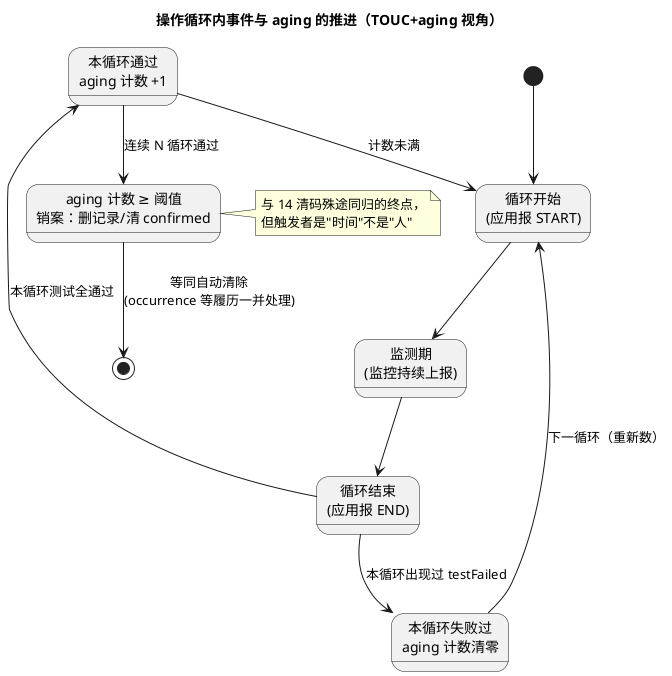

# 03-老化与操作循环

> 一句话定位：操作循环是 Dem 记账的"日历"，aging 是"连续 N 天不犯案就销案"的自动清账机制——它和 14 清码（人为销案）走的完全是两条路。
> 等级：L2 ｜ 前置：[01-事件与DTC](01-事件与DTC.md)

## 原理

Dem 的所有跨循环判断（pending→confirmed、aging 计数、bit1/bit6 的循环内状态）都挂在一个时间骨架上——**操作循环（OperationCycle）**。它不是自然日历，而是应用显式声明的一段生命周期：最常见的是点火循环（KL15 ON→OFF），OBD 法规件还用驾驶循环（warm-up cycle）等更严格定义。

应用在每个循环边界调用 `Dem_SetOperationCycleState(CycleId, CYCLE_STATE_START/END)`（或经 EcuM/BswM 联动自动触发）——**忘了报 END，所有循环级判断（aging、TOUC 第二循环确认）全部冻结**，这是本篇第一顺位的坑。

### aging vs healing：一张表分清

| 维度 | aging（老化） | healing（恢复） |
|---|---|---|
| 目的 | 自动销案：证明故障已消失足够久 | 故障恢复的过渡确认：先熄"当前故障"，暂不销案 |
| 作用对象 | confirmed 的事件记录（含快照/扩展数据按策略处理） | testFailed/pending 等状态位与警告灯（bit7） |
| 计数条件 | 连续 N 个完整操作循环测试通过（任一循环失败即清零） | 恢复去抖通过即生效（或短周期计数） |
| 典型配置/口径 | aging 阈值（OBD 排放件常见 40 个暖机循环；非法规件 10~20 循环） | 指示灯熄灭去抖/恢复确认循环数 |
| 结果 | 记录从事件存储器删除（或按策略保留空壳） | 灯灭、bit0=0，账本仍在（confirmed 依旧） |

一句话：**healing 管"现在的状态别再报"，aging 管"旧账何时翻篇"**。灯灭 ≠ 销案——confirmed 还在，19 02 依然读得到，直到 aging 走完或人工 14。

### 事件恢复与 confirmed 的清除路径

confirmed 状态的出口只有两条：① **14 清 DTC**（人为，立即，见 [04-Dem与Dcm联动](04-Dem与Dcm联动.md)）；② **aging 完成**（自然，需连续 N 循环通过）。第二条路径上每个"循环结束时无失败"都是一次投票，任何一次失败都推翻重来——这个"清零重来"设计保证了偶发抖动不会骗过销案机制。

## 详解

### 与 14 清 DTC 的关系辨析（清 ≠ 老化）

| 维度 | 14 清 DTC | aging 老化 |
|---|---|---|
| 触发者 | 诊断仪（人为） | 时间与恢复（自动） |
| 条件 | 无条件按掩码执行（当前会话允许即清） | 连续 N 个操作循环无故障 |
| 范围 | 按掩码可清单个/一组/全部；同步清状态位、删记录、重置 aging/occurrence 计数 | 只处理"确实消失了"的记录 |
| 语义 | "我不看这个账了"——账可以马上再立（故障仍在则重新立案） | "故障确实好了"——有恢复证据 |
| 副作用 | testNotCompletedSinceLastClear 等位置 1，OBD 就绪码复位 | 状态位随销案自然归位 |

排障口径：**清码验证是复测流程，老化验证是等待流程**——14 之后要靠"再跑出来"证明故障仍在；aging 之后故障若复发会走全新立案流程（第一循环 pending、第二循环 confirmed）。

### 操作循环来源的三种接法

① 应用显式调用 Dem_SetOperationCycleState（最直白，BswM 规则里由点火状态触发）；② 经 EcuM 状态机联动（NVM/UP/DOWN 状态映射循环起止）；③ OBD 驾驶循环按法规语义自定义（暖机条件）。选型只看一条：**循环边界必须与"故障判定有效期"对齐**——点火循环对绝大多数非法规事件够用，法规件必须按 OEM/法规指定循环类型。

## 配置层

| 配置项 | 含义 | 典型值 | 易错点 |
|---|---|---|---|
| DemOperationCycle>Type | 循环类型：IGNITION/POWER/OBD_DRIVING_CYCLE | 全库 1 个点火循环，法规件另加 | 事件挂到"别人家"循环：老化节奏完全错位 |
| DemOperationCycleState API 接入 | 循环起止由谁报（应用/EcuM/BswM） | BswM 规则挂 KL15 | 只报 START 不报 END：aging/TOUC 永久冻结 |
| DemEventParameter>AgingThreshold（口径） | 连续多少个无故障循环后销案 | 法规 40；一般件 10~20 | 阈值=故障消失到销案的最长等待，售后抱怨"灯早灭了码还在"多半是它 |
| StorageClass（TOUC w/ healing 等） | 存储/恢复策略变体 | 排放件 TOUC+aging | 把 healing 存储类当 aging 配：灯灭后账本立即消失，失去追溯 |
| DemEventParameter>指示灯熄灭条件 | bit7 与 bit0/恢复的关系 | 恢复去抖后即灭 | 灯逻辑绑 confirmed：小故障好了灯还亮到销案 |
| aging 期间 NvM 写策略 | 计数变化何时落盘 | 循环末批量写 | 掉电回绕：aging 计数回退几个循环，可接受但要声明 |
| DemClearDTCBehavior 相关 | 14 与计数器/就绪码联动 | 按 OEM | 清码不清 occurrence（部分 OEM 要求保留）：口径要写进设计表 |

## 易错点与陷阱

1. **现象：老化永不发生，DTC 十年不销案。原因：应用从未调用循环 END（或循环配置挂在无人驱动的 cycle 上）。对策：CANoe/调试器断点确认每个 KL15 OFF 有 END 上报；BswM 规则联调覆盖。**
2. **现象：偶发故障（一循环好一循环坏）始终销不了案。原因：aging 计数遇失败清零——这是防抖设计而非 bug。对策：这类事件评估是否该用"发生次数上限/寿命计数"策略，而非指望 aging。**
3. **现象：14 清码后仪表灯仍亮。原因：清码清的是 Dem 账本，仪表灯状态由 bit7/应用缓存驱动，未订阅清除通知。对策：应用注册清除回调（Dem 清除钩子）同步复位指示状态。**
4. **现象：测试台架三天台架运行，aging 阈值 40 循环永远跑不完。原因：台架不上 KL15，循环计数根本不动。对策：台架侧用诊断脚本驱动循环起止（或仿真信号），验收用例里固化"aging 加速验证"步骤。**
5. **现象：aging 完成后 19 06 还能读到该 DTC 的扩展数据。原因：销案策略配置为"清状态保记录"（部分 OEM 要求保留履历）。对策：这不是 bug——按 OEM 口径在模板里写明销案后记录保留策略，验收对齐。**
6. **现象：OBD 就绪码在老化后仍显示未完成。原因：驾驶循环语义与点火循环混用，就绪判定用的循环从未满足法规条件。对策：法规件单独配 OBD 驾驶循环，与点火循环并存不混挂。**

## 面试高频题

- **Q：aging 和 healing 有什么区别？**
  A：healing 是恢复过渡——故障消失后先熄 testFailed/警告灯，账本（confirmed）还在；aging 是自动销案——连续 N 个操作循环无故障后删除事件记录。一个管"别再报"，一个管"旧账翻篇"，且 aging 中途失败会清零重计。
- **Q：14 清码和老化销案的区别？**
  A：14 是人为、无条件、立即清（位、记录、计数器全重置），语义是"不看了"，故障仍在会重新立案；aging 是自然销案，需要连续 N 循环通过的证据，语义是"确实好了"。清 ≠ 老化：验证方式一个靠复测，一个靠等待。
- **Q：操作循环由谁定义？忘了报循环结束会怎样？**
  A：由应用显式声明（Dem_SetOperationCycleState START/END），或经 EcuM/BswM 联动；常见点火循环、OBD 驾驶循环。忘报 END 则所有循环级机制（TOUC 第二循环确认、aging 计数、bit1/bit6 更新）冻结，账本停在旧循环。
- **Q：为什么 aging 计数要在失败时清零？**
  A：防抖：偶发故障"好一循环坏一循环"，若不清零累计到阈值就销案，等于让间歇故障蒙混过关；清零保证"连续健康"才有销案资格。

## 延伸

- [01-事件与DTC](01-事件与DTC.md)：bit1/bit2/bit6 等循环内状态位的定义源头；
- [02-冻结帧](02-冻结帧.md)：销案时快照与扩展数据（aging 计数本身也在扩展数据里）的去留策略；
- [04-Dem与Dcm联动](04-Dem与Dcm联动.md)：14 清码从诊断仪到 Dem_ClearDTC 的调用链；
- [EcuM](../../../07-AUTOSAR架构/2-L2进阶/系统服务栈/EcuM/README.md)：循环起止常由 EcuM 状态驱动；
- [从诊断仪的一次连接说起](../../00-入门导读/01-从诊断仪的一次连接说起-诊断全景.md)：清码在整个诊断全景里的位置。

---

维护约定：笔记命名 `序号-主题.md`；真实截图放 `_images/`；流程/时序/状态/架构图用 PlantUML 内嵌正文，规范见 [图表规范与模板](../../../00-总览/图表规范与模板.md)。
