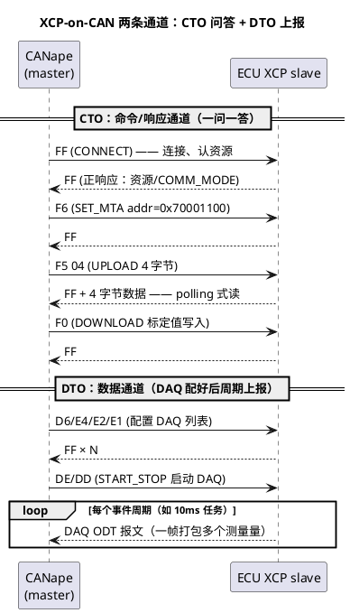

# 01-XCP-on-CAN

> 一句话定位：XCP 是与 UDS 平行的测量标定协议——诊断仪"一问一答"问 ECU，标定工具靠 XCP 对 ECU 内存做高频读（测量）与在线写（标定），本篇讲它在 CAN 上的落地。
> 等级：L2 ｜ 前置：[从诊断仪的一次连接说起](../../00-入门导读/01-从诊断仪的一次连接说起-诊断全景.md)

## 原理

XCP（eXtensible Calibration Protocol，ASAM 标准，前身 CCP）解决的问题只有一个：**让上位机按地址直接读写 ECU 内存里的变量**。读是测量（转速、扭矩、温度），写是标定（PI 增益、扭矩表、阈值）。它不定义"变量是什么、在哪"——那是 A2L 文件的事（见下一篇）；它只定义"怎么连、怎么读、怎么写、怎么高频率读"。

连接模型是**一主多从**：一台 CANape 是 master，总线上多个 ECU 是 slave，各占一组 XCP 报文 ID。主从角色固定——ECU 永远只应答或按配置周期上报，不会主动发起命令。

XCP 把数据流分成两条通道，这是理解一切命令的基础：

- **CTO（Command Transfer Object）**：命令与响应，master 发 CMD 帧，slave 回 RES/ERR 帧，一问一答、字节很少（经典 CAN 8 字节够用）；
- **DTO（Data Transfer Object）**：DAQ 数据帧由 slave 周期发送，一帧可打包多个变量（ODT 表决定），测量流量全走这里。

## 详解

### 常用命令表

| 命令码 | 命令 | 干什么 | 工程场景 |
|---|---|---|---|
| 0xFF | CONNECT | 建立连接，slave 回报资源/DAQ 能力 | CANape 点"Connect"后的第一条 |
| 0xFE | DISCONNECT | 断开连接 | 结束测量 |
| 0xFD | GET_STATUS | 读会话/保护状态 | 判断 seed&key 是否已解锁 |
| 0xF8/0xF7 | GET_SEED/UNLOCK | 资源保护（seed-key） | 写标定前解锁 DAQ/PAG 资源 |
| 0xF6 | SET_MTA | 设置内存地址指针 MTA | 一切读写前的"定位"动作 |
| 0xF5 | UPLOAD | 从 MTA 起读 N 字节 | polling 式读一个测量量 |
| 0xF0 | DOWNLOAD | 向 MTA 起写 N 字节 | 在线改一个标定量 |
| 0xE9/0xE8 | SET/GET_CAL_PAGE | 切换/查询标定页（RAM/Flash） | 标定页切换，见 03 篇 |
| 0xD6/0xD5/0xD4 | FREE_DAQ/ALLOC_ODT/ALLOC_ODT_ENTRY | 动态分配 DAQ 内存 | DAQ 列表初始化 |
| 0xE2/0xE1 | SET_DAQ_PTR/WRITE_DAQ | 把某地址变量挂进 ODT 槽位 | DAQ 配置核心两步 |
| 0xDE/0xDD | START_STOP(_SYNCH) | 启停某（组）DAQ 列表 | 点"Start Measurement"后发生 |

### DAQ vs POLLING：两种取数方式

| 维度 | POLLING（UPLOAD 轮询） | DAQ（事件驱动上报） |
|---|---|---|
| 谁发起 | master 一问一答逐个读 | ECU 按事件周期自动打包上报 |
| 带宽 | N 个量 = N 次往返，总线占用高且碎 | 一帧塞多个量，占用低 |
| 时间一致性 | 各量采样时刻参差 | 同一 ODT 内的量同周期采样，可对齐分析 |
| 适用 | 调试期少量量、低频读、写操作 | 正式测量：几十上百个量、10ms/任务级 |
| 前提 | 无 | ECU 实现 DAQ 模式（CONNECT 响应里会报） |

经验值：超过 5~10 个量、或需要波形对齐，就上 DAQ；POLLING 只留给偶发读写。

### CAN 上五类报文 ID 分配惯例

XCP-on-CAN 不规定具体 ID 数值，工程惯例是从某个基准 ID 起给每个从机连续分配五类：

| 类别 | 方向 | 用途 |
|---|---|---|
| CMD | master → slave | 命令（CTO） |
| RES/ERR | slave → master | 正/错误响应（CTO，通常共用一个 ID） |
| DAQn | slave → master | 数据帧，每个 DAQ 列表一条 ID（DTO） |
| STIM | master → slave | 激励数据（DTO，测量台架偶尔用） |
| EV/SERV | slave → master | 事件/服务上报（EV_STORE_CAL 等） |

排布习惯：同一 ECU 的 CMD/RES 一对相邻，DAQ 列表按编号依次排开，全部落在项目为 XCP 预留的 ID 段内（具体段号由整车通讯矩阵定，切勿自造）。

### 与 UDS 共存

XCP 和 UDS（Dcm）互不隶属、同线并行：UDS 走诊断物理寻址/功能寻址 ID，XCP 走自己的 CMD/RES/DAQ ID 段，**ID 必须错开**；CAN 侧各挂 CanIf 各管各的 ID，AUTOSAR 里是 Dcm 与 Xcp 两个独立模块。风险点只有一个：刷写/标定高峰时 DAQ 流量可能把总线负载顶到 >50%，挤占诊断甚至应用报文——限 DAQ 周期与列表数即可。

## 配置层/工程关联

AUTOSAR 侧 Xcp 模块配置的骨架（与 CANape 侧一一对应）：

- **XcpGeneral**：XCP on CAN 的 CTO/DTO 各 ID、MAX_CTO_SIZE（经典 CAN 为 8）、字节序（MSB/LSB，与 A2L 的 BYTE_ORDER 必须一致）；
- **DAQ 配置**：事件通道绑定任务（如 10ms 任务）、ODT/DTO 大小、支持的最小周期——CANape 里可选的采样周期就是从这里来的；
- **标定页**：XcpCalPage 配置 RAM page / Flash page 对应的内存区与切换权限（CAL_PAGE 命令生效的前提）；
- **保护**：seed&key 资源（DAQ/PAG/PGM），密钥 DLL 在上位机侧，算法与 ECU 侧约定一致。

工具链对应关系：CANape 侧填的 XCP ID/波特率/DLL，本质就是在"对表"Ecu 侧 Xcp 模块配置——两边对不上，就是第 03 篇排查表的常客。

## 易错点与陷阱

1. **现象：CANape 连不上，抓包只见 CMD 无 RES。原因：CMD/RES ID 填反或对调。对策：抓总线确认方向——master 发的那个必须是 ECU 侧配的 CMD ID。**
2. **现象：POLLING 能读到值，DAQ 窗口全是灰的。原因：ECU 未实现 DAQ 或 DAQ 列表没 START；或事件通道周期配置为 0。对策：先发 GET_COMM_MODE_INFO 看 DAQ 支持位，再查 DAQ 配置是否完整下发。**
3. **现象：标定值 DOWNLOAD 成功但整车行为不变。原因：写进了 Flash page 而 ECU 运行在 RAM page（或相反）；或应用代码周期性用 init 值覆盖了该变量。对策：SET_CAL_PAGE 确认激活页；标定量必须由标定软件独占写。**
4. **现象：多字节量读出来高低字节互换。原因：Xcp 模块字节序与 A2L 的 BYTE_ORDER 不一致。对策：两侧统一（TC377/S32K 均小端，A2L 常写 MSB_LAST）。**
5. **现象：开 XCP 测量后总线报错帧增多。原因：DAQ 周期过短/列表过多，总线负载超限。对策：合并 ODT、拉长事件周期，负载控制在 30% 以下。**
6. **现象：与 UDS 同时在线时诊断超时。原因：XCP 与诊断 ID 撞号或被 DAQ 流量挤占。对策：核对通讯矩阵 XCP 段与诊断段；刷写时先停 DAQ。**

## 面试高频题

**Q1：XCP 和 UDS 有什么区别？**
A：定位不同——UDS（14229）是诊断协议，面向产线/售后的事件型"问答"（读版本、读故障、刷写）；XCP 是测量标定协议，面向开发台架的高频内存读写（测量、标定页切换）。两者同挂一条 CAN、ID 各自错开、模块上对应 Dcm 与 Xcp，互不依赖。

**Q2：DAQ 和 POLLING 怎么选？**
A：POLLING 是上位机逐次 UPLOAD 轮询，量少、灵活但带宽碎、时间不同步；DAQ 是 ECU 按事件周期打包上报，带宽省、同帧数据时间一致。正式测量一律 DAQ，POLLING 留给偶发读写与调试。

**Q3：为什么读写前都要 SET_MTA？**
A：XCP 的 UPLOAD/DOWNLOAD 只携带长度不带地址，地址由 MTA（Memory Transfer Address）指针维护，且每次传输后自动前移——连续读一段内存只需 SET_MTA 一次。这是协议为省报文字节做的设计。

**Q4：XCP-on-CAN 需要规划哪些 ID？怎么和诊断共存？**
A：五类：CMD、RES/ERR、DAQn（每列表一条）、STIM、EV/SERV；与 UDS 的物理/功能寻址 ID 必须错开，各走各的 CanIf 路由，唯一冲突是总线负载，控制 DAQ 频率即可。

## 延伸

- [A2L文件](02-A2L文件.md)——XCP 只管传输，地址与换算全在 A2L；
- [CANape实操](03-CANape实操.md)——把本篇命令落到工具操作；
- [CanTp分段15765-2](../../../05-汽车网络通讯/2-L2进阶/传输层/01-CanTp分段15765-2.md)——XCP 报文单帧直发不走 CanTp，UDS 多帧才走，对比着看更清楚；
- [从诊断仪的一次连接说起](../../00-入门导读/01-从诊断仪的一次连接说起-诊断全景.md)——"UDS 问答线 vs XCP 观测线"的分区全景。

---

维护约定：笔记命名 `序号-主题.md`；真实截图放 `_images/`；流程/时序/状态/架构图用 PlantUML 内嵌正文，规范见 [图表规范与模板](../../../00-总览/图表规范与模板.md)。
