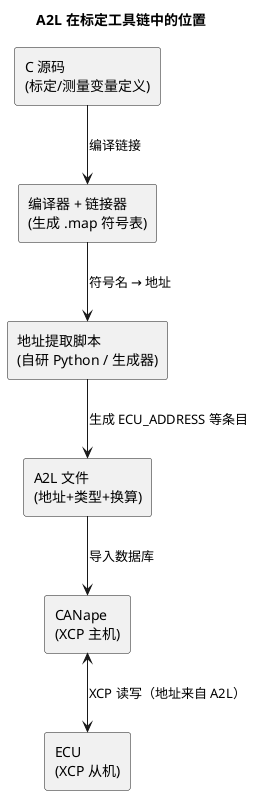

# 02-A2L文件

> 一句话定位：A2L 是 XCP 的"字典"——它告诉 CANape 每个变量的地址、类型、字节序和物理换算，没有它，XCP 只是一根不认识货的传输管道。
> 等级：L2 ｜ 前置：[XCP-on-CAN](01-XCP-on-CAN.md)

## 原理

上一篇说过：XCP 协议只管"按地址读写 ECU 内存"。那么**地址从哪来、读到 0x0AC3 怎么变成 27.5°C**？这份"地址簿 + 换算表"就是 A2L 文件（ASAP2 格式，现名 ASAM MCD-2 MC）。

它的角色用一个链路看最清楚：



A2L 内容本身是关键字嵌套的文本（可用任何编辑器打开），层级骨架：

```text
ASAP2_VERSION 1 61
/begin PROJECT DemoProj ""
  /begin HEADER "" VERSION_1.2.3 /end HEADER

  /begin MODULE DemoECU ""
    /begin A2ML ... /end A2ML          /* 结构化语言定义（一般工具生成，很少手改） */
    /begin MOD_COMMON
      BYTE_ORDER MSB_LAST              /* 整个模块的字节序 */
    /end MOD_COMMON

    /begin MEASUREMENT EngTemp "" UBYTE MSB_LAST 0.1 DegC 0 250
      ECU_ADDRESS 0x70012340           /* 测量量：地址+换算+单位+上下限 */
    /end MEASUREMENT

    /begin CHARACTERISTIC KpTorque "" VALUE UBYTE 0.1 "" 0 255
      ECU_ADDRESS 0x70020100
      EXTENDED_LIMITS 0 255
    /end CHARACTERISTIC

    /begin AXIS_PTS NiSpeedAxis "" 16 UBYTE ... /end AXIS_PTS
    /begin RECORD_LAYOUT Val_UBYTE ... /end RECORD_LAYOUT   /* 内存排布描述 */
    /begin COMPU_METHOD CMT_Temp "" LINEAR ... COEFFS 0 0.1 0 0 ... /end COMPU_METHOD
    /begin COMPU_VTAB VT_GearSt "" ... /end COMPU_VTAB     /* 原始值↔文字枚举 */
  /end MODULE
/end PROJECT
```

## 详解

### 两条核心条目逐字段看

`/begin MEASUREMENT EngTemp "" UBYTE MSB_LAST 0.1 DegC 0 250`

| 字段 | 含义 | 写错的后果 |
|---|---|---|
| EngTemp | 变量名（须与 map 符号一致） | 工具里找不到量 / 读错地址 |
| UBYTE | DATATYPE：原始值类型（UBYTE/SWORD/FLOAT32_IEEE…） | 有符号负值被显示成 65xxx；float 按 int 解 |
| MSB_LAST | 字节序：最高字节在后=小端（TC377/S32K 都是小端） | 多字节量高低字节互换 |
| 0.1 | 引用 COMPU_METHOD（此处直接给了斜率 0.1） | 物理值整体差一个量级 |
| DegC | 单位 | 图表标注错（不影响数值） |
| 0 / 250 | 物理值上下限 | 工具把正常值当越界过滤掉 |

`/begin CHARACTERISTIC KpTorque "" VALUE UBYTE …`（标定量）

| 字段 | 含义 | 说明 |
|---|---|---|
| VALUE / CURVE / MAP | 标量 / 一维曲线 / 二维 Map | 形态决定 CANape 编辑界面（数值框/曲线窗/表格） |
| RECORD_LAYOUT | 内存排布描述（轴点数、轴值在数据前还是后） | 曲线/Map 读写越界的常见根源 |
| ECU_ADDRESS | 标定量的（RAM page）地址 | Flash page 地址由页切换机制对应 |
| EXTENDED_LIMITS | 允许的写入范围 | 工具端软限位 |

### COMPU_METHOD：raw ↔ physical 的三种主流换算

- **LINEAR/RAT_FUNC**：physical = (a·x + b)/(c·x + d)，电压转温度、计数转角度都用它；
- **IDENT**：不换算（状态字、原始计数）；
- **TAB_VERB + COMPU_VTAB**：枚举文字表（0x01="RUN", 0x02="FAULT"），日志可读性全靠它。

### 地址从哪来：从 hex 到 A2L 的标准流水线

1. **约定先行**：标定/测量变量集中定义（独立 .c/.h 或生成代码），标定量放专用 section（如 `.calib`），测量量加 volatile——否则会被优化掉或散落各处；
2. **链接**：链接脚本把 `.calib` 固定到已知地址区；编译产出 `.map`（GCC `-Map=` / Tasking `-O-map` / HighTec、IAR 各有开关）；
3. **后处理脚本**（Python 为主，01 区有 [Python处理ARXML](../../../01-编程语言/2-L2进阶/辅助脚本/01-Python处理ARXML.md) 同类思路）：解析 map，按符号名取地址，填充 A2L 模板中每个条目的 ECU_ADDRESS；
4. **发布绑定**：hex 与 A2L 同版本号入库，禁止"新 hex + 旧 A2L"。

字节序一句话：TC377（TriCore）与 S32K（Cortex-M）都是小端，A2L 写 `MSB_LAST`；BYTE_ORDER 出现在 MOD_COMMON 与每个条目两处，以条目为准。

## 配置层/工程关联

- **变量侧**：AUTOSAR 工程常用生成式管理——SWC 的标定量来自 RTE/参数定义，A2L 生成器从 ARXML+map 双源合成，保证名字与地址同源；
- **地址侧**：`.calib` section 的落点由链接脚本决定，地址布局思路见 [链接脚本与分散加载](../../../02-芯片与体系结构/2-L2进阶/启动流程/03-链接脚本与分散加载.md)；
- **标定页**：RAM page 地址写进 A2L，Flash page 由 SET_CAL_PAGE 切换（上一篇 CAL_PAGE 命令），固化流程见 [CANape实操](03-CANape实操.md)；
- **持久化**：量产件标定值回存依赖 Fee/NvM，链路见 [与NvM链路](../../../04-MCAL与外设驱动/2-L2进阶/Fls与Fee/03-与NvM链路.md)。

## 易错点与陷阱

1. **现象：读某变量值"乱跳"或工具直接报非法地址。原因：A2L 与烧写的 hex 版本不一致（地址过期），读到了别的变量。对策：hex 与 A2L 绑定版本发布，脚本每次构建重新生成 ECU_ADDRESS。**
2. **现象：uint16 量读出高低字节互换。原因：BYTE_ORDER 与 ECU 实际端序相反。对策：小端芯片统一 MSB_LAST，并检查 MOD_COMMON 与条目两处。**
3. **现象：负值量显示成 65xxx。原因：DATATYPE 写成无符号（UBYTE/UWORD），实际是有符号。对策：对照 C 定义改 SWORD/SBYTE，FLOAT32 别写成 UWORD。**
4. **现象：曲线/Map 读越界或轴错位。原因：RECORD_LAYOUT 的轴点数、轴/值排布顺序与 C 数组实际不一致。对策：用小工具 dump 内存比对，宁可少读不多读。**
5. **现象：物理值整体偏一个量级。原因：换算系数抄错（0.1 写成 1，或把斜率写成倒数）。对策：拿一个已知物理量（如电源电压）标定验证。**
6. **现象：map 里找不到该变量符号。原因：变量被优化掉（非全局/未 volatile/被内联）。对策：测量量集中定义+volatile；标定量进专用 section 并加 KEEP。**

## 面试高频题

**Q1：A2L 文件的作用是什么？**
A：它是 ASAP2/ASAM MCD-2 定义的 ECU 测量标定描述文件，给 XCP 主机提供"变量名→地址→类型→字节序→物理换算→单位→限值"的完整映射。没有 A2L，XCP 只能盲读写裸地址。

**Q2：A2L 里的地址是怎么来的？**
A：编译链接产生 map 文件，后处理脚本（或工具链生成器）解析 map 提取符号地址，填充到 A2L 条目的 ECU_ADDRESS。工程上要求 hex 与 A2L 同构建同版本，否则地址失配。

**Q3：MEASUREMENT 和 CHARACTERISTIC 有什么区别？**
A：MEASUREMENT 是测量量——运行时被 ECU 写、CANape 只读；CHARACTERISTIC 是标定量——CANape 可写（在线改 RAM page 值），分 VALUE/CURVE/MAP 三种形态，通常还带 Flash page 固化机制。

**Q4：BYTE_ORDER 写错的典型现象？**
A：单字节量正常、多字节量数值异常（如 0x0102 显示成 0x0201），float 完全乱码。核对 A2L 与 ECU 端序（小端芯片用 MSB_LAST）即可定位。

## 延伸

- [CANape实操](03-CANape实操.md)——A2L 导入后怎么用；
- [XCP-on-CAN](01-XCP-on-CAN.md)——A2L 服务的传输层；
- [链接脚本与分散加载](../../../02-芯片与体系结构/2-L2进阶/启动流程/03-链接脚本与分散加载.md)——`.calib` section 地址怎么被钉住的；
- [与NvM链路](../../../04-MCAL与外设驱动/2-L2进阶/Fls与Fee/03-与NvM链路.md)——标定值量产持久化链路。

---

维护约定：笔记命名 `序号-主题.md`；真实截图放 `_images/`；流程/时序/状态/架构图用 PlantUML 内嵌正文，规范见 [图表规范与模板](../../../00-总览/图表规范与模板.md)。
