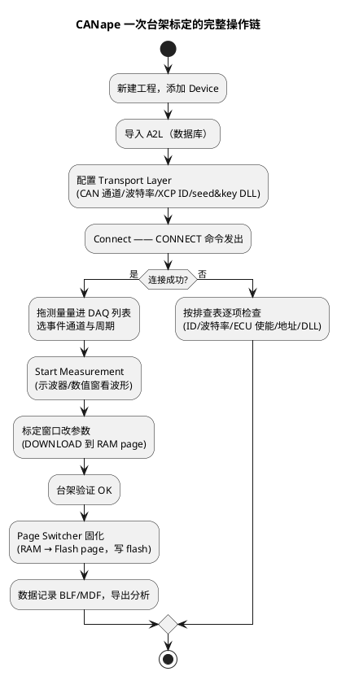

# 03-CANape实操

> 一句话定位：把前两篇拼成一台架日常——CANape 里建工程、连上 ECU、配 DAQ 测量、切页改标定、录数导出，以及连不上时的五步排查。
> 等级：L2 ｜ 前置：[XCP-on-CAN](01-XCP-on-CAN.md) + [A2L文件](02-A2L文件.md)

## 原理

CANape 是 Vector 的测量标定上位机（XCP master）。它的工作模型一句话：**导入 A2L 认识 ECU → 配通道与 ID 连上去 → 把量拖进 DAQ/示波器开始测 → 把标定量写回 ECU 并固化**。连接建立的那一刻，背后就是 01 篇那张 CTO 时序图——CONNECT → GET_STATUS → （可能 GET_SEED/UNLOCK）→ DAQ 配置与启动。

## 详解

### 1. 工程创建步骤清单

1. 新建工程（`.canape`），Add Device；
2. Database 导入 A2L——此时变量树出现 MEASUREMENT/CHARACTERISTIC 分组；地址与换算全部生效（02 篇的产出在这里消费）；
3. Device Configuration → Transport Layer：协议 XCP on CAN、硬件通道、**波特率与台架一致**、CTO/DTO 的 **ID 与 ECU 侧 Xcp 模块配置一致**（01 篇五类 ID）；
4. Seed & Key：指定 DLL 路径（OEM/项目提供），解锁写权限与 PAG/DAQ 资源；
5. 超时参数：默认即可，总线差时再调；保存工程。

### 2. 连接与在线测量（DAQ 列表）

- 把测量量从变量树拖到 **DAQ 列表**（Device → DAQ Configuration）：同一列表的量会打进同一 ODT 组、同一事件周期发送；
- 事件通道/周期来自 A2L 与 ECU DAQ 配置（01 篇配置层），可选周期是 ECU 支持的档位，不是任意值；
- 超过列表容量就分组：快量放 10ms 列表、慢量放 100ms 列表——省总线也省 ODT 槽；
- 点 Start Measurement：CANape 依次下发 FREE_DAQ/ALLOC/WRITE_DAQ/START_STOP（就是 01 篇 DAQ 命令组），波形进示波器/数值窗。

### 3. 标定页切换：RAM page ↔ Flash page

标定量在 ECU 里有两份"页"：**RAM page** 是运行时真正被读的，**Flash page** 是断电不丢的存档。CANape 的 Page Switcher 面板干三件事：

| 操作 | XCP 命令 | 语义 |
|---|---|---|
| 切到 RAM | GET/SET_CAL_PAGE | 在线标定的工作页，改了立即生效 |
| 切到 Flash | GET/SET_CAL_PAGE | 查看/编辑 Flash 里的初始值（只读居多） |
| 固化（download to flash） | DOWNLOAD + 页切换序列 | 把 RAM 里验证过的值写回 Flash page，重启仍生效 |

日常节奏：**RAM 页改 → 台架验证 → 固化 Flash → 记录变更单**。改完不固化，一断电就回到老值——台架最常见的"昨天的标定怎么丢了"。

### 4. 数据记录与导出

- 测量配置里开 Logger：格式选 **MDF4/BLF**（Vector 生态）或 CSV（给 Python/MATLAB 后处理）；
- 记录触发条件（start/stop 按钮、信号条件、时长）按试验大纲设；
- 结束后用 CANape 自带 Calculator/导出，或脚本批量转 CSV——工程上通常约定"原始 MDF 归档 + 导出 CSV 给分析"。

### 5. TOP 5 连不上排查表

| # | 症状 | 优先查 | 对策 |
|---|---|---|---|
| 1 | 发 CMD 无任何响应 | **ID 错**（CMD/RES 填反或抄错段） | 抓包看方向与 ID，对通讯矩阵 |
| 2 | 总线有错帧/完全无响应 | **波特率错**（台架 500k，工程填 250k 之类） | 对齐通道波特率与采样点 |
| 3 | CONNECT 都发了但 ECU 不应 | **ECU 未使能 XCP**（Xcp 模块没起/条件不满足） | 确认 ECU 侧配置与使能条件（车速、会话） |
| 4 | 连上了，读量报非法地址 | **A2L 地址错**（hex 与 A2L 版本不匹配） | 重新生成 A2L，核对 ECU_ADDRESS |
| 5 | 能连能读，不能写 | **安全锁定**（DLL 路径错/算法版本不符，UNLOCK 失败） | 换正确 seed&key DLL，看 ERR 码 0x30/0x31 资源拒绝 |

## 配置层/工程关联

- ECU 侧对应物：CANape 每一项配置都在对 AUTOSAR Xcp 模块的表——ID 对 XcpGeneral、周期对 DAQ 事件通道、页切换对 XcpCalPage、DLL 对资源保护；
- 与诊断并存：台架上诊断（CANdela/CANoe.DiVa）与 CANape 可同时挂总线，但**刷写时先停 DAQ**，避免 36 大块传输被 XCP 流量拖超时（CanTp 的 BS/STmin 会放大这个问题，见 [CanTp分段15765-2](../../../05-汽车网络通讯/2-L2进阶/传输层/01-CanTp分段15765-2.md)）；
- 标定数据治理：变更的参数集要导出（.par/.vcd/mld）入版本库，与 A2L、hex 三件套一起归档——追溯靠它。

## 易错点与陷阱

1. **现象：DAQ 波形周期性"断点"。原因：DAQ 列表超载或事件周期小于 ECU 支持档位，ODT 丢发。对策：分组降频，核对 ECU DAQ 配置的最小周期。**
2. **现象：改了参数整车没反应。原因：写到了 Flash page（ECU 跑在 RAM page）；或该参数被应用周期性回写。对策：Page Switcher 确认 RAM 页激活；确认参数唯一写者是标定工具。**
3. **现象：固化后重启参数丢了。原因：固化流程没走完（flash 写失败被忽略）；或 Fee/NvM 在启动时用旧值覆盖了标定初值。对策：固化后重启复测；检查标定初值的加载链路。**
4. **现象：换台电脑就连不上。原因：seed&key DLL 是绝对路径/依赖缺失；通道驱动没装。对策：DLL 随工程相对路径分发，安装驱动后复测。**
5. **现象：多人同时连同一 ECU 互相打断。原因：XCP 一主多从，但一个 ECU 同一时刻只接受一个 master 的 CONNECT（会话被顶）。对策：台架排班/加连接锁，先断再连。**
6. **现象：MDF 打开全是原始值。原因：换算/单位在导出时丢了。对策：导出带转换的物理值或同步归档 A2L。**

## 面试高频题

**Q1：CANape 建工程的必要三步？**
A：导入 A2L 数据库；配置 Transport Layer（通道/波特率/XCP ID）；配置 seed&key DLL。三者分别解决"认识 ECU""找得到 ECU""有权限写"。

**Q2：RAM page 和 Flash page 怎么用？**
A：在线标定在 RAM page 改值即时生效；验证通过后经 Page Switcher 固化到 Flash page，重启不丢。运行时 ECU 读 RAM 页，启动时把 Flash 页初值加载到 RAM 页。

**Q3：DAQ 列表配置的原则？**
A：按周期分组——同周期量进同一列表省 ODT 与总线；快慢量分列表；总量受 ECU DAQ 配置限制。宁可多列表低频率，不要单列表高频打满总线。

**Q4：连不上 ECU，你的排查顺序？**
A：一 ID（抓包看方向）、二波特率、三 ECU 是否使能 XCP、四 A2L 地址版本、五 seed&key 锁定——由链路层往应用层排。

## 延伸

- [XCP-on-CAN](01-XCP-on-CAN.md)——工具按钮背后的命令与 ID 规划；
- [A2L文件](02-A2L文件.md)——变量树里每个字段怎么来的；
- [CanTp分段15765-2](../../../05-汽车网络通讯/2-L2进阶/传输层/01-CanTp分段15765-2.md)——为什么刷写时要停 DAQ；
- [从诊断仪的一次连接说起](../../00-入门导读/01-从诊断仪的一次连接说起-诊断全景.md)——标定线与诊断线在同一张全景图上的位置。

---

维护约定：笔记命名 `序号-主题.md`；真实截图放 `_images/`；流程/时序/状态/架构图用 PlantUML 内嵌正文，规范见 [图表规范与模板](../../../00-总览/图表规范与模板.md)。
