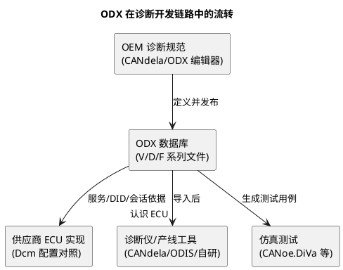

# 01-ODX

> 一句话定位：ODX 是诊断领域的"通用交换格式"（ISO 22901 / ASAM MCD-2D）——OEM 在工具里描述完 ECU 诊断，导出成它，各家诊断仪/仿真器/测试工具都能读懂。
> 等级：L2 ｜ 前置：[从诊断仪的一次连接说起](../../00-入门导读/01-从诊断仪的一次连接说起-诊断全景.md)

## 原理

导读篇说过：诊断仪要认识你的 ECU，得有一本"电话簿"——DID 表、服务表、会话权限、刷写流程都登记在册。这本电话簿在工程上要**跨公司、跨工具流转**（OEM 定义 → 供应商实现 → 产线/售后工具消费），各家用私有格式就会对不上，于是 ISO 22901 定义了 ODX（Open Diagnostic data eXchange）统一格式。

一句话分工：**ODX 描述"这个 ECU 说什么诊断话"，Dcm 实现"ECU 怎么说这些话"，诊断仪靠 ODX 听懂这些话。**

## 详解

### P 系列文件分类

ODX 标准内部按"车辆 → 连接 → ECU 数据 → 闪刷 → 复用库"分层，各是一类文件（业内常称 P 系列）：

| 文件 | 描述对象 | 里面装什么 | 工程上谁维护 |
|---|---|---|---|
| ODX-V | 车辆 | 整车拓扑：有哪些 ECU、各自的诊断单元 | OEM 平台组 |
| ODX-C | 连接/通信 | 每个系统的总线类型、寻址方式、协议栈参数 | OEM 网络组 |
| ODX-D | 诊断数据 | 单 ECU 的服务、DID、例程、DTC、会话/安全状态机 | 诊断工程师（核心工作量） |
| ODX-F | 闪刷数据 | 刷写相关的数据块、格式、安全机制 | Bootloader/诊断共管 |
| ODX-L | 复用库 | 可复用的数据字典：DOP、单位、换算、常量 | 架构组沉淀 |

实际项目交付物常是一个"ODX 数据库目录"：一份 V、若干 C/D/F，外加 L 供引用——而不是单文件。

### 核心容器一句话表

| 容器 | 一句话 |
|---|---|
| DIAG-LAYER | 一层 ECU 诊断描述（协议层/基础层/变体层叠起来的继承体系） |
| DIAG-COMM | 一次诊断交互的抽象（"读版本号"这件事本身） |
| DIAG-SERVICE | 具体服务实例：绑定请求/正响应/负响应报文格式 |
| REQUEST / POS-RESPONSE / NEG-RESPONSE | 报文的三种骨架：字节布局、DID 属性、长度约束 |
| PARAM | 报文里的一个字段（物理值/编码值/长度），DID 挂在这里 |
| DATA-OBJECT-PROP（DOP） | 字段的数据对象属性：类型 + 换算（COMPU-METHOD）+ 单位 + 限值 |
| STATE-CHART / STATE | 会话与安全状态的机器（默认/扩展/编程、锁定等级） |
| DIAG-DID | 不是独立容器——作为 PARAM 的语义注记出现，标明这个字段对应哪个 DID |

看出门道没有：ODX 的 PARAM+DOP 结构，和 A2L 的 MEASUREMENT+COMPU_METHOD 结构是同一个思想——**报文字段/变量 = 位置 + 类型 + 换算 + 单位**，两套生态各自实现了一遍。

### 与 DBC/LDF/A2L 家族对比

| 格式 | 描述对象 | 典型工具 | 所在环节 |
|---|---|---|---|
| DBC | CAN 报文/信号（周期通讯） | CANdb++ / CANoe | 网络设计与仿真 |
| LDF | LIN 调度表与信号 | LIN 工具链 | LIN 总线设计 |
| A2L | ECU 内存变量（测量标定） | CANape / INCA | 台架标定 |
| ODX | ECU 诊断接口（服务/DID/刷写） | CANdela / ODIS / 自研仪 | 诊断定义、产线售后 |
| CDD | 同上（Vector 私有形态） | CANdela Studio | 同上，见下一篇 |

记忆口诀：**DBC 管周期、A2L 管内存、ODX 管问答**——三种"ECU 对外语言"各有一本字典，谁也不能替谁。

## 配置层/工程关联

- **与 Dcm 的关系**：ODX 是工具侧描述，Dcm 配置是 ECU 侧实现，两者必须同源（都从 OEM 诊断规范派生）。实现链路：ODX/CDD → 导入配置生成器（DaVinci/EB tresos 插件）→ 生成 DcmDsp 服务/DID 配置，见下一篇；
- **与产线**：产线 EOL 测试设备直接消费 ODX 数据库（不依赖 CANdela），所以 ODX 发布版本要冻结管理，变更走 OEM 变更流程；
- **与 A2L 的边界**：台架标定走 A2L+XCP；产线写标定/读版本走 ODX+UDS——同一批标定量，两条路都要能通，工程上常做一致性比对。

## 易错点与陷阱

1. **现象：产线设备读不出某 DID，CANdela 里却正常。原因：ODX 版本不一致——工具用了旧库，新 DID 没进 ODX-D。对策：ODX 数据库统一发版，EOL 拿发布件而非中间稿。**
2. **现象：报文长度对不上，诊断仪解析错位。原因：REQUEST 的 BYTE 布局与 ECU 实现的 DID 排布不一致（字节序/多字节字段顺序）。对策：以一份"DID 定义表"为唯一真源，双方引用同一版本。**
3. **现象：会话状态行为与描述不符。原因：STATE-CHART 里会话切换/安全回落条件与 Dcm 配置不一致（如 S3 超时行为）。对策：联调时逐条对表测试，DiVa 类回归工具能自动跑。**
4. **现象：变体继承后丢了服务。原因：DIAG-LAYER 继承链上某层覆盖/屏蔽了父层服务。对策：检查变体层的差异清单，导出全量清单核对。**
5. **现象：ODX 导入自研工具报 schema 错。原因：版本混用（ODX 2.0/2.2 语法差异）或文件含编辑器私有扩展。对策：统一按交付要求的 ODX 版本导出。**

## 面试高频题

**Q1：ODX 是什么？解决什么问题？**
A：ISO 22901 定义的诊断数据交换统一格式（XML 系）。解决 OEM、供应商、产线售后工具之间诊断描述格式不统一的问题——定义一次，各工具都能消费。

**Q2：ODX 有哪几类文件？**
A：V（车辆拓扑）、C（通信连接参数）、D（ECU 诊断数据：服务/DID/DTC/状态机）、F（闪刷数据）、L（复用数据字典）。项目交付是一个数据库目录而非单文件。

**Q3：ODX 和 A2L/DBC 的区别？**
A：描述对象不同——DBC 描述周期通讯报文信号，A2L 描述 ECU 内部测量标定变量（配 XCP），ODX 描述诊断问答接口（配 UDS：服务、DID、刷写流程）。三者是三条语言线各自的字典。

**Q4：ODX 里 DID 在哪定义？**
A：不是独立容器——DID 作为 PARAM（报文字段）的语义属性出现，字段的数据属性由 DOP（类型+换算+单位）描述，挂进 REQUEST/RESPONSE 的字节布局里。

## 延伸

- [CDD与CANdela](02-CDD与CANdela.md)——ODX 最常见的"上游编辑器"与私有兄弟格式；
- [Dcm配置](../Dcm配置/README.md)——ODX 描述如何落到 ECU 侧实现；
- [DID与RID设计](../DID与RID设计/README.md)——DID/例程命名与字节序的真源；
- [从诊断仪的一次连接说起](../../00-入门导读/01-从诊断仪的一次连接说起-诊断全景.md)——"电话簿"比喻的出处。

---

维护约定：笔记命名 `序号-主题.md`；真实截图放 `_images/`；流程/时序/状态/架构图用 PlantUML 内嵌正文，规范见 [图表规范与模板](../../../00-总览/图表规范与模板.md)。
