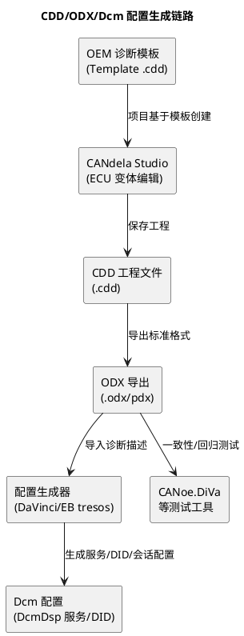

# 02-CDD与CANdela

> 一句话定位：CDD 是 Vector CANdela Studio 编辑出来的 ECU 诊断描述文件——供应商拿 OEM 模板在 CANdela 里做"填空题"，产出 CDD/ODX，再往下游生成 Dcm 配置与测试。
> 等级：L2 ｜ 前置：[ODX](01-ODX.md)

## 原理

上一篇的 ODX 是"标准交换格式"，但**定义与编辑**环节多数还是在 Vector CANdela Studio 里完成，它的工程文件就是 CDD（`.cdd`）。三者的关系一句话：**CANdela 是编辑器，CDD 是它的工程文件，ODX 是它导出的标准交付物。**

## 详解

### CANdela 的工作直觉：模板 → 变体 → 填空 → 导出

把 CANdela 想成一个"带模板的填空系统"：

| 步骤 | 动作 | 干什么 |
|---|---|---|
| 1 | 基于 OEM 模板新建 | 模板里预置了 OEM 强制的服务/DID/会话/安全策略、命名规范、通信参数——不可删改的部分 |
| 2 | 派生 ECU 变体 | 一个 ECU 家族（高低配、左舵右舵）共享基础定义，变体只写差异（多/少哪些 DID、参数范围不同） |
| 3 | 定义服务/DID/例程 | 22/2E 的 DID 清单、19 的 DTC 组、31 的例程、10/27 的会话安全矩阵——逐条挂属性：会话权限、安全等级、字节布局 |
| 4 | 一致性检查 | 工具按模板规则查漏：必选服务缺失、命名不合规、响应超时没填——红了就改 |
| 5 | 导出 | CDD 给 Vector 生态（CANoe 仿真、CANdela 诊断仪）；ODX/PDX 给非 Vector 工具；ARXML 给配置生成器 |

### 与 Dcm 配置的生成链路

诊断描述最终要变成 ECU 里的 Dcm 配置，工程链路是：

1. CDD/ODX 中的服务定义（如 `22 F190`）→ 导出诊断描述 ARXML 或直接导入；
2. DaVinci Configurator / EB tresos 的诊断导入插件 → 生成 **DcmDsp**（服务/DID 配置）、会话与安全等级矩阵（哪些服务在哪个会话、要不要解锁）；
3. 人工复核：DID 数据提供者挂钩（RTE/应用回调）、例程的回调函数——这些是工具生成不了的"接线"；
4. 后续 CDD 变更（OEM 加了 DID）→ 重新导入 → 增量更新配置——**单向流：CDD/ODX 是真源，Dcm 配置是产物**，反过来手改 Dcm 再回填 CDD 是大忌。

### OEM 模板约束与变体管理（一句话版）

- 模板约束：OEM 模板规定"必选项与格式"——必配的服务/DID、DTC 格式、安全等级、甚至界面分组；供应商只能加"ECU 自有项"，不能删 OEM 项。
- 变体管理：`基础变体 ← 派生变体` 继承结构，公共能力放基础层，配置差异（传感器数量、功能裁剪）放派生层——改基础层全家族生效，改派生层只影响该变体。

### 交付物怎么选：CDD、ODX 还是 PDX

| 交付物 | 给谁 | 注意点 |
|---|---|---|
| CDD（工程文件） | Vector 生态内部（CANoe/CANdela 诊断仪） | 含编辑态信息，一般不跨公司交付 |
| ODX 单文件 | 工具间交换的最小单位 | 引用库（ODX-L/DOP）分开时易缺件 |
| PDX（打包） | OEM 集成交付/产线 EOL 的常用形态 | V/C/D/F/L 打包成一个 zip 容器，版本自包含，优先选它 |

经验：跨公司一律交付 PDX（自包含、可校验版本）；团队内部 Vector 工具链协作才传 CDD。

## 配置层/工程关联

- **职责边界**：诊断工程师管 CDD/ODX（描述），集成工程师管 Dcm 配置（实现接线）——两边的"DID 定义表"必须同源同步，变更单驱动；
- **与产线**：产线 EOL 拿的是 ODX/PDX 发布件而非 CDD（避免依赖 Vector 授权与中间态），版本冻结由 OEM 集中管理；
- **与测试**：CANoe 加载 CDD 可直接做诊断面板与自动化测试；DiVa 依据 CDD/ODX 自动生成一致性测试用例（负响应、会话切换、安全访问惩罚）——描述文件的完整性直接决定测试覆盖。

## 易错点与陷阱

1. **现象：Dcm 实现与诊断仪对不上（NRC 0x31 多发）。原因：CDD 加了 DID 但没重新导入生成 Dcm 配置（或反之）。对策：改 CDD 必触发"导出→导入→编译"流水线，两边版本号绑定。**
2. **现象：变体 B 丢了变体 A 里能用的服务。原因：把公共服务定义在了派生变体而非基础变体上。对策：评审定义归属——全家族都有放基础层，个别有放变体层。**
3. **现象：CANoe 诊断面板某 DID 显示乱码。原因：CDD 里 DID 字节布局/字节序与 ECU 实际不符。对策：以 DID 定义表为准修正 CDD，重导出。**
4. **现象：OEM 审核退回。原因：动了模板锁定项（删/改 OEM 强制服务）或命名不合规范。原因层：模板保护没开。对策：开启模板保护，自有项只放在允许的分区。**
5. **现象：导出 ODX 给下游报错。原因：CDD 里有未填完整的必填属性（超时、安全等级），导出检查不通过。对策：先过 CANdela 一致性检查再导出交付。**

## 面试高频题

**Q1：CDD 和 ODX 是什么关系？**
A：CDD 是 CANdela Studio 的工程文件（Vector 私有），ODX 是 ISO 22901 标准交换格式。CDD 是编辑态，ODX 是交付态——CANdela 里编辑 CDD，按需导出 ODX 给非 Vector 工具。

**Q2：CANdela 的典型工作流程？**
A：基于 OEM 模板创建 → 派生 ECU 变体 → 定义服务/DID/例程及会话安全矩阵 → 一致性检查 → 导出 CDD/ODX/ARXML 供诊断仪、Dcm 配置生成器、测试工具消费。

**Q3：CDD 怎么变成 Dcm 配置？**
A：导出诊断描述（ARXML/ODX）→ DaVinci 或 EB tresos 导入插件生成 DcmDsp 服务/DID 配置与会话安全矩阵 → 人工挂钩 DID 数据提供者与例程回调。原则是 CDD 为真源、配置为产物，单向生成。

**Q4：为什么用变体管理？**
A：一个 ECU 家族有高低配等差异，全部复制成独立文件会导致维护爆炸。基础变体放公共定义，派生变体只写差异，继承机制保证改一处、全家族同步。

## 延伸

- [ODX](01-ODX.md)——CDD 的标准下游格式与文件家族；
- [Dcm配置](../Dcm配置/README.md)——生成链的终点：服务/DID/会话怎么接线；
- [DID与RID设计](../DID与RID设计/README.md)——CDD 里每个 DID 条目的设计依据；
- [从诊断仪的一次连接说起](../../00-入门导读/01-从诊断仪的一次连接说起-诊断全景.md)——"电话簿"从哪来、到哪去。

---

维护约定：笔记命名 `序号-主题.md`；真实截图放 `_images/`；流程/时序/状态/架构图用 PlantUML 内嵌正文，规范见 [图表规范与模板](../../../00-总览/图表规范与模板.md)。
