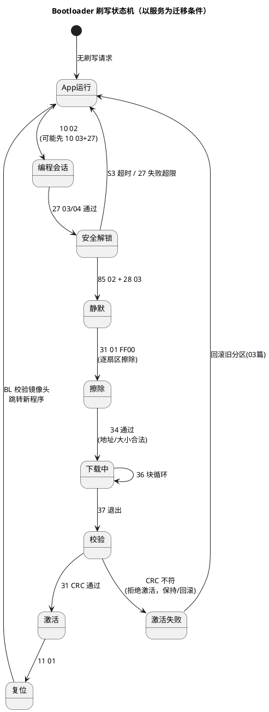

# 02-34-37实现细节

> 一句话定位：把 01 篇时序图右侧拆到字节级——34 怎么协商、36 块计数器怎么滚、37+31 怎么闭环校验，以及"Flash 驱动先行下载到 RAM"这条工程铁律的来龙去脉。
> 等级：L2→L3 ｜ 前置：[刷写流程总览](01-刷写流程总览.md) + [SID34-37-刷写下载](../../1-L1基础/UDS协议/SID34-37-刷写下载.md)

## 太长不看

> - 人话直觉：34 是"谈价"（往哪写、一次给多少），36 是"搬砖"（按块计数滚动送货），37+31 是"验收"（CRC 对不上就白搬）；擦写别人的房子时自己不能住在里面——所以 Flash 驱动要先搬进 RAM 住。
> - 本篇解决：BL 状态机怎么排、34/36 的字段怎么解析、丢块怎么重传、CRC 闭环怎么设计、安全访问失败怎么防爆破。
> - 赶时间记住：①36 的 blockSequenceCounter 从 00 起每块+1、FF 后回 00，错序回 7F 36 73；②34 响应的 maxNumberOfBlockLength 决定 36 负载长度，必须与 CanTp 缓冲匹配；③37 之后 CRC 不过绝不激活；④擦写目标 bank 时驱动必须在 RAM/另一 bank 执行。

## 原理

BL 的所有行为可以收敛成一个状态机——诊断服务只是推动状态迁移的输入：



状态机的价值：**每个状态只接受有限输入，越状态的服务一律 NRC 0x7F/0x22 拒绝**——例如没到"安全解锁"就发 34，直接拒绝，这是 BL 的第一道安全设计。

## 详解

### 34 请求解析：格式兼容位与地址/长度字段

请求与响应的字节布局（帧格式细节见 [SID34-37-刷写下载](../../1-L1基础/UDS协议/SID34-37-刷写下载.md)，这里按 BL 解析视角）：

| 请求字节 | 字段 | 典型值 | BL 解析动作 |
|---|---|---|---|
| [0] | SID | 0x34 | — |
| [1] | dataFormatIdentifier（高半字节压缩/低半字节加密） | 0x00 | 非 0 则 NRC 0x31（不支持压缩/加密） |
| [2] | addressAndLengthFormatIdentifier | 0x44 | 高半字节=地址 4 字节，低半字节=长度 4 字节 |
| [3..] | memoryAddress | 0xA0080000 | **查地址合法性表**：必须落在允许下载区（应用区/RAM 驱动区），落在 BL 自身区直接拒绝 |
| [3+n..] | memorySize | 镜像大小 | 校验不越过分区边界，必要时预留擦除对齐 |

响应 `74 + lengthFormatIdentifier + maxNumberOfBlockLength`：BL 告诉上位机"之后每个 36 最多带多少字节"。这个值不是拍的——**必须 ≤ CanTp 接收缓冲能力**（见 [CanTp分段15765-2](../../../05-汽车网络通讯/2-L2进阶/传输层/01-CanTp分段15765-2.md)：N_Cr 窗口内要收完一整块多帧），经典工程值 0x100~0x400，配合 STmin 与擦写耗时权衡。

### 36 块传输协议细节

- **blockSequenceCounter**：第 1 块 0x00，此后每块 +1，到 0xFF 后回绕 0x00；响应 `76 + counter` 原样回显；
- **末块判断**：BL 按 34 拿到的总长度递减计数，剩余 < blockLength 的那块就是末块（可以不满块）；
- **丢块/乱序**：BL 期望计数器与收到不符 → 回 `7F 36 73`（wrongBlockSequenceCounter）；上位机从期望计数器处重发，**不做滑动窗口**——绝大多数实现是"逐块确认、无窗口"，简单且易恢复；
- **写 Flash 时机**：块到达即写（边收边写，缓冲一个块），或攒满扇区再写——后者省擦写次数但缓冲要求高，TC377 的页编程特性见 [DMU与扇区](../../../02-芯片与体系结构/2-L2进阶/TC377平台/存储器映射/03-DMU与扇区.md)；
- **响应耗时**：块写入期间可能超 P2，规范允许先回 NRC 0x78（responsePending）挂起，或上位机把 P2* 放大到秒级。

### 37 + 31：CRC32 校验闭环

```
37（退出传输）──► BL 冻结下载区，比对累计字节数 == 34 声明大小
                     │ 不等 → 31 例程返回"长度不符"，不激活
                     ▼
31 01 02xx（校验例程）──► BL 对下载镜像整片算 CRC32
                     │ 与镜像头内 CRC（上位机离线算好烧入）比对
                     │ 不等 → 返回"校验失败"，绝不激活
                     ▼
                 31 01 02xx（激活）──► 写有效标志/切换分区 → 11 01 复位生效
```

CRC 三要素必须在两侧文档里锁死：**多项式（常用 0x04C11DB7）、初值/异或（0xFFFFFFFF 起、结果再异或）、字节序与扫描范围（含头部？含填充？）**——范围差异是最常见的"我算的和他算的不一样"。填充约定（未写区按 0xFF 参与计算）见 [04-Fls依赖](04-Fls依赖.md)。

### Flash 驱动先行下载：为什么与怎么做

**为什么**：擦写应用 Flash 时，被操作的 bank 不可读/不可执行（擦写期间同 bank 取指会导致总线错误/Trap）。BL 自身代码若和目标应用同 bank，执行"擦写"这个动作本身就住在被拆的房子里——所以**擦写驱动必须不依赖被擦除区域**。这也是很多 OEM 规范把"Flash 驱动"作为独立小镜像先刷的原因：驱动还能随上位机升级，BL 不用改。

**怎么做**（两种工程形态）：

| 形态 | 做法 | 适用 |
|---|---|---|
| BL 自带驱动 | Flash 驱动链接在 BL 区（独立 bank），擦应用区时驱动天然可执行 | 单分区/低成本，S32K 常见 |
| 驱动先行下载 | 34/36 先把 Flash 驱动下载到 RAM 固定地址（如 PSPR），跳转/回调 RAM 中驱动执行擦写 | 双分区/驱动可升级，TC377 常见（RAM 执行区见 [DSRAM-PSPR-DSPR](../../../02-芯片与体系结构/2-L2进阶/TC377平台/存储器映射/02-DSRAM-PSPR-DSPR.md)） |

### 安全访问失败计数与回退

27 03/04 的 key 错误不能无限试：BL 侧维护失败计数器（掉电存 NVM）——连续 N 次错后进入**延时惩罚**（回 NRC 0x37，要求等 10s 级延时），超限更多次则拒绝进入编程会话直到 11 复位甚至掉电。防的是"拿诊断仪爆破 seed-key"。配套约束：seed 要够随机（不复用、不随时间可预测），key 算法与 DLL 版本受控。

## 配置层/工程关联

- **Dcm 侧**：34/36/37 只在编程会话+安全解锁后放行（会话/安全矩阵）；例程 31 的 DID 绑定 BL 回调（擦除/校验/激活各一个例程 ID，写在 CDD/ODX 里，见 [CDD与CANdela](../../2-L2进阶/诊断数据库/02-CDD与CANdela.md)）；
- **地址布局**：34 的合法性检查表来自分区表（BL 区禁写、应用区允许、RAM 驱动区允许）——分区表是 BL 与链接脚本的共同契约（[04-Fls依赖](04-Fls依赖.md)）；
- **CanTp**：blockLength 与 STmin/BS 联调——36 块越大吞吐越高，但要求 CanTp 缓冲与 BL 响应及时性同步放大。

## 易错点与陷阱

1. **现象：36 第一块就 7F 36 73。原因：上位机首块计数器从 0x01 起发（应从 0x00 起）。对策：对齐协议版本——14229 规定首块 counter=0x00，之后递增。**
2. **现象：34 响应的 blockLength 很大但 36 传输频繁超时。原因：块长超过 CanTp 接收缓冲/BL 写 Flash 阻塞了接收。对策：blockLength ≤ CanTp 缓冲，或 BL 拆分"收块/写块"两段调度。**
3. **现象：两侧 CRC 永远差一点。原因：扫描范围或填充不一致（一侧算了头部，一侧没算；空区一侧算 0xFF 一侧跳过）。对策：文档锁死"起点/终点/填充/字节序"，用小镜像先联调。**
4. **现象：擦应用区时 BL 跑飞/Trap。原因：驱动代码落在了被擦除 bank 或 cache/预取取到了该区。对策：驱动重定位到 RAM 或独立 bank，禁用对目标区的预取。**
5. **现象：37 后字节数对不上但 CRC 碰巧对。原因：36 中途丢块且计数器回绕恰好对齐，长度没校验就放行。对策：37 必须先比长度再进 CRC，长度不符直接失败。**
6. **现象：27 失败几次后永远进不了编程会话。原因：失败计数存 NVM 后超限锁定，未按规范提供解除路径。对策：实现"复位/延时后清零"的解锁条件，并写进诊断规范。**

## 面试高频题

**Q1：36 的块计数器规则？丢块怎么办？**
A：首块 0x00，逐块+1，FF 后回绕 00，响应原样回显；BL 发现期望值不符回 7F 36 73，上位机从期望计数器重发。实现上基本是逐块确认、无滑动窗口，胜在可靠易恢复。

**Q2：为什么 Flash 驱动要先下载到 RAM？**
A：擦写目标 bank 期间该区不可读/不可执行，驱动若在被擦区，执行擦写的代码本身就没地方跑。所以要么驱动放 BL 独立 bank，要么先把驱动 34/36 下载到 RAM（如 PSPR）再回调执行——同时驱动独立发布还能随固件升级。

**Q3：34 的响应里最关键字段是什么？由什么决定？**
A：maxNumberOfBlockLength——决定 36 每块负载上限。上限受 CanTp 接收缓冲、N_Cr 时序与 BL 写 Flash 阻塞时间约束，不是越大越好。

**Q4：校验闭环怎么做才安全？**
A：37 先比累计长度与 34 声明一致，31 例程再对整片镜像算 CRC32 与镜像头比对；长度与 CRC 双过才允许写激活标志/切分区，任一失败保持旧程序可用（配合 03 篇回滚）。

## 延伸

- [刷写流程总览](01-刷写流程总览.md)——本篇状态机所在的完整时序；
- [双分区与回滚](03-双分区与回滚.md)——"激活失败→回滚"的后半程；
- [Fls依赖](04-Fls依赖.md)——块数据最终落到哪个 API；
- [SID34-37-刷写下载](../../1-L1基础/UDS协议/SID34-37-刷写下载.md)——协议侧字段与 NRC 定义；
- [DSRAM-PSPR-DSPR](../../../02-芯片与体系结构/2-L2进阶/TC377平台/存储器映射/02-DSRAM-PSPR-DSPR.md)——TC377 上驱动 RAM 执行的落点；
- 工程深入场景：产线刷写节拍优化（blockLength×STmin 联调把 2MB 镜像从 6min 压到 90s）、以及 36 中途断电后"断点续刷还是整区重来"的取舍（多数选择重来：简单且避免拼接损坏）。

---

维护约定：笔记命名 `序号-主题.md`；真实截图放 `_images/`；流程/时序/状态/架构图用 PlantUML 内嵌正文，规范见 [图表规范与模板](../../../00-总览/图表规范与模板.md)。
