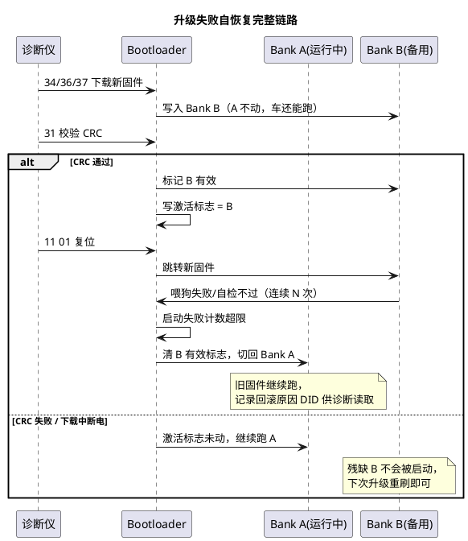

# 03-双分区与回滚

> 一句话定位：双 bank 是"一跑一备"的固件保险——新固件先住进备区、验明正身再换岗；一旦新固件扶不起来，Bootloader 把老将请回来，升级永远不把车刷成砖。
> 等级：L2→L3 ｜ 前置：[刷写流程总览](01-刷写流程总览.md)

## 太长不看

> - 人话直觉：新员工（新固件）先在备用工位试用（写入备 bank），体检合格（CRC）才允许上岗（激活切换）；上岗后连续旷工（看门狗超时）就请老员工回来（回滚）。
> - 本篇解决：双 bank 布局与激活标志怎么设计、回滚触发条件怎么定、TC377 与 S32K 各自的硬件机制怎么用、失败自恢复链路怎么串。
> - 赶时间记住：①任何时候必须有一个"可启动的完整镜像"；②激活=改标志/BMHD，回滚=标志切换回来；③回滚触发三件套：CRC 失败、启动看门狗连续超时、自检不过。

## 原理

单分区的死穴：34/36/37 把应用区擦了再写——**擦完到写完之间断电，Flash 里没有完整程序**，下次上电无程序可跳。双分区（A/B bank）把"运行"与"升级"解耦：跑 A 时刷 B，刷好、验好、切标志，重启后跑 B——**任何时刻 A、B 至少一个是完整的**。

## 详解

### 激活切换机制：标志放哪、谁认

| 机制 | 做法 | 典型平台 |
|---|---|---|
| 软件激活标志 | BL 在专用 Flash 扇区/EE 区写"当前活动 bank"标志，复位后先读它再跳转 | 通用，S32K 应用+BL 软切常见 |
| 硬件引导头 | 镜像头带入口地址+CRC，BootROM/BL 校验通过才跳；双 bank 各有引导头，写对侧引导头即切换 | TC377（BMHD，见 [TC377-BMI与引导头](../../../02-芯片与体系结构/2-L2进阶/启动流程/01-TC377-BMI与引导头.md)） |
| Flash bank swap | 芯片级地址交换：切换后两个 bank 的物理地址对调，程序"原地"换新 | TC377 PFlash swap、S32K Program Flash swap |

标志写入的原子性是命门：写标志本身也可能断电——所以标志区要么双份互为校验（老标志+新标志+CRC），要么用硬件保证的 swap 序列（先写指示字、再触发确认），保证任意时刻 BL 都能判定"谁可信"。

### 回滚触发条件

| 触发 | 判定方式 | 处理 |
|---|---|---|
| 新镜像 CRC 失败 | 31 例程校验不过 | 不激活，旧 bank 继续跑（升级整体失败但不伤车） |
| 启动看门狗超时 | 应用启动后须在限定时间内通过诊断/IO 喂"启动成功"标志，BL 计数连续 N 次复位未果 | 切回旧 bank，置回滚事件 |
| 自检不过 | 新固件自检（时钟/供电/外设）失败主动请求回滚或复位循环 | 同上 |
| 主动回滚 | 诊断 31 例程/特定 DID 请求 | 校验旧 bank 完整后切换 |

注意：**回滚不是无限次**——旧版本可能带着已知缺陷，多数规范限制回滚次数并记录事件（防止两个坏镜像来回打乒乓球）。

### TC377：BMHD 引导头与 bank swap

TC377 的 PFlash 分 bank（详见 [PFlash与DFlash](../../../02-芯片与体系结构/2-L2进阶/TC377平台/存储器映射/01-PFlash与DFlash.md)），每个可启动镜像配 BMHD（Boot Mode Header：起始地址+APP_ID+CRC+备份头）。BootROM 从固定位置取 BMHD、校验 CRC 后跳转。双 bank 做法：A/B 各带 BMHD，BL 按"活动标志 + BMHD 有效性"选跳；TC3xx 还支持硬件 PFlash swap（UCB 中配置 swap 标志，两 bank 地址对调），使"切换"对应用完全透明。关键点：**UCB/BMHD 写错可能锁死芯片**，产线工装必须有 BMHD 校验工具。

### S32K：Program Flash swap 与 FlexRAM

S32K1 系列（FTFC 控制器，见 [FTFC机制](../../../02-芯片与体系结构/1-L1基础/S32K平台/存储器与Flash/01-FTFC机制.md)）把程序 Flash 分两个可交换的 block：通过 **swap indicator 序列**（擦指示扇区→写 0x55/0xAA/0xF0 等状态字→触发 swap）让两 block 地址互换，新固件刷在非活动 block、swap 后"原地"变成活动区，BL 自身留在保护区不动。**FlexRAM**（[分区与安全](../../../02-芯片与体系结构/1-L1基础/S32K平台/存储器与Flash/03-分区与安全.md)）在此的角色是作 EEE 模拟 EEPROM 的备份 RAM（存激活标志/回滚计数这类掉电数据），也可配作普通 RAM——刷写期间数据不丢靠它。

## 配置层/工程关联

- **链接脚本**：A/B 两区入口/加载地址对称设计，应用代码与位置无关或两区各编译一份（[链接脚本与分散加载](../../../02-芯片与体系结构/2-L2进阶/启动流程/03-链接脚本与分散加载.md)）；
- **Dcm/BL 配置**：34 的地址合法性表放行"非活动 bank"，BL 区永远禁写；31 激活例程写标志；回滚原因登记为 DID（诊断仪可读）；
- **NvM/Fee**：激活标志、启动失败计数、回滚事件存独立小扇区或 EEE——这些数据必须在"擦应用区"时幸存（[Fls依赖](04-Fls依赖.md) 布局篇）。

## 易错点与陷阱

1. **现象：激活标志写一半断电，重启随机跳旧/新。原因：标志无原子性，半写的标志两版解读不一致。对策：双份标志+CRC 或走芯片 swap 序列，读端有唯一判定规则。**
2. **现象：新固件反复复位，车趴窝。原因：只有看门狗回滚但计数阈值太长/没实现。对策：启动成功标志机制必须落地，阈值常取 3~5 次。**
3. **现象：回滚后功能异常。原因：旧固件配新标定/新 DBC，版本配套被破坏。对策：镜像头带配套版本校验，回滚同时校验标定区兼容性。**
4. **现象：A/B 地址不对称导致切过去跑飞。原因：固件按绝对地址链接，swap 后外设/中断向量错位。对策：两区同构布局或位置无关设计，中断向量重映射验证。**
5. **现象：BMHD/UCB 误操作芯片锁死。原因：34 地址表放行了引导头区或工装写头工具 bug。对策：引导头区硬禁写+产线工具独立校验 BMHD CRC。**

## 面试高频题

**Q1：双分区为什么能保证"永远刷不坏"？**
A：运行区与升级区分离，升级只写备用 bank，激活前必须过 CRC；任何断电时刻，活动 bank 都是完整的旧程序。激活后还有启动看门狗兜底：新程序起不来就回滚。

**Q2：激活切换有哪几种实现？**
A：软件标志（BL 读 Flash/EE 标志选 bank）、硬件引导头（TC377 BMHD：入口+CRC，写对侧头即切换）、芯片级 bank swap（TC377 UCB swap、S32K swap indicator 地址对调）。核心要求都是标志写入的原子性与可判定性。

**Q3：什么情况触发回滚？**
A：三类——校验失败（CRC 不过不激活）、启动失败（新程序连续 N 次没在时限内报告"启动成功"，看门狗计数）、自检失败或主动诊断请求。回滚要记事件、限次数，防两个坏镜像来回切。

**Q4：S32K 和 TC377 的双 bank 机制差异？**
A：S32K 用 FTFC 的 Program Flash swap（swap indicator 状态字序列，两 block 地址互换），FlexRAM 兼作 EEE 存标志；TC377 用 BMHD 引导头（每镜像带头，BootROM 校验跳转）加可选的 UCB PFlash swap，BMHD 写错有锁片风险，管理更严。

## 延伸

- [刷写流程总览](01-刷写流程总览.md)——双分区位于"激活/复位"那一格；
- [34-37实现细节](02-34-37实现细节.md)——"验明正身"的 CRC 闭环细节；
- [Fls依赖](04-Fls依赖.md)——双分区地址布局与标志扇区安排；
- [PFlash与DFlash](../../../02-芯片与体系结构/2-L2进阶/TC377平台/存储器映射/01-PFlash与DFlash.md) / [TC377-BMI与引导头](../../../02-芯片与体系结构/2-L2进阶/启动流程/01-TC377-BMI与引导头.md)——TC377 侧硬件基础；
- [FTFC机制](../../../02-芯片与体系结构/1-L1基础/S32K平台/存储器与Flash/01-FTFC机制.md) / [分区与安全](../../../02-芯片与体系结构/1-L1基础/S32K平台/存储器与Flash/03-分区与安全.md)——S32K 侧硬件基础；
- 工程深入场景：OTA 升级链路（车云协同下 A/B 分区+断点策略）、量产产线"首次烧写+强制激活 B"的工装流程，以及双分区下的标定区共用问题（标定数据放独立区，避免随应用区被回滚带跑）。

---

维护约定：笔记命名 `序号-主题.md`；真实截图放 `_images/`；流程/时序/状态/架构图用 PlantUML 内嵌正文，规范见 [图表规范与模板](../../../00-总览/图表规范与模板.md)。
