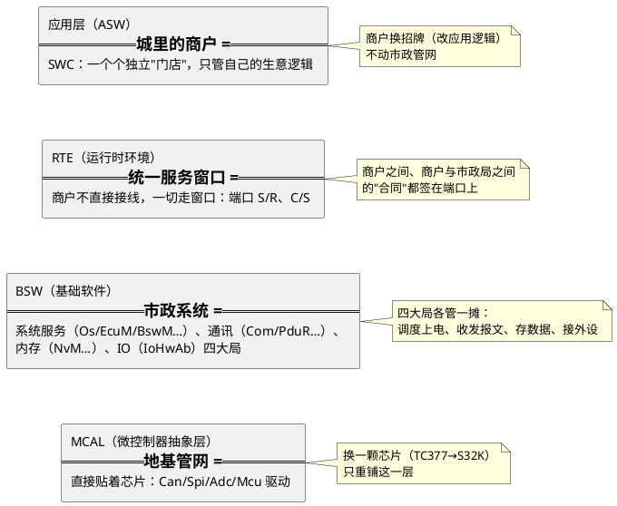

# 01-AUTOSAR第一课-一座城的分区图

> 一句话定位：把 AUTOSAR 分层架构想象成一座城市的规划——商户、统一服务窗口、市政系统、地基管网各归其层，一张图记住每一层管什么、为什么这样切——之后再看到 RTE/BSW/MCAL 这些词，脑子里都有坐标。
> 等级：L1 ｜ 前置：无

## 一座城的四个分区

第一次打开 AUTOSAR 分层图，很多人被满屏缩写劝退。换个角度：把它当一座城市的规划图看——

一句话各归其位：

- **应用层 = 商户**：SWC（Software Component）是独立门店，只写业务逻辑，不关心信号最终走了 CAN 还是 LIN；
- **RTE = 统一服务窗口**：所有跨门店、跨局的往来都经 RTE 中转——SWC 永远只调 `Rte_Write/Rte_Read/Rte_Call`，不直接碰 BSW 函数；
- **BSW = 市政系统**：四大局——系统服务栈（Os 调度、EcuM 上下电、BswM 模式管理、WdgM 监督）、通讯服务栈（Com/PduR/CanSM/NM…）、内存栈（NvM…）、IO 栈（IoHwAb）；
- **MCAL = 地基管网**：直接贴芯片寄存器的驱动，就是 04 区讲的那批 CanDrv/Spi/Adc/Mcu。

## 一帧信号从 SWC 到总线的旅程

把城市走一遍：车速 SWC 里写 `VehSpd = 88` → `Rte_Write` 进窗口 → RTE 转交 Com 打包 → PduR 选路 → CanIf 包装 → CanDrv（MCAL）把帧推上总线。半毫秒后，另一座城（对端 ECU）沿同一条链反向拆包，应用读到 88。

| 站点 | 层 | 干的活 | 属于哪区 |
|---|---|---|---|
| SWC（车速） | 应用层 | 写信号值，不关心怎么送出去 | 本区（RTE 之下才管运输） |
| RTE | 运行时环境 | 把端口写操作转给 Com，应用与栈解耦 | 本区（3-L3高级/RTE） |
| Com | 通讯服务栈 | 按通讯矩阵把信号装配进 PDU | 本区（2-L2进阶/通讯服务栈） |
| PduR | 通讯服务栈 | 路由表：这包数据走哪条总线 | 本区（2-L2进阶/通讯服务栈） |
| CanIf→CanDrv | 通讯服务栈/MCAL | 包装、选硬件对象、驱动寄存器 | 本区/04 区（MCAL） |
| CAN 总线 | 物理 | 帧上双绞线，仲裁、应答、错误处理 | 05 区（总线世界） |

链上每一层在本库都有归属：下两层的原理与排障在 [05 区导读](../../05-汽车网络通讯/00-入门导读/README.md)（CanIf 之下的总线世界）、驱动接口契约在 04 区（MCAL）、**Com 之上的栈内接线与 RTE 就是本区的地盘**——一句话：07 区管"城规与市政局"，05/04 区管"道路与管网施工"。

## BSW 四个栈一句话各表

| 栈 | 一句话 | 代表模块 |
|---|---|---|
| 系统服务栈 | 管"谁什么时候跑、几点开机几点睡、出了岔子怎么办" | Os、EcuM、BswM、WdgM、Det/Dlt |
| 通讯服务栈 | 管"报文的打包、选路、总线状态机与睡眠唤醒" | Com、PduR、CanSM、CanNm、CanIf |
| 内存栈 | 管"掉电不丢的数据怎么存：块、队列、冗余" | NvM、MemIf、Fee/Ea |
| IO 栈 | 管"MCAL 与应用之间的桥：把外设读数翻译成信号" | IoHwAb |

## 分层图上的几个"邻居词"

分层图上还有几个不属于四栈、但总在图边上晃的词，先混个脸熟：

| 词 | 在城里的角色 | 归属 |
|---|---|---|
| CDD（复杂驱动） | 商户自建的"专用通道"，绕过窗口直连底层 | 04 区（CDD设计方法论） |
| SchM | 各"局"的内部排班表：MainFunction 挂到哪个 Task | 本区（2-L2进阶/SchM与调度） |
| Det/Dlt | 市政系统的"投诉热线"与"工作日志" | 本区（2-L2进阶/系统服务栈） |
| EcuC | 全城配置图纸的总目录（容器树的根） | 本区（2-L2进阶/方法论与ARXML） |

## 为什么要分层：换芯片、换总线、复用

分层不是学术洁癖，是三笔经济账：

1. **换芯片**：TC377 换 S32K，只重写 MCAL 与部分驱动——上层市政系统与应用原样搬家；
2. **换总线**：CAN 换 CAN-FD 甚至以太网，应用 SWC 一行不改——改动收在通讯服务栈以内，因为应用只跟 RTE 窗口签合同，不跟总线签；
3. **复用**：SWC 像标准集装箱，从 A 项目拖到 B 项目，端口定义不变就能用。

代价也直说：分层带来配置复杂度与调用链变长（排障时一层层跳转）——这正是本区要给每个栈留"排障"内容的原因。

## 分层三问自测

拿三个新手最常问的问题自测一下，答案都在上文的城市比喻里：

| 问题 | 一句话答案 |
|---|---|
| SWC 能直接调 CanIf 的函数吗？ | 不能——商户不进市政局后厨，一切走 RTE 窗口（`Rte_Call`/`Rte_Write`）；BSW 模块之间倒是可以按 SWS 规定的接口互调 |
| 换成自适应平台（AP）还能用这套吗？ | Classic 与 Adaptive 是两座不同的城：CP 面向硬实时 MCU、静态配置；AP 面向高性能 SoC、进程化与服务化（详见架构总览的对比篇） |
| 手写代码还剩多少？ | SWC 内部逻辑、CDD、复杂驱动——城市里"非标装修"的部分；标准化接线全部由配置生成 |

## 配置驱动开发：ARXML 进、代码出

AUTOSAR 的日常不是从零写代码，而是**填配置**：在工具（EB tresos/DaVinci）里把容器与参数填好 → 存成 ARXML → 生成器吐出 RTE 与配置 C 代码 → 手写代码只剩 SWC 内部逻辑与 CDD。直觉：**ARXML 是图纸，生成器是预制件厂，你主要在做"画图纸+验收"，不是"砌每块砖"**。图纸怎么读、怎么 diff review，归 [方法论与ARXML](../2-L2进阶/方法论与ARXML/README.md)；想查某个模块的原始规定，用 [SWS阅读法](../1-L1基础/SWS阅读法/README.md)。

## 本区地图与坡道

| 带 | 子目录 | 一句话 |
|---|---|---|
| 1-L1基础 | 架构总览/ | 分层架构=入门第一课；Classic vs Adaptive、版本演进 |
| 1-L1基础 | SWS阅读法/ | 方法论工具：学会查 AUTOSAR 规范原文 |
| 2-L2进阶 | 方法论与ARXML/ | ECU 配置结构、容器与参数、手读 ARXML、diff review |
| 2-L2进阶 | SchM与调度/ | 调度表、Runnable 到 Task 映射 |
| 2-L2进阶 | 系统服务栈/ | Os/EcuM/BswM/WdgM/Det与Dlt 五个孙目录 |
| 2-L2进阶 | 通讯服务栈/ | Com/PduR/CanSM/LinSM/NM/CanIf/CanTrcv |
| 2-L2进阶 | 内存栈/ | NvM 块管理、写队列、冗余、MemIf/Fee/Ea |
| 2-L2进阶 | IO栈/ | IoHwAb：MCAL 与 ASW 之间的桥 |
| 3-L3高级 | RTE/ | 端口起步可 L2，生成代码解读偏深 |
| 3-L3高级 | 加密栈/ | Csm/CryIf/Crypto、SecOC 配置 |
| 3-L3高级 | 多核集成/ | 主从核启动、IOC 与核间中断、共享资源保护 |

归带说明：架构总览与 SWS阅读法放 L1，因为"分层图入脑"与"会查规范"是读一切模块笔记的前置；RTE 放 L3 是因生成代码解读偏深，但其端口起步篇可提前读。

自查口径：读完本篇，你应能不查资料画出四层结构、说出 BSW 四个栈各管什么、解释"换芯片为什么不用改应用"——说得出，就可以进 L1 带读分层架构详解了。

## 下一步读什么

- 第一课展开：[架构总览](../1-L1基础/架构总览/README.md)——分层架构图详解、Classic vs Adaptive；
- 方法论工具：[SWS阅读法/01-如何查SWS](../1-L1基础/SWS阅读法/01-如何查SWS.md)——学会查 SWS 原文，之后读任何模块都能自证；
- 最薄的栈先走：[IO栈/01-IoHwAb设计](../2-L2进阶/IO栈/01-IoHwAb设计.md)——从 IoHwAb 看 MCAL 与 ASW 怎么接线；
- 主线纵深：[EcuM/02-上下电时序](../2-L2进阶/系统服务栈/EcuM/02-上下电时序.md)（上下电时序起步）→ [SchM与调度](../2-L2进阶/SchM与调度/README.md)；
- 深水区按需：[RTE/01-S-R与C-S端口](../3-L3高级/RTE/01-S-R与C-S端口.md)（S/R 与 C/S 端口篇可提前读）；
- 完整阅读顺序见本区 [README 入门坡道](../README.md)。

---

维护约定：笔记命名 `序号-主题.md`；真实截图放 `_images/`；流程/时序/状态/架构图用 PlantUML 内嵌正文，规范见 [图表规范与模板](../../00-总览/图表规范与模板.md)。
