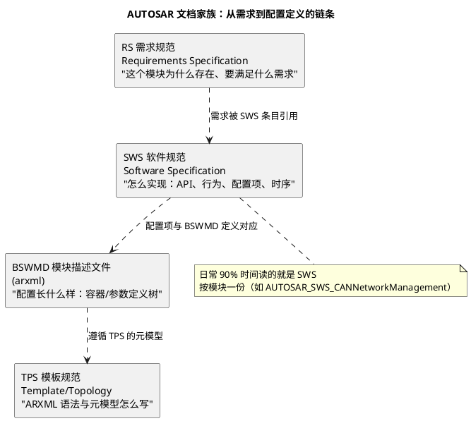
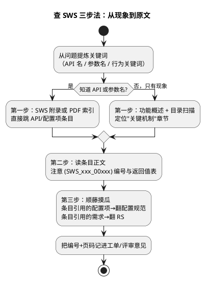

# 01-如何查SWS

> 一句话定位：认全 AUTOSAR 文档家族（SWS/RS/BSWMD/TPS），摸清 SWS 的章节套路，练会"带着问题查原文"的三步法——从此任何模块的行为争议都能自己翻规范裁决，而不是靠猜或问人。
> 等级：L1→L2 ｜ 前置：[分层架构](../架构总览/01-分层架构.md)

工具报错、评审抬杠、面试追问，最终都要落到同一个问题："规范原文怎么说？"AUTOSAR 全部规范公开可下载，缺的不是文档，是**查的方法**。本篇就是那套方法。

## 原理

### AUTOSAR 文档家族：四类各管一层

| 缩写 | 全称 | 回答什么问题 | 使用频率 |
|---|---|---|---|
| RS | Requirements Specification | 这个模块存在的意义、需求编号（SWS 条目都挂着 RS 编号） | 低（溯源时用） |
| SWS | Software Specification | API 签名/行为/配置参数/时序/约束——**主战场** | 极高 |
| BSWMD | BSW Module Description（arxml） | 配置容器树的形式化定义（哪些容器、哪些参数、取值范围） | 配置排障时高 |
| TPS | Template Specification | ARXML/系统描述/ECU 配置的元模型语法 | 写工具/手改 arxml 时 |
| EXP/TR | 解释性/技术报告 | 分层架构总图（EXP_LayeredSoftwareArchitecture）等背景读物 | 入门时 |

### SWS 章节结构规律

模块 SWS 的目录十年如一日，记住六个固定区，翻书就有索引：

1. **功能概述（Introduction/Functional Overview）**：模块分层位置、框图、术语——第一次接触某模块先读这 10 页；
2. **API 定义（API Specification）**：每个函数的签名、参数、返回值、前提条件——查"这个函数到底干什么"；
3. **关键机制（Functional Specification/行为规范）**：状态机、超时、重试、错误反应——查"出这种情况它怎么办"（大头所在）；
4. **配置项（Configuration Specification）**：与 BSWMD 对应的参数表：名称/类型/范围/默认值/多值性——查"这个参数能填什么"；
5. **时序与调度（Scheduling/Sequence）**：Init/MainFunction/ISR 的调用时机与顺序；
6. **约束与依赖（Dependencies/Constraints）**：与其他模块的关系、编译/生成约束。

### 带着问题查的三步法

## 详解

### 例：查"CanNm 超时后到底干什么"

这是典型的行为类问题（只知道现象：网络管理停发报文了），走一遍：

1. **定文档**：下载 `AUTOSAR_SWS_CANNetworkManagement.pdf`（注意选对项目版本，如 R4.2.2）；
2. **先看功能概述**里的状态机图：CanNm 有 BusSleep/Normal/RepeatMessage/PrepareSleep 等状态——确认"超时"对应哪条转移（NormalMessageTimeout / NM-Timeout Timer）；
3. **在关键机制章节搜"Timeout"**：命中条目（如 `[SWS_CAN_00xxx]` Network Timeout Timer）：定义了超时后触发回调 `Nm_NetworkTimeout`→上层 NM 协调状态迁移，并给出与 `CanNmTimeoutTime` 的关系；
4. **跳到配置规范**查 `CanNmTimeoutTime`：类型/单位/取值范围/默认值——确认工程里配的 2s 是否合法；
5. **闭环**：把条目编号写进排查记录——"按 SWS_xxx，超时后回调 X，当前配置 2s，行为符合规范，问题在上层"。

一次走查同时用到了：概述定位→行为条目→配置项三段式，这就是三步法的肌肉记忆版。

### 官网下载与本地检索技巧

- **下载路径**：AUTOSAR 官网 → Development → Classic Platform（或 Adaptive）→ 选版本（如 R19-11）→ Document List 里按类别（Specification/Template/Report）勾选下载 PDF 包；旧版 R4.x 在同一页归档区；
- **建本地库**：按 `版本/类别/文档名` 三级目录存（例：`R4.2.2/SWS/AUTOSAR_SWS_CANNetworkManagement.pdf`），全库一次性下载，别用到再找；
- **检索工具**：VS Code + PDF 搜索插件，或用 `pdfgrep`/Everything 按文件名秒定位；Chrome/Edge 拖 PDF 全文搜索也快；
- **认编号不认页码**：引用规范一律带条目号 `SWS_Can_00xxx`（PDF 里可搜），页码换版就漂移；
- **对照 BSWMD**：SWS 配置项章节 ↔ tresos 里打开该模块 xdm 的 Calculator/校验规则，两边互证最稳。

## 配置层/工程关联

- tresos 报的配置校验错误（"value out of range"），最终依据就是 SWS 配置规范 + BSWMD 定义——报错信息里的参数名直接回 SWS 搜，别瞎试值；
- 评审配置 diff 时，每个"改了值的参数"都应能在 SWS 配置规范里找到它影响的行为条款（见 [04-diff-review技巧](../../2-L2进阶/方法论与ARXML/04-diff-review技巧.md)）；
- OEM 差异化需求落 ARXML 时，用 TPS（如 TPS_ECUC）确认语法——手改 arxml 前必读。

## 易错点与陷阱

1. **拿论坛/博客当依据**：二手解读常过时或张冠李戴，最终裁决只能是所锁定版本的 SWS 条目；
2. **版本不对口**：拿 R19-11 的 SWS 解释 R4.2.2 工程，条目编号/参数范围可能对不上——先核版本再翻内容（见 [版本演进](../架构总览/03-版本演进.md)）；
3. **只读 API 不读约束**：函数能用≠随便用，SWS 里 Precondition/上下文限制（能否在 ISR 调、需不需要先 Init）常被漏看；
4. **混淆 SWS 与 RS**：SWS 讲实现行为，RS 讲需求动机；配置项的行为定义在 SWS，别在 RS 里找不到参数而怀疑人生；
5. **忽略 BSWMD 与 SWS 的对应关系**：SWS 配置项表的每个参数在 BSWMD 里都有定义节点，配置工具报"未知容器"时，先比对 BSWMD 版本。

## 面试高频题

1. SWS、RS、BSWMD、TPS 分别是什么？查一个模块的配置参数范围应该看哪份？
   答：RS 讲模块存在的需求动机，SWS 讲 API/行为/配置/时序（主战场），BSWMD 是配置容器树的 arxml 形式化定义，TPS 管 ARXML 元模型语法。查参数范围看 SWS 的 Configuration Specification 章节，再与 BSWMD/配置工具定义互证。
2. 描述一次你按 SWS 排查问题的经历（考察点：会不会用条目编号、能不能走"现象→机制→配置项"链路）。
   答：以 CanNm 超时停发为例：先读功能概述确认状态机里"超时"对应哪条转移，再在关键机制章搜 Timeout 命中条目（如 [SWS_CAN_00xxx]，触发 Nm_NetworkTimeout 回调），最后到配置规范查 CanNmTimeoutTime 的类型/范围核对工程值，把条目编号写进排查记录闭环。
3. AUTOSAR 规范条目编号（SWS_xxx）有什么用？为什么引用规范要带编号？
   答：编号是条目的稳定 ID，PDF 里可直接检索，还能顺着引用挂回 RS 需求编号；页码换版本会漂移而编号不会，所以评审意见、工单引用一律带编号，换版本也能对得上。
4. 项目锁 R4.2.2，你手上只有 R19-11 的文档，有什么风险？
   答：版本不对口：条目编号、参数取值范围、默认值甚至模块行为都可能已变，拿新文档解释老工程会得出错误结论。先去官网归档区下载对应版本，所有引用锁定项目版本号。

## 延伸

- [分层架构](../架构总览/01-分层架构.md)：SWS 每份开头的"分层位置图"就是五层图，先修好坐标
- [版本演进](../架构总览/03-版本演进.md)：为什么"查之前先核版本"——版本线决定文档口径
- [容器与参数](../../2-L2进阶/方法论与ARXML/02-容器与参数.md)：SWS 配置项在 ARXML 里如何落成容器与参数
- [ARXML手读](../../2-L2进阶/方法论与ARXML/03-ARXML手读.md)：把"查到的定义"和"工程里的值"对上的手艺
- [通讯服务栈](../../2-L2进阶/通讯服务栈/README.md)：SWS 阅读练兵场——CanNm/CanSM 的状态机条目最锻炼人
