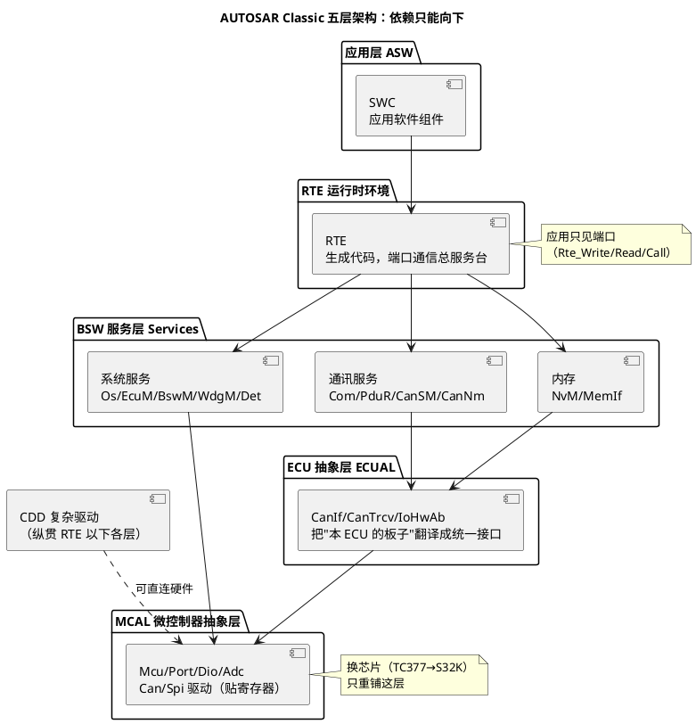
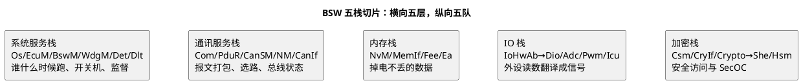

# 01-分层架构

> 一句话定位：把 AUTOSAR Classic 的五层从上到下一次讲透——每层管什么、代表模块是谁、层与层靠什么接口咬合，以及"可替换性"这套设计背后的经济账。
> 等级：L1 ｜ 前置：[AUTOSAR第一课-一座城的分区图](../../00-入门导读/01-AUTOSAR第一课-一座城的分区图.md)

导读把 AUTOSAR 比作"一座城的四个分区"（商户/服务窗口/市政系统/地基管网），那是入门直觉。本篇换成工程师视角，按规范口径数清**五层**：市政系统（BSW）其实再切成"服务层 + ECU 抽象层"两层，另有一条纵贯的 CDD 通道。之后看任何一张三方架构图，都能对号入座。

## 原理

### 五层结构与层间依赖

### 每层一句话 + 代表模块

| 层 | 一句话职责 | 代表模块 |
|---|---|---|
| 应用层 ASW | 业务逻辑的集装箱：SWC 只写"做什么"，不管数据走 CAN 还是 LIN | 应用 SWC、Sensor/Actuator SWC |
| RTE | 应用与基础软件之间唯一的总服务台：端口 S/R、C/S 通信统一收发、并负责把 Runnable 派发进 Task | Rte（生成物，无手写） |
| BSW 服务层 | 与具体硬件无关的"市政服务"：调度、协议栈、存储管理 | Os、EcuM、BswM、Com、PduR、CanSM、CanNm、NvM、Det/Dlt |
| ECU 抽象层 ECUAL | 把本 ECU 的板级差异（外设、收发器、传感器）翻译成统一接口 | CanIf、CanTrcv、LinIf、IoHwAb |
| MCAL | 贴芯片寄存器的最后一层：唯一知道"这是颗 TC377 还是 S32K"的层 | Mcu、Port、Dio、Adc、Pwm、Can、Spi |

两个容易漏的角色：**CDD（复杂驱动）**纵贯 RTE 以下各层，用于塞进 AUTOSAR 没标准化的东西（如特驱动芯片协议）；**RTE 之下、应用之上不存在其他横向通道**——所有跨层调用都要么走 RTE，要么是 BSW 内部按 SWS 规定的接口互调。

### 纵向切片：BSW 五条栈

分层是横向的，工程组织却常按纵向"栈"来看 BSW——一个栈解决一类问题，从服务层一直捅到 MCAL：

本知识库 2-L2进阶 的目录划分（系统服务栈/通讯服务栈/内存栈/IO栈）+ 3-L3高级 的加密栈，就是照这五条纵队切的。

## 详解

### AUTOSAR 接口：层与层之间的"合同"

分层要成立，层间契约必须先说清。AUTOSAR 把接口分四类，记两对就够了：

| 接口类别 | 谁定义 | 例 | 用在哪 |
|---|---|---|---|
| 标准化 AUTOSAR 接口 | AUTOSAR 规范定义语法+语义 | `Rte_Write`、`CanIf_Transmit` | SWC↔RTE、RTE↔BSW |
| 标准化接口（非 AUTOSAR 接口） | 规范定义的普通 C 接口 | Os 的 `ActivateTask` | BSW 模块之间 |
| 特定 AUTOSAR 接口 | OEM/供应商在 ARXML 里自定义的端口接口 | 项目私有的 S/R 端口 | SWC↔SWC |
| 特定接口 | 项目自定义 C 接口 | CDD 对硬件的私有访问 | CDD↔芯片外设 |

主线一句话：**对应用暴露的永远是 AUTOSAR 接口（端口），对下则是标准 C 接口**。"AUTOSAR 接口"特指以端口/操作形式描述、由 RTE 承载的那类——这也是"SWC 可移植"的根基。

### 可替换性：分层存在的理由

分层不是学术洁癖，是三笔经济账：

1. **换芯片**：TC377 换 S32K——只重写 MCAL（英飞凌 MCAL 包换成 NXP RTD），重配 Port 引脚/时钟；服务层、ECUAL（纯软件逻辑部分）、应用原样搬家；
2. **换总线**：CAN 升 CAN FD——应用 SWC 一行不改，改动收在 CanIf 之下的驱动与收发器配置，再加通讯矩阵重配；
3. **复用**：SWC 是标准集装箱，端口定义不变就能从 A 项目拖到 B 项目。

代价：配置量爆炸（一个 ECU 动辄上千个 ECUC 参数）+ 调用链变长（排障要一层层跳）。这也是本库后面所有模块笔记都要带"配置层/工程关联"的原因——在 AUTOSAR 里，"改行为"多半等于"改配置"。

### 五层是逻辑分层，不是代码目录

同一段生成代码（比如 RTE 生成的 `Rte_Xxx.c`）在文件系统里和 BSW 混在一起，但逻辑归属泾渭分明。判断某个 `.c` 属于哪层，看它 include 的头文件与被谁调用，而不是看目录名。

## 配置层/工程关联

以 EB tresos 工程为坐标，五层大致这样落位：

| 层 | tresos/工程里的形态 |
|---|---|
| 应用层 | SWC 的 ARXML（由 ISOLAR/DaVinci Developer 建模）或三方交付 swc.arxml + 手写 `.c` |
| RTE | RTE generator 按系统描述（顶层 ECU extract）生成 `Rte.c/Rte_*.c` |
| BSW 服务层+ECUAL | tresos 各插件（Os/Com/PduR/CanIf/...）的 `.xdm` 配置 → 生成 BSW 代码 |
| MCAL | 芯片厂交付（TC377 用 Infineon MCAL，S32K 用 NXP RTD/EBtresos 插件），也是一堆 xdm/arxml |
| CDD | 手写代码 + 手工在 EcuC 里挂 CddXxx 模块配置 |

日常工作的真实比例：80% 时间在"填配置 + 生成 + 编译 + diff review"，20% 写 SWC 内部逻辑与 CDD。配置怎么组织，见 [方法论与ARXML](../../2-L2进阶/方法论与ARXML/README.md)。

## 易错点与陷阱

1. **把 BSW 当成一层**：规范里 BSW = 服务层 + ECU 抽象层 + MCAL 三层；说"BSW 层之下是 MCAL"会露怯——MCAL 本身就属于 BSW。
2. **以为 SWC 可以直接调 `CanIf_Transmit`**：不行。应用只见端口，一切经 `Rte_Write/Rte_Call`；能直调 BSW 的只有 CDD 和 BSW 内部互调。
3. **CanIf 的层级答错**：CanIf 在 ECU 抽象层（它包的是"本 ECU 有几个 Can 控制器/收发器"），CanSM/CanNm 才在服务层。面试高频送分/送命题。
4. **"换芯片只动 MCAL"说过头**：ECUAL 里贴板子的部分（IoHwAb、Port 引脚、CanTrcv 型号）也得重配重生成；不动的是**服务层与应用层**。
5. **CDD 当万能后门**：绕过 RTE 直连硬件虽合法，但每个 CDD 都是可移植性漏洞，接入要过评审，数量要克制。
6. **拿逻辑分层套代码目录**：工程目录里 RTE/BSW/MCAL 常混在同一 `base` 目录树下，靠目录名认层必错，认层看调用关系。

## 面试高频题

1. 画出 AUTOSAR Classic 分层架构，并说明每层职责与代表模块。（加分项：画出 CDD 纵贯、指出 BSW 含三层）
   答：自上而下五层——应用层（SWC 业务集装箱）→ RTE（端口通信总服务台 + Runnable 派发进 Task）→ BSW 服务层（Os/EcuM/Com/PduR/NvM 等与硬件无关的服务）→ ECU 抽象层（CanIf/IoHwAb 翻译板级差异）→ MCAL（贴寄存器：Mcu/Port/Dio/Can/Spi）。加分项：BSW = 服务层 + ECUAL + MCAL 三层；CDD 纵贯 RTE 以下各层、可直连硬件。
2. RTE 的作用是什么？为什么 SWC 不能直接调用 `CanIf_Transmit`？
   答：RTE 是应用与基础软件之间唯一的总服务台：统一收发端口 S/R、C/S 通信，并把 Runnable 派发进 OS Task。SWC 只见端口（Rte_Write/Rte_Call），直调 BSW 接口会把硬件与平台细节漏进应用，换芯片/换总线时应用就得跟着改，破坏可移植性这一分层的根本目的。
3. Com、PduR、CanIf、Can 驱动分别位于哪一层？一条发送链路按层走一遍。
   答：Com 在服务层（信号组装/超时监控），PduR 在服务层（PDU 选路），CanIf 在 ECU 抽象层（统一多控制器/收发器），Can 驱动在 MCAL。发送链：SWC `Rte_Write` → Com（信号装进 PDU）→ PduR（按路由表转发）→ CanIf（选控制器、挂 HRH/确认）→ Can 驱动（写硬件邮箱）→ 总线。
4. 更换 MCU（TC377→S32K）时哪些层/模块需要改动？为什么应用层可以不动？
   答：MCAL 整体重铺（英飞凌 MCAL 包换 NXP RTD），ECUAL 中贴板子的部分（IoHwAb 映射、Port 引脚、CanTrcv 型号）重配重生成；服务层与应用层不动——它们只依赖标准化 AUTOSAR 接口与端口通信，芯片差异被下层吸收，这正是"换芯片只动下层"的经济账。
5. 什么是 AUTOSAR 接口？标准化接口与特定接口的区别？CDD 用哪类接口访问硬件？
   答：AUTOSAR 接口特指以端口/操作形式描述、由 RTE 承载的接口（如 `Rte_Write`、`CanIf_Transmit`）；标准化接口是规范定义的普通 C 接口（如 Os 的 `ActivateTask`），用于 BSW 互调；特定接口是 OEM/项目自定义（项目私有 S/R 端口、CDD 私有访问）。CDD 用特定接口直连硬件——合法但每个 CDD 都是可移植性漏洞，接入要过评审。

## 延伸

- [AUTOSAR第一课-一座城的分区图](../../00-入门导读/01-AUTOSAR第一课-一座城的分区图.md)：本篇的城市比喻母本，先读更顺
- [Classic-vs-Adaptive](02-Classic-vs-Adaptive.md)：五层图是 CP 专属，AP 是另一座城
- [版本演进](03-版本演进.md)：这张五层图在 R4.2 与 R19-11 之间变过什么
- [SWS阅读法](../SWS阅读法/README.md)：知道每层"规定怎么写的"之后，学会去查 SWS 原文自证
- [方法论与ARXML](../../2-L2进阶/方法论与ARXML/README.md)：五层在工程里都变成配置——ARXML 怎么读怎么 diff
