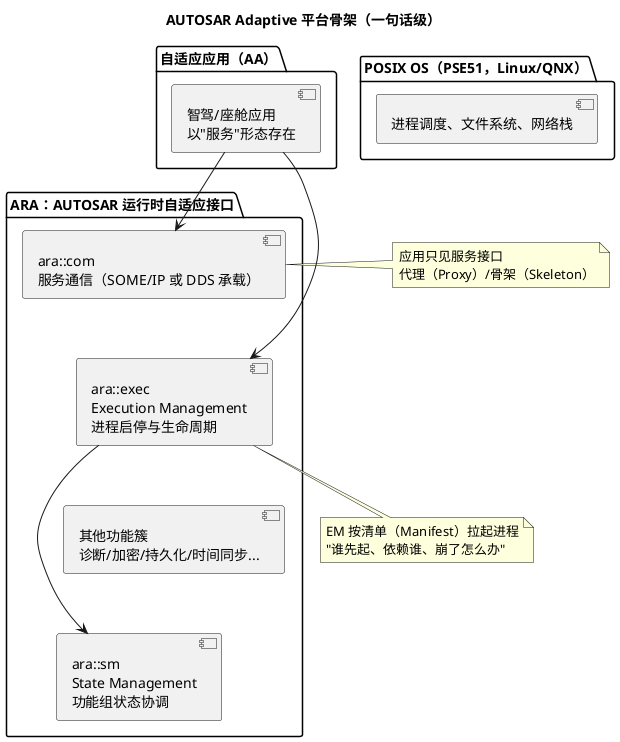

# 02-Classic-vs-Adaptive

> 一句话定位：说清 Classic Platform（CP）与 Adaptive Platform（AP）为什么是两座不同的城——AP 为高算力智驾/座舱而生，十条对比表 + ara 平台概念图，帮你建立"何时会碰到 AP"的雷达，点到即止不深入。
> 等级：L2→L3 ｜ 前置：[01-分层架构](01-分层架构.md)

## 太长不看

> - 人话直觉：CP 是"定时驱动、全部焊死"的专用控制器；AP 是"跑在 Linux 上、按服务组装"的车载电脑——一个像 PLC，一个像手机 App 平台。
> - 本篇解决：别人说"我们域控是 AP 的"时，你脑子里能立刻对上十个维度的差异，并知道哪些活儿会落到自己头上。
> - 赶时间记住：①CP=C+OSEK+RTE+静态配置，AP=C++14+POSIX+ara::com+动态部署；②AP 不是 CP 的升级版，是并存的两套平台；③国内量产主力仍是 CP，AP 集中在座舱/智驾域控；④两者靠网关/SOME/IP 桥接共存。

## 原理

### 为什么要有 AP：CP 的天花板

CP 假设的世界：一颗 MCU、硬实时、全部行为在编译期静态确定。这套假设在三个场景失效：

1. **算力**：智驾域控要跑感知/融合/规划，TC377/S32K 这类 MCU 根本扛不住，得上 SoC（A 核 + GPU/NPU）；
2. **动态性**：车机/OTA 世界需要"装应用、更新应用、服务随时上下线"，CP 的静态配置格格不入；
3. **生态**：这些领域的人来自 Linux/安卓世界，OSEK 与 C 是另一个星球的物种。

于是 AUTOSAR 在 2017 年发布 Adaptive Platform：**POSIX OS（PSE51）+ C++14 + 面向服务**，面向高性能计算，而 CP 继续守着硬实时车身/底盘/动力。

### AP 平台概念图

一句话记住三个核心：**ara::com 管通信**（服务发现、事件/方法/字段，类比 CP 的 RTE+Com 合体）、**Execution Management 管进程生死**（按 Manifest 启动应用）、**State Management 管功能组切换**（类比 CP 的 BswM，但管的是"一组进程"）。

## 详解

### CP vs AP 十条对比

| # | 维度 | Classic Platform | Adaptive Platform |
|---|---|---|---|
| 1 | 主语言 | C | C++14（含部分 C） |
| 2 | 操作系统 | OSEK/RTOS（AUTOSAR OS，静态任务） | POSIX PSE51（Linux/QNX），进程+线程 |
| 3 | 通信机制 | RTE 端口（S/R、C/S），编译期生成 | ara::com 服务（SOME/IP、DDS），服务发现可动态 |
| 4 | 部署方式 | 编译期静态配置，烧死后不变 | Manifest 声明式，支持安装/更新（OTA 友好） |
| 5 | 调度单位 | Task/Runnable，us~ms 级硬实时 | 进程/线程，软实时为主（也可配实时核） |
| 6 | 内存管理 | 静态分配为主，无 MMU 假设 | 虚拟内存、动态分配常态 |
| 7 | 硬件目标 | MCU（TC377/S32K 级），KB~MB 内存 | SoC（A 核+GPU/NPU），GB 级内存 |
| 8 | 典型应用 | 车身/底盘/动力/网关 ECU | 智驾域控、座舱、区域控制器高层 |
| 9 | 配置/描述语言 | ARXML（ECUC、系统描述） | ARXML（Manifest）+ CMake 等 |
| 10 | 与硬件关系 | MCAL 直贴寄存器 | 经 POSIX 驱动/硬件抽象，不再有 MCAL 概念 |

### 两平台如何共存

量产车里不是二选一，而是**分层协作**：CP 的车身/底盘 ECU 干硬实时活，AP 域控干算力活，之间用以太网 + SOME/IP 通信（CP 侧由 SoAd/EthIf + 生成代码桥到 SOME/IP）；典型智驾域控还是"CP 桥片/安全岛 + AP 大核"的异构布局——安全监控跑 CP，算法跑 AP。

### 何时你会接触 AP

- 做座舱/智驾域控集成、服务设计与 SOME/IP 矩阵评审时；
- 做 CP↔AP 网关/桥接配置（SoAd、SocketConnection、服务路由）时；
- 面试聊"你们平台演进方向"时。

本库主线仍是 CP（天天 tresos/ARXML 的主业），AP 相关内容只在涉及交互（如 SOME/IP 映射）时顺带展开——这是**点到即止篇**：建立雷达，不展开 ara 细节。

## 配置层/工程关联

- CP 工程师的工具链：EB tresos/DaVinci + ARXML（ECUC），见 [方法论与ARXML](../../2-L2进阶/方法论与ARXML/README.md)；
- AP 工程师的工具链：服务设计（ARXML Service Interface Deployment）→ 生成 ara::com 代理/骨架代码 → CMake 构建 → Manifest 打包部署——不再有 ECUC 容器树，配置重心从"容器与参数"移到"服务接口与部署描述"；
- 交界处的配置最容易被忽视：CP 侧 SoAd 的 SocketConnection、Tpdu 路由，要与 AP 侧 SOME/IP 服务端口一一对应，配置评审时两侧要对着查。

## 易错点与陷阱

1. **把 AP 当 CP 的下一代升级版**：不是替代关系，是并存分工——硬实时车身/底盘短期内仍是 CP 天下，"CP 会淘汰"是错误叙事。
2. **以为 AP 也用 MCAL**：AP 跑在 Linux/QNX 上，硬件访问走 POSIX 驱动，分层架构图（五层）是 CP 的专利，别把五层图套到 AP 上。
3. **把 RTE 与 ara::com 直接画等号**：方向对（都是应用的通信抽象），但 ara::com 是面向服务、支持动态发现，RTE 是静态端口——类比可以，等号不能画。
4. **混淆 AUTOSAR OS 与 POSIX**：AP 里没有 AUTOSAR OS 的 Task/Alarm/ScheduleTable 概念，调度是 Linux 进程调度 + EM 的生命周期管理。
5. **以为 AP 就等于 QNX/Linux 本身**：AP 是规范（功能簇+接口契约），OS 只是承载；拿裸 Linux 就说"我们是 AP"，缺 ara 层与 Manifest 约束不算。
6. **对比表背了就乱用**：AP 也能跑实时核（混合关键性系统），"AP 无实时"是简化说法，面试里要说"软实时为主、可配实时增强"。

## 面试高频题

1. CP 和 AP 的核心区别？各自的典型应用场景与硬件？
   答：CP=C+OSEK/RTOS+RTE+编译期静态配置，跑在 MCU（TC377/S32K 级）上做硬实时车身/底盘/动力；AP=C++14+POSIX(PSE51)+ara::com 面向服务，跑在 SoC（A 核+GPU/NPU）上做智驾/座舱等高算力软实时。两者是并存分工，不是升级替代。
2. ara::com 与 RTE 的通信模型差异？SOME/IP 在其中扮演什么角色？
   答：RTE 是编译期静态生成的端口通信（S/R、C/S），ara::com 是面向服务的动态模型（服务发现、事件/方法/字段，Proxy/Skeleton 代码），支持运行期上下线——类比可以、画等号不行。SOME/IP 是 ara::com 的主要承载协议（也可 DDS），负责把服务调用/事件序列化到车载以太网上。
3. AP 的 Execution Management 与 State Management 分别管什么？类比 CP 的哪个模块？
   答：EM 按 Manifest 声明拉起/监控进程生命周期（谁先起、依赖谁、崩了怎么办），类比 CP 的 EcuM+Os 对启动的静态安排；SM 协调功能组（Function Group）状态切换，类比 CP 的 BswM——但管理对象从"模式"变成了"一组进程"。
4. 一个量产智驾项目里 CP 和 AP 如何分工与通信？
   答：典型异构布局——CP 做安全岛/桥片（硬实时监控、CAN 侧网关），AP 大核跑感知/融合/规划。通信走车载以太网 + SOME/IP：CP 侧由 SoAd/EthIf 按服务路由配置桥接，两侧 SocketConnection/端口映射要一一对应、联调前先对齐服务部署描述（ARXML）。

## 延伸

- [01-分层架构](01-分层架构.md)：CP 五层图是本篇所有对比的"对照组"母图
- [03-版本演进](03-版本演进.md)：AP 从 17-03 起步、随 R19-11 走向成熟的版本线
- [通讯服务栈](../../2-L2进阶/通讯服务栈/README.md)：CP 侧 SOME/IP 桥接的现场（SoAd/PduR 配置）
- [AUTOSAR第一课-一座城的分区图](../../00-入门导读/01-AUTOSAR第一课-一座城的分区图.md)：CP 这座城的全景，AP 是另一座城
- 工程深入场景：域控项目中你负责 CP 安全岛侧，AP 大核同事找你联调服务接口——先对齐服务部署描述（ARXML）与 Socket 映射，再谈时序；此时本篇对比表就是双方的"翻译词典"
