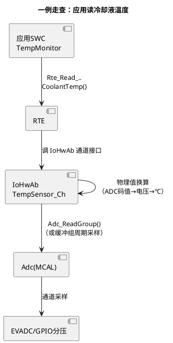

# 01-IoHwAb设计

> 一句话定位：ASW 与 MCAL 之间按"传感器/执行器物理通道"组织的桥——应用 SWC 说"读冷却液温度"，IoHwAb 负责把这句话翻译成"读 Adc 通道 3、按分压曲线换算成 ℃"；换算错了、通道映射错了，功能层永远查不出来，所以这一层的配置纪律要求最高。
> 等级：L2 ｜ 前置：[07 区导读](../../00-入门导读/01-AUTOSAR第一课-一座城的分区图.md)、[分层架构](../../1-L1基础/架构总览/01-分层架构.md)

## 原理

### IoHwAb 桥接位置（component）



数据的三段变形：**硬件给出电压 → MCAL 给出码值（0~4095）→ IoHwAb 给出物理值（-40~150℃）**。应用 SWC 从头到尾不碰码值——这是分层架构在 IO 方向的落点（总论见 [分层架构](../../1-L1基础/架构总览/01-分层架构.md)，驱动侧视角见 [寄存器到 IoHwAb 分层](../../../04-MCAL与外设驱动/1-L1基础/驱动分层思想/01-寄存器到IoHwAb分层.md)）。

### 换算公式直觉（以线性传感器为例）

12 位 ADC、5V 参考、传感器 0.5V~4.5V 对应 -40℃~150℃：

```text
电压  V   = adc / 4095 × 5.0
温度  T   = -40 + (V - 0.5) / (4.5 - 0.5) × (150 - (-40))
```

三个工程细节藏在公式外：**开路/短路检测**（V<0.5V 或 >4.5V → 报传感器故障，不是外推到 -400℃）；**非线性传感器查表**（NTC 温度/油门踏板常是 R-T 表，码值→电阻→查表插值）；**滤波**（一阶低通/滑动平均去毛刺，放 IoHwAb 里让所有应用共享一份滤波后的值）。

### 生成 vs 手写的选择

| 维度 | 工具生成（如 DaVinci） | 手写 C |
|---|---|---|
| 换算能力 | 线性系数、简单表 | 任意（查表/插值/状态机/诊断钩子） |
| 一致性保障 | 端口-通道映射由配置闭环 | 靠评审与静态检查 |
| 改硬件成本 | 改映射重生成 | 改代码重测 |
| 适用 | 大批量常规 IO（开关/电位计/简单传感器） | 复杂换算、带故障诊断语义的通道、特殊外设 |

常见折中：**框架生成 + 换算函数手写**——生成的只有"哪个语义端口绑哪个 MCAL 通道"这层壳，换算逻辑是应用代码挂进去的回调。

### 与 CDD 的边界

IoHwAb 仍然踩在 MCAL 标准接口之上（Adc/Pwm/Dio/Icu/Spi）；当一块硬件**没有也不该有** MCAL 驱动（专用协议芯片、需要微秒级时序的并行操控、或 MCAL 驱动根本不覆盖的片上外设），才用 CDD 绕过分层直接操硬件——判断标准与适用场景见 [CDD 定位与边界](../../../04-MCAL与外设驱动/2-L2进阶/CDD设计方法论/01-CDD定位与边界.md)。一句话：**换算复杂留 IoHwAb，接口非标才 CDD**。

## 详解

**为什么按"物理通道"而不是按"MCAL 模块"组织**：若按模块组织（IoHwAb_Adc/IoHwAb_Pwm），一个执行器（如 EGR 阀：PWM 输出+位置反馈 ADC+故障 DIO）会被撕到三个文件里；按物理通道组织（EGRValve 一个单元，内含输出、反馈、诊断），与功能安全里的"执行器监控"结构天然对齐。这也是 IoHwAb 与 [01-NvM块管理](../内存栈/01-NvM块管理.md) 同款的设计哲学：**对外按语义单元，对内才按技术分层**。

**输出方向的对称结构**：执行器通道把物理值翻译回硬件——应用写 35% 占空比 → IoHwAb 换算成 Pwm 周期计数值、处理极性（高有效/低有效）、下电安全态（进 LimpHome 时输出固定安全值）。

**采样策略在哪定**：周期采样（Adc 缓冲组+定时触发）还是按需采样（Adc_ReadGroup），配置在 MCAL 侧（见 [Adc 原理与转换链路](../../../04-MCAL与外设驱动/2-L2进阶/Adc/01-原理与转换链路.md)）；IoHwAb 只决定"缓存哪份、何时换算"。多应用读同一通道时，换算做一次、结果共享——避免各 SWC 各算各的导致同一传感器读出两个温度。

**标定视角**：换算系数（增益/偏移/查表）常做成标定量（A2L 可见），产线/EOL 可以校——IoHwAb 是标定参数最密集的层之一，设计时给每个换算系数留标定接口。

## 配置层

| 配置项 | 含义 | 典型值 | 易错点 |
|---|---|---|---|
| IoHwAbSignal↔AdcChannel/Group | 语义信号绑采样通道 | 每 AI 信号一条 | 绑错通道→读的是别的传感器，换算全对也白搭 |
| IoHwAbSignal↔PwmChannel | 语义输出绑 PWM 通道 | 每 AO 信号一条 | 极性/周期与执行器驱动要求不符→反向动作 |
| IoHwAbSignal↔DioChannel/Port | 开关量绑定 | DI/DO 每条 | 端口方向（输入/输出）在 Port 配置漏改→读悬空 |
| 换算参数（增益/偏移/查表引用） | 码值↔物理值 | 按传感器手册 | 手册抄错单位（mV/V、kΩ/Ω）是高频事故 |
| 故障阈值（开路/短路窗） | 诊断判定边界 | 略超量程两端 | 阈值贴着量程边→正常波动误报故障 |
| 滤波配置（深度/系数） | 去毛刺 | 一阶低通 α=0.2 起 | 滤太狠→快速真实变化（碰撞信号类）被吃掉 |
| 采样触发（绑定 Adc Group 周期） | 数据新鲜度 | 10~20ms | 新鲜度要求高的信号进了慢组 |

## 易错点与陷阱

1. **通道映射错位（最贵的事故）**：现象是功能层读到"合理的错误值"——油压显示水温范围的数据，逻辑全对但物理量张冠李戴；原因是换通道/改板后映射表没同步；对策：映射必须工具生成+硬件在环逐通道激励验证（注入已知电压核对读数）。
2. **换算单位抄错**：现象是读数整体偏移/斜率异常但曲线形状对；原因是传感器手册单位（mV vs V）或满量程抄错；对策：换算参数做成标定量，台架两点校准（0% 与 100% 注入）兜住文档错误。
3. **无故障窗设计**：现象是传感器断线后读数外推到物理不可能的值，功能层没拦住；原因是换算函数没有开路/短路边界判定；对策：超量程区间返回"传感器无效"专用值并置 DTC，功能层按失效处理（对照 [01-Com](../通讯服务栈/01-Com.md) 的失效值机制）。
4. **滤波吃掉真实瞬态**：现象是快速变化信号（踏板急踩）响应迟钝、控制环震荡；原因是一刀切滤波系数；对策：按信号动态特性分级——缓变信号重滤、瞬态信号轻滤或不滤。
5. **执行器无安全态**：现象是进 LimpHome 或复位瞬间执行器停在随机占空比；原因是 IoHwAb 输出通道没定义失效安全值；对策：每个输出通道配"失效→安全态"逻辑（如 PWM=0 或专用 DIO 态），下电序列里主动落安全态。
6. **绕过分层直操寄存器**：现象是换芯片移植时 IoHwAb 里藏的裸寄存器代码爆雷；原因是嫌 MCAL 接口绕直接写寄存器；对策：该走 CDD 的按 [CDD 定位与边界](../../../04-MCAL与外设驱动/2-L2进阶/CDD设计方法论/01-CDD定位与边界.md) 正规化，评审禁 IoHwAb 出现寄存器名。

## 面试高频题

- **Q：IoHwAb 在分层架构里的位置和职责？**
  A：位于 ECU 抽象层（RTE 之下、MCAL 之上），按传感器/执行器物理通道组织：把 SWC 的语义读写（读温度/写占空比）翻译成 MCAL 通道操作 + 物理值换算 + 故障窗判定 + 滤波。它是 ASW 唯一合法的 IO 入口，换芯片只改它和 MCAL。
- **Q：为什么换算放 IoHwAb 而不是应用 SWC？**
  A：换算是硬件相关的（传感器曲线、分压网络、板级参数），属于 ECU 抽象层职责；放应用会把硬件细节漏进功能层，换板/换传感器要动应用。且多应用共享同一通道时，集中换算保证一致性（同一个传感器只有一个真值）。
- **Q：什么时候该用 CDD 而不是 IoHwAb？**
  A：硬件接口非标（专用协议芯片、MCAL 无对应驱动）或性能要求超出 MCAL 接口能力（微秒级并行时序）时用 CDD 直接对接硬件；仅是换算复杂、诊断语义复杂，留在 IoHwAb 内部实现即可。
- **Q：设计一个 ADC 温度通道要考虑哪些失效？**
  A：开路（V→0 或上拉满量程）、对地短路、对电源短路、参考电压漂移——对应换算前先做窗口判定（V<0.5V/＞4.5V 判故障），故障时返回无效值+置 DTC，功能层走降级；再叠加滤波去毛刺与采样新鲜度检查。

## 延伸

- [分层架构](../../1-L1基础/架构总览/01-分层架构.md)：IoHwAb 所处的整体分层框架；
- [寄存器到 IoHwAb 分层](../../../04-MCAL与外设驱动/1-L1基础/驱动分层思想/01-寄存器到IoHwAb分层.md)：从寄存器到抽象层的演进视角；
- [Adc 原理与转换链路](../../../04-MCAL与外设驱动/2-L2进阶/Adc/01-原理与转换链路.md)：IoHwAb 之下的采样链；
- [CDD 定位与边界](../../../04-MCAL与外设驱动/2-L2进阶/CDD设计方法论/01-CDD定位与边界.md)：何时绕过分层；
- [01-Com](../通讯服务栈/01-Com.md)：传感器无效值向上传播后的信号失效机制。
