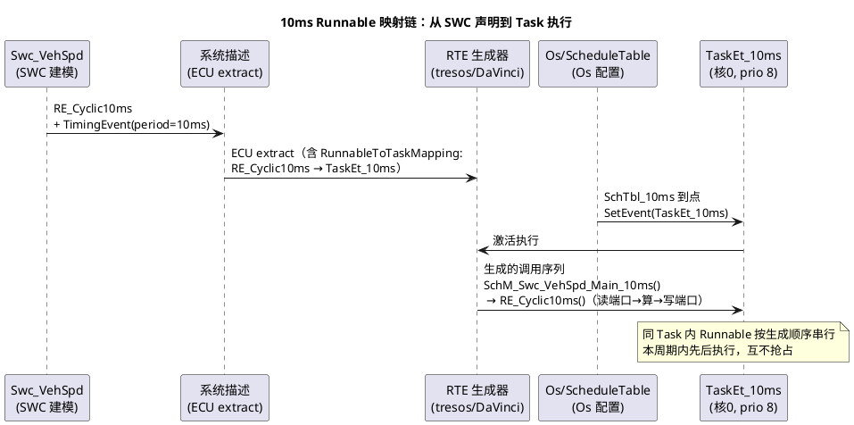

# 02-Runnable到Task映射

> 一句话定位：讲清 RTE 如何把 SWC 的 Runnable 映射进 Os Task——周期/事件/模式切换三类触发、映射配置长什么样、OS-Application 与核心绑定、同 Task 内顺序执行语义，最后完整走查一个 10ms Runnable 从 SWC 到 Task 的映射链。
> 等级：L2 ｜ 前置：[调度表](01-调度表.md)

[上篇](01-调度表.md) 讲了 Os 侧：调度表到点唤醒 Task。本篇补上另一头：**Task 身体里的 Runnable 从哪来、按什么顺序跑**——这是 RTE 生成器最核心的工作，也是"我的代码为什么 10ms 才跑一次/为什么跑在核 1"这类问题的答案所在。

## 原理

### Runnable 是什么，为什么必须被映射

Runnable 是 SWC 内部可被调度的最小函数单位（`xxx runnable entity`），但它自己没有"腿"——不映射进 Task 就永远没人调用。映射的本质：**给每个 Runnable 的触发事件指定一个 Os Task 作为宿主**，由 RTE 生成代码在 Task 体内按序调用。

### 三类触发事件，三种映射规则

| 触发类型 | RTE Event | 映射规则直觉 | 典型例子 |
|---|---|---|---|
| 周期触发 | TimingEvent（period=10ms） | 挂到周期匹配的 Task；周期不一致会报错/警告 | 10ms 采样滤波 |
| 数据触发 | DataReceivedEvent / DataSendCompleted / OperationInvoked... | 挂到该通信回调可达的 Task（常是 BSW 事件任务或专设 Task） | 收到报文触发解析 |
| 模式切换触发 | ModeSwitchEvent（ENTRY/EXIT/TRANSITION） | 挂到模式管理相关 Task（常由 BswM/RTE 模式机驱动）；有同步/异步调用语义之分 | 进入睡眠模式前收尾 |

周期触发是绝对主力：**TimingEvent 的 period 必须与宿主 Task 的实际触发周期一致**（映射进 10ms Task 的 Runnable period 就得是 10ms）——RTE 生成时校验，周期错配是最常见的配置报错。

### 映射表长什么样（配置直觉）

在系统描述（ECU extract / RTE 配置）里，映射信息大致长这样（tresos RTE/ISOLAR 中以容器与引用呈现，此处为直觉化伪结构）：

```
Rte
└─ 映射关系的实质（三段引用对起来）
   ① SWC 的 RunnableEntity（如 /Swc_VehSpd/Rte/PP_VehSpd/RE_Cyclic10ms）
   ② 触发事件：TimingEvent(period=10ms) / DataReceivedEvent(on PduR_xxx) ...
   ③ 事件 → OsTask（如 /Os/OS/TaskEt_10ms）        ← 这一步就是"映射"
   生效：Rte 生成代码在 TaskEt_10ms 的函数体里生成
         对 RE_Cyclic10ms 的调用（经 SchM 生成的主函数调度）
```

工具里你操作的往往就是一张"Runnable ↔ Event ↔ Task"三列表：选中 runnable，指定它由哪个事件触发、落到哪个 Task——底层即上面三段引用。

### OS-Application、核心绑定与同 Task 顺序语义

- **OS-Application 归属**：每个 Os Task 属于一个 OS-Application（可信/不可信应用域），Runnable 随宿主 Task 落进该域；域的划分常按功能组（安全相关/非安全相关），映射时别把 ASIL-D 的 Runnable 混进 QM 域的 Task；
- **核心绑定**：TC377 三核平台，Os Task 按核划分（每核一个 Os 实例），Runnable 映射到哪个 Task 就跑在哪个核——跨核通信自动走 IOC（RTE 生成核间代码），代价是延迟与占用 SpinLock 风险；
- **同 Task 内顺序执行语义**：一个 Task 的一次激活中，映射进来的多个 Runnable **按 RTE 生成顺序串行执行**，中间不互相抢占——顺序由映射配置（常显式指定 position/顺序约束）决定；先发的信号先处理、后发的排队，数据一致性靠"同 Task 串行"天然保证；
- 排序工程直觉：把"生产者放前、消费者放后"（如采样 Runnable 在滤波 Runnable 前），可在一个周期内完成整链，少等一个周期。

### 典型走查：一个 10ms Runnable 的完整映射链



链条口诀：**SWC 声明 runnable+事件 → 系统描述里做映射 → RTE 生成调用序列 → 调度表到点唤醒 Task → Task 体内按序执行**。任何一环断了（没建事件、没映射、Task 没被任何表/闹钟唤醒、核没使能），现象都是"这个 runnable 从来不跑"。

## 详解

### SchM 是什么角色

SchM（Schedule Manager）不是独立 BSW 模块，而是**每个 SWC/BSW 模块配套的调度粘合层**（生成的 `SchM_<Mod>.c`）：把模块的 MainFunction/runnable 按配置包成"主函数"，挂进对应 Task。BSW 模块（Com/PduR/CanSM...）的 MainFunction 映射与 SWC runnable 映射遵循同一套思想——工程上常统称"SchM 映射"。这也是本目录把"SchM 与调度"合并讲的原因：Os 侧（上篇）+ RTE/SchM 侧（本篇）合起来才是完整调度图景。

### 常见问题三连的自查路径

1. **"为什么不跑"**：查链条五环——事件建了吗→映射了吗→Task 被谁唤醒（表/闹钟）→核/OS-Application 使能了吗→（数据触发的）触发源在跑吗；
2. **"为什么跑这么晚（抖动大）"：**同 Task 前面的 Runnable 太重/优先级被压/同核干扰——用 trace 看 Task 激活到 runnable 实际执行的间隔；
3. **"为什么跑在核 1"**：映射指向的 Task 在核 1 的 Os 实例里——映射决定一切，问"哪个 Task"别问"哪行代码"。

### 优先级与周期的搭配直觉

- 周期越短的任务优先级越高（10ms > 20ms > 100ms），同周期内按 deadline 紧迫度排；
- 别把长活（NvM 写队列处理）塞进短周期 Task——要么独立低优先级 Task，要么移到 100ms；
- 数据触发的 Runnable 若对时延敏感，配专用高优先级小任务，别挤在周期大杂烩里。

## 配置层/工程关联

- 工具分工直觉：DaVinci Developer/ISOLAR 建模 SWC 与映射，tresos 承接 ECU extract 生成 RTE；映射变更后重新生成，`Rte.c`/`SchM_*.c` 的 diff 要进评审（方法见 [04-diff-review技巧](../方法论与ARXML/04-diff-review技巧.md)）；
- 生成产物自查：打开 `SchM_<Swc>_Main_10ms` 之类函数，核对你配置的执行顺序——"配置说 A 在 B 前，生成代码就得 A 在 B 前"；
- 多核工程（TC377）：RTE 自动为跨核端口生成 IOC/Send-Receive 通道与 SpinLock，映射评审要额外看核间数据流与锁粒度（详见 3-L3高级 的多核集成专题）；
- 安全相关项目：ASIL 域划分 + Runnable 映射表一起评审，禁止跨域混挂；WdgM 监督的 checkpoint 也要落到被监督的 runnable 上。

## 易错点与陷阱

1. **TimingEvent 周期与宿主 Task 周期不一致**：轻则生成报错，重则生成器按 Task 周期跑（行为悄悄变了）——映射完必核对周期一致。
2. **把所有 Runnable 塞进一个 Task**：省事但顺序耦合+最坏执行时间叠加；任何一个 Runnable 变慢，全家跟着抖——按功能组拆 Task。
3. **以为同 Task 内 Runnable 会并行**：同一次激活内严格串行，"我以为先跑的其实在排队"是周期性 bug 高发区；顺序要么显式配置，要么读生成代码确认。
4. **忽略模式切换 runnable 的阻塞语义**：ENTRY/EXIT 模式切换事件默认要求被调方执行完才继续（同步语义），映射进的任务若迟迟不被调度，BswM 模式切换会卡住。
5. **跨核映射没算代价**：Runnable 与其数据源不在同核，每次读写都走 IOC（核间通信+锁），高频小数据会放大延迟与总线占用——"数据和算它的 runnable 同核"是默认原则。
6. **改了映射不重新生成/不评审生成物**：映射是配置不是代码，但生效全靠生成——忘了生成或生成失败被无视，等于没改。

## 面试高频题

1. RTE 如何把 Runnable 映射进 Task？三类触发事件分别怎么落位？
   答：映射本质是"Runnable 的触发事件 → Os Task"的引用：周期触发（TimingEvent）挂到周期一致的 Task（错配会被生成器校验拦下）；数据触发（DataReceivedEvent 等）挂到通信回调可达的 Task（BSW 事件任务或专设任务）；模式切换触发（ModeSwitchEvent）挂到模式管理相关 Task，由 BswM/RTE 模式机驱动。RTE 生成代码在 Task 体内按序调用各 Runnable（经 SchM 主函数）。
2. 同一个 Task 里多个 Runnable 的执行顺序由什么决定？有什么工程讲究？
   答：由映射配置显式指定的顺序（RTE 生成顺序）决定，同一次激活内严格串行、互不抢占。讲究：生产者放前、消费者放后，一个周期内跑完整链少等一拍；重活别塞短周期 Task；ASIL 域的 Runnable 不能混挂进 QM 域 Task。
3. Runnable 映射到另一个核的 Task 会发生什么？IOC 起什么作用？
   答：Runnable 跑在其宿主 Task 所在核，跨核端口通信由 RTE 自动生成 IOC 通道（核间通信+SpinLock）承载——代价是访问延迟与锁占用，高频小数据会被放大。默认原则："数据和算它的 Runnable 同核"。
4. 一个 Runnable 从来不执行，你的排查步骤？
   答：沿五环查链条：①事件建了吗（TimingEvent/DataReceivedEvent）→②映射配了吗（RunnableToTaskMapping）→③宿主 Task 被谁唤醒（调度表/Alarm 到点了吗）→④核与 OS-Application 使能了吗→⑤数据触发的触发源在跑吗。任何一环断，现象都是"从来不跑"。

## 延伸

- [调度表](01-调度表.md)：Task 被唤醒的那一侧——完整调度图景的另一半
- [分层架构](../../1-L1基础/架构总览/01-分层架构.md)：RTE 在五层中的角色与"应用不碰 OS"的隔离原则
- [ECU配置结构](../方法论与ARXML/01-ECU配置结构.md)：映射关系作为配置树一部分的来龙去脉
- [系统服务栈](../系统服务栈/README.md)：BswM/EcuM 的模式与生命周期如何驱动模式切换类映射
- [ARXML手读](../方法论与ARXML/03-ARXML手读.md)：在系统描述里亲手找到 RunnableToTask 映射的引用链
