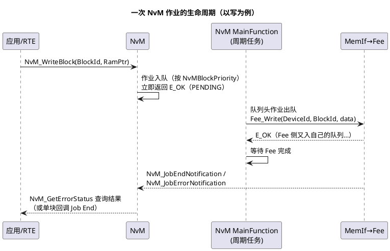

# 01-NvM块管理

> 一句话定位：NVRAM 管理器的"户口系统"——应用要存的一切数据（配置/标定/诊断快照）都被登记成一个个 NvM 块，块的类型、CRC、优先级、RAM 镜像方式决定了它在掉电、坏块、掉电窗口下能不能活下来。
> 等级：L2 ｜ 前置：[07 区导读](../../00-入门导读/01-AUTOSAR第一课-一座城的分区图.md)

## 原理

### NvM Job 异步处理 sequence

核心直觉：**NvM 的 API 都是"递交"，不是"完成"**——调用返回 E_OK 只代表作业进了队列；真正的读写在 MainFunction 的周期节拍里逐个作业推进，应用要么轮询 `NvM_GetErrorStatus`，要么注册单块回调。跨层全程异步，这决定了"写完没"永远是一个要显式确认的问题。

### 块：应用数据单元的户口

| 数据类别 | 典型内容 | 块特征 | 建议类型 |
|---|---|---|---|
| 配置数据 | 车型编码、用户设置（座椅记忆/收音机） | 上电读、偶尔写 | Native 或 Redundant |
| 标定/工程数据 | VIN、下线写入的参数 | 一次性写入、绝不能错 | Redundant + CRC |
| 诊断运行数据 | DTC 快照、里程计数 | 频繁写、可容忍个别失败 | Native + CRC（或 Dataset） |
| 事件计数/里程 | 磨损计数、运行小时 | 高频写、磨损敏感 | Dataset 或细粒度小块 |

### 三种块类型（选择即容错策略）

| 类型 | 份数 | 读时择优 | 适用 |
|---|---|---|---|
| Native | 1 份 | 无 | 可重取数据、掉电丢一版无碍 |
| Redundant | 2 份（主+副本） | 有 | 一份损坏仍可用，关键数据标配 |
| Dataset | N 份（按索引选） | 按 NvMDatasetSelectionIdx | 多套参数（如多车型配置）、轮换写降磨损 |

### RAM 镜像：显式 vs 隐式

| 维度 | 显式同步（Explicit） | 隐式同步（Implicit） |
|---|---|---|
| 谁触发落盘 | 应用调 NvM_WriteBlock | NvM 周期对比 RAM 与 NV，变了才写 |
| 数据可见性 | 应用独占 RAM，写期间 NvM 内部拷 shadow | NvM 与应用共享 RAM（永久映射） |
| 代价 | 多一份 shadow RAM | 写时机不可控、必须配 CRC 才可靠比对 |
| 典型场景 | 事件驱动（保存设置） | 大量"偶尔变"的数据统一托管 |

## 详解

**优先级与排队直觉**：NvM 内部维护多个作业队列（高/常规/低），`NvMBlockPriority`（0 最高）决定块入哪条；MainFunction 每周期按优先级取作业。直觉：**下电前必须写完的块给高优先级；高频写的大块给低优先级**，别让里程类数据把关键块的队列堵住。

**ReadAll/WriteAll 是批量通道**：上电时 EcuM 发起 `NvM_ReadAll`（把配置了 ReadAll 标志的块批量读入 RAM 镜像），下电前 `NvM_WriteAll`（把 WriteAll 标志的块批量落盘）——这是系统级时序的一环，见 [EcuM 上下电时序](../系统服务栈/EcuM/02-上下电时序.md)。单块的 NvM_ReadBlock/NvM_WriteBlock 是运行期补充通道。

**BlockId 的两个世界**：配置里的 BlockId 是 NvM 内部编号（0~max），另有 NvM_BlockIdType 供 API 使用；工具生成保证 SWC 看到的句柄一致。手写接口层时把 MemIf 的 DeviceBlockNumber 与 NvM BlockId 混着用是最经典的一类配置事故。

**为什么每个块都要 RAM 镜像**：Flash/Eeprom 写入以页/扇区为单位且擦写慢，NvM 的模型是"RAM 是工作副本、NV 是持久副本"——所有读写先对 RAM，持久化由作业机制搬运。没有镜像的块（直接给 NV 缓冲指针）仅限特殊场景（VRAM 概念），常规配置一律配镜像。

## 配置层

| 配置项 | 含义 | 典型值 | 易错点 |
|---|---|---|---|
| NvMBlockUseCrc | 块是否附 CRC 校验 | 关键数据 true | 隐式同步不开 CRC→变化检测失真 |
| NvMMaxNumOfWriteRetries | 写失败重试次数 | 2~3 | 0→一次瞬时失败即报错；过大→下电序列拖长 |
| NvMBlockPriority | 作业优先级 | 0（高）~255（低） | 全 0→队列退化成 FIFO，关键块被堵 |
| NvMSelectBlockForReadAll/WriteAll | 是否进批量通道 | 常用块 true | 下电写漏配→运行时写了但断电即丢 |
| NvMBlockMaxDataSets / SelectionBits | Dataset 份数与索引位宽 | 按需 | 索引越界→读到错误数据集 |
| NvMBlockUseSyncCompat / 同步方式 | 显式/隐式同步选择 | 按数据特性 | 两者语义记反→写丢/写重 |
| RAM 镜像（NvMRamBlockDataAddress） | 镜像地址或永久 RAM | 显式给临时、隐式给永久 | 指针指向栈/临时区→异步写入时机踩空 |
| NvMMainFunctionPeriod | 作业推进节拍 | 5~10ms | 太长→上电 ReadAll 拖慢 ECU 起动 |

## 易错点与陷阱

1. **"写完了"的错觉**：现象是调完 NvM_WriteBlock 返回 E_OK 就断电，重启数据是旧值；原因是 API 只代表入队，作业还没被 MainFunction 推进到 Flash；对策：下电前显式等 `NvM_GetErrorStatus` 变 IDLE（或全部块作业清空）才允许 KL30 断，见 [02-写队列与显隐同步](02-写队列与显隐同步.md) 的掉电窗口分析。
2. **BlockId 与 DeviceBlockNumber 错位**：现象是块 A 的数据写进了块 B 的 NV 区；原因是接口层手写映射表时对不上 MemIf/Fee 的编号；对策：映射关系必须由工具生成，评审只看 ARXML 不看手写数组。
3. **优先级全默认导致关键块延迟**：现象是下电序列里 NvM_WriteAll 超时、被 EcuM 砍断；原因是高频大块（如整页日志）与关键小块同优先级排队；对策：日志类降优先级或移出 WriteAll 通道。
4. **隐式同步无 CRC 丢更新**：现象是 RAM 改了但 NV 没写；原因是隐式同步靠比对检测变化，无 CRC 时比对粒度失真；对策：隐式同步必配 CRC（也服务于完整性，见 [03-冗余与CRC](03-冗余与CRC.md)）。
5. **Dataset 索引未初始化就读**：现象是首上电读到全 FF 或错误数据集；原因是 NvMDatasetSelectionIdx 没有在 ReadAll 前设好默认值；对策：初始化序列显式设索引，块首读校验 CRC。
6. **RAM 镜像指向临时缓冲**：现象是偶发写入旧数据；原因是镜像指针指到栈变量/复用缓冲，MainFunction 异步取数时内容已被改写；对策：镜像指向静态区，显式同步模式下写期间应用不改 RAM。

## 面试高频题

- **Q：NvM_WriteBlock 调用返回后数据就掉电安全了吗？**
  A：没有。返回 E_OK 只表示作业入队；落盘要经 MainFunction→MemIf→Fee→Fls 全链异步推进。掉电安全要等 NvM_GetErrorStatus 回 IDLE（或收到块完成回调），下电序列必须预留这个窗口。
- **Q：三种块类型怎么选？**
  A：Native 单份，适合可重取/丢失无碍的数据；Redundant 主备两份读时择优，关键标定与 VIN 类数据标配；Dataset 多套按索引切换，适合多配置集与高频轮换写降磨损。选择本质是在 RAM/Flash 开销与容错需求间做权衡。
- **Q：显式与隐式同步的区别？**
  A：显式：应用独占 RAM 镜像，主动调 NvM_WriteBlock 触发，写时序可控；隐式：NvM 与应用共享永久 RAM，周期比对（依赖 CRC）发现变化自动写，省调用但写时机不可控。高频变化数据用隐式+高优先级会造成持续 Flash 流量，慎用。
- **Q：NvM_ReadAll/WriteAll 与单块 API 什么关系？**
  A：ReadAll/WriteAll 是系统级批量通道（EcuM 上电/下电时序调用），按块的 ReadAll/WriteAll 标志圈定成员；单块 API 是运行期事件驱动的补充。两者共用同一套作业队列与优先级机制。

## 延伸

- [02-写队列与显隐同步](02-写队列与显隐同步.md)：写链全链时序与掉电窗口定量分析；
- [03-冗余与CRC](03-冗余与CRC.md)：块类型与 CRC 的容错细节；
- [04-MemIf-Fee-Ea](04-MemIf-Fee-Ea.md)：块作业在 NvM 之下如何落到物理介质；
- [与 NvM 链路](../../../04-MCAL与外设驱动/2-L2进阶/Fls与Fee/03-与NvM链路.md)：04 区视角的同一链路；
- [EcuM 上下电时序](../系统服务栈/EcuM/02-上下电时序.md)：ReadAll/WriteAll 在系统时序中的位置。
