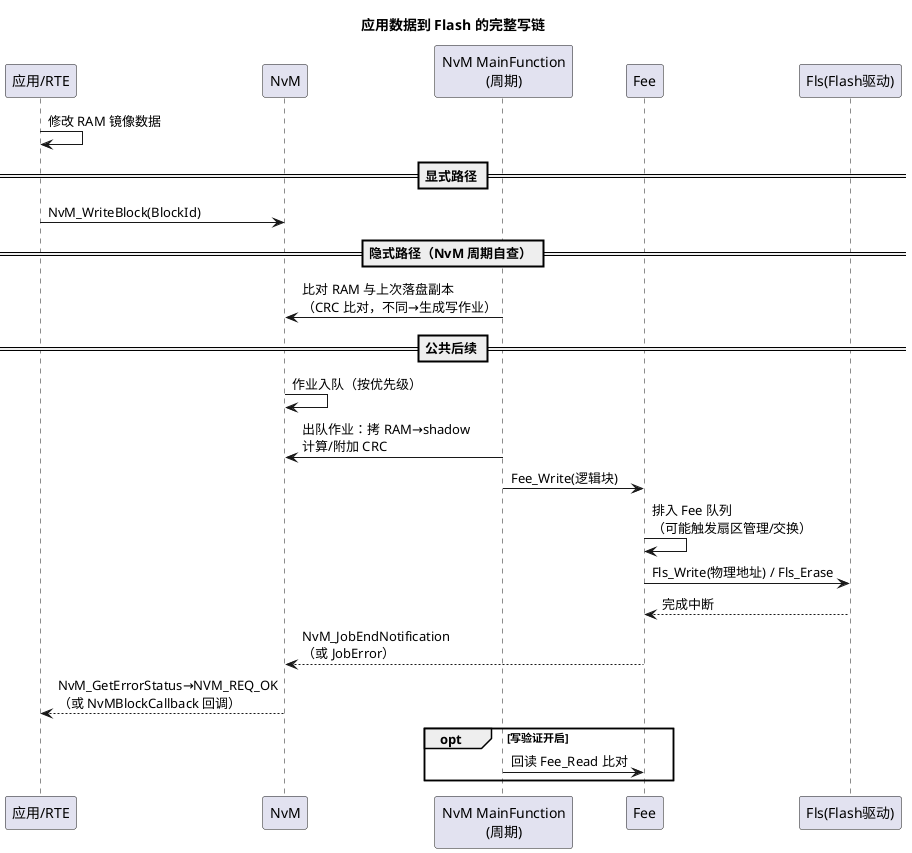

# 02-写队列与显隐同步

> 一句话定位：把"应用改了 RAM"到"Flash 里真的换了字节"之间的完整链条讲透——写作业在队列里怎么排队、显式/隐式同步各承担什么、写验证与重试兜底什么，以及 KL30 掉电窗口必须留多大才算安全。
> 等级：L2 ｜ 前置：[01-NvM块管理](01-NvM块管理.md)

## 原理

### 写链全貌 sequence

直觉：写延迟 = **队列等待 + NvM 节拍 + Fee 调度 + Flash 物理（写/擦）+（可选）回读**。五个环节里 Flash 擦除是量级最大的变量（单扇区擦除几十 ms 到几百 ms，Fee 扇区交换时集中爆发）。

### 显式 vs 隐式同步（工程对比）

| 维度 | 显式同步 | 隐式同步 |
|---|---|---|
| 触发 | 应用显式调 NvM_WriteBlock | NvM 周期比对 RAM 与落盘副本，变了才写 |
| 写时机 | 应用掌控（如"保存设置"按键） | 不可控，变化后最多等一个检查周期 |
| 数据一致性 | 写时拷 shadow，应用随后可继续改 RAM | 共享 RAM，写入搬运期间应用改数据=脏写 |
| Flash 流量 | 事件驱动，稀疏 | 高频变化数据→持续写流量，磨损放大 |
| 掉电风险窗口 | 可控（写完再断电） | 最后一个检查周期内的变化可能丢 |
| 典型场景 | 用户设置保存、标定写入、DTC 存储 | 大量低频变化的托管数据（配合 CRC） |

选择口诀：**时机重要用显式，省心托管用隐式；高频数据别隐式（磨损），一致性要紧必 shadow**。

### 写验证与重试

- **Write Verification（NvMBlockUseWriteVerification）**：写完成后再回读比对——Flash 的写入偶发位翻转/半写入（尤其掉电瞬间）靠它兜住，代价是写耗时近乎翻倍。关键标定块建议开，高频数据块慎开。
- **写重试（NvMMaxNumOfWriteRetries）**：写/验证失败自动重写 N 次仍败则报 NVM_REQ_NOT_OK；读侧对应 NvMMaxNumOfReadRetries。重试是拿时间换可靠性，下电序列预算必须含它。
- **状态反馈**：作业结果经 `NvM_GetErrorStatus` 查询，取值为 `NvM_RequestResultType` 枚举——`NVM_REQ_OK / NVM_REQ_PENDING / NVM_REQ_NOT_OK / NVM_REQ_INTEGRITY_FAILED（CRC坏）/ NVM_REQ_CANCELED`；或走块级回调 `NvMBlockCallback` 主动通知。**INTEGRITY_FAILED 是"读到坏数据"的专属信号**，排障时先分清它和 NOT_OK（操作失败）。

## 详解

**掉电窗口的定量直觉**：设 KL30 断电后 DCDC 还能维持 T_hold（典型 50~200ms，看硬件），写链最坏耗时 T_write（含队列+擦除爆发+重试），安全条件是 **T_write + 裕量 ≤ T_hold**。三个工程后果：EcuM 的 NvM_WriteAll 超时（如 EcuMNvramWriteAllTimeout）必须小于 T_hold；扇区交换这类长操作不该集中在下电时触发；重试次数 × 单次写耗时要计入预算。用示波器量"KL30 掉电→复位脚有效"的真实 T_hold 是每个项目早该做的一次性校准。

**隐式同步的脏写窗口**：隐式模式下 NvM 搬运 RAM 时应用正在写同一块——读到的可能是半新半旧数据（torn write）。SWS 允许靠写保护（NvM_SetRamBlockProtection）或把高频数据挪到显式路径规避。现象特征：NV 里出现"从没设置过的组合值"。

**WriteAll 不是全写**：NvM_WriteAll 只处理配置了 WriteAll 标志且（隐式模式下）比对有变化的块——别指望它把所有 RAM 都刷一遍；运行期单块写过的块，其状态已更新，WriteAll 跳过。

**Fee 队列的隐藏串行**：NvM 一个 MainFunction 周期通常只推进一个作业到 Fee，Fee 又有自己的队列与物理擦写串行——多层队列叠加时，排在队尾的块最坏要等（NvM 队列深度×周期 + Fee 物理时间），这是"为什么一个小块写要 100ms+"的答案。

## 配置层

| 配置项 | 含义 | 典型值 | 易错点 |
|---|---|---|---|
| NvMBlockUseWriteVerification | 写后回读比对 | 关键块 true | 高频块开→Flash 流量/耗时翻倍 |
| NvMMaxNumOfWriteRetries | 写失败重试 | 2~3 | 与下电超时联动，配大→断电被砍 |
| NvMBlockCallback | 单块完成/出错回调 | 关键块配 | 回调里做重活→阻塞 MainFunction |
| 隐式检查使能（块级 Sync 配置） | 周期比对开关 | 托管块 true | 与显式 API 混用语义不清 |
| NvMMainFunctionPeriod | 作业节拍 | 5~10ms | 节拍×队列深度=最坏等待，要预算 |
| EcuMNvramWriteAllTimeout | 下电等 NvM 完成 | 按 T_hold 预算 | 大于 T_hold→下电被硬断，等于没等 |
| NvMBlockCRC 类型 | CRC 长度 | CRC8/16/32 按块大小 | 小块用 CRC32 浪费，大块用 CRC8 漏检 |

## 易错点与陷阱

1. **写返回 E_OK 就当掉电安全**：现象是保存设置后立刻断电，重启丢数据；原因是作业还在队列/Fee 未落 Flash；对策：等 NVM_REQ_OK 再放行下电，UI 场景至少等一个写周期再提示"已保存"。
2. **下电被 EcuM 超时砍断**：现象是偶发（写多时）丢最近一次修改；原因是 WriteAll 超时配得大于硬件 T_hold，或扇区交换恰逢下电；对策：校准 T_hold、缩 NvMWriteAllTimeout、Fee 扇区策略避免下电集中擦除（见 [04-MemIf-Fee-Ea](04-MemIf-Fee-Ea.md)）。
3. **隐式同步高频块磨损 Flash**：现象是数据每隔固定周期就写一次、Flash 寿命告警；原因是隐式比对发现变化就写，计数类数据持续变化；对策：高频数据走显式+事件合并（如每 N 次变化写一次），或用 Dataset 轮换分摊（见 [03-冗余与CRC](03-冗余与CRC.md)）。
4. **回调里干重活**：现象是 NvM MainFunction 周期抖动、通讯任务受牵连；原因是块回调里做打印/长计算；对策：回调只置标志，处理放应用任务。
5. **INTEGRITY_FAILED 当普通失败重试**：现象是坏块反复重试耗时；原因是 CRC 失败走的是数据完整性路径（冗余择优/恢复默认），不是简单重写；对策：读失败先看冗余副本，无副本则回默认值并记录 DTC（策略见 [03-冗余与CRC](03-冗余与CRC.md)）。
6. **两个任务并发写同一块**：现象是 NV 数据偶发"混合体"；原因是 NvM 队列按作业串行但 RAM 源不锁；对策：同一块的单写者原则，或用 NvM_SetRamBlockProtection 在写期间锁 RAM。

## 面试高频题

- **Q：从应用修改 RAM 到 Flash 写入完成，中间有哪些环节？哪一环最耗时？**
  A：应用改 RAM →（显式 API 或隐式周期比对触发）作业入队 → NvM MainFunction 出队、拷 shadow、附 CRC → Fee_Write 进 Fee 队列（可能触发扇区管理）→ Fls 物理写（必要时先擦）→ 完成通知逐层上抛 →（可选）回读验证。最耗时的是 Flash 擦除，扇区交换时集中爆发，可到百 ms 级。
- **Q：显式和隐式同步怎么选？**
  A：写时机需要应用掌控（保存/标定/诊断存储）用显式；大量低频变化数据想省心托管用隐式（必须配 CRC 做变化检测）。高频变化数据避免隐式（磨损+持续流量），一致性敏感场景注意共享 RAM 的脏写窗口。
- **Q：掉电保护窗口怎么设计？**
  A：量测硬件 T_hold（KL30 断到复位有效）→ 预算最坏写链时间（含队列+擦除+重试）→ EcuM 的 WriteAll 超时 < T_hold 且 > 最坏写时间 → 下电序列等 NvM 全部 IDLE 才进入 GO_OFF。留不出裕量就削减下电必写块或提高其优先级。
- **Q：NVM_REQ_INTEGRITY_FAILED 和 NVM_REQ_NOT_OK 的区别？**
  A：前者是数据完整性问题——读出的块 CRC 校验失败（数据坏了），处理走冗余择优/默认值恢复；后者是操作失败——写/擦物理失败重试耗尽。排障方向完全不同：前者查存储介质历史与写入时序，后者查 Flash 驱动与硬件。

## 延伸

- [01-NvM块管理](01-NvM块管理.md)：块类型、优先级与队列基础；
- [03-冗余与CRC](03-冗余与CRC.md)：INTEGRITY_FAILED 之后的恢复路径；
- [04-MemIf-Fee-Ea](04-MemIf-Fee-Ea.md)：写链下半程（Fee 队列与扇区交换）；
- [与 NvM 链路](../../../04-MCAL与外设驱动/2-L2进阶/Fls与Fee/03-与NvM链路.md)：驱动区视角的同一条链；
- [EcuM 上下电时序](../系统服务栈/EcuM/02-上下电时序.md)：WriteAll 在下电序列的时位。
