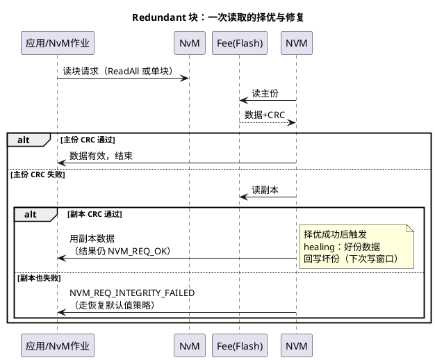

# 03-冗余与CRC

> 一句话定位：NvM 的数据保全双保险——冗余块用"两份存储、读时择优、坏份回修"扛住单点损坏，CRC 用"写入附指纹、读出重验"识别静默损坏；两者叠加才是关键数据（VIN/标定/DTC）的完整容错方案。
> 等级：L2 ｜ 前置：[01-NvM块管理](01-NvM块管理.md)

## 原理

### 冗余块读时择优 sequence

写方向的顺序保证：先写完主份、确认落盘，再写副本——任意时刻掉电，最多坏掉"正在写的那一份"，另一份始终完整，这就是冗余块的掉电安全性来源。

### CRC：范围与时机

- **计算时机**：写作业执行时，NvM 对 shadow 里的块数据计算 CRC 并与数据一起落盘；读作业执行时，重算并与存储值比对。CRC 值属于块的存储格式一部分（在 Fee 层面位于块数据后）。
- **作用范围**：NvM 的 CRC 覆盖**块数据本身**（应用数据），与 Fee 块管理头（块号/长度/状态机标记）的内部校验是两层独立机制——前者由 NvM 配置控制，后者是 Fee 模拟 EEPROM 机制的固有部分（见 [04-MemIf-Fee-Ea](04-MemIf-Fee-Ea.md)）。
- **长度选择**：CRC8（小块，如几字节设置项）/ CRC16（中等）/ CRC32（大块、高完整性要求）。漏检概率随长度指数下降，代价是存储字节与计算时间。

### Healing（读修复）

择优成功≠结束：NvM 会把好份数据**回写坏份**，让冗余对在下个写周期恢复"双完好"状态——否则下次掉电若再坏另一份就双失。直觉：healing 把"发现单份损坏"变成一个自动维修事件，但维修本身是一次写作业，仍占队列与 Flash 寿命；项目排障时看到"没写过的块突然有写流量"，先想到 healing。

### 磨损直觉：冗余的账单

冗余块每次写 = **两份物理写**，写流量与擦除负担直接翻倍；再叠加写验证（回读）与 healing，关键块的真实擦写次数远大于应用感知。权衡公式直觉：**数据价值高、写频低**（VIN、标定、下线数据）→ 冗余+CRC+写验证全开没问题；**写频高**（里程、计数器）→ 冗余翻倍磨损，改用 Dataset 轮换或 Native+细粒度分块。Flash 寿命预算按"最坏块擦写次数 ÷ 额定 endurance"留 10 倍以上裕量。

### Dataset 块（多套参数按索引选）

Dataset = 同一结构的多份数据集 + 一个运行期索引（`NvMDatasetSelectionIdx`）：读/写作业只作用于当前索引指向的那份。两大用途——**多配置集**（同一软件刷不同车型，索引区分参数集，常配合只读 D flash 或刷写工具预置）；**轮换写降磨损**（索引在多份间轮转，每份被写的频率降为 1/N）。注意 Dataset 不提供"读时择优"——索引指谁读谁，损坏恢复语义与冗余不同。

## 详解

**为什么两份要放不同扇区**：Fee 的配置允许冗余主/副份落在不同物理扇区；若两份同扇区，一次坏块/擦除失败同时带走双份，冗余失效。配置走查时把"冗余份的扇区分布"列为必查项。

**CRC 抓的是"静默损坏"**：写失败有错误码，但掉电瞬间的半写入、长期使用的位翻转、误擦除——这些不报错只坏数据，只有读时 CRC 能识别。所以"这数据从不写错，不用 CRC"是错觉：CRC 防的不是写失败，是**读了坏数据还不自知**。

**INTEGRITY_FAILED 之后怎么办**：NvM 只报结果不编故事——恢复策略属于应用/DEM 层：回默认值并记录 DTC（如"配置数据丢失，已恢复出厂"），或进安全状态。标定类数据恢复默认值可能改变整车行为，必须与功能安全概念联动。

**冗余与 Dataset 不互斥但别混用直觉**：Redundant 是"同份数据双保险，读择优"；Dataset 是"多套不同数据，索引选择"。配成 Dataset 想要容错是常见误解——索引指向的那份坏了就是坏了。

## 配置层

| 配置项 | 含义 | 典型值 | 易错点 |
|---|---|---|---|
| NvMBlockManagementType | 块类型：NATIVE/REDUNDANT/DATASET | 关键数据 REDUNDANT | 选 DATASET 当容错用→无择优 |
| NvMBlockUseCrc | 是否附 CRC | 关键块 true | 冗余块不开 CRC→择优依据缺失 |
| NvMBlockCrcType | CRC 长度 | CRC8/16/32 按块大小 | 大块配 CRC8→漏检率不可接受 |
| NvMBlockMaxDataSets / NvMDatasetSelectionBits | Dataset 份数与索引位宽 | 按需（2/4/8 份） | 索引未初始化→首读随机数据集 |
| NvMBlockUseWriteVerification | 写后回读 | 冗余关键块 true | 高频块叠加冗余→磨损失控 |
| FeeBlockConfiguration（块号/双份扇区布局） | 冗余份的物理落位 | 主副分扇区 | 两份同扇区→冗余形同虚设 |
| 恢复默认值钩子（块级 JobError 回调） | INTEGRITY_FAILED 处理入口 | 关键块必配 | 只报错不恢复→应用读到垃圾 |

## 易错点与陷阱

1. **冗余两份落在同一扇区**：现象是一次 Flash 坏块后"双保险"同时失效、恢复默认值；原因是 Fee 块配置没做扇区分置；对策：配置走查清单加"冗余份扇区分布"项，生成后核对物理地址。
2. **以为 Dataset 能容错**：现象是某数据集损坏后直接读到坏数据；原因是把 Dataset 当 Redundant 用（索引单点读，无择优）；对策：容错需求选 REDUNDANT，多配置需求才选 DATASET。
3. **healing 写流量误诊为应用 bug**：现象是日志显示未调写 API 的块出现写作业；原因是读择优触发了坏份回修；对策：知道这是正常行为，但要把 healing 计入 Flash 寿命预算与下电窗口。
4. **CRC 长度与块大小不匹配**：现象是偶发 INTEGRITY_FAILED 但数据"看着没问题"；原因是小块用 CRC8 漏检、或多块共用一个 CRC 计算单元配置错位；对策：按数据长度与完整性等级选型，别全项目一刀切 CRC32（浪费）或 CRC8（漏检）。
5. **恢复默认值策略缺失**：现象是 CRC 失败后应用继续用未初始化 RAM；原因是只处理了 NVM_REQ_OK 分支；对策：INTEGRITY_FAILED 分支显式恢复默认+记 DTC+必要时进安全状态。
6. **掉电恰好打断"写两份"中间态**：现象是偶发读出旧数据但 CRC 通过；原因是先写副本后写主份的顺序颠倒，或两份写之间没有确认间隔；对策：依赖标准实现的主份先行顺序，自研接口层别"优化"掉中间确认。

## 面试高频题

- **Q：Redundant 块的读写流程？**
  A：读：先主份，CRC 过则用；主份坏读副本，副本过则用其数据并触发 healing 回写坏份；双坏报 NVM_REQ_INTEGRITY_FAILED。写：先写主份并确认，再写副本，任意时刻掉电最多坏一份，另一份保底。
- **Q：CRC 防的是什么？计算时机在哪？**
  A：防静默数据损坏——掉电半写入、位翻转、误擦除这类不报错只坏数据的情况。写作业时对块数据计算 CRC 随数据落盘，读作业时重算比对。它与 Fee 块管理头的内部校验是两层机制。
- **Q：冗余和 Dataset 怎么区分选用？**
  A：Redundant=同一份数据存两份、读时择优，用于容错，代价是写流量翻倍；Dataset=多套数据按索引选，用于多配置集或轮换写降磨损，无择优容错。高频数据用冗余会加速磨损，应转 Dataset 轮换或显式低频写。
- **Q：什么是 healing？为什么要做？**
  A：读时发现一份坏一份好，用好的把坏的修回来（回写）。不做的话冗余处于"单份完好"状态，下次再坏另一份就双失——healing 让冗余对自动回到双完好，是自愈机制，但产生额外写流量需计入寿命与下电预算。

## 延伸

- [01-NvM块管理](01-NvM块管理.md)：块类型体系与作业队列；
- [02-写队列与显隐同步](02-写队列与显隐同步.md)：写顺序、重试与掉电窗口；
- [04-MemIf-Fee-Ea](04-MemIf-Fee-Ea.md)：冗余份的物理落位与 Fee 块头校验；
- [Fee 模拟 EEPROM](../../../04-MCAL与外设驱动/2-L2进阶/Fls与Fee/02-Fee模拟EEPROM.md)：扇区级磨损与交换机制；
- [Fls 驱动](../../../04-MCAL与外设驱动/2-L2进阶/Fls与Fee/01-Fls驱动.md)：擦写物理特性（endurance 与时序）。
