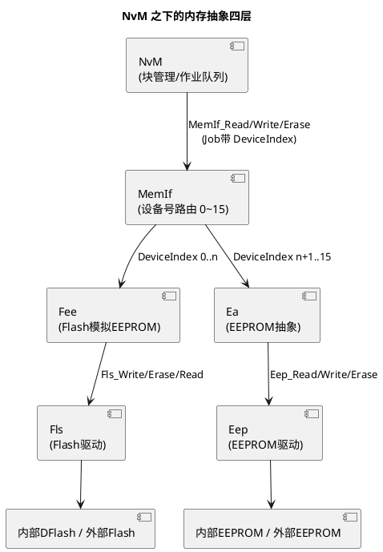
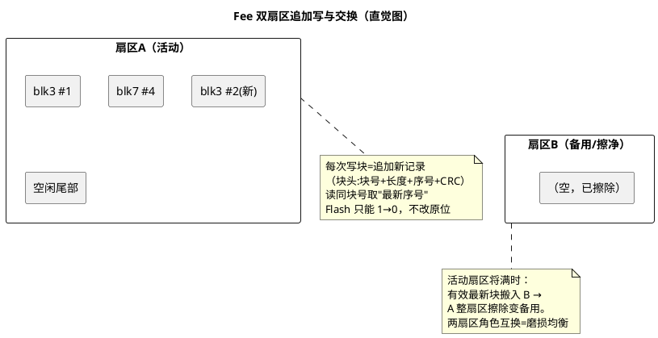

# 04-MemIf-Fee-Ea

> 一句话定位：NvM 之下的"搬运三兄弟"——MemIf 按设备号路由，Fee 在 Data Flash 上把"按块读写"模拟出来（追加写+扇区交换），Ea 对真 EEPROM 做同样抽象；配置走查的关键是把 NvM 块号一路对到 Fls 物理扇区不出错。
> 等级：L2 ｜ 前置：[01-NvM块管理](01-NvM块管理.md)、[与 NvM 链路](../../../04-MCAL与外设驱动/2-L2进阶/Fls与Fee/03-与NvM链路.md)

## 原理

### 四层堆栈 component

MemIf 的存在意义：NvM 只发"设备 X 的块 Y 读写"，不关心下面是 Flash 模拟还是真 EEPROM——多个 Fee/Ea 实例经 MemIf 的设备号（0~15）统一寻址，NvM 与上层完全无感介质差异。

### Fee：在 Flash 上模拟 EEPROM（扇区交换直觉）

两条铁律推导出整套机制：**Flash 写只能把 1 清成 0、擦除只能整扇区**。所以"改数据"永远是追加新版本（旧版本作废），活动扇区写满就做**扇区交换**（有效数据搬去备用扇区，旧扇区擦净待命）——顺带获得了磨损均衡与"每次写都有完整块头 CRC"两个红利。块头管理、地址查找这些细节在 [Fee 模拟 EEPROM](../../../04-MCAL与外设驱动/2-L2进阶/Fls与Fee/02-Fee模拟EEPROM.md) 有展开。

### Ea：一句定位

Ea（EEPROM Abstraction）对**真 EEPROM**（内部 EEP 或外挂）做与 Fee 对称的抽象——把 EEPROM 的扇区/页组织屏蔽掉，向上提供同样的按块读写接口；因为 EEPROM 可字节改写、无交换压力，Ea 比 Fee 薄得多，配置重心在扇区归属划分。

## 详解

**NvM 块号到物理扇区的三级映射**：`NvM BlockId →（配置引用）MemIf DeviceIndex + FeeBlockNumber →（Fee 布局）活动扇区内的逻辑地址 → Fls 物理地址`。三处引用（NvM 块的 NvMTargetBlockReference、Fee 块号、Fls 扇区列表）全部要工具生成闭环——任何一处手改，轻则读写错位，重则 Fee 布局校验失败整栈起不来。

**FeeImmediateData 快通道**：标记 immediate 的块（如碰撞数据）在写请求到达时插队直写（不等常规调度），且扇区管理保证其优先落盘——代价是物理擦写更频繁，只给真正"掉电前必须抢救"的数据用。

**虚拟页（FeeVirtualPageSize）**：Fee 写入以虚拟页为最小单位（多个物理页/扇区行对齐），块大小与页边界的关系影响空间利用率；小碎块太多浪费页尾，合并相邻小数据进一个 NvM 块是常见优化。

**交换时机是延迟炸弹**：扇区交换要"搬全部有效块+擦旧扇区"，一次可到百 ms~秒级；它会阻塞同扇区所有后续写作业。系统设计上：避免下电窗口撞交换（阈值留余量）、把高频块与关键块分扇区组，就是对付它。

**与 04 区驱动的分工**：Fee 决定"写哪个逻辑位置、何时交换"，Fls 只管"把这段字节写进这个物理扇区、擦净它"——擦写时序、ECC、等待状态这些硬件方言在 [Fls 驱动](../../../04-MCAL与外设驱动/2-L2进阶/Fls与Fee/01-Fls驱动.md)。

## 配置层

| 配置项 | 含义 | 典型值 | 易错点 |
|---|---|---|---|
| MemIf DeviceMax（设备数） | MemIf 挂的 Fee/Ea 实例数 | 1~2 | 加设备忘扩→DeviceIndex 越界 |
| FeeNumberOfWriteCycles（块预期写次） | Fee 布局优化依据 | 按数据画像填 | 全填默认→高频块挤同扇区，交换风暴 |
| FeeBlockNumber | Fee 逻辑块号（NvM 引用它） | 连续分配 | 与 NvM 引用错位→读写别家数据 |
| FeeImmediateData | 快写通道 | 碰撞类 true | 滥用→磨损与延迟不可控 |
| FeeVirtualPageSize | 虚拟页大小 | 按硬件 8~64 字节 | 与物理页不匹配→空间浪费或对齐错误 |
| FlsSectorList（DFlash 扇区划分） | Fee 可用的物理扇区 | 2 个以上，留备用 | 只配 1 扇区→无法交换，写满即死 |
| Ea 扇区归属（若用 Ea） | 每块落哪个 EEPROM 扇区 | 按容量分配 | 与 Eep 驱动扇区参数不一致→写越界 |
| FeeMainFunctionPeriod | Fee 作业节拍 | 5~10ms | 太长→写延迟叠加 NvM 节拍恶化 |

典型配置走查（从上到下五步）：① NvM 块引用指向 MemIf 设备 0 的 Fee 块 17；② Fee 块 17 大小 = 数据+CRC，非 immediate；③ 块 17 归属扇区组"组 1"（高频组）；④ 扇区组 1 = Fls 扇区 4+5（DFlash）；⑤ Fls 扇区 4/5 物理地址与芯片手册核对。五步任一断链，静态评审就该拦下。

## 易错点与陷阱

1. **只给 Fee 配一个扇区**：现象是写一段时间后所有写作业失败、NvM 报 NOT_OK；原因是无备用扇区可交换，活动扇区写满即止；对策：Fls 扇区列表至少两扇区成组，容量按块布局×1.5 以上裕量。
2. **NvM 块引用与 FeeBlockNumber 错位**：现象是块 A 读写到块 B 的内容、CRC 偶发通过（结构相同）；原因是接口层手写编号表；对策：引用关系工具生成，配置 diff 时核对引用而非裸数字。
3. **高频块与关键块同扇区组**：现象是关键块下电写总超时、延迟毛刺大；原因是高频块触发频繁交换，同组长作业阻塞关键块；对策：按写频画像分组（高频组/关键组/冷数据组），NumberOfWriteCycles 如实填。
4. **虚拟页与物理特性不匹配**：现象是空间利用率低或偶发写对齐错误；原因是 FeeVirtualPageSize 脱离硬件编程粒度拍脑袋；对策：按 DFlash 页大小与 ECC 粒度设置，见 [Fls 驱动](../../../04-MCAL与外设驱动/2-L2进阶/Fls与Fee/01-Fls驱动.md)。
5. **Immediate 块滥用**：现象是 Flash 寿命远低于预算；原因是把"想快"的块都标 immediate，插队直写绕过调度优化；对策：仅保留碰撞/事件抢救类，其余走常规通道（写策略见 [02-写队列与显隐同步](02-写队列与显隐同步.md)）。
6. **换用外部 Flash 忘了 Fls 语义差异**：现象是擦写时间数量级变化、交换超时；原因是外部 SPI Flash 擦除慢且经 Fls_Ext；对策：交换阈值与超时按实际介质重新整定，勿复用内部 DFlash 参数。

## 面试高频题

- **Q：画出 NvM 到物理介质的四层并说明每层职责。**
  A：NvM（块作业队列/镜像/CRC 冗余）→ MemIf（设备号 0~15 路由到 Fee/Ea 实例）→ Fee/Ea（模拟 EEPROM：块布局、追加写、扇区管理）→ Fls/Eep（物理擦写）。职责口诀：NvM 管语义、MemIf 管寻址、Fee 管布局、Fls 管字节。
- **Q：Fee 为什么要扇区交换？过程是什么？**
  A：Flash 只能整扇区擦、写只能 1→0，改数据只能追加新版本；活动扇区写满前，把所有有效最新块搬入备用扇区，然后擦除旧扇区转为备用。交换顺带实现磨损均衡（两扇区轮流被擦），代价是搬+擦的长作业（百 ms 级）会阻塞写。
- **Q：MemIf 设备号什么时候需要多个？**
  A：存在多个存储实例时——如内部 DFlash 挂 Fee（设备 0）、外挂 EEPROM 挂 Ea（设备 1）、或两个 Flash Bank 各一个 Fee。NvM 块的引用里带设备号，MemIf 据此分发，上层无需感知介质差异。
- **Q：读一个 Fee 块时怎么找到最新数据？**
  A：每个写入记录都带块头（块号+长度+序号+CRC）；Fee 按块号在活动扇区/查找表中定位该块的所有版本，取序号最新且 CRC 通过的记录。这也是"追加写"下读语义的来源。

## 延伸

- [Fee 模拟 EEPROM](../../../04-MCAL与外设驱动/2-L2进阶/Fls与Fee/02-Fee模拟EEPROM.md)：块头/交换的驱动区详解；
- [Fls 驱动](../../../04-MCAL与外设驱动/2-L2进阶/Fls与Fee/01-Fls驱动.md)：物理擦写特性与页粒度；
- [与 NvM 链路](../../../04-MCAL与外设驱动/2-L2进阶/Fls与Fee/03-与NvM链路.md)：本篇的驱动区对照篇；
- [01-NvM块管理](01-NvM块管理.md)：块作业如何下达到这里；
- [03-冗余与CRC](03-冗余与CRC.md)：冗余份数在本层的扇区落位。
