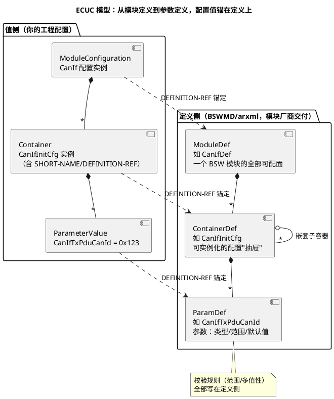

# 01-ECU配置结构

> 一句话定位：说清"一个 ECU 的配置"到底是什么——EcuC 这棵 ARXML 大树如何由一个个模块配置组成、ModuleDef→ContainerDef→ParamDef 三级定义如何管住千军万马的参数，以及 tresos 里 Base/Extension/Variant 的分层文件惯例。
> 等级：L2 ｜ 前置：[分层架构](../../1-L1基础/架构总览/01-分层架构.md)

在 [分层架构](../../1-L1基础/架构总览/01-分层架构.md) 里说过：AUTOSAR 日常的主活是"填配置"。本篇把"配置"这个词解剖开：它不是一个个散的设置页，而是一棵**有定义、有实例、有层级**的 ARXML 树——工具里的每个输入框，最终都长成树上的一个节点。

## 原理

### ECU 配置 = 一个 ECU 全部模块配置的总集

一个 ECU（比如你手上的 TC377 网关）的完整配置，逻辑上就是一份大 ARXML：里面 `Os`、`Com`、`PduR`、`CanIf`、`Can`、`NvM`……每个模块各占一个分支。AUTOSAR 元模型给这棵树起了名字：**EcuC（ECU Configuration）**。

```
ECU 配置（EcuC）                         ← 逻辑上的"一整棵树"
├─ Os                                   ← 模块配置 1：任务/调度表/计数器
├─ Com                                  ← 模块配置 2：信号与 IPdu 组包
├─ PduR                                 ← 模块配置 3：路由表
├─ CanIf / Can                          ← 模块配置 4/5：抽象层与驱动
├─ NvM / Fee                            ← 模块配置 n...
└─ （物理上可拆成多个 .arxml 文件存放）
```

两个关键直觉：

1. **逻辑一棵树，物理多文件**：工程里它通常被拆成多个 `.arxml`（按模块、按项目分野），由工具在加载时合成——"ECU 配置"指合成后的整体，不是某个单独文件；
2. **每个模块配置 = 定义 × 你的取值**：光有值不行，值必须"挂在"该模块的定义树上才合法——这是 ECUC 模型的核心。

### ECUC 模型：定义侧的三级结构



- **ModuleDef**：模块的"可配置面全集"，随模块交付（BSWMD 或厂商 xdm schema）；
- **ContainerDef**：可实例化的抽屉，多数可多重实例（配 3 路 CAN 就是 3 个容器实例）；
- **ParamDef**：叶子参数，定义了类型、取值范围、默认值、多值性（单值/多值）。

你的工程文件里写的只是"值侧"：每个节点用一个 `DEFINITION-REF` 指回定义侧——**定义管"能不能配、配多大"，值侧管"配成啥"**。工具打红叉，本质是值侧节点在定义侧找不到锚点或越界。

### 生成代码：配置怎么变成 `.c`

tresos 点 Generate 时的直觉流程：

```
你的配置（.arxml/.xdm 值侧）
   +  模块定义（厂商交付的定义侧）
   +  模块代码模板（厂商交付的生成器）
        ↓ 校验（def-ref 配对 + 范围检查）
     生成的 .c/.h
   （如 CanIf_Cfg.c、Com_Cfg.h、Os_Cfg.c——全是"数据表+初始化"）
```

要点：BSW 模块的**逻辑代码是厂商预编译交付的库/源码，生成器产出的主要是"配置数据"**（初始化表、宏开关、常量数组）。所以改一个 CanId → 重新生成 → 变的往往是一个数组元素——这也是配置能被 diff review 的根基（详见 [04-diff-review技巧](04-diff-review技巧.md)）。

## 详解

### tresos 的分层配置文件惯例

真实工程从不把所有值写在一个文件里，而是分层叠加（tresos 的典型惯例）：

| 层 | 文件形态 | 谁维护 | 放什么 |
|---|---|---|---|
| Base | 厂商/平台层 `.xdm`（base plugin） | BSW/MCAL 供应商 | 模块默认值、与芯片绑定的基础配置 |
| Extension/Project | 工程层 `.xdm`（对 base 的覆盖） | 你（项目工程师） | 本项目差异值：报文参数、任务周期、引脚 |
| Variant | 变体文件（如 PredefinedVariant/派生变体） | 你/配置经理 | 同平台多车型的差异（左舵/右舵、高配/低配） |

叠加直觉：**值查找顺序 = Variant → Extension → Base，越靠近工程层优先级越高**。好处：升级厂商包时 base 换掉，你的工程层改动保留；多车型共用一个工程，只差一个变体文件。副作用：一个参数的"生效值"可能藏在三层之一——查找请用工具的"effective value/计算值"视图，别肉眼逐层翻（怎么核对见 [03-ARXML手读](03-ARXML手读.md)）。

### Module 列表从哪来

一个工程该有哪些模块配置？答案是**由系统设计与软件架构决定**：通讯矩阵（Com/PduR/CanIf/Can）、调度需求（Os/RTE）、存储需求（NvM/Fee）、诊断（Dcm/Dem）……模块清单和版本由 BSW 集成者（常常就是你）在项目初期锁定，并写进交付物清单——这决定了后面所有配置工作的"施工图范围"。

## 配置层/工程关联

- tresos 工程树里：`base` 目录=厂商 base 插件集（含 MCAL），工程 `.xdm` 是你的 Extension 层，`config output` 目录是生成物；
- 版本锚点：每个模块配置头部有模块定义版本（如 CanIf 4.2.2 的 def 路径），迁移工程先核对这批版本（背景见 [版本演进](../../1-L1基础/架构总览/03-版本演进.md)）；
- 多变体交付：变体管理做不好，后期"高配车上冒出低配的报文"这类事故就从这里来——变体值评审要进 checklist；
- 生成物入库策略（团队约定）：生成代码是否入库、diff 报告是否随变更单归档，直接决定后期追溯成本。

## 易错点与陷阱

1. **以为 ECU 配置是"一个文件"**：它是逻辑总集，物理上分散在 base/工程/变体多个文件，加载合成后才是完整配置——讨论"配置改了什么"必须先说清在哪个层改的。
2. **只改值侧不核对定义侧**：跨版本/跨厂商搬配置时 def-ref 路径变了，工具可能报"未知参数"也可能静默丢弃——导入后必须跑校验并 diff（见 [04-diff-review技巧](04-diff-review技巧.md)）。
3. **在 Base 层直接改值**：把项目差异写进厂商 base 层，下次升级厂商包全被冲掉——差异永远写在工程/变体层。
4. **混淆"配置参数"与"生成代码"**：生成器产出的多是配置数据表，模块逻辑代码在交付库里；别指望在生成文件里改逻辑，那是下次生成就会消失的。
5. **变体叠加顺序想当然**：不同工具/不同配置项的覆盖规则有细节差异（有的按"最后定义优先"，有的按层优先级），关键参数用 effective 值视图确认，别赌记忆。

## 面试高频题

1. 什么是 ECU 配置（EcuC）？ModuleDef/ContainerDef/ParamDef 三级各是什么？
   答：EcuC 是一个 ECU 全部模块配置的逻辑总集（Os/Com/PduR/CanIf…各占一分支，物理上可拆多文件）。定义侧三级：ModuleDef 是模块可配置面全集，ContainerDef 是可实例化的配置"抽屉"（可多实例），ParamDef 是叶子参数（类型/范围/默认值/多值性）；值侧每个节点用 DEFINITION-REF 锚回定义——定义管"能不能配、配多大"，值侧管"配成啥"。
2. tresos 里 Base/Extension/Variant 三层配置文件的关系与优先级？为什么这样分？
   答：Base=厂商层默认值（随 BSW/MCAL 包升级被替换），Extension=工程层差异值，Variant=车型/变体差异；查找顺序 Variant → Extension → Base，越靠近工程层优先级越高。分层是为了升级厂商包不冲掉项目改动、多车型共工程只差一个变体文件。副作用是生效值可能藏在任一层，要用工具的 effective value 视图核对。
3. BSW 生成代码与配置是什么关系？改一个 CanId 之后生成产物里变的是什么？
   答：模块逻辑代码是厂商预交付的库/源码，生成器产出的是"配置数据"（初始化表/常量数组/宏开关）。改 CanId 重新生成后，变的往往是 CanIf/Com 配置表里的一个数组元素或常量——这也是配置能做 diff review 的根基。
4. 配置工具报"definition not found / out of range"是什么机制在起作用？
   答：ECUC 校验在做值侧↔定义侧配对：值节点的 DEFINITION-REF 在定义树里找不到锚点（跨版本/跨厂商搬配置 def 路径变了）报 not found；参数值超出 ParamDef 声明的范围/多值性报 out of range——红叉本质是锚点丢失或越界。

## 延伸

- [容器与参数](02-容器与参数.md)：值侧节点的语法解剖——SHORT-NAME/DEFINITION-REF/VALUE 逐个拆
- [ARXML手读](03-ARXML手读.md)：拿一段真实配置走读这棵树
- [04-diff-review技巧](04-diff-review技巧.md)：两版配置怎么比、比什么
- [如何查SWS](../../1-L1基础/SWS阅读法/01-如何查SWS.md)：定义侧的每个参数，行为含义都在 SWS 里
- [分层架构](../../1-L1基础/架构总览/01-分层架构.md)：五层各有各的模块配置——总集按层分布的地图
