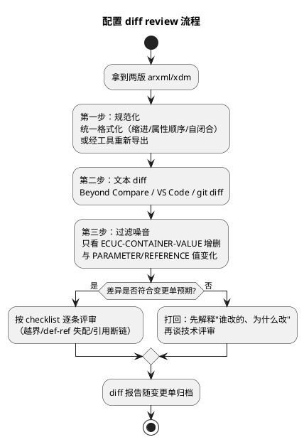

# 04-diff-review技巧

> 一句话定位：两版配置之间"改了什么、谁改的、改得对不对"——规范化格式化→文本 diff→只看 ECUC 容器与参数增删改→tresos/ARTOP 差异报告兜底，配一张评审 checklist，让每次配置变更都有迹可查。
> 等级：L2 ｜ 前置：[ARXML手读](03-ARXML手读.md)

配置即代码，就要有代码级的评审纪律。场景：Sprint 结束要交付新配置包；凌晨的报文丢失怀疑上周有人动了 Com；客户问"V2.3 比 V2.2 改了什么"——答案都从一份 diff 开始。

## 原理

### 为什么先规范化：同配置，不同"长相"

XML 同一内容可有多种序列化：属性顺序、缩进、换行、自闭合标签（`<X/>` vs `<X></X>`）。工具导出的两次文件若格式有差，文本 diff 会满屏假差异。所以流程第一步永远是**规范化**：



规范化手段三选一：XML 格式化工具（如 VS Code 的 XML Tools "Format as XML"）、xmllint `--format`、或最稳的"都用同一工具同一版本重新导出"。**三招共同前提：规范化本身不能改内容**——只动序列化，不动树。

### diff 的原子单位：容器与参数

结合 [容器与参数](02-容器与参数.md) 的模型，一份配置 diff 应归类为四种原子变化：

| 变化类型 | diff 里的样子 | 风险直觉 |
|---|---|---|
| 参数值变更 | `<VALUE>` 行变了 | 直接：行为变化，逐条对 SWS 核语义 |
| 容器新增/删除 | 整块 `ECUC-CONTAINER-VALUE` 增删 | 大：新报文/新任务的引入，牵引用链 |
| 引用变更 | `VALUE-REF` 路径变了 | 隐蔽：重接线，链断就是运行时故障 |
| def-ref 变更 | `DEFINITION-REF` 变了 | 最危险：参数"身份"变了，多半是版本/定义迁移副作用 |

### 工具兜底：结构化差异报告

文本 diff 是人人可用的下限，工程上限是结构化报告：

- **EB tresos**：工程内可比较配置/生成配置差异报告（含参数级差异列表），随交付物输出；
- **ARTOP/开源 ECUC 工具链**：基于元模型解析后按容器树输出增删改清单，天然过滤序列化噪音；
- **git 仓库**：把 arxml/xdm 纳入版本管理，`git log -p -- xxx.arxml` 直接回答"谁改的、什么时候改的"——这一条能消灭一半扯皮。

## 详解

### 评审 checklist（逐条打勾）

新增/删除容器：

- [ ] 每个新增容器都在变更单范围内？无"顺手多加"的？
- [ ] 删除的容器没有被别处 VALUE-REF 引用？（搜全局）
- [ ] 多重容器数量与通讯矩阵/软件需求一致？

参数值变更：

- [ ] 每个变更值能对上需求条目（矩阵表号/工单号）？
- [ ] 值在 ParamDef 范围内且语义对（十进制/枚举名没看错）？
- [ ] 关联参数成对改了？（如 CanId 与 CanIdType、周期与超时）

引用与 def-ref：

- [ ] VALUE-REF 目标存在且指向预期实例？
- [ ] DEFINITION-REF 无"意外变化"？（版本迁移除外，需单独说明）
- [ ] 跨模块链路完整（Com→PduR→CanIf→Can 一条龙都在 diff 里自洽）？

工程层纪律：

- [ ] 改动落在正确的层（工程/变体层，不是 base 层）？
- [ ] 变更后通过校验（tresos validation 零 error）？
- [ ] diff 报告+变更单归档，生成代码同步重新生成？

### 典型 diff 片段怎么读

```
<ECUC-NUMERICAL-PARAM-VALUE>
  <SHORT-NAME>CanIfTxPduCanId</SHORT-NAME>
-   <VALUE>290</VALUE>
+   <VALUE>291</VALUE>
</ECUC-NUMERICAL-PARAM-VALUE>
```

读法：`EngSpd` 报文的 CanId 从 290 改到 291——追问三连：矩阵变更单在哪？对端 ECU 同步改了吗？DLC/周期等其他参数要不要跟？**diff 给出事实，评审给出来龙去脉**。

## 配置层/工程关联

- 交付物纪律：每版配置包附带"与上版的 diff 报告 + 校验报告"两件套，是多数 OEM 的硬性要求；
- tresos 配置比较入口：工程比较（比较两工程/两基线）与模块级差异导出；报告语言要能让不看工具的人读懂；
- git 落地建议：xdm/arxml 全入库、生成物按团队策略入库或由 CI 生成；`.gitattributes` 里给 arxml 标 text，保证 diff 干净；
- CI 加分项：流水线里跑"规范化检查 + 校验 + diff 报告生成"，把本篇流程自动化，评审会只看报告。

## 易错点与陷阱

1. **拿原始导出直接 diff**：属性顺序/缩进差异淹没真差异——先规范化，否则"看漏一条 CanId 变更"只是时间问题。
2. **把格式化当无害操作**：用错格式化器（重排元素顺序）会悄悄改变文档语义——规范化工具要固定，且规范化前后做一次"内容级"校验。
3. **只看参数值不看引用**：`VALUE-REF` 一行变化可能等价于"整条报文换了路由"，隐蔽度最高，review 时引用变更要单独过一遍。
4. **忽略 def-ref 变化的版本迁移含义**：跨版本升级工程时 def 路径批量变化是预期内，但混入"个别参数 def 悄悄改了"就是事故苗头——升级类 diff 要按"批量 vs 个别"分组看。
5. **diff 干净就放行**：两版都没改≠都正确——diff 只回答"变了什么"，不回答"对不对"；新基线仍要跑全量校验。
6. **无版本管理的"人肉对版本"**：靠文件名日期和记忆对版本，出了"幽灵改动"无法追责——arxml 入 git 是性价比最高的整改。

## 面试高频题

1. 两个版本的 ARXML 配置怎么做差异评审？描述完整流程与工具链。
   答：三步流程：①规范化（统一格式化或用同一工具重新导出，只动序列化不动内容）→②文本 diff（Beyond Compare/VS Code/git diff）→③过滤噪音，只看四种原子变化（参数值/容器增删/引用变更/def-ref 变更），对照变更单逐条过 checklist；兜底用 tresos 差异报告或 ARTOP 结构化对比，diff 报告+校验报告随变更单归档。
2. 文本 diff ARXML 有哪些噪音？怎么消除？
   答：噪音来自 XML 序列化差异：属性顺序、缩进/换行、自闭合写法（<X/> vs <X></X>），会产生满屏假差异。消除：先规范化（XML Tools 格式化、xmllint --format、或同一工具重新导出），规范化工具要固定且不能重排元素顺序，规范化后做一次内容级校验确认树没变。
3. 配置变更的评审要点有哪些？（考察 checklist 意识：越界/引用断链/层级/变更单对应）
   答：新增/删除容器——是否都在变更单范围、删除目标有无被 VALUE-REF 引用；参数值——能否对上需求条目、是否在 ParamDef 范围内、关联参数成对改；引用与 def-ref——VALUE-REF 目标存在、DEFINITION-REF 无意外变化、跨模块链路自洽；工程纪律——改动落在工程/变体层而非 base 层、校验零 error、diff 报告归档且生成物同步重新生成。
4. 怎么防止"配置被悄悄改了没人知道"？谈谈你的版本管理实践。
   答：arxml/xdm 全量入 git（.gitattributes 标 text 保证 diff 干净），git log -p 直接回答"谁改的、什么时候"；CI 流水线跑规范化检查+校验+diff 报告自动生成；每版交付附"与上版 diff+校验"两件套；跨版本升级的 def-ref 批量变化与个别参数变化分组评审。

## 延伸

- [ARXML手读](03-ARXML手读.md)：diff 命中行之后，靠手读功夫确认上下文
- [容器与参数](02-容器与参数.md)：四种原子变化的语法基础
- [ECU配置结构](01-ECU配置结构.md)：改动落在哪一层——diff 报告要标注层归属
- [如何查SWS](../../1-L1基础/SWS阅读法/01-如何查SWS.md)：变更参数的行为语义，回 SWS 配置规范核对
- [版本演进](../../1-L1基础/架构总览/03-版本演进.md)：跨版本迁移时的 def-ref 批量变化背景
