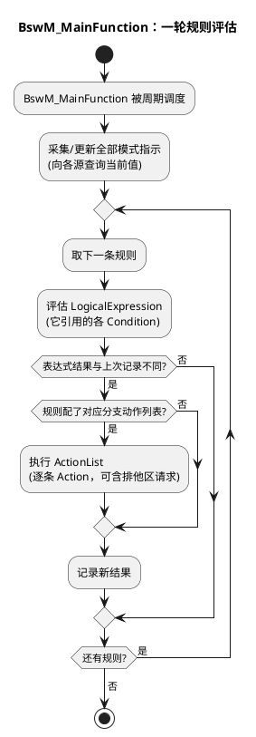

# 01-模式仲裁

> 一句话定位：BswM 是一个没有自己状态的纯规则引擎——收模式信号、算逻辑表达式、放动作列表，全 ECU 的"何时开何机关"策略都浓缩在它的规则集里。
> 等级：L2 ｜ 前置：[AUTOSAR第一课-一座城的分区图](../../../00-入门导读/01-AUTOSAR第一课-一座城的分区图.md)

## 原理

### 规则引擎三段式

```plantuml
@startuml
title BswM 规则引擎：条件 → 逻辑表达式 → 动作列表
skinparam defaultFontName "Microsoft YaHei"
package "模式信号源" {
  [SWC 经 RTE\n(模式请求端口)] as SWC
  [BSW 模块\n(CanSM/NvM/EcuM/ComM)] as BSW
}
package "BswM" {
  [ModeCondition\n条件] as COND
  [LogicalExpression\n逻辑表达式] as LEXP
  [Rule] as RULE
  [ActionList\n动作列表] as ACT
}
SWC --> COND
BSW --> COND
COND --> LEXP : AND/OR 组合
LEXP --> RULE : 真/假
RULE --> ACT : 真→ActionList_True\n假→ActionList_False（可选）
note bottom of ACT : 动作：开/关 CanSM、起停调度表、\nEcuM 请求、发模式切换通知 SWC…
end note
@enduml
```

**BswM 自己没有状态机**：它不记住"我是处于什么模式"，只有一堆被评估的规则；所谓"模式"只是规则输入的取值。这与 EcuM（内建状态机）形成鲜明对照——**机制（EcuM）有状态，策略（BswM）无状态**。

### 规则执行流（activity）



### 模式请求 vs 模式指示：两类信号别混

| 维度 | 模式请求（Request） | 模式指示（Indication） |
|---|---|---|
| 方向 | 源**推**给 BswM："我要求切到 X" | BswM **拉**：查某模块"你现在什么状态" |
| 谁发起 | SWC（用户功能想开/关）、ComM（应用想用总线） | CanSM（BusOff/正常）、NvM（Job 结果）、EcuM（RUN/POST_RUN） |
| 语义 | 意图（希望如此） | 事实（已经如此） |
| 典型条件 | `SWC_POWER_MODE == ON` | `CANSM_BUSOFF == BusOff` |
| 例子 | 诊断会话激活→请求 FULL_POWER | NvM 写完→指示 ALL_DONE |

直觉：**请求是"点菜"，指示是"菜到没到"**——规则常常是"有人点菜 且 菜好了 → 上菜（切模式）"。

### 信号源全景

- **SWC 经 RTE**：应用组件经模式切换接口/模式请求端口参与仲裁（比如车窗 SWC 说"我要休眠了"）；
- **BSW 模块直连**：CanSM（总线状态）、ComM（用户请求）、NvM（Job 完成）、EcuM（生命周期状态）、PduR/Dcm 等按需挂入；
- **纯软件开关**：BswM 自己的动作也能"发"模式（如规则 A 的动作置一个内部模式量，供规则 B 引用）——规则链的基本套路。

## 详解

**一次完整的仲裁长什么样**：KL15 从 ON→OFF。BswM 周期评估时发现条件 `ECUM_STATE == POST_RUN 且 CANSM == SILENT` 成立（表达式由两个条件 AND），触发动作列表：停 SchM 调度表→NvM_WriteAll→ComM 请求睡眠→EcuM 请求 SLEEP。注意**每个动作都是对其他模块的调用**——BswM 从不自己动手干业务，它是总调度不是工人。

**为什么这套设计能打**：整车策略（省电时序、功能联动、降级方案）本质是布尔逻辑+动作编排，规则引擎天然适配；策略变更只改配置不动代码——集成阶段的"模式矩阵"就变成了一张可评审的规则表。

**与 EcuM 的关系再强调**（见 [EcuM/02-上下电时序](../EcuM/02-上下电时序.md)）：上电后 EcuM 把 RUN 状态作为指示交给 BswM，BswM 首轮仲裁决定开什么；下电时 BswM 裁决后向 EcuM 发请求。EcuM 状态既是 BswM 的输入也是它动作的输出——闭环。

## 配置层

| 配置项 | 含义 | 典型值 | 易错点 |
|---|---|---|---|
| BswMModeRequestSource | 模式请求源（绑定 SWC 端口/BSW 模块） | 每源一个模式枚举 | 请求/指示源类型配反，语义全乱 |
| BswMModeCondition | 单条条件（源+期望值） | CANSM_BUSOFF==BusOff | 条件值写死枚举，源改了没跟 |
| BswMLogicalExpression | 条件的 AND/OR 组合 | 2~4 条件组合 | 表达式过长难评审，规则难维护 |
| BswMRule（含真/假动作列表） | 规则本体 | 真分支配动作，假分支可选 | 只配真分支：状态恢复不回去 |
| BswMAction / ActionList | 动作与编排 | 调 CanSM/EcuM/SchM/RTE 通知 | 动作里夹业务逻辑，BswM 变上帝模块 |
| 规则触发方式 | MAINFUNCTION 周期 / IMMEDIATE | 混合用 | 详见 [02-规则配置](02-规则配置.md) |
| BswMModeManagement（周期） | MainFunction 周期 | 10~20ms | 周期太长：模式响应迟钝 |

## 易错点与陷阱

1. **条件初值没配**：上电首轮评估时某源还没发过值（初始值默认假），本该开的规则不开——系统停在半初始化；每个模式源都要配可靠的初始值。
2. **请求当指示用**：拿"SWC 请求睡眠"当"SWC 已睡眠"裁决，实际 SWC 还在跑就切了模式——功能闪断；请求与事实之间要有确认（另一条指示规则）。
3. **只配真分支动作**：模式进入时开了调度表/总线，退出分支没配——切不回去；规则评审表强制检查真/假两列。
4. **动作列表里塞慢活/业务**：BswM 动作应该是"发令"，在动作里跑长流程会拖垮 MainFunction；慢活下放给目标任务。
5. **规则间隐性依赖没排顺**：规则 B 依赖规则 A 置的内部模式量，但评估顺序不保证 A 先——偶发首轮不触发；用 IMMEDIATE 规则或显式排序控制。
6. **模式枚举变更不联动**：源头（如 CanSM 状态枚举）加了一档，BswM 条件没跟——出现"永远不成立"的死条件；变更管理里把模式枚举列入联动检查。

## 面试高频题

- **Q：BswM 的本质是什么？为什么说它没有状态？**
  A：纯规则引擎：ModeCondition→LogicalExpression→ActionList；它不保存自身状态机，"当前模式"只是各模式信号源的取值快照，规则在每轮 MainFunction 重新评估。
- **Q：模式请求和模式指示的区别？**
  A：请求=源主动表达意图（SWC/ComM 想要什么模式）；指示=BswM 查询事实（CanSM/NvM/EcuM 现在什么状态）；一个是点菜、一个是菜好了没。
- **Q：BswM 和 EcuM 怎么协作？**
  A：EcuM 把生命周期状态（RUN/POST_RUN）作为模式指示给 BswM；BswM 按策略向 EcuM 发请求（RequestRUN/睡眠目标）；EcuM 执行机制序列，BswM 持有策略。
- **Q：上电后 BswM 什么时候开始起作用？**
  A：EcuM 完成启动序列进 RUN 并发首个模式指示后，BswM 首轮规则仲裁决定开总线/起功能——此前它可能已被初始化，但等输入源就绪才有意义。

## 延伸

- [02-规则配置](02-规则配置.md)：把规则拆开看的三段解剖与三个实例；
- [EcuM 上下电时序](../EcuM/02-上下电时序.md)：交棒与请求的完整闭环；
- [通讯服务栈目录](../../通讯服务栈/README.md)：CanSM/ComM 这些模式源的大本营；
- [睡眠与假醒](../../../../05-汽车网络通讯/2-L2进阶/网络管理/03-睡眠与假醒.md)：睡眠策略里 BswM 与 NM 的接力；
- [AUTOSAR第一课-一座城的分区图](../../../00-入门导读/01-AUTOSAR第一课-一座城的分区图.md)：BswM 在服务栈中的位置。
