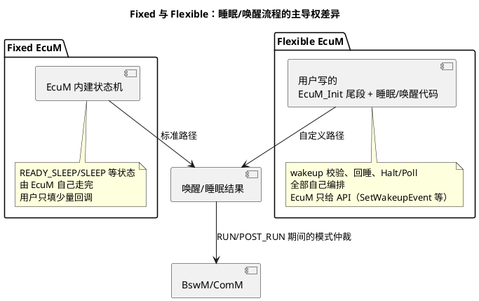

# 01-flex-vs-fixed

> 一句话定位：EcuM 有两副骨架——Fixed 状态机（EcuM 自己当管家，简单上下电够用）和 Flexible（把 wakeup/sleep 流程还给用户，配 BswM 接管）——现代项目九成选 Flexible。
> 等级：L2 ｜ 前置：[AUTOSAR第一课-一座城的分区图](../../../00-入门导读/01-AUTOSAR第一课-一座城的分区图.md)

## 原理

### EcuM 的本职：给整个 ECU 定"生活作息"

不管哪种形态，EcuM 都干三件事：**初始化编排（分阶段起栈）、上下电/睡眠序列编排、唤醒事件管理**。两副骨架的差别只在"睡眠与唤醒这段流程由谁主导"。

### 逐项对比

| 维度 | Fixed | Flexible |
|---|---|---|
| 状态机主人 | EcuM 内建（STARTUP/UP/RUN/POST_RUN/…） | 用户实现（EcuM 只保留启动段骨架） |
| 唤醒源校验 | EcuM 按 WakeupConfiguration 内建流程走 | 用户代码全权（何时验、验多久、失败回睡） |
| 睡眠入口 | 内建 SLEEP/SHUTDOWN 序列 | 用户决定 Halt/Poll/Reset 与时机 |
| 配置量 | 小（勾唤醒源+超时） | 大（回调、模式请求、与 BswM/ComM 交互全要自己搭） |
| 灵活性/可裁剪 | 差，流程死了 | 高，按整车策略任意编排 |
| 调试难度 | 低（状态可打印） | 高（流程散在用户代码） |
| 适用 | 简单节点：上电即 RUN、下电即断 | 需求复杂的：多睡眠档位、部分网络、快唤醒 |
| 现代主流 | — | ✅ Flexible + BswM 接管 RUN/POST_RUN |

### 为什么主流是 Flexible + BswM

Fixed 的状态机把"什么时候 RUN、什么时候睡"焊死在 EcuM 里；但真实项目的作息是**策略**（KL15 断了但 CAN 还要陪跑 3 秒、诊断激活就不许睡……），这类策略天然属于规则引擎。于是标准分工定型：

- **EcuM（Flexible）管"怎么睡"**：执行 Halt、关时钟、配唤醒源——机制执行者；
- **BswM 管"何时睡/何时醒着"**：模式仲裁与规则（CanSM 状态、KL15、诊断请求）——策略决策者。

交接面：EcuM 在启动祈使完成后进入 RUN，把主导权交给 BswM（经模式请求接口）；BswM 裁决后调 `EcuM_RequestRUN/EcuM_RequestPOSTRUN` 决定 EcuM 状态走向。

## 详解

**Fixed 的内建状态机速览**（细节见 [02-上下电时序](02-上下电时序.md)）：STARTUP→UP→RUN→POST_RUN→（RESET/SHUTDOWN），睡眠侧 SHUTDOWN→SLEEP/HIBERNATE。用户可挂的钩子少，换来回调即用，适合"标准上下电"的小节点（传感器、简单执行器）。

**Flexible 的自由度与代价**：wakeup validation 定时、假醒回睡、MCU 时钟切换节奏全由用户代码掌控——好处是能精确满足整车厂的低功耗指标（如整机睡眠电流、唤醒到首帧时间）；代价是这些代码要自己写对、自己测，且必须和 BswM 规则对齐，否则出现"BswM 想睡、EcuM 还醒着"的打架。

**迁移直觉**：从 Fixed 起步的原型，量产切 Flexible 时，重点改写三处——唤醒校验流程、睡眠准备序列（Halt 前的外设下电清单）、与 BswM 的模式握手；初始化阶段（阶段一/二）两种形态基本一致。

**工具配置视角**：主流生成器（EB tresos / Vector DaVinci）里，Fixed 对应一组固定的 Wakeup/Sleep 配置容器，勾完即生成内建流程；Flexible 则要求把用户实现挂进 EcuM 的回调点（如自定义唤醒处理函数）。切换形态时 ARXML 容器结构不同，**不能靠"关掉几个参数"混过去**，迁移按"删旧容器+按新模板重建"走，避免半新半旧的僵尸配置混进基线。

**上手先辨形**：接手一个工程怎么判断用的哪种骨架？看两点：①生成的 EcuM 代码里有没有内建睡眠状态机（Fixed 会有完整的 SLEEP/唤醒验证流程函数）；②搜唤醒校验逻辑落点——在 EcuM 生成代码里=Fixed，在用户工程（如 EcuM_UserCfg / BswM 模块）里=Flexible。辨错形态，后续排障方向全错。

## 配置层

| 配置项 | 含义 | 典型值 | 易错点 |
|---|---|---|---|
| EcuM 配置形态选择 | Fixed / Flexible（生成器选项） | Flexible | 两套配置混配：Fixed 参数残留无效果还误导 |
| EcuMWakeupSource（见 03 篇） | 唤醒源+校验超时 | CAN 唤醒超时 500ms~2s | Flexible 下超时只是给你用的建议值，得自己实现 |
| EcuMSleepMode（Halt/Poll） | 睡眠档位定义 | MCU Halt + 唤醒源开 | 配了 Poll 却没周期任务跑，白耗电 |
| EcuMComM / 与 ComM 联动 | 睡眠时通知总线状态机 | 关联 ComM 最小模式 | 忘联动：总线没睡 ECU 先睡，NM 假醒连环炸 |
| BswM 模式请求端口 | EcuM→BswM 的 RUN/POST_RUN 指示 | 挂到 BswM 规则 | Flexible 下忘了把主导权交 BswM，两套逻辑打架 |
| EcuMGeneral/EcuMMainFunctionPeriod | 主函数周期 | 10~20ms | 周期过长：唤醒校验/超时粒度变粗 |

## 易错点与陷阱

1. **形态混配**：工程从模板拷来 Fixed 残留（WakeupConfiguration 里一堆内建流程），又按 Flexible 写代码——内建流程不生效，唤醒行为"看起来配了却没跑"；切形态时清理另一套参数。
2. **Flexible 下以为 EcuM 还管唤醒校验**：配置了 WakeupSource 就以为校验自动做——Flexible 里校验代码是你的；现象是假醒不复位回睡、耗电超标。
3. **RUN 主导权交接缺失**：EcuM 进 RUN 后没有通知 BswM/没人发模式请求，系统停在"半初始化"状态（总线开不了）；必须在启动序列末尾触发首次模式仲裁。
4. **睡眠档位与外设下电清单不一致**：配了 Halt 但某外设（如 CAN 收发器）没进待机，睡眠电流超标；Halt 前清单逐外设核对。
5. **忽视 NvM 写完再睡**：睡眠序列里没等 NvM 全部落盘就 Halt，掉电丢数据；POST_RUN/SHUTDOWN 序列要含 NvM 完成等待。

## 面试高频题

- **Q：Fixed 和 Flexible EcuM 的本质区别？**
  A：睡眠/唤醒流程的主导权——Fixed 由 EcuM 内建状态机走完（配置少、不灵活），Flexible 由用户代码实现（自由度高、配 BswM 常见）；初始化阶段两者基本一致。
- **Q：为什么现代项目主流是 Flexible？**
  A：整车低功耗策略越来越复杂（部分网络、快唤醒、多睡眠档位），是"策略问题"应交给 BswM 规则引擎裁决，EcuM 只做机制执行——Flexible 恰好提供这种分工。
- **Q：EcuM 和 BswM 怎么分工？**
  A：BswM=何时（模式仲裁、规则），EcuM=怎么执行（初始化编排、睡眠/Halt、唤醒管理）；交接靠模式请求/指示接口。
- **Q：两种形态下唤醒校验分别谁做？**
  A：Fixed=EcuM 内建校验流程（超时收 WakeupConfiguration 管）；Flexible=用户代码全权实现（何时验、失败回睡自己写）。

## 延伸

- [02-上下电时序](02-上下电时序.md)：启动/下电序列的逐步展开；
- [03-唤醒源](03-唤醒源.md)：唤醒类型与假醒校验细节；
- [BswM 模式仲裁](../BswM/01-模式仲裁.md)：策略侧的规则引擎；
- [睡眠与假醒](../../../../05-汽车网络通讯/2-L2进阶/网络管理/03-睡眠与假醒.md)：网络管理侧的睡眠协调；
- [AUTOSAR第一课-一座城的分区图](../../../00-入门导读/01-AUTOSAR第一课-一座城的分区图.md)：EcuM 在服务栈中的位置。
