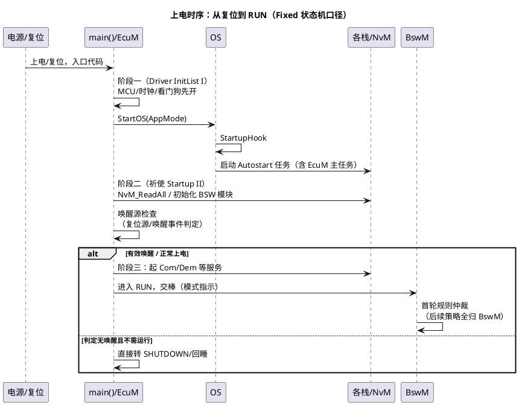
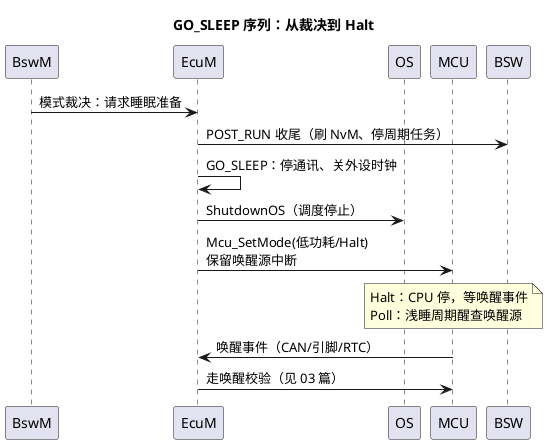

# 02-上下电时序

> 一句话定位：把"上电到 RUN"和"RUN 到断电"两段序列背下来——上电五步（EcuM_Init→StartOS→阶段二祈使→唤醒检查→交棒 BswM），下电三目标（RESET/SLEEP/HIBERNATE），排障时序问题就有了坐标系。
> 等级：L2 ｜ 前置：[01-flex-vs-fixed](01-flex-vs-fixed.md)

## 原理

### 完整上电时序



记住五个里程碑：**入口→EcuM_Init（阶段一）→StartOS（OS 接管）→阶段二祈使（NvM 读全部、栈初始化）→RUN 交棒 BswM**。哪一步没到，故障就框定在哪段。

### 下电三目标与序列

| 目标（Target） | 含义 | 收尾动作 | 典型场景 |
|---|---|---|---|
| RESET | 复位重启 | 通知 BswM→EcuM_Shutdown→Mcu_PerformReset | 软复位、看门狗前主动重启 |
| SLEEP | 睡眠（RAM 保持，低功耗等待唤醒） | GO_SLEEP 序列→停调度→MCU 低功耗模式+开唤醒源 | KL15 OFF 后陪网睡眠 |
| HIBERNATE | 休眠（RAM 不保持，等同断电重启） | 同 SLEEP 序列但不保持状态，唤醒=冷启动 | 长时间停车深度休眠 |



### EcuM 状态机全景

```plantuml
@startuml
title EcuM Fixed 状态机（核心状态）
skinparam defaultFontName "Microsoft YaHei"
[*] --> STARTUP : EcuM_Init/StartOS
STARTUP --> UP : 阶段二祈使完成
UP --> RUN : 唤醒源有效/正常上电
RUN --> POST_RUN : 无人再请求 RUN\n（RUN 请求被撤销）
POST_RUN --> SHUTDOWN : 收到下电目标指令
SHUTDOWN --> RESET : Mcu_PerformReset
SHUTDOWN --> SLEEP : 目标 SLEEP\nGO_SLEEP→Halt
SHUTDOWN --> HIBERNATE : 目标 HIBERNATE
SLEEP --> STARTUP : 唤醒校验通过（重启流程）
note right of RUN : 谁在请求 RUN：\nBswM 规则/ComM/EcuM 自身\n（RunSelfRequest）
end note
@enduml
```

### 与 BswM 的交接点

两个方向、两个接口，别混：
- **上电交接（指示）**：EcuM 进 RUN → 模式指示给 BswM → BswM 首轮仲裁（起不起总线、开不开功能全在这里裁决）；
- **下电交接（请求）**：BswM 裁决"该睡了" → 调 EcuM 请求接口（请求撤销 RUN→POST_RUN→SHUTDOWN）→ EcuM 执行机制序列（停栈、Halt）。
一句话：**EcuM 汇报状态、执行动作；BswM 发号施令**（详见 [BswM/01-模式仲裁](../BswM/01-模式仲裁.md)）。

## 详解

**阶段一 vs 阶段二放什么**：阶段一（StartOS 前）只放"活命必需"——时钟、栈、看门狗、极早期 IO；阶段二（OS 调度已跑）放 NvM_ReadAll 与各栈 Init，因为它耗时且可能要等待。把慢初始化塞进阶段一会拖长"看门狗开而没人喂"的裸奔窗口。

**RUN 请求计数逻辑**：RUN 不是状态机自走，而是"请求计数>0 就留在 RUN"——EcuM 自请求（RunSelfRequest）、ComM、BswM 规则都可持有请求；全部撤销才降 POST_RUN。排障"下不了电"时先查谁还捏着 RUN 请求。

**下电排障坐标系**：卡在哪一态一目了然——卡 POST_RUN=还有模块没完成收尾（NvM 写未完）；卡 SHUTDOWN=某外设关不掉（等总线静默失败）；反复重启=RESET 目标+异常源未清。

## 配置层

| 配置项 | 含义 | 典型值 | 易错点 |
|---|---|---|---|
| EcuMInitConfiguration（阶段一列表） | Driver InitList I 顺序 | 时钟→MCU→Wdg→IO | 顺序错：先开 Wdg 后配时钟，喂不上狗 |
| EcuMNvMLocalBlockEntries 等 | 阶段二 NvM 读范围 | 只读必要块 | 全量读：上电到首帧太慢 |
| EcuMRunSelfRequest | EcuM 自持 RUN 请求 | true（校准/诊断态用） | 忘关：永远下不了电 |
| EcuMSleepOnCanNvEnabled 等联动 | 与 ComM/NM 睡眠协调 | 按平台开 | 不联动：总线未静默就 Halt，整车 NM 炸 |
| EcuMWakeupSource（见 03 篇） | 唤醒源+校验超时 | CAN 500ms~2s | SLEEP 前没使能唤醒源=睡死 |
| EcuMDefaultShutdownTarget | 默认下电目标 | SLEEP 或 RESET | 目标配 RESET 但业务想睡：整机反复重启 |
| EcuMMainFunctionPeriod | 主函数周期 | 10~20ms | 太长：状态推进/超时粒度粗 |

## 易错点与陷阱

1. **阶段一塞慢初始化**：NvM/外设长活拖在 StartOS 前，看门狗窗口内没人喂——复位循环；阶段一只留"活命三件套"（时钟/栈/狗）。
2. **上电到首帧超时**：NvM_ReadAll 块太多/太慢，整车要求上电 X ms 内发首帧做不到；只读必要块，其余懒加载。
3. **RUN 请求泄漏**：诊断/ComM/BswM 某处请求了 RUN 没撤销，ECU"假活"下不了电；下电排障先查 RUN 请求持有者。
4. **下电目标错配**：本想 SLEEP 却配了 RESET，现象是断 KL15 后 ECU 无限重启；DefaultShutdownTarget 与业务策略对齐。
5. **ShutdownOS 后调 OS API**：调度已停，任何任务类服务非法（E_OS_CALLEVEL）；ShutdownHook 里只做无副作用收尾（见 [Os/04-Hook](../Os/04-Hook.md)）。
6. **SLEEP 前忘切 WdgM 模式/停喂**：下电慢流程被狗咬复位当故障报；SHUTDOWN 序列里同步 WdgM_SetMode（见 [WdgM/02-失效响应](../WdgM/02-失效响应.md)）。

## 面试高频题

- **Q：描述从上电到 RUN 的完整序列。**
  A：复位→main→EcuM_Init 阶段一（时钟/栈/狗）→StartOS（StartupHook、Autostart 任务起跑）→阶段二祈使（NvM_ReadAll、各栈 Init）→唤醒源检查→有效则进 RUN 并模式指示交棒 BswM，由 BswM 首轮仲裁接管策略。
- **Q：下电三目标 RESET/SLEEP/HIBERNATE 的区别？**
  A：RESET=复位重启（无低功耗）；SLEEP=RAM 保持的低功耗等待（唤醒续跑）；HIBERNATE=RAM 不保持、唤醒即冷启动；目标经 SHUTDOWN 序列后由 Mcu_SetMode/PerformReset 落地。
- **Q：EcuM 和 BswM 在上下电时怎么配合？**
  A：上电：EcuM 完成启动序列进 RUN，模式指示触发 BswM 首轮仲裁；下电：BswM 裁决后撤销/请求 EcuM 状态，EcuM 执行 POST_RUN→SHUTDOWN→目标态的机制序列。
- **Q：为什么 RUN 状态是"请求驱动"的？**
  A：多方（EcuM 自身、ComM、诊断、BswM）都可能要求继续运行，请求计数归零才允许离开 RUN——这是"多方否决睡眠"的标准实现，避免单点误判下电。

## 延伸

- [01-flex-vs-fixed](01-flex-vs-fixed.md)：状态机主人是谁的骨架差异；
- [03-唤醒源](03-唤醒源.md)：SLEEP 之后的故事与假醒处理；
- [BswM 模式仲裁](../BswM/01-模式仲裁.md)：交棒后的策略世界；
- [Hook](../Os/04-Hook.md)：StartupHook/ShutdownHook 在序列中的位置；
- [04-WdgM联动](../../../../04-MCAL与外设驱动/2-L2进阶/Wdg/04-WdgM联动.md)：上下电各阶段的喂狗节奏。
