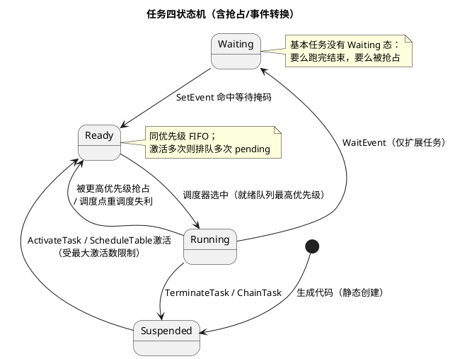

# 01-任务与调度

> 一句话定位：任务四状态机 + 优先级抢占调度是整栋 BSW 大楼的地基——所有 MainFunction 周期、事件等待、中断后重调度，都跑在这套 OSEK 血统的机制上。
> 等级：L2 ｜ 前置：[AUTOSAR第一课-一座城的分区图](../../../00-入门导读/01-AUTOSAR第一课-一座城的分区图.md)

## 原理

### 任务的一生：四状态机

四个状态一句话：**Suspended 没生（未激活）、Ready 排队（就绪）、Running 在跑、Waiting 等事件（挂起）**。调度器唯一要做的事：在每次调度点，从 Ready 队列里挑最高优先级上 CPU。

### 基本任务 vs 扩展任务

| 维度 | 基本任务（BASIC） | 扩展任务（EXTENDED） |
|---|---|---|
| 状态集 | 无 Waiting | 有 Waiting |
| 等待事件 | 不行，跑到 Terminate 为止 | WaitEvent 挂起等待 |
| 典型激活数 | 可多次（排队执行） | 通常 1 次 |
| 栈 | 可共享/静态复用，省内存 | 独立栈（挂起时现场必须保住） |
| 适用 | 周期性 MainFunction、纯算完就走 | 事件驱动：等报文、等按键、等状态 |
| 代价 | 灵活性低 | 内存开销大、上下文切换重 |

直觉：**"闹钟叫我干活"用基本任务，"活儿没到先睡觉"用扩展任务**。BSW 里 90% 的 MainFunction 任务都是基本任务。

### 三种抢占策略

| 策略 | 何时让出 CPU | 优点 | 缺点 | 适用 |
|---|---|---|---|---|
| 全抢占（FULLY） | 任何调度点（含高优就绪、API 调用） | 响应最快，高优任务延迟确定 | 切换开销大、需独立栈、共享数据必须加保护 | 通讯/控制类任务，现代项目默认 |
| 非抢占（NON） | 只在任务主动结束/API 让出点 | 无任务级竞争、共享区免锁 | 高优被低优长跑阻塞，抖动大 | 简单慢速后台活（如 NvM 刷写） |
| 混合（MIXED） | 部分任务标记为不可抢占 | 按需取舍 | 配置复杂、易配错 | 过渡方案，一般配 RES_SCHEDULER 替代 |

### 调度点（Scheduling Points）清单

OS 只在这些时刻重新挑任务，其余时间"打不还手"：

1. 任务**主动终止**：TerminateTask / ChainTask；
2. 任务**调用 OS 服务**：ActivateTask、SetEvent、ReleaseResource 等状态改变类 API 内部触发重调度；
3. **中断返回**：类别 2 中断（OS 管理的 ISR）执行完，返回前重调度——周期报文到达经 ISR 激活任务，走的就是这条路；
4. **WaitEvent**：任务自己交出 CPU；
5. 抢占发生时（本身就是一次调度点执行的产物）。

## 详解

**调度直觉**：静态优先级 + 就绪队列，永远跑"当前 Ready 的最高优先级"。没有时间片轮转——同优先级多个就绪任务按 FIFO 排队，前面不让，后面饿死。所以**优先级排布就是实时性设计**：周期短/ deadline 紧的任务给高优先级，慢速后台（NvM 写、诊断刷写）压最低。

**激活数（Activation）**：基本任务配多次激活（如 2），意思是允许"上一个还没跑完，下一个激活请求先排队"，排队上限即配置值，超了返回 E_OS_LIMIT。扩展任务多次激活极易配出问题，实践上配 1。

**栈的账**：非抢占任务跑完才换人，栈可以复用；全抢占任务随时可能被挂起，必须独立栈。配置 OsTaskStackSize 时留 20~30% 余量，并开栈水印检测（或 Hook 里量）再收。

**配置任务三步直觉**：① 定周期与 deadline → 排优先级（任务间拉开梯度，别扎堆同一优先级）；② 定类型（有没有等待需求）→ BASIC/EXTENDED；③ 按调用深度 + 最大中断帧估栈。

## 配置层

| 配置项 | 含义 | 典型值 | 易错点 |
|---|---|---|---|
| OsTaskType | BASIC / EXTENDED | MainFunction 用 BASIC | 基本任务里调 WaitEvent 返回 E_OS_ACCESS |
| OsTaskPriority | 静态优先级，数大者高（按栈约定） | 通讯>控制>后台，拉开梯度 | 同优先级扎堆，FIFO 互相拖延迟 |
| OsTaskActivation | 最大排队激活数 | BASIC 1~2，EXTENDED 1 | 配大无收益，激活风暴时掩盖问题 |
| OsTaskSchedule | FULLY / NON / MIXED | FULLY | NON 任务里长循环阻塞全体高优 |
| OsTaskStackSize | 任务栈（字节） | 512~2048，实测后定 | 只算局部变量不算调用链+中断帧 |
| OsTaskAutostart | 上电随 StartOS 自动激活 | 周期任务/初始化任务开 | 忘配：任务永远停在 Suspended，"代码在却从不跑" |
| OsTaskPeriod（经 Alarm/ST 关联） | 周期激活来源 | 10/20/100ms 对齐 | 周期没对齐 OS tick 的整数倍，抖动大 |

## 易错点与陷阱

1. **扩展任务配了多次激活**：事件等待与多次激活语义冲突，多数 OS 直接拒绝或运行时 E_OS_LIMIT；扩展任务保持 Activation=1。
2. **非抢占任务里写长循环/长延时**：所有高优任务被卡，现象是"整个 ECU 周期性卡顿"——用trace 抓任务切换时间线一眼看穿；改成全抢占+资源保护。
3. **同优先级任务互相排队**：以为设了优先级就有实时性，实际同级 FIFO；优先级要拉开，让"最不能等的"唯一最高。
4. **栈配小了先死在中断嵌套上**：任务本体够用，最深中断帧压栈即溢出；栈预算 = 调用链 + 最大 ISR 嵌套帧 + 余量。
5. **忘配 Autostart**：StartOS 后任务纹丝不动，调度器空转（只有 idle）；排障第一问：这个任务谁激活（Autostart/Alarm/事件）？
6. **把抢占当万能**：全抢占下共享数据裸奔，偶发数据撕裂；必须配资源/临界区（见[02-事件与资源](02-事件与资源.md)）。

## 面试高频题

- **Q：画出任务四状态机，指出扩展任务独有的状态与转换。**
  A：Waiting 独有；进入靠 WaitEvent，离开靠 SetEvent 命中等待掩码回到 Ready；基本任务没有该状态。
- **Q：AUTOSAR OS 有哪些调度点？为什么中断返回也是调度点？**
  A：任务终止、状态改变类 API 调用、WaitEvent、中断返回。类别 2 ISR 可能激活了更高优任务，返回用户级前必须重调度，否则激活被延迟到下一次调度点。
- **Q：全抢占 vs 非抢占怎么选？**
  A：看延迟确定性要求：通讯/控制选全抢占（共享区加锁）；慢速后台、无实时要求、想省栈与切换开销选非抢占；实际项目里混合 + RES_SCHEDULER 制造"可控不可抢占区"最常见。
- **Q：基本任务为什么省内存？**
  A：不可等待（无 Waiting），运行完即终止，栈在终止后可被其他基本任务复用（栈复用机制）；扩展任务挂起现场必须永久保留独立栈。

## 延伸

- [02-事件与资源](02-事件与资源.md)：Waiting 态的燃料与共享数据的锁；
- [03-Alarm与ScheduleTable](03-Alarm与ScheduleTable.md)：谁在周期性 ActivateTask；
- [04-Hook](04-Hook.md)：PreTask/PostTask 打点看调度行为；
- [04-WdgM联动](../../../../04-MCAL与外设驱动/2-L2进阶/Wdg/04-WdgM联动.md)：任务排布如何影响被监督的 Alive 节奏；
- [AUTOSAR第一课-一座城的分区图](../../../00-入门导读/01-AUTOSAR第一课-一座城的分区图.md)：OS 在分层中的位置。
