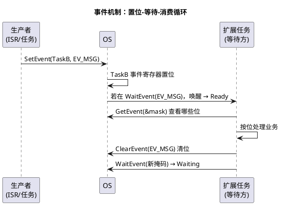
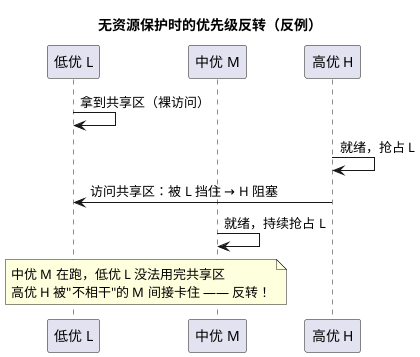

# 02-事件与资源

> 一句话定位：事件给扩展任务"睡觉等活儿"的能力，资源用优先级天花板给共享数据"上锁不反转"的秩序——一静一动，撑起 OS 的同步世界。
> 等级：L2 ｜ 前置：[01-任务与调度](01-任务与调度.md)

## 原理

### 事件机制：掩码位 + 单播投递

事件不是队列，是**挂在某个任务上的一组二进制位（掩码）**，只有该任务自己能消费：



- `SetEvent(TaskID, Mask)`：给目标任务置位（ISR/任务均可，跨任务指定）；
- `WaitEvent(Mask)`：当前任务挂起，直到 Mask 中任一位被置位（进入 Waiting，见 01 状态机）；
- `GetEvent(TaskID, &Events)`：读当前事件位（不清除）；
- `ClearEvent(Mask)`：只有任务自己清自己的位。

### 资源与调度：优先级天花板防反转



OS 的解法——**优先级天花板协议（Priority Ceiling）**：

- `GetResource(ResID)`：任务优先级被抬到该资源配置的**天花板优先级**（≥ 所有会用它的任务的最高优先级）；
- 抬升期间，中优任务 M 再也插不进来，低优 L 必然很快 Release；
- `ReleaseResource(ResID)`：降回原优先级，触发重调度。
- 天花板协议一次只允许持有一个资源（标准资源约束），从机制上掐死死锁。

### 内部资源与 RES_SCHEDULER

`RES_SCHEDULER` 是 OS 预置的内部资源，**天花板 = 系统最高任务优先级**：GetResource(RES_SCHEDULER) 等价于"关闭任务级抢占"（中断仍然进）。三个用途：短临界区免自旋、混合抢占实现、保护非重入库函数。注意它只挡任务不挡 ISR——挡中断要 Ioc/平台层关中断原语。

## 详解

**扩展任务事件循环骨架**（事件驱动任务的通用长相）：

```c
TASK(Task_RxMsg)                       /* 扩展任务，Activation=1 */
{
    EventMaskType ev;
    for (;;)                           /* 永不 Terminate */
    {
        (void)WaitEvent(EV_CAN_RX | EV_TIMER | EV_ERROR);
        (void)GetEvent(Task_RxMsg, &ev);
        (void)ClearEvent(ev);           /* 先取后清，处理新来的位 */
        if (ev & EV_CAN_RX)  { /* 收帧处理 */ }
        if (ev & EV_TIMER)   { /* 周期超时 */ }
        if (ev & EV_ERROR)   { /* 差错善后 */ }
    }                                  /* 回到 WaitEvent 继续睡 */
}
```

要点：**循环体内不等待、不 Terminate**；GetEvent/ClearEvent 成对；事件处理要快，慢活儿用 ActivateTask 转给别的任务。

**死锁四条件**（互斥、持有并等待、不可剥夺、循环等待）一句带过：OS 的标准资源机制靠"**一次只持一个资源 + 天花板抬升**"直接破坏后两条，所以标准资源间不会死锁；死锁风险全在**你绕过 OS 资源、自造的锁**（裸全局 flag、平台层互斥）里。

## 配置层

| 配置项 | 含义 | 典型值 | 易错点 |
|---|---|---|---|
| OsEvent | 定义事件（掩码位） | EV_CAN_RX=0x01 等，与任务绑定 | 事件不挂任务无法被等待 |
| OsTaskEventRef | 扩展任务的事件集 | 按需 2~4 个 | 挂一堆不用的事件，掩码管理混乱 |
| OsResource | 资源定义 + 天花板优先级 | 天花板=使用者最高优先级 | 天花板配低了，反转照旧 |
| OsResourceProperty | STANDARD / INTERNAL / LINKED | 共享数据 STANDARD | INTERNAL 当数据锁用，语义错位 |
| OsResourceAccessingTask/App | 谁能用这个资源 | 只列真正共享的双方 | 全员可访问=天花板变成全局锁 |
| RES_SCHEDULER | 预置内部资源 | 天花板=最高任务优先级 | 大段代码包进去，系统"伪非抢占" |

## 易错点与陷阱

1. **事件不清除**：GetEvent 只读不清，忘 ClearEvent 的位永远命中，WaitEvent 立即返回——扩展任务退化成 100% 占空比空转；口诀"取、清、干、睡"。
2. **在持有资源时 WaitEvent**：任务持资源期间挂起等待，其他等资源的任务被无限期阻塞（标准 OS 禁止此组合，返回 E_OS_RESOURCE）；临界区内只做内存操作，绝不等事件。
3. **GetResource/ReleaseResource 不配对**：提前 return 跳过 Release，任务带着高优先级跑完全程——低优任务"莫名"压制全体；用成对宏或 RAII 风格包装。
4. **天花板优先级配错**：新增一个高优使用者后忘了抬天花板，保护失效反转复现；资源使用者清单变更必须同步评审天花板。
5. **基本任务调 WaitEvent**：E_OS_ACCESS；基本任务没有 Waiting 态，等待需求应升级为扩展任务或拆出事件任务。
6. **拿 RES_SCHEDULER 当万能锁**：把毫秒级业务包进 GetResource(RES_SCHEDULER)，全系统任务级停摆；它只该包住几十微秒级的短临界区。

## 面试高频题

- **Q：事件和信号量/队列的区别？**
  A：事件是"任务私有的一组布尔位"，无计数、无数据、不排队，只负责唤醒；传数据靠全局缓冲+资源保护，或 RTE/IOC 通道。
- **Q：优先级反转是什么？天花板协议怎么防？**
  A：低优持有共享区、高优等它、中优反复抢 CPU，高优被中优间接阻塞；GetResource 把持有者抬到天花板（≥所有使用者的最高优先级），中优再也插不进来，阻塞时长收敛为低优的临界区长度。
- **Q：RES_SCHEDULER 和关中断有什么区别？**
  A：RES_SCHEDULER 只关任务级抢占（天花板=最高任务优先级），ISR 照常执行，延迟小、适合短临界区；关中断连 ISR 一起挡，抖动大，只用于极短原语。
- **Q：为什么标准资源机制下不会死锁？**
  A：一次只允许持有一个资源且天花板抬升打破循环等待；死锁四条件中的"循环等待"与"持有并等待"被同时破坏。

## 延伸

- [01-任务与调度](01-任务与调度.md)：Waiting 态的来源；
- [03-Alarm与ScheduleTable](03-Alarm与ScheduleTable.md)：Alarm 的到期动作之一就是 SetEvent；
- [04-Hook](04-Hook.md)：ErrorHook 里抓 E_OS_* 错误码的姿势；
- [03-核间通讯与共享资源](../../../../02-芯片与体系结构/3-L3高级/多核架构/03-核间通讯与共享资源.md)：跨核共享时资源不够用，得上 SpinLock；
- [05-多核OS](05-多核OS.md)：核间互斥的续篇。
