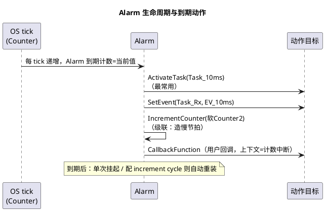
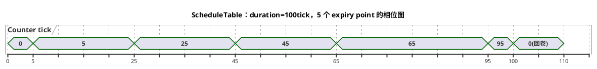

# 03-Alarm与ScheduleTable

> 一句话定位：OS 里所有"按时间干活"的活儿都由 Counter 驱动——Alarm 是单点定时器，ScheduleTable 是带相位的时序脚本，RTE 的周期采样、任务激活全靠它们。
> 等级：L2 ｜ 前置：[01-任务与调度](01-任务与调度.md)

## 原理

### 共同的地基：Counter

Counter 是 OS 的"心跳计数器"（软 Counter 由 OS tick 递增，或硬件 Counter 由 GPT 驱动）。Alarm 和 ScheduleTable 都是**挂在某个 Counter 上的到期机制**——先有 tick，再有定时。

### Alarm：单点闹钟

- **绝对/相对设置**：`SetAbsAlarm`（到绝对计数值）/ `SetRelAlarm`（过 N tick）；
- **循环**：配了 `OsAlarmAutostart(cycle>0)` 或 SetRelAlarm 带 cycle 参数，到期自动重置（递增重置）；cycle=0 则单次；
- **到期动作四选一**：ActivateTask / SetEvent / IncrementCounter / 回调函数。

### ScheduleTable：带相位的时序脚本

一个 ScheduleTable 在**一个 duration（总长）**内定义一串 **expiry point**，每个点带独立偏移和自己的动作集（可同时激活多个任务/置多个事件），点与点之间还能定义 default action 填空档：

文字版相位表（duration=100 tick，tick=1ms）：

| expiry point | 偏移 | 动作 |
|---|---|---|
| EP_Fast | 5 | ActivateTask(Task_5ms) |
| EP_Com  | 25 | ActivateTask(Task_20ms_A) |
| EP_App  | 45 | ActivateTask(Task_20ms_B) |
| EP_Diag | 65 | SetEvent(Task_Rx, EV_DIAG) |
| EP_Slow | 95 | ActivateTask(Task_100ms) |

核心价值：**相位可控**——20ms_A 在 25、20ms_B 在 45，错峰跑，CPU 峰值被摊平；Alarm 各自独立计数，想精确错峰只能人肉凑偏移，还受各自累计误差影响。

### 显式 vs 隐式同步

| 同步方式 | 谁提供相位 | 机制 | 适用 |
|---|---|---|---|
| 隐式（IMPLICIT） | 跟随所挂 Counter 自身 | 表内部连续推进，duration 必须**整除** Counter 周期 | ECU 内部时序（默认） |
| 显式（EXPLICIT） | 外部持续校准 | `SyncScheduleTable` 不断喂"绝对相位"，表自动拉扯（EXACT/NEXT 帧） | 与外部主时钟对齐：FlexRay 全局时间、与网关 ECU 同拍 |

显式同步没喂或喂晚了，表进入 RUNNING→同步丢失状态，expiry point 精度退化甚至重启。

### Alarm vs ScheduleTable 选型

| 维度 | Alarm | ScheduleTable |
|---|---|---|
| 触发点 | 单点（循环则等间隔） | 多点、任意偏移、单 duration 内编排 |
| 相位控制 | 无（各自独立累计） | 强（点间相位固定、错峰） |
| 与外部同步 | 无 | 显式同步（FlexRay 等） |
| 配置复杂度 | 低，三五行 | 高，要设计 duration 与点集 |
| 典型场景 | 单个周期任务、超时看护 | RTE 周期采样表、多任务错峰编排、FlexRay 通信调度 |

选型直觉：**一个点的事找 Alarm，一串带相位的事找 ScheduleTable**。EB tresos/Vector 工程里，SchM 生成的周期调度几乎全是 ScheduleTable。

## 配置层

| 配置项 | 含义 | 典型值 | 易错点 |
|---|---|---|---|
| OsCounterMaxAllowedValue | 计数回卷上限 | tick=1ms、回卷 0xFFFF | Alarm 绝对值超上限，设置失败 |
| OsCounterTicksPerBase | 每单位 tick 数 | 1 | 影响 Alarm 参数单位换算 |
| OsAlarmAutostart | 上电自动启动（alarmtime/cycle） | alarmtime=相位偏移，cycle=周期 | 相对/绝对语义弄混，首个周期错位 |
| OsAlarmAction | 到期动作 | ACTIVATETASK 居多 | 回调动作跑在中断上下文，不能调阻塞 API |
| OsScheduleTableDuration | 表总长（tick） | = 公倍数周期（如 100tick） | 必须能被 Counter 周期整除（隐式） |
| OsScheduleTableExpiryPoint | 各点偏移+动作 | 5/25/45/65/95 错峰 | 所有点都堆在偏移 0，相位编排白做 |
| OsScheduleTableSyncStrategy | NONE/IMPLICIT/EXPLICIT | ECU 内部 NONE/IMPLICIT | 配 EXPLICIT 却没人调 SyncScheduleTable，表永远追不上 |
| OsScheduleTableRepeat | 到期后是否重启 | 无限重复 | duration 结束不重复，后半场全静默 |

## 易错点与陷阱

1. **Alarm 单位换算错**：配置里的"tick"≠毫秒，忘了乘 OsCounterTicksPerBase 或换算 GPT 频率，实际周期差若干倍；改配置后必用 GPIO 翻转+示波器（或 OS trace）核一次。
2. **Autostart 的 alarmtime 用了绝对语义**：StartOS 后 Counter 已走了几 tick，绝对值立刻过期或迟到；一般用相对偏移。
3. **ScheduleTable duration 不整除 Counter 周期**：隐式同步下表推进与计数回卷打架，OS 拒绝启动或相位漂移；duration 必须整除。
4. **expiry point 全挤在 0/1 偏移**：等于把错峰编排退化为同拍爆发，CPU 峰值超标、低优任务被挤丢；点集设计要画时序条带图。
5. **显式同步没人喂**：FlexRay 时间主丢失/上层没调 SyncScheduleTable，表精度退化；要配同步丢失的处理策略（重启表/切隐式）。
6. **CancelAlarm 后当单次**：带 cycle 的 Alarm 到期自动续，不 Cancel 就一直响；单次需求 cycle=0。

## 面试高频题

- **Q：Alarm 和 ScheduleTable 都是周期机制，本质区别？**
  A：Alarm 是"Counter 上的一只单点闹钟"（可循环）；ScheduleTable 是"一个 duration 内的相位化动作脚本"，点间相位精确可控、支持显式外部同步。
- **Q：怎么把多个 10/20/50ms 任务排得 CPU 不冲顶？**
  A：用 ScheduleTable 的 expiry point 错峰：同周期任务分不同偏移点，短周期点靠前、慢任务点靠后；比 Alarm 人肉凑偏移稳。
- **Q：隐式和显式同步分别什么时候用？**
  A：隐式=ECU 内部节拍（表跟随 Counter，duration 整除计数周期）；显式=要与外部时钟对齐（FlexRay 全局时间），需周期调 SyncScheduleTable 喂相位。
- **Q：RTE 的周期 runnable 是谁在驱动？**
  A：生成代码把同周期 runnable 打包进 OS 任务，任务由 ScheduleTable/Alarm 周期激活——RTE 只是搬运工，心跳来自 OS 定时机制。

## 延伸

- [01-任务与调度](01-任务与调度.md)：被激活任务的状态流转；
- [02-事件与资源](02-事件与资源.md)：expiry point 的另一动作 SetEvent 消费端；
- [04-Hook](04-Hook.md)：PreTask 打点验证各 expiry point 实际相位；
- [SchM与调度目录](../../SchM与调度/README.md)：RTE/BSW 调度表生成侧的全景；
- [05-多核OS](05-多核OS.md)：多核下 Counter/表按核独立配置。
