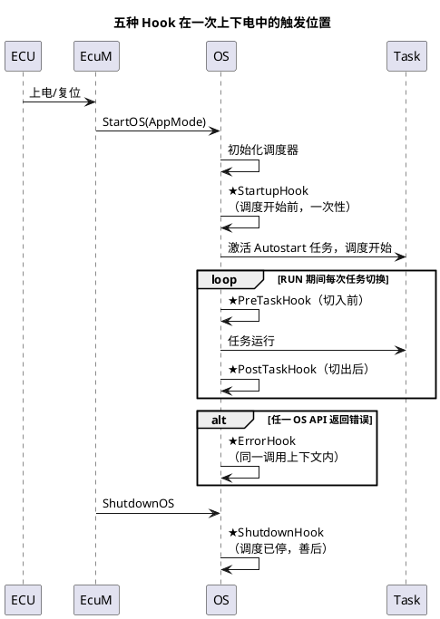

# 04-Hook

> 一句话定位：Hook 是 OS 留给集成者的五个"官方后门"——启动收尾、停机善后、任务切换打点、错误集中收口，全都在 OS 上下文里跑，用错上下文就是自爆点。
> 等级：L2 ｜ 前置：[01-任务与调度](01-任务与调度.md)

## 原理

### 五种 Hook 一览



| Hook | 触发时机 | 上下文 | 典型用途 |
|---|---|---|---|
| StartupHook | StartOS 内、**调度器启动前** | OS 启动上下文，中断多未开 | 校验复位源、初始化 OS 管不到的外设、启动性能计时 |
| ShutdownHook | ShutdownOS 内，**调度已停止** | 类似启动上下文 | 记录停机原因、点亮故障灯、最后一条日志 |
| PreTaskHook | 每次切入任务**前** | 任务级上下文 | 切调试 GPIO、性能打点起点、任务进入 trace |
| PostTaskHook | 每次切出任务**后** | 任务级上下文 | 性能打点终点、任务退出 trace、CPU 占用统计 |
| ErrorHook | 任一 OS 服务返回非 E_OK **时** | 与出错调用同一上下文 | 集中收口 OS 错误：取错误码、报 Det、计数 |

### 上下文限制：能调什么 API

Hook 不是任务，**不是所有 OS 服务都合法**，非法调用返回 E_OS_CALLEVEL：

- **StartupHook**：可调 ActivateTask（预热激活）、GetActiveApplicationMode 等；不可等事件、不可依赖已运行调度；
- **ShutdownHook**：调度器已停，几乎只剩"无副作用"的读操作与用户级收尾，别再指望任务/事件；
- **PreTaskHook/PostTaskHook**：任务级上下文，多数查询类 API 可用；**禁止** TerminateTask/ChainTask（改变当前任务状态）等调度破坏类调用；它们在每次任务切换都执行，必须**短、确定、无业务逻辑**；
- **ErrorHook**：与出错调用同上下文（可能是 ISR 级）——只做"取证"：GetTaskID / GetServiceID / OSError_* 宏，然后转发（Det/计数/置全局标志），**绝不在里面重试同一调用**，否则错误递归爆栈。

## 详解

**典型用法一：PreTask/PostTask 性能打点（调试期利器）**

```c
TASK(Task_10ms) { /* 业务 */ TerminateTask(); }

void PreTaskHook(void)
{
    Gpt_StartTimer(TIMER_PROFILE);          /* 或翻转调试 GPIO */
}

void PostTaskHook(void)
{
    /* 也可用 GetTaskID 关联到具体任务，记入 trace 缓冲 */
}
```

任务级切换每次都进 Hook，**发布版务必编译开关裁掉**（见易错点）。调试期用它画任务执行时间线（配逻辑分析仪抓 GPIO），比盯示波器猜高效得多。

**典型用法二：ErrorHook 集中报 Det**

```c
#include "Det.h"
void ErrorHook(StatusType Error)
{
    TaskType tid;
    (void)GetTaskID(&tid);                       /* 出错现场：哪个任务 */
    (void)Det_ReportError(OS_MODULE_ID, 0U,
        OSErrorGetServiceId(), (uint8)Error);    /* 哪个服务 + 错误码 */
    OsErrCount[Error]++;                          /* 供上位机/日志读 */
}
```

OSErrorGetServiceId() 告诉你**哪个 API 出错**，参数级细节用 OSError_xxx_yyy 宏取——这两个宏是排障时唯一的"黑匣子"，调试器里在 ErrorHook 下断点，一次抓现行。

## 配置层

| 配置项 | 含义 | 典型值 | 易错点 |
|---|---|---|---|
| OsStartupHook / use | 启用 StartupHook | true | 初始化代码放错阶段（应放 EcuM 阶段一） |
| OsShutdownHook | 启用 ShutdownHook | true | 里面调任务类 API 全部无效 |
| OsPreTaskHook / OsPostTaskHook | 启用任务切换钩子 | 调试期 true / 量产 false | 忘裁剪：每秒数千次切换全多跑钩子 |
| OsErrorHook | 启用错误钩子 | true | 钩子里调会出错的 API，递归进 Hook |
| OsErrorHook 裁剪开关 | 量产可整体去掉 | Det 关时一并关 | 上报通道（Det）已裁而 Hook 还在，白跑 |
| profile 开关（工具链选项） | 生成打点代码 | 仅 DEBUG 配置开 | 发布版误开，时序变慢还查不出原因 |

## 易错点与陷阱

1. **Hook 里调非法 API**：典型是 ShutdownHook 里 ActivateTask、PreTaskHook 里 WaitEvent——返回 E_OS_CALLEVEL 且未必有 ErrorHook 能兜（某些 OS 在 Hook 内出错不上报）；对照 SWS 的"允许服务表"逐条过。
2. **PreTask/PostTask 忘裁剪**：两钩子每次任务切换都跑，量产还开着 printf 之类，CPU 白烧几个百分点、抖动变大；用编译开关（如 `#if OS_PROFILE`）整段裁。
3. **ErrorHook 里重试/递归**：在 ErrorHook 里再调 OS 服务又失败，再次进 ErrorHook，栈迅速见底；Hook 只取证转发，重试逻辑放任务里做。
4. **把业务逻辑塞进 Hook**：Hook 无周期保证、上下文受限，塞通信/诊断逻辑必出幺蛾子；Hook 只做观测与极短收尾。
5. **StartupHook 里开中断/长初始化**：此阶段 OS 调度未启动，长活儿会推迟首个任务几个毫秒级 tick，唤醒类时序敏感项目直接超时；重初始化放 EcuM 阶段，Hook 只留校验级代码。
6. **误以为 ErrorHook 能覆盖一切错误**：它只接 OS 服务的返回错误（E_OS_*），BSW 模块错误走 Det，硬件异常走 Trap/CPU 异常——三条道别混。

## 面试高频题

- **Q：五种 Hook 各自的触发时机？**
  A：StartupHook=StartOS 后调度启动前一次；ShutdownHook=ShutdownOS 调度停止后一次；Pre/PostTaskHook=每次任务切入/切出；ErrorHook=任一 OS 服务返回错误时（与调用同上下文）。
- **Q：ErrorHook 里怎么知道是哪个 API、什么错误？**
  A：GetServiceId/OSErrorGetServiceId() 拿服务号，入参 Error 是错误码，参数细节用 OSError_<service>_<param> 宏取；标准姿势是取证后报 Det/计数，不重试。
- **Q：PreTaskHook 能调 TerminateTask 吗？**
  A：不能——钩子上下文里改变当前任务状态的调度类服务非法，返回 E_OS_CALLEVEL。
- **Q：量产版怎么处理这些钩子？**
  A：Pre/PostTask 打点类整段编译裁剪；ErrorHook 保留轻量计数（或与 Det 一并按配置裁）；Startup/ShutdownHook 保留极短收尾，保证停机可观测。

## 延伸

- [01-任务与调度](01-任务与调度.md)：任务切换即 Pre/PostTask 的触发源；
- [02-事件与资源](02-事件与资源.md)：E_OS_RESOURCE 等错误码在 ErrorHook 的取证对象；
- [05-多核OS](05-多核OS.md)：每核独立的 Hook，错误上下文按核区分；
- [Det 错误追踪](../Det与Dlt/01-Det.md)：ErrorHook 的错误出口；
- [EcuM 上下电时序](../EcuM/02-上下电时序.md)：Startup/ShutdownHook 在生命周期中的准确位置。
