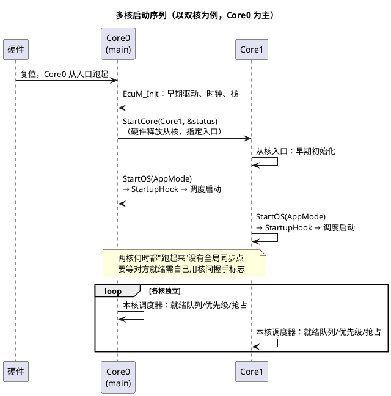

# 05-多核OS

> 一句话定位：多核 OS 的核心只有三件事——核各自跑一份调度器（任务静态绑定不迁移）、核间互斥换 SpinLock（短平快）、跨核数据走 IOC（OS 内建的零拷贝通道）。
> 等级：L2→L3 ｜ 前置：[01-任务与调度](01-任务与调度.md)

## 太长不看

> - 人话直觉：多核不是"一个 OS 管多个核"，而是"每个核一套调度器 + 一个小邮局"——任务生在哪个核、死在哪个核，核间只递条不搬家。
> - 本篇解决：多核怎么启动、跨核数据/互斥怎么做、哪些单核直觉在这里会翻车。
> - 赶时间记住：①任务静态绑定核（无迁移）；②核间临界区用 SpinLock，持锁期间禁止调度类 OS API；③跨核通信优先 IOC，语义见 RTE 目录。

## 原理

### 多核启动序列

关键认知：**Core0 是主核**（先跑 EcuM_Init，负责 StartCore 唤醒从核）；从核的初始化顺序、何时开始调度，由集成者保证，OS 不替你做全局同步。

### 任务静态绑定：没有"任务迁移"

- 任务在配置期通过 OsApplication→Core 绑定到核，**运行期不可迁移**（AUTOSAR OS 明确不做负载均衡）；
- 每核独立的优先级空间、就绪队列、调度器；01 篇的状态机在每核内照旧成立；
- "这个任务偶尔跑 Core0、偶尔跑 Core1"不存在——想拆负载，就把任务按核拆份（如 Com 通讯放 Core0、应用算法放 Core1）。

### 核间互斥：SpinLock

单核的 GetResource 抬优先级就够；跨核时对方核不看你优先级，**必须自旋等待**：

- `GetSpinlock(lock)`：锁空闲则取走；被占则原地自旋（占着 CPU 空转），直到对方释放；
- 持锁约束（SWS 硬性规定）：**持 SpinLock 期间禁止调用阻塞/调度类 OS API**（TerminateTask、WaitEvent、GetResource 等）——自旋方在等，持锁方若睡眠等于互殴死锁；锁区必须几十微秒级；
- 核内嵌套：可配 lock 方法（`LOCK_ALL_INTERRUPTS` / `LOCK_CAT2_INTERRUPTS` / 无锁中断），决定持锁时本核中断是否被压住；
- 顺序纪律：多把 SpinLock 必须按全局配置顺序获取，乱序=跨核死锁（这次天花板协议救不了你）。

### 跨核数据：IOC

IOC（Inter-OS-Application Communicator）是 OS 内建的跨核/跨 OS-Application 数据通道，配置器生成收发接口（`IocSend_<group>` / `IocReceive_<group>`），支持队列/非队列语义，无需手写共享缓冲+锁。SWC 跨核通信则由 RTE 生成 IOC 包装（概念与模式详见 [RTE 目录](../../../3-L3高级/RTE/README.md)）。

一句话分工：**裸 BSW 跨核传数用 IOC 直配，SWC 跨核口由 RTE 自动落成 IOC**。

## 详解

**典型分核方案**（域控/网关常见）：Core0=通讯栈（Can/Ethernet/Com/PduR）+ 诊断；Core1=应用算法+控制；共享区只有 Com 信号缓冲与 NvM 镜像，分别用 SpinLock/IOC 保护。核间中断（`ActivateTask` 跨核激活、核间通知）由 OS 用核间中断实现，对用户表现为"跨核 ActivateTask 会在目标核排队"。

**哪些单核直觉会翻车**：
1. "优先级最高的任务最先跑"——只在**本核**成立，跨核比总负载没意义；
2. "GetResource 保护共享区"——跨核无效，换 SpinLock；
3. "全局变量直接读写"——无锁跨核读写是数据撕裂之源；
4. "中断优先级压住任务就安全"——对方核的中断不归你管。

## 配置层

| 配置项 | 含义 | 典型值 | 易错点 |
|---|---|---|---|
| OsApplication→CoreAssignment | OS-Application（任务集合）绑核 | Com 栈→Core0，应用→Core1 | 绑核后想"挪一挪"=重新分区级改动 |
| OsSpinLock | 定义自旋锁 | 只给真正跨核共享的资源 | 每个共享区一把，锁粒度过大自旋排队 |
| OsSpinLockLockMethod | 持锁时压中断范围 | LOCK_CAT2_INTERRUPTS 常用 | 方法不匹配：锁内被本核中断重入 |
| Spinlock 顺序 | 获取顺序配置 | 全局线性顺序表 | 两核反序获取两把锁=跨核死锁 |
| IocSender/Receiver | IOC 通道两端（跨核） | 数据队列 1~4 深 | 队列溢出丢数据没接通知 |
| StartCore 时机 | 从核启动点 | EcuM 阶段一末尾 | 从核跑了、共享外设还没初始化 |
| 核间激活 | 跨核 ActivateTask/SetEvent | 用于从核事件注入 | 忘记从核目标核的 AppMode 对齐 |

## 易错点与陷阱

1. **持 SpinLock 期间调调度类 API**：返回 E_OS_SPINLOCK（或直接死锁——对方核在自旋等你，你却在等调度）；锁区内只做共享内存读写，先取数后出锁再处理。
2. **锁区太长**：自旋是烧 CPU 的等待，锁区里跑微秒级以上循环，对方核利用率虚高、实时性崩；量级警戒线：几十微秒。
3. **多锁乱序**：Core0 按 A→B、Core1 按 B→A 取锁，经典互等；SpinLock 顺序在配置期定死并 code review。
4. **跨核裸共享变量**：无 IOC/无锁的 `volatile` 全局在两核读写，偶发撕裂；要么 IOC，要么 SpinLock+短临界区。
5. **从核初始化抢跑**：StartCore 后从核立刻访问 Core0 还没初始化好的共享外设/缓存区；要握手门（全局 ready 标志+屏障）。
6. **以为 OS 会做负载均衡**：静态绑定是设计约束，分核失衡只能改配置重发，不能运行时调；分核方案要早期架构评审。

## 面试高频题

- **Q：AUTOSAR 多核 OS 为什么不允许任务迁移？**
  A：可迁移任务要求栈/上下文全局可迁、优先级全局统一、缓存亲和性差，实时性不可分析；静态绑定让每核调度行为确定、WCET 可算，符合车载实时与安全分析需求。
- **Q：SpinLock 和 Resource 的区别？什么场景用哪个？**
  A：Resource=核内优先级天花板，不忙等（持锁方不会被第三方抢占）；SpinLock=跨核忙等，持锁方不许睡眠。同核共享用 Resource，跨核共享必须 SpinLock。
- **Q：持 SpinLock 时为什么不能调 TerminateTask/WaitEvent？**
  A：持锁方睡眠会让自旋等待方无限空转（核白白烧死），且睡眠方无法保证释放时机；SWS 直接禁止持锁期间调用阻塞/调度类服务。
- **Q：IOC 是什么？和 RTE 什么关系？**
  A：OS 提供的跨 OS-Application/跨核数据通道，配置器生成收发函数；SWC 跨核端口通信由 RTE 底层自动生成 IOC 实现——裸 BSW 用 IOC 直配，SWC 层无感。

## 延伸

- [01-任务与调度](01-任务与调度.md)：每核内的调度基本盘；
- [02-事件与资源](02-事件与资源.md)：核内同步机制，跨核失效的边界；
- [01-主从核启动](../../../../02-芯片与体系结构/3-L3高级/多核架构/01-主从核启动.md)：硬件视角的核启动；
- [03-核间通讯与共享资源](../../../../02-芯片与体系结构/3-L3高级/多核架构/03-核间通讯与共享资源.md)：一致性、缓存与共享内存底层；
- [RTE 目录](../../../3-L3高级/RTE/README.md)：SWC 跨核通信如何落成 IOC。
- 工程深入场景：域控制器把 SecOC/PduR 放 Core0、应用算法放 Core1，跨核经 IOC 传 PDU 镜像——排障时先看 SpinLock 峰值占用与 IOC 队列水位，再查分核中断负载均衡；Aurix TC377 还要叠加 STM 时钟与核间中断（SRC）路由的平台细节。
