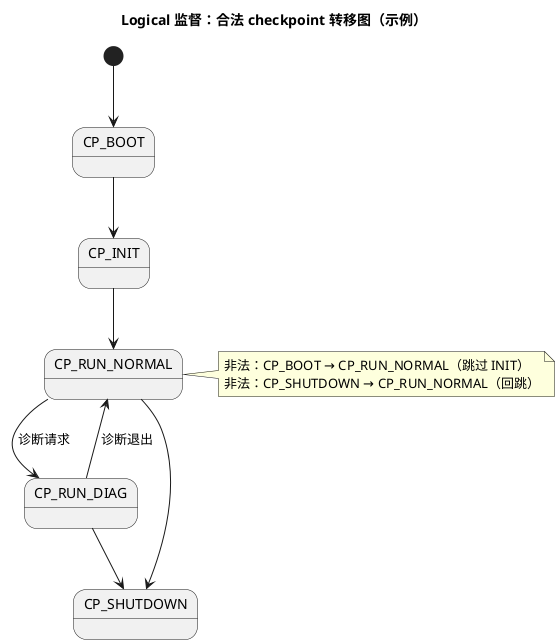

# 01-监督实体与checkpoint

> 一句话定位：直接喂硬件狗只证明"CPU 还在转"，WdgM 用监督实体+checkpoint 把"程序流走对了没"变成可检查项——喂狗的资格从"活着"升级为"活对了"。
> 等级：L2 ｜ 前置：[AUTOSAR第一课-一座城的分区图](../../../00-入门导读/01-AUTOSAR第一课-一座城的分区图.md)

## 原理

### 为什么 MCAL Wdg 不够

裸喂狗（任务里定时刷 WDT 寄存器）只防"CPU 死机"：一个卡在 while(1) 里的任务照样能把狗喂活——**喂狗 ≠ 逻辑对**。WdgM 在驱动之上加一层监督抽象：被监督代码在关键点"打卡"（checkpoint），WdgM 检查打卡的**次数、间隔、顺序**，全对了才替你喂狗。

### 监督实体（SE）与 checkpoint

```plantuml
@startuml
title WdgM 分层：打卡-判定-喂狗
skinparam defaultFontName "Microsoft YaHei"
package "被监督对象" {
  [SE1：Task_10ms\nCP: INIT → RUN → END] as S1
  [SE2：Task_Init\nCP: BOOT → VALID] as S2
  [SE3：主循环\nCP: A → B → C（合法顺序图）] as S3
}
package "BSW 服务层" {
  [WdgM 监督引擎\nWdgM_MainFunction 周期检查]
}
package "MCAL" {
  [Wdg 驱动]
}
[硬件 WDT]
S1 --> [WdgM 监督引擎] : WdgM_CheckpointReached(SE,CP)
S2 --> [WdgM 监督引擎] : 打卡
S3 --> [WdgM 监督引擎] : 打卡
[WdgM 监督引擎] --> [Wdg 驱动] : 全体健康 → Wdg_SetTriggerCondition
[Wdg 驱动] --> [硬件 WDT] : 喂狗
note bottom of [WdgM 监督引擎] : 任一 SE 违规 → 本地状态 FAILED/EXPIRED\n→ 停止喂狗/触发失效反应（见 02 篇）
end note
```

- **监督实体（Supervised Entity, SE）**：一个被监督的执行流单元（一个任务、一个初始化流程、一个状态机）；
- **checkpoint**：SE 内的打卡点，`WdgM_CheckpointReached(SE, CP)` 上报"我到了这里"；checkpoint 是三种监督共同的数据源——**没有打卡，一切监督都是空谈**。

### 三种监督方式

| 监督方式 | 检查什么 | 违规判定 | 防什么 | 直觉 |
|---|---|---|---|---|
| Alive（活监督） | 监督周期内某 CP 到达**次数** ∈ [min,max] | 次数太少（卡死）/太多（狂转、重复激活风暴） | 任务停转 | "活够次数，别刷屏" |
| Deadline（期限监督） | 两个 CP **之间**的时长 ∈ [min,max] | 太慢（阻塞）/太快（跳过了工作） | 阶段超时/异常加速 | "这段路用时正常吗" |
| Logical（逻辑监督） | CP 到达**顺序**符合预定义合法图 | 走了非法边/跳步/回跳 | 控制流跑偏 | "走的路线对吗" |

**Logical 的合法顺序图**（用状态图表达 checkpoint 间的合法转移）：



### 与 Wdg 驱动的分层

WdgM 是**决策层**（判"值不值得续命"），Wdg（MCAL）是**执行层**（摸狗头）：WdgM_MainFunction 每轮汇总全部 SE 状态，全体健康才调 `Wdg_SetTriggerCondition`；任何 SE 进 EXPIRED 就停止喂，硬件狗到期复位。两层联动细节（含 EcuM 各阶段的模式切换）见 [04-WdgM联动](../../../../04-MCAL与外设驱动/2-L2进阶/Wdg/04-WdgM联动.md)，硬件狗本身见 [01-看门狗原理](../../../../04-MCAL与外设驱动/2-L2进阶/Wdg/01-看门狗原理.md)。

## 详解

**checkpoint 埋点直觉**：
- 周期任务：Alive 监督，循环末一个 CP 即可（打卡次数=监督周期/任务周期）；
- 初始化流程：Deadline 监督 BOOT→VALID 之间（超时=初始化卡住，比如等一个永不到来的传感器应答）；
- 有模式/分支的流程：Logical 监督，每个模式入口一个 CP，配合法转移表；
- 打卡要放在**"工作做完了"的位置**，放循环开头只能证明"被打断了"，不能证明"干完活"。

**一次 Alive 判定的数学**：设监督周期 1s、任务周期 10ms、CP 在循环末，期望到达次数 100；配 margin ±20% → 允许 [80,120]。任务被高优偶尔延迟几次没问题（次数型监督对单次抖动天然免疫），但持续卡死立即越界——这就是"次数监督比时刻监督健壮"的原因。

**喂狗链路全景**：CP 打卡 → WdgM 记账 → WdgM_MainFunction 判定 → 健康：Wdg_SetTriggerCondition(剩余时间) → Wdg 寄存器操作 → 硬件 WDT 不咬；异常：不喂/切模式 → WDT 到期 → 复位。任何一环断（任务卡/引擎没跑/驱动错）最终都由硬件狗兜底。

## 配置层

| 配置项 | 含义 | 典型值 | 易错点 |
|---|---|---|---|
| WdgMSupervisedEntity | 监督实体（含 CP 集合） | 关键任务/流程各一 SE | 全项目只配 1 个 SE：监督粒度形同虚设 |
| WdgMCheckpoint | 打卡点 + LocalCheckpointId | Alive 1 个/Logical 按转移图 | CP 埋了没在代码调用=白配 |
| WdgMAliveSupervision | 期望次数+容差 [min,max] | 周期比算出，±20% 起 | 容差为 0：正常抖动也判死 |
| WdgMDeadlineSupervision | 起止 CP+时限 [min,max] | 初始化按最坏时长×2 | max 配太紧：首次冷启动即违规 |
| WdgMLogicalSupervision | 合法 CP 转移图 | 状态机每入口一 CP | 漏画一条合法边：正常模式切换被误判 |
| WdgMCheckpointReached | 打卡 API | 循环末/流程关键点 | 返回值不查：配置错（CP ID 不符）无感知 |
| WdgMInitialMode/模式集 | 各阶段监督参数组 | SLOW/NORMAL/EXPIRED | 下电慢任务没切 SLOW：误咬 |

## 易错点与陷阱

1. **checkpoint 忘埋**：SE 配了、代码没调 WdgM_CheckpointReached——该 SE 永远"未到达"，开局即违规；配置评审对每 SE 核对打卡调用。
2. **Alive 容差照抄理论值**：min=期望次数、max=期望次数，任务一次抖动/一次调度延迟就违规；先宽（±30%）跑稳再收。
3. **Deadline 的 max 忽略冷启动**：初始化时限按热启动测的，量产首启（NvM 冷读、Flash 慢）超时被咬；用最坏工况定 max。
4. **Logical 图漏合法边**：新加的分支（如紧急下电路径）没画进转移图，正常功能被判"程序流错误"；代码分支与转移图同步维护。
5. **打卡放在任务开头**：只能防"从未进入"，防不了"进入后死循环"；打卡放在业务完成点。
6. **SE 配了但引擎没跑**：WdgM_MainFunction 所在任务没起/周期错，全系统被判死；先确认引擎心跳再谈监督参数（排障详见 [02-失效响应](02-失效响应.md)）。

## 面试高频题

- **Q：有了硬件看门狗为什么还要 WdgM？**
  A：硬件狗只防 CPU 死机，卡死任务照样能喂狗；WdgM 用 SE+checkpoint 检查程序流的次数/间隔/顺序，"活对了"才允许喂——把监督从"活着"升级到"逻辑正确"，对应 ISO 26262 的程序流监控。
- **Q：三种监督分别检查什么、适合什么对象？**
  A：Alive 查周期内打卡次数（周期任务）、Deadline 查两 CP 间时长（初始化/阶段流程）、Logical 查 CP 顺序合法性（有分支模式的状态机）；三者覆盖频率/时长/路径。
- **Q：WdgM 和 Wdg 驱动怎么分工？**
  A：WdgM 是决策层（汇总 SE 状态决定喂不喂），Wdg 是执行层（寄存器级喂狗）；WdgM 健康→调 Wdg_SetTriggerCondition，违规→停止喂由硬件狗复位兜底。
- **Q：checkpoint 应该埋在哪里？**
  A：证明"工作完成"的位置——周期任务放循环末、流程放阶段完成点、状态机放模式入口；埋开头只能证明被调度，不能证明干完。

## 延伸

- [02-失效响应](02-失效响应.md)：违规后的状态机、参数计算与排障；
- [04-WdgM联动](../../../../04-MCAL与外设驱动/2-L2进阶/Wdg/04-WdgM联动.md)：BSW 决策层与 MCAL 执行层的工程联动；
- [01-看门狗原理](../../../../04-MCAL与外设驱动/2-L2进阶/Wdg/01-看门狗原理.md)：硬件狗机制基础；
- [EcuM 上下电时序](../EcuM/02-上下电时序.md)：监督模式随生命周期的切换；
- [AUTOSAR第一课-一座城的分区图](../../../00-入门导读/01-AUTOSAR第一课-一座城的分区图.md)：WdgM 在服务栈中的位置。
