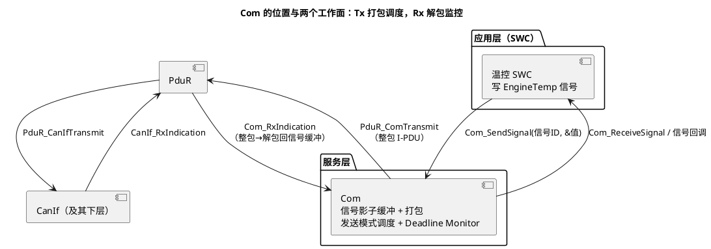

# 01-Com

> 一句话定位：通讯栈里唯一懂"信号"的一层——应用只管 Com_SendSignal / Com_ReceiveSignal，打包进 I-PDU、按发送模式调度、接收超时监控全归 Com；总线行为"对不对"，十有八九先查 Com 配置。
> 等级：L2 ｜ 前置：[07 区导读](../../00-入门导读/01-AUTOSAR第一课-一座城的分区图.md)

## 原理

### 定位：信号级收发站

Com 之上人人谈"信号"，Com 之下人人谈"I-PDU"——**Com 是这两套词汇表之间的翻译官**：发送方向把一堆信号打包进一个 I-PDU，接收方向把整包拆回信号。

### I-PDU 打包布局：信号就是位偏移

以一个 8 字节周期 I-PDU 为例：

| 信号 | ComSignalType | 长度(bit) | ComSignalBitPosition | 落在哪个字节 | 字节序 |
|---|---|---|---|---|---|
| EngineSpeed | UINT16 | 16 | 0 | byte0~1（低位字节在前） | LITTLE |
| EngTemp | UINT8 | 8 | 16 | byte2 | 单字节无字节序 |
| EngState | UINT4 | 4 | 24 | byte3 低 4 位 | — |

关键口径：**AUTOSAR 的位编号在字节内从 LSB=0 起数、跨字节连续累加**，与 DBC 的 Motorola 起始位口径不同——工具导入 DBC 时会自动换算，人工核对配置时千万别直接抄 DBC 上的数字。多字节信号再看 ComSignalEndianess（LITTLE/BIG/OPAQUE），配错一个，对端解出来的就是"温度 12℃ 变 4608℃"。

### 发送模式：ComTxMode 四选一

| 模式 | 触发条件 | 典型用途 |
|---|---|---|
| PERIODIC | Com_MainFunctionTx 周期检查，ComTxModeTimePeriod 到点就发当前缓冲 | 状态周期广播 |
| DIRECT | Com_SendSignal 事件触发，连发 ComTxModeNumberOfRepetitions 次、间隔 TimePeriod | 状态突变快报 |
| MIXED | 周期 + 事件叠加（同一 PDU 既周期发、事件又提前发） | 绝大多数车身报文 |
| NONE | 不发送（PDU 处于 DISABLED、走 ComTxModeFalse 配置时） | 诊断切换、停发保护 |

**MDT（ComTxModeMinimumDelayTime）是整个 PDU 的总闸**：无论哪种触发，两帧间隔不得小于 MDT。周期 + 事件并存的 PDU 靠它防止事件风暴刷爆总线。

### 接收方向：Deadline Monitor 与失效值

- Com_RxIndication 解包 → 更新信号缓冲 → Com_MainFunctionRx 做超时检查：**ComFirstTimeout 只判第一帧**（容忍发方刚上电没来得及发），之后按 **ComTimeout** 周期判死；
- 超时 → 信号被 **ComTimeoutSubstitutionValue** 替换 + 触发 ComTimeoutNotification 回调，应用据此报 Dem 故障、进降级；
- 发方也可主动声明失效：信号值等于 **ComSignalDataInvalidValue**（协议保留值，如 0xFF）→ Com 触发 ComInvalidNotification，应用拿到的是"无效"语义而不是一个假数据。

### IPduGroup：一把闸门管一组 PDU

Com_IpduGroupStart(group, initialize) / Com_IpduGroupStop(group)：BswM 规则在进 RUN、睡眠切换、诊断会话变化时开停整组 Tx/Rx PDU；**initialize=TRUE 会把信号缓冲刷回 ComSignalInitValue**。组没启动 = 这组 PDU 收发全静默——"上电不发包"的老案子一半栽在这里。

## 详解

**API 直觉**：Com_SendSignal(Com_SignalIdType, void*) 把值写进 Tx 信号影子缓冲并返回结果——COM_OK / COM_BUSY（PDU 正在发送中，稍后重写）/ COM_SERVICE_NOT_AVAILABLE（IPduGroup 未启动）。注意**事件模式的"发"不是当场发**：它只是标记，真正的发送决策在下一个 Com_MainFunctionTx 里做（挑周期、数 repetitions、卡 MDT）。

**True/False 成对配置**：每个 ComTxIPdu 有 ComTxModeTrue / ComTxModeFalse 两套模式，ENABLED 用 True（PERIODIC/DIRECT/MIXED），DISABLED 用 False（一般 NONE）——切换由 Com 的 PDU 模式（Com_IpduGroupStart/Stop 或 ComM 链路）驱动，不是应用随手改。

**周期怎么来的**：ComTxModeTimePeriod 的单位是"Com tick"= Com_MainFunctionTx 的周期。配 10ms MainFunction 而想要 15ms 周期是配不出来的——所有发送周期必须是 MainFunctionTx 周期的整数倍。

**接收初始化**：IPduGroup 启动时若 initialize=TRUE，Rx 信号也会先被刷成初值/替代值，避免"启动瞬间读到上次的陈旧值"。

## 配置层

| 配置项 | 含义 | 典型值 | 易错点 |
|---|---|---|---|
| ComIPduLength | I-PDU 长度（字节） | 8（经典 CAN）/64（FD） | 与矩阵/CanIf DLC 不一致→帧长错 |
| ComTxModeMode | 发送模式 | MIXED | DIRECT 忘配 repetitions=1 帧"闪没" |
| ComTxModeTimePeriod | 周期/重复间隔（Com tick） | 10~1000ms | 非 MainFunctionTx 周期整数倍→漂移 |
| ComTxModeNumberOfRepetitions | 事件触发连发次数 | 1~3 | 0=只标记不发，现象"事件丢了" |
| ComTxModeMinimumDelayTime | 最小帧间隔闸门 | =周期或略小 | 比 TimePeriod 还大会把周期拖慢 |
| ComSignalBitPosition / Endianess | 位偏移 / 字节序 | 见打包表 | 直接抄 DBC 起始位→错位 |
| ComSignalInitValue / DataInvalidValue | 初值 / 失效保留值 | 0 / 0xFF（按矩阵） | 初值没配→启动首帧全 0 |
| ComFirstTimeout / ComTimeout | 首帧/周期接收超时 | 首超时 2~3×周期 | 事件型报文配了超时→频繁误报 |
| ComTimeoutSubstitutionValue | 超时替代值 | 0xFF 或安全值 | 与 InvalidValue 混用语义 |
| ComIPduGroup（Tx/Rx 分组） | 启停单位 | 按 RUN/诊断场景分组 | 应用包没进任何组→永不收发 |
| ComMainFunctionRx/Tx 周期 | 调度粒度 | 5~10ms | 周期与超时粒度不匹配 |

## 易错点与陷阱

1. **事件帧"丢了"**：DIRECT 模式配了，但 ComTxModeNumberOfRepetitions=0 或 MDT 配得比事件间隔还大——现象是信号突变时总线上一帧都没有；对策：核对 repetitions≥1、MDT≤最小事件间隔，并在 Com_MainFunctionTx 任务里确认组已 Start。
2. **多字节信号解出来差 256 倍量级**：Endianess 或 BitPosition 配错（常见于手抄 DBC 位号）；对策：用一致性工具核对矩阵↔Com↔CanIf 三处，改动只走工具导入。
3. **Deadline Monitor 频繁误报**：发送方是纯事件型（状态不变不发），接收方却按周期报文配了 ComTimeout；对策：事件型信号不配超时，或超时 > 协议约定的最大静默期，且用 FirstTimeout 兜启动窗口。
4. **发送周期慢慢漂**：ComTxModeTimePeriod 单位是 Com tick，配了个 15ms 而 MainFunctionTx 是 10ms——实际要么 10 要么 20；对策：所有周期取 MainFunction 周期整数倍，生成后 diff 复核。
5. **上电全网静默**：IPduGroup 没人调 Start（BswM 规则漏了/ComM 用户没起来）；对策：沿 ComM→Com 链查 PDU 模式，BswM 规则里补组启动。
6. **超时后读到"合理假值"**：ComTimeoutSubstitutionValue 配了 0，应用把 0 当真值用（0℃ 也是温度）；对策：替代值用协议保留值 + 应用必须挂 ComTimeoutNotification 处理降级。

## 面试高频题

- **Q：Com 和 PduR 分工是什么？**
  A：Com 是信号级的收发站——打包/解包、发送模式调度、接收超时监控；PduR 只做 PDU 级查表转发。Com 上面向信号，下面面向 I-PDU，PduR 则完全不知道信号的存在。
- **Q：四种发送模式的区别与 MDT 的作用？**
  A：PERIODIC 周期到点发、DIRECT 事件触发连发 N 次、MIXED 两者叠加、NONE 停发；MDT 是 PDU 级最小帧间隔总闸，防止事件风暴，任何触发都要过它。
- **Q：Deadline Monitor 怎么工作？超时后应用看到什么？**
  A：Com_MainFunctionRx 里按 ComFirstTimeout（仅首帧）与 ComTimeout（周期）检查最后接收时间；超时后信号被替换为 ComTimeoutSubstitutionValue 并触发 ComTimeoutNotification，应用据此报故障/降级。
- **Q：信号失效值和超时替代值有什么区别？**
  A：失效值是**发方主动声明**（信号写成 ComSignalDataInvalidValue，触发 ComInvalidNotification）；替代值是**收方超时兜底**（ComTimeoutSubstitutionValue）。一个是协议语义，一个是本地监控语义。

## 延伸

- [02-PduR](02-PduR.md)：打包好的 I-PDU 出门第一站；
- [EcuM 上下电时序](../系统服务栈/EcuM/02-上下电时序.md)：IPduGroup 启停在启动序列里的位置；
- [Os 任务与调度](../系统服务栈/Os/01-任务与调度.md)：Com_MainFunctionTx/Rx 挂在哪个任务、什么周期；
- [DBC](../../../05-汽车网络通讯/1-L1基础/通讯数据库/01-DBC.md)：位偏移与字节序的源头口径；
- [07 区导读](../../00-入门导读/01-AUTOSAR第一课-一座城的分区图.md)：Com 在整座城里的位置。
