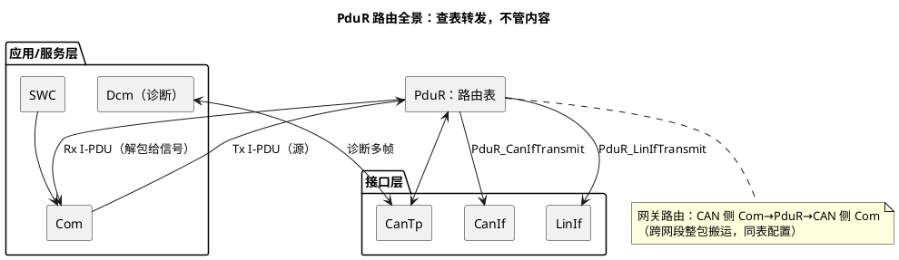

# 02-PduR

> 一句话定位：栈内的邮政分拣中心——一张静态路由表决定每个 PDU 从哪来、到哪去，自己不产生也不修改数据；Com/CanTp/Dcm/CanIf 之间所有转接都查它，配漏一行就单向断流。
> 等级：L2 ｜ 前置：[01-Com](01-Com.md)

## 原理

### 典型路由路径一图

记住一句话：**PduR 只做三件事——收、查表、发**。上行（RxIndication/TxConfirmation）同样查表，只是方向反过来。

### 路由表长什么样（配置走查）

| Source（谁给的） | Dest（发给谁） | 说明 |
|---|---|---|
| ComTxPdu_EngData | CanIfTxPdu_EngData | 信号报文：Com→CanIf |
| CanTpRxPdu_UDS | DcmRxPdu_UDS | 诊断多帧：CanTp→Dcm |
| DcmTxPdu_UDS | CanTpTxPdu_UDS | 诊断响应：Dcm→CanTp |
| CanIfRxPdu_GW | ComRxPdu_GW（另一路） | PDU 网关：整包转发到另一网段 |

每条路由 = 一个 **PduRDestPdu** 配置：PduRDestPduId（目标侧句柄，编译期编号）+ PduRSourcePduRef（源模块的 PDU 引用）+ PduRDestPduRef（目标模块的 PDU 引用）。运行时 PduR 收到带源句柄的调用 → 查表 → 用目标句柄调下一层。

### 为什么所有 PDU 都要过 PduR

1. **统一收口**：Com 不需要知道底下是 CAN、LIN 还是 ETH——换总线只改路由表与目标层，Com 配置不动；
2. **多目标天然支持**：一源多目标（诊断同时上 CAN 与 ETH）只是表里多两行；
3. **网关能力内建**：跨网段转发、信号网关（SigGW）/PDU 网关都以 PduR 为枢纽；
4. **工具可全自动生成**：配置即拓扑，diff 审查一眼看全流向。

## 详解

**PDU 网关 vs 信号网关（一句话）**：PDU 网关整包搬运、不改布局（A 网段的 PDU 原样发到 B 网段，可换 ID）；信号网关（经 SigGW/RTE）可把 A 报文的信号拆出来重组进 B 报文的任意位置——前者快而笨，后者灵活而贵。

**TP 的 on-the-fly 转发**：PDU 网关转发诊断多帧时，PduR 可逐段转发（on-the-fly）而不必整包重组缓存，代价是要配转发方向的流控参数与超时；分段缓存方案的 RAM 占用则按最大诊断报文长预留。

**TxConfirmation 反向链**：CanIf_TxConfirmation → 查表 → PduR_CanIfTxConfirmation → Com_TxConfirmation。Com 靠它结束一次 DIRECT 发送的 repetitions 计数与 MDT 计时——**确认链断掉，Com 的事件模式会"发一次就停"**。

**ComIPdu→DestPduId 的编号真相**：应用拿到的 Tx PDU 句柄其实是 PduR 生成的 PduRDestPduId 表项（Com 的 ComTxIPdu 句柄与之绑定）。所以删改任何一个 PDU 都会引起整批 ID 重排——**手动维护的 ID 常量是事故源**，必须每次生成后核对。

## 配置层

| 配置项 | 含义 | 典型值 | 易错点 |
|---|---|---|---|
| PduRDestPduId | 目标侧句柄（编译期） | 工具自动编号 | 手写常量与重排后的表不符 |
| PduRSourcePduRef | 源 PDU 引用 | Com/CanTp/Dcm 的 PDU | 源引用漏配→该 PDU 无处可去 |
| PduRDestPduRef | 目标 PDU 引用 | CanIf/LinIf/Com 的 PDU | 目标指错模块→发到另一网段 |
| PduRGatewayKeepId | 网关转发是否保留源 ID | false（按目标侧 ID 发） | true 但两网段 ID 规则冲突 |
| PduRGatewayTransmitLayer | 网关转发出口层 | CanIf（另一控制器） | 出口层指回源控制器→自环 |
| TP 转发超时/流控参数 | on-the-fly 转发参数 | STmin/BS 按诊断规范 | 忘配→网关诊断只通单帧 |
| PduRConfigurationId | 整表版本标识 | 递增 | 与生成代码不同步 |

## 易错点与陷阱

1. **单向断流、无任何报错**：路由表里漏配该 PDU 的 PduRDestPdu——PduR 直接丢弃（多数实现只在 DevErrorDetect 打开时报 DET），现象是"Com 信号正常、总线无帧"或"总线有帧、应用收不到"；对策：用矩阵生成路由表，生成后 grep 每个新增 PDU 的源/目标两个引用。
2. **网关 ID 冲突**：PduRGatewayKeepId=true 把 ID 原样带过去，但 B 网段该 ID 已被别的报文占用——现象是间歇性仲裁冲突/数据串台；对策：跨网段默认按目标侧 ID 映射。
3. **网关诊断多帧卡死**：on-the-fly 转发方向没配流控/超时，或目标侧 CanTp 的缓冲不足——现象是单帧诊断通、多帧停在某一分段；对策：核对两侧 CanTp N_BS/N_CR 超时与转发参数。
4. **事件报文只发一次**：CanIf 侧 TxConfirmation 链路（CanIf→PduR→Com）没接通（CanIf confirmation 未使能/路由表只配了 Tx 没配确认方向），Com 的 repetitions 计数与 MDT 永远不推进；对策：抓 Com_TxConfirmation 是否被调（见 [06-CanIf-LinIf](06-CanIf-LinIf.md)）。
5. **删 PDU 后 ID 全体错位**：PduRDestPduId 是表内序号，任何增删都会重排，手写 switch-case/常量表没同步——现象是"某些报文发成了别的内容"；对策：ID 常量一律生成，禁止手抄。

## 面试高频题

- **Q：为什么 AUTOSAR 里所有 PDU 都必须过 PduR，哪怕只有一条通路？**
  A：统一收口——上层模块与底层通信类型解耦（换总线只改路由表），一源多目标与网关能力天然内建，且整网流向可由配置工具静态审查。
- **Q：PduR 收到一帧后的处理流程？**
  A：CanIf_RxIndication 带源句柄调 PduR_RxIndication → 查路由表得到一/多个目标 → 逐个调目标模块接口（Com_RxIndication / CanTp_RxIndication / 另一网段 CanIf_Transmit）；PduR 不看内容、不缓存（TP 转发除外）。
- **Q：PDU 网关和信号网关的区别？**
  A：PDU 网关在 PduR 层整包搬运不改布局、可逐段转发，低延迟低开销；信号网关经 SigGW/RTE 拆包重组，信号可任意映射到不同布局的目标报文，适合矩阵差异大的两个网段。
- **Q：TxConfirmation 为什么也要过 PduR？**
  A：发送方（Com/Dcm）只持有 PduR 分发的句柄，确认回调需要同样的查表反向映射回源模块，链路：CanIf_TxConfirmation→PduR→Com_TxConfirmation/Dcm 流控。

## 延伸

- [01-Com](01-Com.md)：路由表上游的信号世界；
- [06-CanIf-LinIf](06-CanIf-LinIf.md)：路由表下游的接口层与确认链；
- [CanTp 分段 15765-2](../../../05-汽车网络通讯/2-L2进阶/传输层/01-CanTp分段15765-2.md)：TP 转发涉及的分段与流控语义；
- [CanDrv 接口契约](../../../04-MCAL与外设驱动/2-L2进阶/CanDrv与LinDrv/01-CanDrv接口契约.md)：PduR 之后到硬件的最后一跳；
- [分层架构](../../1-L1基础/架构总览/01-分层架构.md)：为什么中间要留一层"纯转发"。
