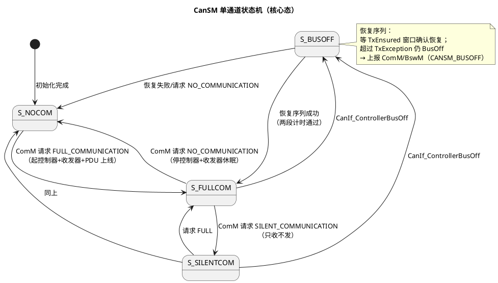
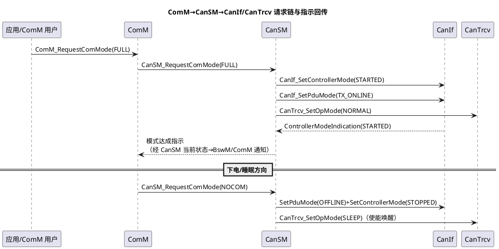

# 03-CanSM

> 一句话定位：CAN 通道的模式大管家——把 ComM 的通信模式请求翻译成对 CanIf（控制器）和 CanTrcv（收发器）的操作，并独扛 BusOff 恢复序列；"这条通道为什么不发了"的排障，从它的状态机开始。
> 等级：L2 ｜ 前置：[01-Com](01-Com.md)

## 原理

### CAN 通道状态机（每控制器一份）

### ComM 请求链：模式请求如何落地

### BusOff 恢复序列（与协议侧对照）

协议侧发生了什么（详见 [busoff 恢复策略](../../../05-汽车网络通讯/1-L1基础/CAN/总线错误与恢复/02-busoff恢复策略.md)）：TEC 超过 256 → 控制器进 BusOff（总线关闭，不再收发）。

AUTOSAR 侧 CanSM 的恢复序列：

1. CanDrv 检测到 BusOff → CanIf_ControllerBusOff 回调 CanSM，状态转 S_BUSOFF；
2. CanSM 做**恢复重启**：先 SetControllerMode(STOPPED) 再 STARTED（清错误计数、重新上线），期间该通道 PDU 离线；
3. 双保险计时：**CanSMBorTimeTxEnsured**（恢复观察窗，窗口内总线恢复正常即算恢复成功）与 **CanSMBorTimeTxException**（判决线，超时仍 BusOff/无法重启）；
4. 恢复成功 → 回 S_FULLCOM、PDU 重新上线；失败 → 通过 BusOff 处理通知 ComM/BswM（模式 CANSM_BUSOFF），由策略层决定复位、降级还是继续重试。

## 详解

**CanSM 管模式，CanIf 管操作**：CanSM 不知道邮箱/Hth 这些硬件概念，它只会对 CanIf 说"这个控制器 START/STOP、PDU 上/下线"；同理收发器只认 CanTrcv 的三档模式。分层记忆：**ComM 表达意图，CanSM 编排动作，CanIf/CanTrcv 执行**。

**BusOff 期间谁背锅**：BusOff 期间该通道所有 Tx 被 CanIf 拒绝（上层 CAN_BUSY），Com 的事件 PDU 全部丢弃——如果应用依赖事件帧，恢复后必须有能力重发（Com 的 repetitions 是有限的，应用层要有状态重同步机制）。

**静默模式的真实用途**：SILENT 让本节点只收不发——诊断"在线监听不干扰"（如产线 EOL 抓包节点）与部分网络场景下"保持监听"靠它。

**多通道独立性**：每个 CAN 控制器一份状态机，A 路 BusOff 不影响 B 路；ComM 的用户-通道映射决定"哪些通道跟着哪个用户起停"。

## 配置层

| 配置项 | 含义 | 典型值 | 易错点 |
|---|---|---|---|
| CanSMCanControllerId↔CanIf 控制器映射 | 通道绑定 | 0~n | 映射错→操作落到另一路 CAN |
| CanTrcvRef（通道关联收发器） | 是否经 CanTrcv | 有 Trcv 芯片时必配 | 不配→Trcv 永远停在 Standby，发不出帧 |
| CanSMBorTimeTxEnsured | BusOff 恢复观察窗 | 10~50ms | 过短→抖动反复判死 |
| CanSMBorTimeTxException | 恢复失败判决线 | 100~200ms | 过短→频繁上报引发复位循环 |
| BusOff 恢复使能（CanSMBusOffRecovery 类） | 是否自动恢复 | true | 关掉=一次 BusOff 永久停发 |
| CanSMDevErrorDetect | 开发错误追踪 | Debug 版 true | 量产忘关→CPU 开销 |
| CanSMMainFunctionPeriod | 状态推进粒度 | 10ms | 太长→模式切换与计时都变粗 |

## 易错点与陷阱

1. **BusOff 恢复后 Com 不再发事件帧**：恢复序列期间 PDU 离线，事件 PDU 全被丢弃且 Com 的 repetitions 早耗尽；对策：应用对关键状态做周期重同步（关键信号配 MIXED 模式），不要指望纯事件帧扛过 BusOff。
2. **TxException 太短引发复位循环**：判决线配得比总线实际恢复还短，CanSM 频繁上报 CANSM_BUSOFF，上层策略直接复位 ECU——上电又 BusOff 再复位；对策：两段计时按整车网络规模实测整定。
3. **通道-控制器-收发器三方映射不一致**：CanSM 通道绑了 CanIf 控制器 0，但该控制器的 CanIfCtrlCfg 指向 Trcv 通道 1——现象是"控制器 STARTED 了但总线上没有电平"或模式指示永远不来；对策：三方映射一次配置、生成后统一 diff。
4. **NOCOM 判定不等收发器真睡**：CanSM 请求 NOCOM 后立即认为可睡，但 CanTrcv 还在 Standby——整机电流超标；对策：确认 CanSM→CanTrcv SetOpMode(SLEEP) 已含在 NOCOM 序列，电流测试覆盖睡眠态。
5. **Silent 模式下诊断不通**：SILENT 只收不发，Dcm 的响应发不出去；对策：诊断用户在 ComM 用 FULL 请求覆盖（用户优先级），或切换场景前回 FULL。
6. **BusOff 只盯 CanSM 忘了协议层原因**：恢复序列能拉回控制器，但根因可能是波特率错/终端电阻坏/某节点疯狂重发；对策：结合 [busoff 恢复策略](../../../05-汽车网络通讯/1-L1基础/CAN/总线错误与恢复/02-busoff恢复策略.md) 从错误计数器与物理层排起。

## 面试高频题

- **Q：完整描述一次 BusOff 的检测与恢复。**
  A：CanDrv 检测控制器 BusOff → CanIf_ControllerBusOff 通知 CanSM（状态转 BUSOFF）→ CanSM 做恢复重启（STOPPED→STARTED，清计数重新上线）→ 在 TxEnsured 窗口内恢复成功则回 FULLCOM；超过 TxException 仍失败则上报 ComM/BswM（CANSM_BUSOFF），由策略层决定复位或降级。
- **Q：CanSM 和 CanIf 的分工？**
  A：CanSM 是策略层——管理通道通信模式（FULL/SILENT/NOCOM）、编排 BusOff 恢复；CanIf 是执行层——把控制器启停/PDU 上下线翻译成对 CanDrv 的调用并回传指示。CanSM 不知道硬件对象，CanIf 不知道通信策略。
- **Q：ComM 请求 FULL_COMMUNICATION 后发生了什么？**
  A：ComM→CanSM_RequestComMode(FULL) → CanSM 依次 CanIf_SetControllerMode(STARTED)、CanIf_SetPduMode(TX_ONLINE)、CanTrcv_SetOpMode(NORMAL) → 收到 CanIf 指示后向 ComM/BswM 报模式达成，Com 报文开始收发。
- **Q：SILENT 模式有什么用？**
  A：只收不发——产线 EOL 监听、部分网络场景保持监听、故障注入观察；实现上控制器仍 STARTED 但 PDU 处于 TX_OFFLINE。

## 延伸

- [01-Com](01-Com.md)：CanSM 放行之后 Com 的发送行为；
- [07-CanTrcv](07-CanTrcv.md)：模式序列里收发器那一环；
- [busoff 恢复策略](../../../05-汽车网络通讯/1-L1基础/CAN/总线错误与恢复/02-busoff恢复策略.md)：协议侧的错误计数与恢复语义；
- [EcuM 上下电时序](../系统服务栈/EcuM/02-上下电时序.md)：NOCOM/SLEEP 与下电序列的衔接；
- [BswM 模式仲裁](../系统服务栈/BswM/01-模式仲裁.md)：谁在替应用调 ComM。
