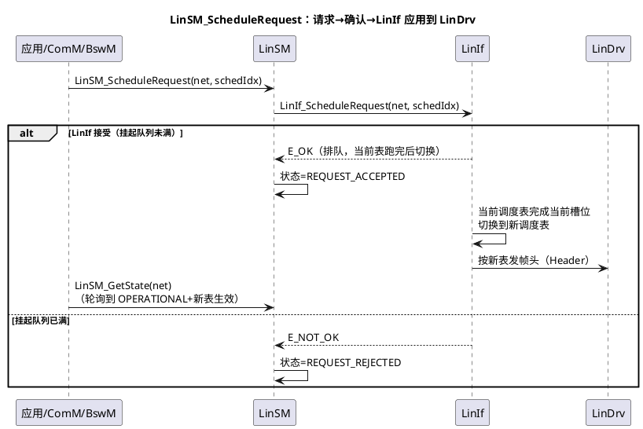
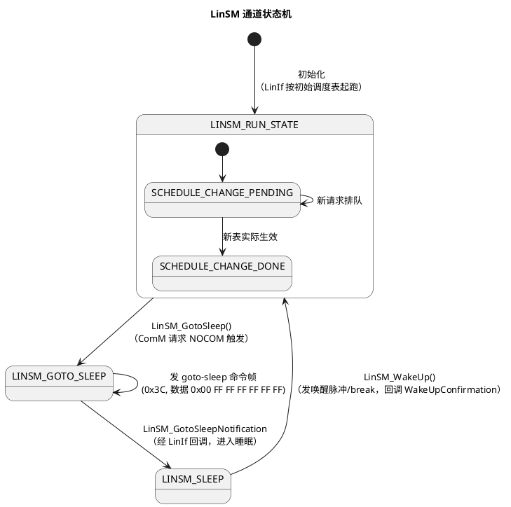

# 04-LinSM

> 一句话定位：LIN 网络的模式与调度表管家——主机节点上把 ComM 的模式请求翻译成"进睡眠/发唤醒/切调度表"，其中调度表切换是 CAN 没有的独有职责；LIN 网络"不轮询了/睡不下去"的排障从它查起。
> 等级：L2 ｜ 前置：[03-CanSM](03-CanSM.md)

## 原理

### LinSM 调度表切换 sequence（本篇核心图）

要点：切换不是立即生效——LIN 主机要把当前调度表至少跑完当前帧/表尾才换表，LinIf 内部维护一个**挂起请求队列**（深度可配），所以"请求成功"≠"已经在发新表"，应用要靠 `LinSM_GetState` 确认。

### LinSM 状态机（每 LIN 通道一份）

### 睡眠/唤醒：goto-sleep 命令帧

LIN 睡眠由主机显式广播：**goto-sleep 命令帧**（帧 ID 0x3C，数据域 `0x00 FF FF FF FF FF FF`），从机收到后各自休眠；主机随后停发帧头、LinDrv 进 SLEEP 模式（收发器拉低功耗、保留唤醒检测）。`LinSM_GotoSleep()` 触发整个序列，完成后 LinIf 调 `LinSM_GotoSleepNotification` 回调，LinSM 才认为通道真正可睡。唤醒方向：`LinSM_WakeUp()` 让 LinDrv 发唤醒脉冲（典型 250us~5ms 的显性 break），总线上任一节点也可通过拉低总线唤醒；唤醒确认经 `LinSM_WakeUpConfirmation` 回来。协议细节见 [主从与调度表](../../../05-汽车网络通讯/1-L1基础/LIN/协议原理/01-主从与调度表.md)。

### 与 ComM 的请求链

ComM_RequestComMode(FULL) → LinSM_RequestComMode → 通道进 LIN_OPERATIONAL（LinIf 起跑初始调度表）；ComM_RequestComMode(NOCOM) 且条件满足 → LinSM_GotoSleep 序列。与 CAN 唯一的差别：**FULL 之外还要"跑哪张表"的信息**，这由应用/BswM 另行调 LinSM_ScheduleRequest，ComM 本身不管调度表。

## 详解

**LinSM 与 CanSM 的差异**——同一个"SM"岗位，两个网络的脾气不同：

| 维度 | CanSM | LinSM |
|---|---|---|
| 模式语义 | FULL / SILENT / NOCOM 三态 | OPERATIONAL / SLEEP 两态（无 SILENT） |
| 调度表 | 无（CSMA 仲裁，谁有数据谁发） | 有（单主轮询，必须切表） |
| BusOff | 有恢复序列（两段计时） | 无（单主网络不存在仲裁失败） |
| 收发器 | 经 CanTrcv 管模式 | 通常 LinDrv 直管（LIN 收发器简单） |
| 睡眠机制 | NOCOM 序列（静默+停控制器） | goto-sleep 命令帧广播 |

**为什么调度表切换要排队**：LIN 从机的应答有超时窗口（帧超时见 [LIN 帧超时排障](../../../05-汽车网络通讯/1-L1基础/LIN/排障/01-帧超时.md)），主机若在帧中间硬切表，从机会丢响应；LinIf 保证在安全边界切换，代价是切换延迟——最快的切换也要等当前帧结束，最慢要等当前表跑完一轮。

**从机节点没有 LinSM**：LinSM/LinIf 的调度逻辑只存在于主机；从机节点（多为智能执行器）只需 LinDrv+LinIf 应答帧头，模式管理靠 ComM/裸逻辑。配置时主机节点的 LinIf 才有 LinIfScheduleTable。

**唤醒后要重新请求调度表**：唤醒序列只把通道拉回 OPERATIONAL，生效的是初始调度表（LDF 里 Network-speed 后的第一张表）；应用必须在 WakeUpConfirmation 之后重新 `LinSM_ScheduleRequest` 目标表，否则主机一直按初始表轮询——现象是"醒了但只发那几帧"。

## 配置层

| 配置项 | 含义 | 典型值 | 易错点 |
|---|---|---|---|
| LinSMChannel↔LinIfNetworkRef | LinSM 通道绑到 LinIf 网络 | 每 LIN 通道一条 | 绑错网络→操作打到另一条 LIN |
| LinSMScheduleTable（索引顺序） | 调度表索引，API 传的 schedIdx | 按 LinIfScheduleTable 顺序 0~n | 新增/删除表导致索引移位，上层硬编码错位 |
| LinIfNumberOfScheduleRequests | LinIf 挂起请求队列深度 | 2~4 | 配 1→切换请求密集时 E_NOT_OK 被拒 |
| LinSMDevErrorDetect | 开发错误追踪 | Debug 版 true | 量产忘关→CPU 开销 |
| LinSMMainFunctionPeriod | 状态推进粒度 | 10ms | 太长→GetState 确认延迟、切换变慢 |
| goto-sleep 后从机超时（LinIf/LinDrv 层） | sleep 帧后停表前的余量 | 按从机规格 | 太急→部分从机没收到命令帧就停发帧头 |

## 易错点与陷阱

1. **调度表索引错位**：现象是请求"切到诊断表"却轮询了别的表；原因是 LinIfScheduleTable 顺序变了而应用仍用写死的数字；对策：统一用生成头文件的调度表索引宏，禁止手写常量，配置 diff 时重点核对表顺序。
2. **ScheduleRequest 被静默拒绝**：现象是偶发切换不生效、LinSM_GetState 一直是 REJECTED 瞬间翻转；原因是挂起队列深度配 1，上一次请求未消费完新请求即被拒（返回 E_NOT_OK 不重试就丢）；对策：调用处检查返回值+失败重发，队列深度≥实际并发数。
3. **GotoSleep 后不等 Notification 就断外设**：现象是从机节点没进睡眠、整机电流超标；原因是应用调完 LinSM_GotoSleep 就停任务/关时钟，sleep 命令帧还没发出去；对策：下电序列里等 GotoSleepNotification（或 GetState 轮询到 SLEEP）再继续，见 [EcuM 上下电时序](../系统服务栈/EcuM/02-上下电时序.md)。
4. **唤醒后没重新请求调度表**：现象是节点醒了但只发初始表那几帧；原因见"详解"；对策：把"唤醒确认→ScheduleRequest 目标表"封装成一个状态机步骤，不依赖人工调用顺序。
5. **主机从机角色配置反了**：现象是总线上没人发帧头（双从机）或帧头无人应答（双主机）；原因是 LinIf 的 master/slave 角色与实际节点不符；对策：按 LDF 逐节点核对角色，LDF 是唯一事实源（见 [LinDrv 接口契约](../../../04-MCAL与外设驱动/2-L2进阶/CanDrv与LinDrv/02-LinDrv接口契约.md)）。
6. **把 LIN 的帧超时当 BusOff 排**：现象是某从机应答丢失、应用以为是网络状态机问题；原因 LIN 无 BusOff 概念，错误处理在 LinIf/LinDrv 的帧超时与校验和层；对策：走 [LIN 帧超时](../../../05-汽车网络通讯/1-L1基础/LIN/排障/01-帧超时.md) 的排障路径。

## 面试高频题

- **Q：LinSM_ScheduleRequest 的完整流程？**
  A：应用/BswM 调 LinSM_ScheduleRequest(net, schedIdx) → LinSM 转发 LinIf_ScheduleRequest → LinIf 排队（队列满返回 E_NOT_OK，LinSM 状态 REQUEST_REJECTED）→ 当前调度表跑到安全边界后切换 → 新表帧头发出，LinSM_GetState 轮询到切换完成。切换有延迟，非同步生效。
- **Q：LIN 网络怎么进睡眠和唤醒？**
  A：睡眠：LinSM_GotoSleep → 主机广播 goto-sleep 命令帧（0x3C，0x00+0xFF×7）→ 从机各自休眠，主机 LinDrv 进 SLEEP → LinSM_GotoSleepNotification 确认可睡。唤醒：LinSM_WakeUp 发唤醒脉冲（break 显性位），总线拉低也能唤醒任一节点，WakeUpConfirmation 确认后重新请求调度表。
- **Q：LinSM 和 CanSM 的核心差异？**
  A：三点——LinSM 有调度表切换（单主轮询网络的固有需求）、无 BusOff 恢复（无仲裁冲突）、睡眠靠 goto-sleep 命令帧显式广播（CAN 靠 NM 报文停发后各自休眠）。
- **Q：为什么调度表切换不能立即生效？**
  A：LIN 主机按表逐槽发帧头，从机按帧头应答；若帧中间硬切表会打断从机应答造成帧超时。LinIf 在安全边界（当前帧/表尾）切换，并挂起排队，因此请求与生效之间有延迟。

## 延伸

- [03-CanSM](03-CanSM.md)：同一岗位在 CAN 网络的形态（对照记忆）；
- [主从与调度表](../../../05-汽车网络通讯/1-L1基础/LIN/协议原理/01-主从与调度表.md)：调度表与 goto-sleep 的协议侧原理；
- [LinDrv 接口契约](../../../04-MCAL与外设驱动/2-L2进阶/CanDrv与LinDrv/02-LinDrv接口契约.md)：LinSM/LinIf 之下驱动层的接口边界；
- [EcuM 上下电时序](../系统服务栈/EcuM/02-上下电时序.md)：GotoSleep 在下电序列中的位置；
- [LIN 帧超时](../../../05-汽车网络通讯/1-L1基础/LIN/排障/01-帧超时.md)：LIN 侧排障从帧级错误入手。
