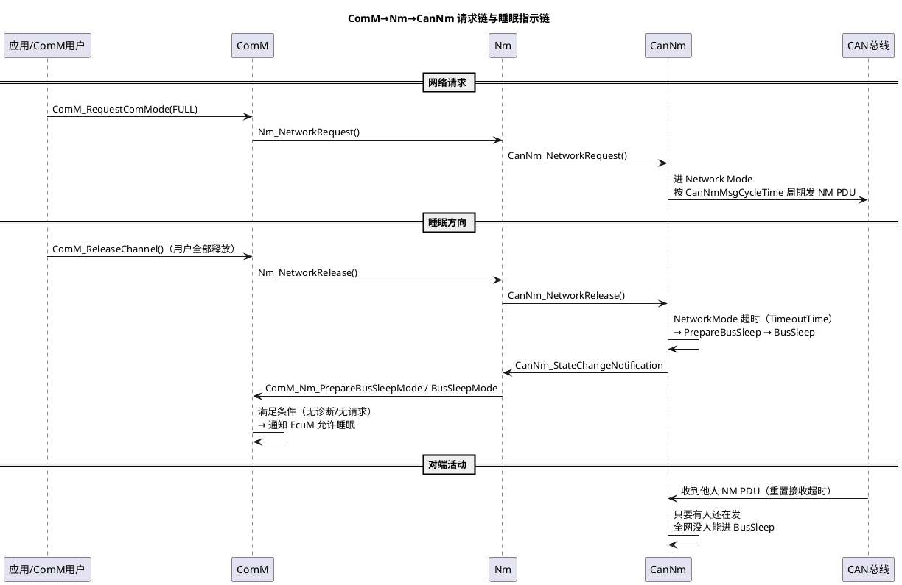
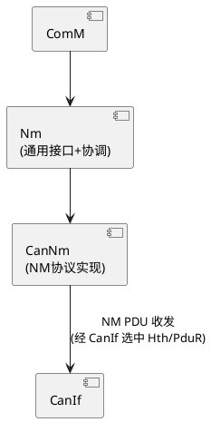

# 05-CanNm-LinNm

> 一句话定位：AUTOSAR 里网络管理协议栈的"驱动集成层"——NM 状态机的协议原理（状态定义、超时语义）在 05 区讲透了，本篇只讲它怎么嵌进 BSW：CanNm 的配置项体系、ComM→Nm→CanNm 的请求/指示链，以及 LinNm 这层"薄壳"与 CanNm 的差异。
> 等级：L2 ｜ 前置：[01-Com](01-Com.md)、[AUTOSAR NM 状态机](../../../05-汽车网络通讯/2-L2进阶/网络管理/02-AUTOSAR-NM状态机.md)

## 原理

### ComM / Nm / CanNm 集成链（以"请求通信→睡眠"为主线）

记忆锚点：**请求向下（Request），状态向上（Notification）**；全网是否入睡由"还有没有人在发 NM PDU"这一个物理事实决定。

### CanNm 在栈中的位置

CanNm 自己不碰硬件：NM PDU 的收发全部经 CanIf（进而 CanDrv）；Nm 层是通用协调壳（多总线统一接口、网关场景的 Nm 协调休眠 NmCoordSleep 等都在这层）。

## 详解

**NM PDU 的 8 字节结构**：`[Source Node ID][CBV][UserData×6]`（OEM 可约定偏移，CanNmPduCbvPosition/CanNmPduPosition?）。三个字段各有分工——NodeID 声明"谁在线"；CBV（Control Bit Vector）的 bit0 是 **Repeat Message Request**，置 1 表示"请全网回 RepeatMessage 状态重新确认在线"；UserData 捎带 OEM 自定义信息（常见：活动字节，指示哪些功能域需要保持唤醒）。配不配 UserData、放什么，完全按 OEM 规范——这是集成商最容易配错的自由度。

**CBV 与睡眠的关系**：正常睡眠流程中，节点释放后停发 NM PDU，各自超时进 BusSleep。但只要**任一节点**发的 NM PDU 里 CBV 的 Repeat 位是 1，收到它的节点全部被拉回/保持在 RepeatMessage 状态继续发帧——这是"全网不睡"的合法机制，也是排障时最常见的人为事故源。

**CanNm 状态骨架**（完整状态机见 [NM 状态机](../../../05-汽车网络通讯/2-L2进阶/网络管理/02-AUTOSAR-NM状态机.md)）：Bus-Sleep →（网络请求/收到 NM 帧）→ RepeatMessage（**必经**，限时发帧）→ Normal Operation（周期发帧）→（释放+超时）→ Prepare Bus-Sleep → Bus-Sleep。RepeatMessage 是从"睡"到"干活的必经缓冲带"，防止刚醒就睡回去。

**LinNm 是薄壳**：LIN 的网络管理不走"广播 NM PDU"——LIN 是单主网络，睡眠由主机 goto-sleep 命令帧统一执行（见 [04-LinSM](04-LinSM.md)）。LinNm 只做三件事：向 Nm/ComM 转述 LinSM 的状态（`LinNmSleepIndication`——主机已广播 goto-sleep，全网可睡；`LinNmWakeupIndication`——总线被唤醒）；把 Nm 的请求转成对 LinSM 的调用；**没有 RepeatMessage 状态复杂度、没有 CBV、没有周期 NM 帧**。

**立即醒与快速 NM**：部分 OEM 规范（典型如大众 OSEK NM 变体）要求唤醒后立即连发数帧 NM（CanNmImmediateNmTransmissions，如 3 帧×10ms）加速全网同步——配错会导致唤醒电流尖峰或全网被误拉醒。

## 配置层

| 配置项 | 含义 | 典型值 | 易错点 |
|---|---|---|---|
| CanNmTimeoutTime | 各状态超时基值 | 2s | 必须大于 MsgCycleTime 的合理倍数，配小→全网反复进出 PrepareBusSleep |
| CanNmMsgCycleTime | NM PDU 发送周期 | 250ms~1s（OEM 约定） | 与 OEM 规范不一致→被他节点判为异常节点 |
| CanNmRepeatMessageTime | RepeatMessage 状态驻留时长 | 1.6s | 过长→唤醒后占线；过短→慢节点错过同步窗口 |
| CanNmImmediateNmTransmissions/CycleTime | 唤醒后立即发帧数与间隔 | 0（标准）或 3×10ms | 不按 OEM 约定配→唤醒风暴或唤醒延迟 |
| CanNmNodeId | 本节点 NM 源地址 | 全网唯一 | 两节点配重→互相重置超时，全网不睡 |
| CanNmCbvPosition / CBV 使能 | CBV 字节位置与是否发送 | 按 OEM 规范 | 位置错→对端把 UserData 当 CBV 解析 |
| CanNmPduLength / UserData 使能 | NM PDU 长度与用户数据 | 8 字节 | 长度/映射与 OEM 不一致→帧被对端丢弃 |
| CanNmPassiveModeEnabled | 只收不发 NM | false | 误开→本节点"隐身"，网关场景判断异常 |
| CanNmNodeDetectionEnabled | 收无 Repeat 位帧是否保持唤醒 | true | OEM 规范差异项，配反→该睡不睡或秒睡 |
| NmCoordinatorRole / PnEnabled | 协调休眠/部分网络 | 按架构 | Pn 细节见 [部分网络](../../../05-汽车网络通讯/2-L2进阶/网络管理/04-部分网络.md) |

## 易错点与陷阱

1. **节点死活不睡（自己不发别人也不睡）**：现象是电流实测总线一直有 NM 帧；根因排查询序——应用层是否真的释放了 ComM 通道（诊断会话/DID 请求没退出最常见）→ 本节点 CanNmTimeoutTime 是否配得离谱大 → 是否误开 ImmediateNm 或 NodeDetection 语义配反；对策：先抓总线确认"最后一帧 NM 谁发的"，顺着 NodeID 找节点。
2. **假醒/立即醒：RepeatMessage 位没清**：现象是某节点释放后全网仍醒或反复回醒；原因是某节点应用/CDD 写 NM PDU 时把 CBV 置 1 后没清（UserData 复用错位最常见）；对策：按 OEM 规范核对 CBV 位置与清位逻辑，抓帧看 CBV 字节。
3. **NodeId 冲突**：现象是两节点 NM 帧互掐、全网超时反复重置；对策：NodeID 分配表纳入配置评审，与通信矩阵（DBC/ARXML）同源。
4. **NM PDU 周期与超时不匹配**：CanNmTimeoutTime 小于等于 MsgCycleTime→自己刚发完就超时进 PrepareBusSleep 又被自己下一帧拉回，状态机抖动；对策：TimeoutTime ≥ 2×CycleTime 起步，按 OEM 整定。
5. **LIN 侧拿 CAN 的思路排障**：现象是 LIN 节点"NM 超时"概念查无此物；原因是 LinNm 无周期 NM 帧、无 CBV，睡眠由 LinSM goto-sleep 驱动；对策：LIN 不睡查 LinSM 序列与从机休眠电流，别在 Nm 配置里绕（见 [睡眠与假醒](../../../05-汽车网络通讯/2-L2进阶/网络管理/03-睡眠与假醒.md)）。
6. **睡眠判定不看 NM 只看电流**：现象是 CanSm/ComM 报已睡眠但电流超标；原因收发器没进低功耗（CanTrcv 模式链没走完）；对策：睡眠电流测试分段——控制器睡/收发器睡/外设睡，逐段归因。

## 面试高频题

- **Q：ComM 怎么和 CanNm 交互？画出请求与指示两条链。**
  A：请求链：ComM_RequestComMode(FULL) → Nm_NetworkRequest() → CanNm_NetworkRequest() → 进 Network Mode 周期发 NM PDU；指示链：CanNm 状态变化 → CanNm_StateChangeNotification → Nm → ComM_Nm_NetworkMode/PrepareBusSleepMode/BusSleepMode → ComM 汇总（含诊断、其他用户）后通知 EcuM 是否可睡。
- **Q：CBV 的 Repeat Message Request 位是干什么的？**
  A：置 1 表示要求接收方进入/保持 RepeatMessage 状态限时重发 NM——用于节点重启/新上电后向全网重新声明在线、防止"睡了又被需要"的竞态。副作用是任一节点误置 1 且不清位，全网永远睡不着。
- **Q：LinNm 和 CanNm 的本质差异？**
  A：CanNm 是完整 NM 协议实现（三状态+超时+CBV+周期帧）；LinNm 只是 LinSM 与 Nm 之间的翻译层——睡眠指示（LinNmSleepIndication，主机 goto-sleep 完成）、唤醒指示（LinNmWakeupIndication）转成 Nm 事件，无独立状态机复杂度，因为 LIN 单主网络的睡眠本来就不靠分布式协商。
- **Q：怎么定位"全网不睡"？**
  A：抓总线最后一帧 NM 的 NodeID 锁定嫌疑节点 → 查该节点 ComM 用户释放情况（诊断/应用）→ 查其 CanNm 配置（TimeoutTime、ImmediateNm、CBV 清位）→ 再查物理层（假醒源、收发器）。系统化路径见 [睡眠与假醒](../../../05-汽车网络通讯/2-L2进阶/网络管理/03-睡眠与假醒.md)。

## 延伸

- [AUTOSAR NM 状态机](../../../05-汽车网络通讯/2-L2进阶/网络管理/02-AUTOSAR-NM状态机.md)：本篇引用的状态机完整定义；
- [睡眠与假醒](../../../05-汽车网络通讯/2-L2进阶/网络管理/03-睡眠与假醒.md)：全网不睡的系统化排障；
- [部分网络](../../../05-汽车网络通讯/2-L2进阶/网络管理/04-部分网络.md)：CanNm PnEnabled 与选择性睡眠；
- [04-LinSM](04-LinSM.md)：LinNm 背后真正的睡眠执行者；
- [03-CanSM](03-CanSM.md)：NM 睡眠达成后控制器/收发器下电由它编排。
